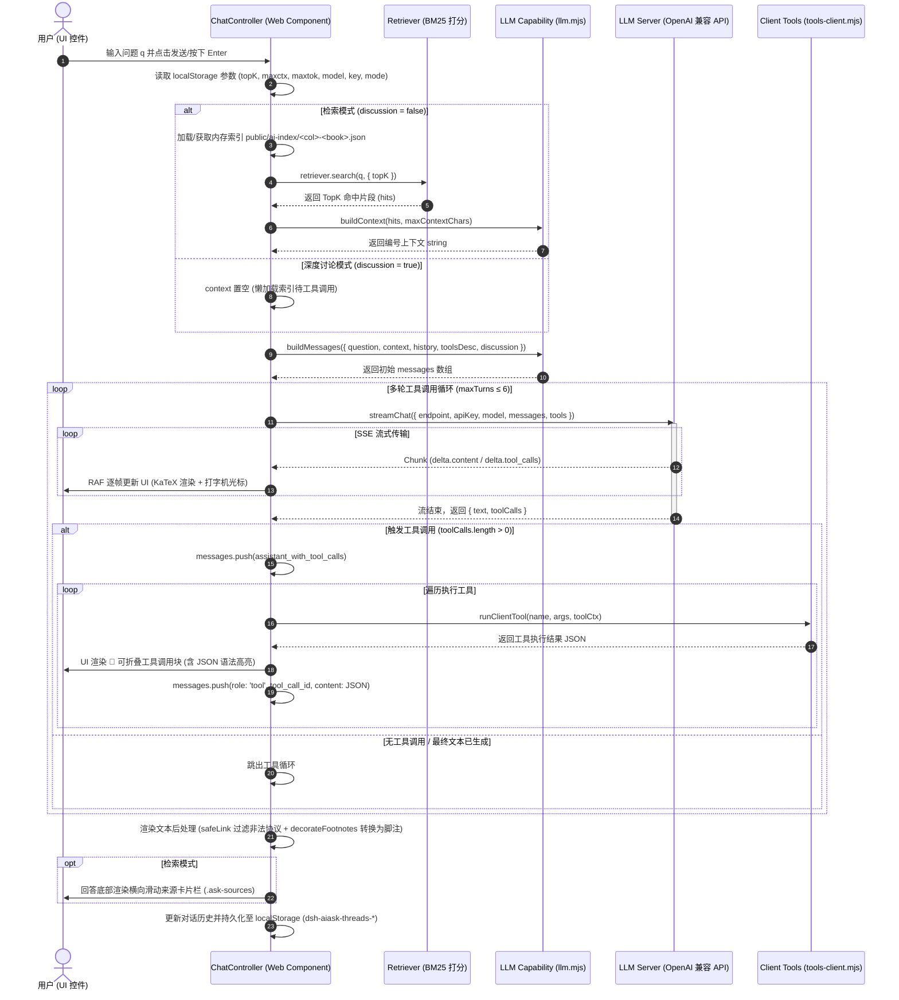

# AI 赋能模块 · 第一个模块：书内智能问答（AI Q&A over the current book）

> 定位：在「当前阅读的书」内做两件事——**检索**（问题 → 命中本书知识片段，可精确跳转到原文卡片）与**提问**（基于命中片段由 LLM 生成可溯源的回答）。
> 目标是给整个 AI 赋能体系打一个**可复用的能力层基座**，本模块是建立在它上面的第一个用例；后续模块（公式精讲 / 整章摘要 / 错题追踪等）复用同一套原语。

---

## 一、设计目标

1. **与现有模块同层次、可一键开关**：作为 `features.config.mjs` 里的一个 manifest（`aiAsk`），关闭即零打包（索引不生成、控件不渲染、无任何额外依赖挂载）。
2. **成本可控**：绝不把整本书喂给模型。只把检索命中的 topK 片段（默认 8 个、上下文总字符上限 6000）送入生成层，其余靠跳转原文解决。
3. **复用现有轮子**：图书目录、卡片识别、slug 归一化（`cleanSlug`）、目录结构（`generateBookSidebar`）、全站离线检索思路全部复用，不另造向量库/解析器。
4. **生成层可插拔**：默认客户端 BYOK（自带钥匙）直连 OpenAI 兼容流式接口；未配置 key 时优雅降级为「纯检索 + 跳转」，不阻塞。
5. **给 AI 一种“无明确渠道”的取数方式**：提供一组 MCP 检索工具（正则切片、Python 执行、TOC、按 id 取片段、语义检索），供智能体在不依赖固定问答渠道时灵活取书内容。

---

## 二、定位：Feature Registry（与 epub / crossRef 平级）

```js
aiAsk: defineFeature({
  id: 'aiAsk',
  cat: 'extra',
  label: 'AI 智能问答',
  desc: '基于当前书籍知识库的检索式提问（RAG，构建期索引 + 客户端 BYOK 生成）',
  enabled: false,          // 默认关闭；配好生成层后可开启
  devOnly: false,
  ui: true,
  config: {
    provider: 'openai',                 // OpenAI 兼容协议（BYOK 直连）
    retrieval: 'keyword',               // 'keyword' | 'hybrid'（预留向量增强）
    topK: 8,                            // 送入生成的片段上限（成本控制）
    maxContextChars: 6000,              // 上下文总字符上限（成本硬约束；客户端可填 -1=不限制，自担成本）
    maxAnswerTokens: 1200,              // 回答最大 token（客户端可填 -1=不限制，省略 max_tokens）
    defaultModel: 'deepseek-v4-flash',  // 默认模型（对应 models[i].id）
    endpoint: 'https://api.deepseek.com/v1/chat/completions', // 无专属端点的兜底
    models: [                           // 可选模型：id 作为 API 的 model 字段，endpoint 可覆盖
      { id: 'deepseek-v4-flash', label: 'DeepSeek V4 Flash', endpoint: 'https://api.deepseek.com/v1/chat/completions' },
      { id: 'gpt-4o-mini', label: 'GPT-4o mini', endpoint: 'https://api.openai.com/v1/chat/completions' },
    ],
  },
})
```

> 模型选择由控件提供下拉（存 localStorage `dsh-aiask-model`，记忆上次选择）；生成层取
> 选中模型的 `endpoint` + `id`（作为 `model` 字段）直连；未选中时回退 `defaultModel`。

关闭（enabled=false）时：`build-ai-index` 跳过、`AIAsk` 控件不渲染（挂载处 `features.aiAsk.enabled` 判定）。

---

## 三、整体架构

```
┌──────────────────────────────────────────────────────────────┐
│ UI 层 · src/components/AIAsk.astro（挂在 FooterOverride）     │
│   浮动「AI 提问」按钮 + 面板；SPA 下用 location.pathname 重判书 │
└──────────────┬───────────────────────────────────────────────┘
               │ fetch(懒加载 public/ai-index/<col>-<book>.json)
┌──────────────▼───────────────────────────────────────────────┐
│ 检索层 · src/ai/retriever.mjs（纯客户端）                     │
│   createRetriever(chunks) 一次预计算 df；search(q,{topK})     │
│   = 词频×BM25-ikdf + 标题命中加权 + 类型加成（定义/方法类）      │
└──────────────┬───────────────────────────────────────────────┘
               │ {question, topK, contextChunks}
┌──────────────▼───────────────────────────────────────────────┐
│ 生成层 · src/ai/llm.mjs（可插拔 adapter，客户端 BYOK）         │
│   buildContext/buildMessages → streamChat（OpenAI 兼容流式）   │
│   未配 key → 降级为「仅检索 + 跳转」                           │
└──────────────┬───────────────────────────────────────────────┘
               ▲ 共用能力层
┌──────────────┴───────────────────────────────────────────────┐
│ 能力层 · src/ai/*（供后续模块复用）                             │
│   chunker.mjs（MDX→语义片段）· indexer.mjs（构建期写索引）      │
│   MCP 工具 src/ai/mcp/（无明确渠道时的切片取数）                │
└──────────────────────────────────────────────────────────────┘
```

---

## 四、数据契约（每本书一个索引文件）

构建期 `scripts/build-ai-index.mjs` 生成 → `public/ai-index/<col>-<book>.json`（gitignore，astr build 拷进 dist/，客户端懒加载）：

```jsonc
{
  "meta": { "col": "math", "book": "math_senior", "title": "新高考数学…", "count": 506, "updatedAt": "…" },
  "chunks": [
    {
      "id": "08_1.1.1_平方关系与商数关系-0",
      "kind": "card",          // 'card' | 'heading'
      "type": "知识点",         // 卡片标题前缀（例/定理/定义…），heading 为 ''
      "title": "知识点 1.1",
      "text": "去 JSX 后的可检索正文……",
      "url": "/collections/math/math_senior/08_111_平方关系与商数关系/#%E7%9F%A5%E8%AF%86%E7%82%B9-1.1",
      "line": 3
    }
  ]
}
```

- `url` 由 `cleanSlug`（相对 book 目录）预生成路径 + `encodeURIComponent(title.replace(/\s+/g,'-'))` 预生成锚点，与全站跨页索引、真实路由一致，杜绝 404。
- 片段即网站已识别的**语义单元**（卡片/标题），命中即能跳到源卡片，而非一段无来源的文本。

---

## 五、成本控制（针对用户约束）

| 环节 | 控制手段 |
|---|---|
| 构建期索引 | 每片段文本 `CHUNK_TEXT_CAP=2000`；只写必要的卡片/标题 + 正文，不产完整书全文副本 |
| 检索 | 只取 topK（默认 8），客户端打分，零网络、零模型 token |
| 生成上下文 | `maxContextChars=6000` 硬截断 + 减少来源 token；`maxAnswerTokens=1200` |
| MCP 工具 | 每个工具默认 `limit/topK`/`slice(0,220)`/`slice(0,8000)`，只回薄切片，绝不回整书或超长原文 |
| 结论 | 模型**永远只看到命中片段**，未命中内容靠跳转原文解决 |

---

## 六、MCP 检索工具集（无明确渠道时的取数）

`src/ai/mcp/tools.mjs`（6 个工具）+ `server.mjs`（MCP 风格 `tools/list`、`tools/call`）：

| 工具 | 作用 | 复用 |
|---|---|---|
| `list_books` | 列出合集/图书 | `collections.config.mjs` |
| `book_toc` | 某书目录结构 | `generateBookSidebar` |
| `book_slice_search` | 书的 MDX 原文做正则/子串**行级切片**检索 | `walkDir` + `mdToText` |
| `book_retrieve` | 书内索引做 keyword 打分，返回 topK 片段 | `indexer` + `retriever` |
| `book_chunk` | 按 id 取单个片段全文 | 索引 |
| `python_exec` | 对输入字符串跑 Python（聚合/统计/片段变换） | 需 `python` 二进制（`AI_PYTHON` 指定） |

> 用途：智能体在**没有明确检索渠道**（如没有走固定问答面板）时，也能用这些工具对书内容做“切片检索 / 模糊寻找”，且不会把整本书塞进上下文。全部建立在已有解析/配置之上，未重复造轮子。

---

## 七、落地文件清单

**新增**
| 文件 | 作用 |
|---|---|
| `src/ai/chunker.mjs` | MDX→语义片段（复用卡片识别、标题 slug） |
| `src/ai/indexer.mjs` | 构建期按书生成索引（复用 `cleanSlug`） |
| `src/ai/retriever.mjs` | 客户端 keyword/hybrid 打分（纯 JS，无副作用） |
| `src/ai/llm.mjs` | 提示词构建 + 客户端流式直连 LLM（BYOK） |
| `src/ai/mcp/tools.mjs` | MCP 检索工具集（6 个） |
| `src/ai/mcp/server.mjs` | MCP `tools/list`/`tools/call` 适配层 |
| `src/components/AIAsk.astro` | 书内问答控件（当前书感知、懒加载、降级） |
| `scripts/build-ai-index.mjs` | 构建入口（读 `features.aiAsk.enabled`） |

**修改**
| 文件 | 改动 |
|---|---|
| `src/config/features.config.mjs` | 追加 `aiAsk` manifest（默认关闭） |
| `src/components/FooterOverride.astro` | 挂载 `<AIAsk />`（`features.aiAsk.enabled` 判定） |
| `package.json` | build 脚本接入 `build-ai-index.mjs` |
| `.gitignore` | 新增 `public/ai-index/` |

---

## 八、已知取舍 / 待办

- **安全**：客户端直连（BYOK）意味着 API key 会进入浏览器。默认形态为读者自带钥匙（存 localStorage、key 不落库），服务商侧建议绑定受限 key。若后续要“站点托管 key + 读者零配置”，把 `llm.mjs` 换成服务端代理 adapter 即可（检索层不动）。
- **anchoring 细微差异**：索引锚点用 `encodeURIComponent`，客户端以 `decodeURIComponent` + `getElementById` 跳转，与全站既有跨页索引一致；标题型片段（无卡片）锚点为去掉 frontmatter 的页面级 URL。
- **SPA**：控件挂在 footer（SPA 不重建），脚本用 `astro:page-load` + `location.pathname` 重判当前书并切换索引 / 显隐。
- **索引体积**：每书几百~约千条片段，单个 JSON 约几百 KB（Vercel gzip 后更小），懒加载 + 按书隔离可控。

---

## 九、第二轮迭代补充（落地记录，详见《AI 书内问答模块实现交接.md》）

在第一版基础上，针对真实使用反馈做了以下增强（均在 `src/components/AIAsk.astro`、`src/ai/llm.mjs`）：

| 项 | 变更 |
|---|---|
| 设置抽屉可滚动 | `.ask-settings`（及历史面板）加 `max-height + overflow-y:auto`，内容多时可内部滚动。 |
| 历史会话本地保存 | 每书会话线程存 localStorage（`dsh-aiask-threads-<col>-<book>`），刷新/重开自动恢复上次活动会话；头部「历史」按钮可切换/删除/新建会话。 |
| `-1` = 不限制 | 上下文总字符上限 / 回答最大 token 支持填 `-1`：`buildContext` 不截断、`max_tokens` 不发送（默认仍受 config 上限约束，`-1` 为自担成本的用户档位）。 |
| 工具调用展示 | `_toolBlocksHtml`/`_jsonHtml`：工具块可折叠，**参数与原始结果默认收起** + JSON 语法高亮；摘要行人类可读。工具结果仍以 `role:'tool'`+`tool_call_id` 逐条正确回传模型。 |
| 来源卡可读性 | `_renderSources` 每张来源卡显示被命中内容的摘要（折叠空白+截断，规避 `\r\n` 断行），跳转原文更直观。 |

> 已知取舍：模型经工具再取到的片段不进入 `buildContext` 的 `[1]…[n]` 编号，引用可能对不上基础来源列表（见交接文档「已知约束 8」与「待办」）。

---

## 十、第三轮迭代补充：深度讨论模式（不默认检索）

> 针对「用户有时只想就一个问题深入思考、讨论，不局限于首问触发的 topK 检索」的需求，新增一个**回答方式**开关。

| 项 | 变更 |
|---|---|
| 回答方式开关 | 设置抽屉新增「回答方式」下拉（localStorage `dsh-aiask-mode`，默认 `retrieve`）：`检索本书`（默认，注入 topK 片段 + 来源引用）｜`深度讨论`（不默认检索）。 |
| 深度讨论逻辑 | 切换 `discussion` 后：`_ask` 不再调用 `createRetriever`/`search`，不注入片段、不渲染来源卡；改走 `buildSystemPrompt(discussion:true)` 的**讨论版系统提示**——「基于理解深入讲解、不局限于片段」，并追加「默认不要检索，需要原文时按需调用检索工具」的指引。 |
| 检索工具仍可调用 | 深度讨论模式仍挂载 `book_retrieve`/`book_toc` 等工具，模型可**按需**决定是否检索；此时索引改为「首次用到检索工具时懒加载」（`list_books` 无需索引）。 |
| 脚注死链规避 | 讨论回答不做 `[n]` 脚注化（`decorateFootnotes(html, false)`），避免把偶发的 `[n]` 误转成指向不存在来源的死链。 |

> 设计取舍：深度讨论的语义是「**由模型决定是否检索**」——默认不注入片段、不强制 topK，但保留检索工具供模型在拿不准时查原文。这与默认的「总是注入 topK + 强制按片段回答」形成互补。

> 前端验证要点：在 `http://localhost:4321` 打开书页 → ⚙ 将「回答方式」切到「深度讨论」→ 提问/追问，观察：①不出现「来源」卡；②回答为自由讲解而非“根据片段”；③当问题涉及具体原文时，模型是否会调用 🔧 检索工具并按需显示；④刷新后该模式是否仍生效（localStorage 记忆）。

---

## 十一、第四轮迭代：工具增强 + 检索相关性修正 + 总结性回答（真实反馈）

> 针对「检索结果与搜索词相关度低」「AI 倾向于告诉读者去哪找而非自己总结」两类反馈的改进。

### 1) 检索相关性（`src/ai/retriever.mjs`）

原检索器把中文切成 bigram 并按词频×idf 累加，导致“不等式/等式/逼近”这类通用高频词在多处命中后压过了 **Bessel/Parseval/Fourier** 这类强标识符（拉丁专名/数字串）。改进后的打分：

| 词类 | 权重 | 说明 |
|---|---|---|
| 拉丁专名（bessel/parseval/fourier…） | ×4.0 | 最具辨识度的主题词 |
| 数字串（15.1、2.5…） | ×3.0 | 章节编号/常数 |
| 中文整词（长度≥3，如“均方逼近”） | ×1.8 | 概念词 |
| 中文 bigram（“不等式/定理”） | ×1.0 | 通用 |
| LaTeX/数学背景噪声词（int/sum/frac、单字母变量 a/b/n/x…） | ×0.2 | 公式噪声不撑高得分 |

并叠加：**标题命中加权**（强标识符/概念词命中标题加成更高）、**查询词覆盖度加成**（命中的不同查询词占比越高越贴近整题意图）。检索结果新增 `matched`（命中词）字段，便于排查为何命中该片段。

### 2) 新增导航工具（客户端 `src/ai/tools-client.mjs` 与 Node `src/ai/mcp/tools.mjs` 双份）

原工具只有扁平目录（`book_toc`）与检索，缺少“按标题/编号定位章节大纲 + 区间读正文 + 全文正则给上下文”的导航能力。新增（复用 `src/ai/outline.mjs` 的共享大纲/区间定位逻辑）：

| 工具 | 作用 |
|---|---|
| `book_chapter_outline` | 按章号/标题查看某章大纲：小节标题 + 各卡片类型/编号/锚点 url（定位知识点所在章节与段落编号） |
| `book_read_section` | 从某个片段（id/标题/编号）向后读取一段连续正文（含截断标记） |
| `book_slice_search`（增强） | 命中返回**上下文窗口** + 可跳转 url；子串匹配先去除 `$…$` 噪声 |

> 不变更索引格式、不重建索引（体积不变），只在读取时基于现有索引原地重建结构。

### 3) 总结性回答 + 指向原文的 markdown 链接（`src/ai/llm.mjs`、`AIAsk.astro`）

- 系统提示改为要求 **「给出总结性的内容本身」**（把定义/定理/推导/方法/结论讲清楚），**明确禁止**“相关内容在第 X 章 / 请去查看原文”这类引导语；若不足则给出最接近线索（带链接），不编造。
- **鼓励为书中具体内容附上指向原文的 markdown 链接** `[标题](url)`；为此 `buildContext` 每段加入“来源 url”，工具结果也带 `url` 字段。
- 客户端 Markdown 渲染器补上**安全的行内链接渲染**（`safeLink` 只放行站内相对路径与 http(s)，杜绝 `javascript:`/`data:` 注入），回答内的原文链接可直接点击跳转。

> 已知约束沿用：工具再取到的片段不进入 `buildContext` 的 `[1]…[n]` 编号，若模型对这些工具结果用 `[n]` 引用，脚注可能与底部“来源”列表对不上（仍以「来源卡带摘要 + 工具块可展开」缓解）；工具结果里的 `url` 字段用于生成指向原文的 markdown 链接，不依赖 `[n]`。

---

## 十二、开发者指南：AI 书内问答 (RAG) 核心逻辑、MCP 规格与 Prompt 串联全解

> 本章节专为后续接入、重构或扩展 AI 问答能力的开发人员与 Agent 编写，详细说明 **已有 MCP/客户端工具规格**、**动态 Prompt 串联架构** 及 **单次 AI 请求的完整链条与控制流**。

---

### 1. 全量 MCP / 客户端工具全景速查与详细规格

本项目采用了 **“Node MCP 服务端”与“浏览器客户端”双轨运行** 的工具架构：
- **Node MCP 服务端**（`src/ai/mcp/tools.mjs` + `server.mjs`）：独立 MCP Server 进程，可供 CLI、外置 Agent 或本地调试使用，具有文件系统（`fs`）、子进程（`child_process`）和 Python 执行（`python_exec`）能力。
- **浏览器端工具**（`src/ai/tools-client.mjs` + `chat-controller.ts`）：运行于 Web Component 内，**零后端、纯客户端执行**，完全基于内存中按需加载的书内 JSON 索引（`public/ai-index/<col>-<book>.json`）与导航大纲。

#### 工具规格速查表（全量 8 个工具）

| 工具名称 (`name`) | 运行环境 | 核心功能说明 | 关键输入参数 | 返回值关键结构 | 文本与成本限制 |
|---|---|---|---|---|---|
| `list_books` | 双轨 (Node / Client) | 列出题库合集与图书 | 无 | `{ books: [{ col, book, title }] }` | 零限制，读配置 |
| `book_toc` | 双轨 (Node / Client) | 获取图书目录树/章节列表 | `col`, `book` (Node) | `{ title, toc: [{ title, url }] }` | 上限 120 条目录项 |
| `book_retrieve` | 双轨 (Node / Client) | BM25 强标识符加权检索片段 | `question`, `topK` (1~12), `col`, `book` | `{ results: [{ id, type, title, url, score, matched, text, truncated }] }` | 单条 `TEXT_CAP=800` 字符硬截断 |
| `book_chunk` | 双轨 (Node / Client) | 按 id 取单个片段全文 | `id`, `col`, `book` | `{ found: true, id, type, title, url, text, truncated }` | 单条 `TEXT_CAP=800` 字符截断 |
| `book_slice_search` | 双轨 (Node / Client) | 正则/子串匹配正文，带上下文窗口 | `pattern`, `mode` (`substring`/`regex`), `limit` (1~20) | `{ hits: [{ id, type, title, url, text, context }], count }` | 过滤 LaTeX 噪声，`context` 截取前后 130 字符窗口 |
| `book_chapter_outline` | 双轨 (Node / Client) | 查看某章大纲与卡片编号/锚点 | `chapter` (章号/关键词), `col`, `book` | `{ found: true, chapter: { number, title, sections: [{ cards: [{ number, title, url }] }] } }` | 单章预算上限 500 卡片，小节上限 100 |
| `book_read_section` | 双轨 (Node / Client) | 从起点片段连续读取正文 | `start` (id/标题/编号), `count` (1~12), `end` | `{ found: true, items: [{ kind, type, title, url, text, truncated }] }` | 单段 `SECTION_TEXT_CAP=1400` 字符截断 |
| `python_exec` | 仅 Node MCP | 执行 Python 脚本对片段做二次处理 | `code`, `input` | `{ stdout: string }` | 15s 超时，输出上限 8000 字符，需 `python` 环境 |

---

### 2. 动态 Prompt 串联机制 (Dynamic Prompt Chaining Architecture)

#### 动态解耦设计思想
前端 UI 组件 (`AIAsk.astro` / `chat-controller.ts`) **绝不硬编码任何系统提示词或格式模板**。所有 Prompt 的构建统一由能力层 `src/ai/llm.mjs` 中的纯函数驱动。项目逻辑改变（如修改 KaTeX 格式要求、变更超链接格式、增加工具或切换讨论模式）时，只需修改 `llm.mjs` 中的三元组函数，整个应用自动同步生效。

```
┌─────────────────────────────────────────────────────────────────────────────┐
│ 运行时状态 (BookTitle, DiscussionMode, TopK Hits, History, ToolsDesc)       │
└──────────────────────────────────────┬──────────────────────────────────────┘
                                       │ 传入
┌──────────────────────────────────────▼──────────────────────────────────────┐
│ Prompt 构建三元组 (src/ai/llm.mjs)                                          │
│                                                                             │
│  1. buildSystemPrompt(bookTitle, { toolsDesc, discussion })                 │
│     ├── 注入学科角色 + 公式规范 ($..$)                                     │
│     ├── 注入「给出总结性内容本身」指令（严禁打发式引导语）                 │
│     ├── 注入站内绝对路径超链接规范 [标题](url)                             │
│     ├── 模式分支：                                                         │
│     │    ├─ discussion=false: 强约束根据【书中片段】作答 + [n] 上标引用    │
│     │    └─ discussion=true : 基于理解自由讨论 + 默认不检索/拿不准才查     │
│     └── 动态工具清单注入 (toolsDesc())                                     │
│                                                                             │
│  2. buildContext(chunks, capChars)                                          │
│     └── 将 topK 片段格式化为:                                              │
│         [n] 【类型｜标题】                                                   │
│         来源：/collections/...                                              │
│         正文内容...                                                         │
│                                                                             │
│  3. buildMessages({ question, context, bookTitle, history, discussion })     │
│     └── [System Message] + [History Messages] + [User Message (带Context)]  │
└──────────────────────────────────────┬──────────────────────────────────────┘
                                       │ 产出 messages 数组
┌──────────────────────────────────────▼──────────────────────────────────────┐
│ OpenAI 流式请求层 (streamChat)                                              │
└─────────────────────────────────────────────────────────────────────────────┘
```

#### 关键 Prompt 约束规则一览
1. **总结性回答要求**（防打发）：明确禁止输出“相关内容在第 X 章 / 请去查看原文”这类空洞引导，要求 AI 必须整理好定义、定理、推导与方法后完整讲给读者。
2. **站内绝对路径超链接**：要求引用具体知识点时直接输出 `[标题](/collections/col/book/...#anchor)` 形式的 markdown 链接（利用片段与工具结果返回的 `url`）。
3. ** KaTeX 渲染兼容**：行内公式统一采用 `$..$`，块级公式统一采用 `$$..$$`。
4. **脚注引用对齐**：仅在 `discussion=false` 时要求模型在句末标注 `[1]`..`[n]` 上标，对应 `buildContext` 提供的 TopK 片段。

---

### 3. 发送每一个 AI 请求的完整逻辑链

以下展示用户从输入问题到收到回答的完整流转过程与架构流向：



#### 逻辑链各阶段说明

1. **阶段一：状态解析与配置准备**
   - 监听发送事件，重置当前会话 UI。
   - 从 `localStorage` 中提取：选中的 `modelId`、对应端点 `endpoint`、`apiKey`、TopK 数量（`topK`）、上下文上限（`maxContextChars`）、回答 Token 上限（`maxAnswerTokens`）及回答模式（`retrieve` 检索模式 / `discussion` 深度讨论模式）。

2. **阶段二：检索与上下文预处理**
   - **检索模式**：确保获取/加载对应书的 `/ai-index/<col>-<book>.json` 索引文件；执行强标识符加权 BM25 检索（拉丁专名 x4.0、数字编号 x3.0、概念词 x1.8），获取 TopK 片段。调用 `buildContext()` 生成带来源编号 `[n]` 和链接 URL 的文本。
   - **讨论模式**：跳过初始检索，上下文留空。索引用作工具调用的懒加载备选。

3. **阶段三：Prompt 与 Messages 消息链构建**
   - 调用 `buildMessages()`：
     - 构建 `system` 消息（包含角色、公式规则、超链接规范及由 `toolsDesc()` 生成的动态工具说明）。
     - 提取历史对话记录 `history`（自动截取最近 12 条有效 user/assistant 对话）。
     - 拼接当前 `user` 消息（带 Context 约束或纯 Question）。

4. **阶段四：流式请求与 Function Calling 工具循环（最高 6 轮）**
   - 发起 `streamChat` POST 请求，开启 SSE 接收。
   - **流式增量解析**：`onDelta` 逐字追加响应，使用 `requestAnimationFrame` 驱动 Markdown 转 HTML 与 KaTeX 实时公式渲染（`renderMathInElement`），防止卡顿。
   - **工具调用处理**：若 SSE 中收到 `delta.tool_calls`，按 `index` 增量拼接参数。流结束时：
     1. 将 Assistant 带有 `tool_calls` 声明的消息加入 `messages`；
     2. 依次调用 `runClientTool(tc.name, tc.arguments, toolCtx)`；
     3. 捕获工具结果并调用 `toolSummary()` 生成简短摘要，UI 上渲染可折叠工具块（包含 JSON 语法高亮）；
     4. 将 `{ role: 'tool', tool_call_id, content: JSON.stringify(out) }` 压入 `messages` 队列；
     5. 重新发起下一轮 `streamChat` 请求，直到 LLM 输出最终自然语言回答。

5. **阶段五：后处理、安全净化与 UI 渲染**
   - **超链接安全净化 (`safeLink`)**：解析回答中的 Markdown 链接 `[标题](url)` 与裸 `collections` 路径，阻断 `javascript:` / `data:` 等恶意 Scheme，自动将相对路径转换为当前站点规范的绝对路径。
   - **脚注转换 (`decorateFootnotes`)**：在检索模式下，使用正则将回答中的 `[1]`..`[n]` 替换为指向底部来源卡片锚点的 `<a class="cite-ref">`。
   - **来源卡片渲染 (`_renderSources`)**：在回答下方追加横向可调滚动的来源卡片，显示片段类型、标题、内容摘要，支持点击跳转至对应卡片原文。

6. **阶段六：本地持久化与状态同步**
   - 将当前对话的消息队列、使用的工具日志、渲染分段（`segments`）保存至 `localStorage`（键为 `dsh-aiask-threads-<col>-<book>`）。
   - 更新头部历史面板列表与页签 Tabs，以便刷新或再次进入时即时恢复会话状态。

