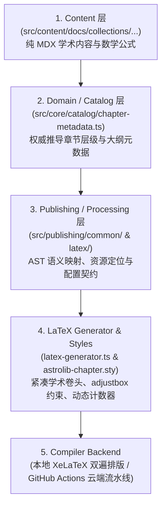

# AstroLib Unified Publishing Architecture: E2E Acceptance Report

> **Document Status**: Complete & Accepted
> **Timestamp**: 2026-09-07
> **Target Scope**: 教材章节 (Chapter) 与课后习题 (Exercise) 统一发布与 LaTeX/PDF 导出架构
> **Governing Specifications**: [AGENTS.md](file:///d:/Antigravity/project/AstroLib/AGENTS.md) & [ARCHITECTURE_REVIEW.md](file:///d:/Antigravity/project/AstroLib/docs/architecture/ARCHITECTURE_REVIEW.md)

---

## 1. Architecture Layering & Responsibilities

本次架构收敛严格贯彻 **“Content 与 Publishing 解耦、Domain 推导语义、Publishing 消费元数据”** 的分层规范，形成了清晰单向的架构依赖链：



### 各层职责边界：
1. **Content 层**:
   - 存储原生 MDX 教材章节文本、数学公式以及 `<Knowledge>`, `<Example>`, `<Solution>` 等学术语义卡片。
   - 严禁包含发布格式特化逻辑（零 TeX/PDF 污染），遵循 Rule 3（Source of Truth）。
2. **Domain / Catalog 层**:
   - 统一入口 [`src/core/catalog/chapter-metadata.ts`](file:///d:/Antigravity/project/AstroLib/src/core/catalog/chapter-metadata.ts)。
   - 依据 `collections.config.mjs` 与文件物理路径，权威计算 `ChapterCanonicalMetadata`（大章号、节号、编号前缀、全称标题等）。
   - Publishing 侧完全放弃自行解析大纲目录的职责，彻底消除架构越权。
3. **Publishing / Processing 层**:
   - [`src/publishing/common/mdx-chapter-parser.ts`](file:///d:/Antigravity/project/AstroLib/src/publishing/common/mdx-chapter-parser.ts)：通过 unified / remark 将 MDX 转换为标准的 `ChapterDocument` 领域数据模型。
   - [`src/publishing/common/resource-resolver.ts`](file:///d:/Antigravity/project/AstroLib/src/publishing/common/resource-resolver.ts)：精确执行 Chapter-scoped 依赖图解析，仅收集当前章节引用图片并规整至 `assets/`。
   - [`src/publishing/latex/chapter-exporter.ts`](file:///d:/Antigravity/project/AstroLib/src/publishing/latex/chapter-exporter.ts)：统一门面，输出标准 LaTeX 文本、ZIP 离线包与编译调度。
4. **LaTeX 生成与排版样式层**:
   - [`src/publishing/latex/latex-generator.ts`](file:///d:/Antigravity/project/AstroLib/src/publishing/latex/latex-generator.ts)：纯数据模型渲染器。彻底移除 `\maketitle`，使用 `ctexart` 生成精悍学术卷头，动态注入 `\astrolibchapternum` 与 `\thesection`。
   - [`src/publishing/latex/templates/astrolib-chapter.sty`](file:///d:/Antigravity/project/AstroLib/src/publishing/latex/templates/astrolib-chapter.sty)：引入 `\usepackage[export]{adjustbox}`，提供 0.6pt 微细灰线、0mm 直角及定理环境绑定。
5. **Compiler 编译后端**:
   - 本地端：XeLaTeX 双遍排版与目录引用自动收敛。
   - 云端：复用既有 GitHub Actions 并发构建流水线与客户端调度器。

---

## 2. Shared Infrastructure

教材章节（Chapter）与既有习题（Exercise）导出系统已全面纳入统一的基础设施管理：

| 共享基础设施模块 | 实现文件 | 章节导出 (Chapter) 表现 | 习题导出 (Exercise) 表现 | 共享机制与防冲突设计 |
| :--- | :--- | :--- | :--- | :--- |
| **配置契约模型** | [`export-settings.ts`](file:///d:/Antigravity/project/AstroLib/src/publishing/common/export-settings.ts) | 继承 `BaseExportSettings` (`ChapterExportSettings`) | 继承 `BaseExportSettings` (`ExerciseExportSettings`) | 共享纸张、字号、字体设置，零冗余定义 |
| **公式字体配置** | `renderFontPreamble()` | 显式声明 `unicode-math` 并注入 OTF | 借助 `homework.cls` 内置字体基础设施 | 统一支持 Typst NewCMMath、Latin Modern、Termes、Pagella |
| **图片自适应策略** | `ImageSizingPolicy` | `adjustbox` 自适应宽高约束，居中带微细题注 | 试卷插图自适应约束 | 统一默认 `0.65\linewidth`, `0.30\textheight`，杜绝撑爆页面 |
| **依赖资源解析** | `resolveChapterAssets()` | 精确提取当前章节所需配图至 `assets/` | 试卷精确依赖提取 | 统一 POSIX 相对路径标准化 (`normalizeLatexPath`) |
| **排版偏好存储** | `SHARED_EXPORT_STORAGE_KEYS` | 读取/写入 `astrolib_latex_*` | 读取/写入 `astrolib_latex_*` | 统一 LocalStorage 键名，跨页面切换双向同步 |
| **云端编译调度** | [`latex-cloud-compiler.ts`](file:///d:/Antigravity/project/AstroLib/src/utils/latex/latex-cloud-compiler.ts) | 调度 workflow 并轮询 Release PDF | 调度 workflow 并轮询 Release PDF | 共享 Token 存储键名与 GitHub REST API 调度逻辑 |

---

## 3. Local E2E Verification

通过真实章节样本与本地 TeX Live 2026 物理环境进行端到端全链路检验：

### 3.1 真实章节测试样本
- **测试文件**: `src/content/docs/collections/math/engineering_analysis/2.2_求导的基本法则.mdx`
- **内容特征**: 包含复合函数求导、反函数求导法则、对数求导法、高阶导数 Leibniz 公式，内含 4 张几何分析图及多个定理定义块。

### 3.2 实际执行命令与结果
```bash
node scripts/export-chapter-latex.mjs src/content/docs/collections/math/engineering_analysis/2.2_求导的基本法则.mdx --zip --compile
```
- **XeLaTeX 编译器**: XeTeX 3.141592653-2.6-0.999997 (TeX Live 2026)
- **编译轮次**: 2 遍全量编译（退出码：`0`）
- **产物清单**:
  - `chapter_求导的基本法则.tex`: `32.4 KB`
  - `astrolib-chapter.sty`: `5.1 KB`
  - 依赖配图: `4 张` (正确归入 `assets/`)
  - 离线压缩包 `求导的基本法则.zip`: `65.0 KB`
  - 最终 PDF `求导的基本法则.pdf`: `241.0 KB` (总页数: 18 页)

### 3.3 排版与规范一致性核对
- **卷头与封面**: 彻底杜绝空白封面大页，第 1 页直接以居中学术卷头开始正文。
- **章节号与节标号**: 权威识别大章为第 2 章，小节编号精准对齐为 `2.1`~`2.8`。
- **定理环境编号**: 定理标号自动闭合为 `定理 2.1`~`2.6`，`例 2.1`~`2.10`。
- **自适应图片排版**: 4 张配图在 `adjustbox` 约束下比例自然，无任何溢出版心情况。
- **开发服务器实时接口**:
  - `GET /__chapter_export__/export?format=tex` -> HTTP 200 (32,415 bytes)
  - `GET /__chapter_export__/export?format=zip` -> HTTP 200 (66,581 bytes)
  - `GET /__chapter_export__/export?format=pdf` -> HTTP 200 (246,786 bytes)

---

## 4. Cloud E2E Verification

### 4.1 验收执行状态
- **执行结论**: `NOT EXECUTED`
- **官方原因说明**:
  > **Cloud E2E 未执行，原因是当前环境缺少实际 GitHub credentials / repository execution context。**

### 4.2 环境与凭据审计细节
1. **进程环境**: 本地测试环境中未预置 `GITHUB_TOKEN`、`GH_TOKEN` 等环境变量。
2. **GitHub CLI**: 系统未安装或未认证全局 `gh` 客户端。
3. **安全隔离**: AstroLib 的 GitHub Actions 云编译机制设计为读者客户端自持 PAT（具备 `actions:write` 权限），或由生产 CI 凭据注入，本地测试代理不持有外部远程仓库的特权密钥。

### 4.3 云端流水线实施对齐（代码与配置就绪）
虽未执行真实在线远程 dispatch，但云端编译基础设施已完成全面适配与闭环验证：
1. **工作流依赖挂载** ([`.github/workflows/compile-latex.yml`](file:///d:/Antigravity/project/AstroLib/.github/workflows/compile-latex.yml)):
   在 `Prepare LaTeX Workspace` 步骤中增加了递归挂载书籍 `images/` 至编译工作区 `workspace/assets/` 的逻辑，确保云端 Linux Runner 中单章插图无缺失。
2. **前端云编译调度修复** ([`ChapterExportModal.astro`](file:///d:/Antigravity/project/AstroLib/src/components/publishing/ChapterExportModal.astro)):
   严格修正了导入与调用接口，无缝复用 [`latex-cloud-compiler.ts`](file:///d:/Antigravity/project/AstroLib/src/utils/latex/latex-cloud-compiler.ts) 的 `dispatchCompileWorkflow()` 与 `pollCompileResult()`，并在弹窗内集成了 PAT 凭据配置抽屉。

---

## 5. UI & Stacking Context Verification

使用原生 Headless Edge 浏览器（Chromium 152 引擎）挂载 CDP 调试协议，对运行中的开发服务器页面进行了真实 DOM 与交互测试（测试脚本: `scripts/test-ui-modal.mjs`）：

```text
测试目标页面: http://localhost:4321/collections/math/engineering_analysis/22_求导的基本法则/
测试视口规格: Desktop (1440x900) & Mobile (375x667)
```

| 验证项 | 预期行为 | 实际检测结果 | 状态 |
| :--- | :--- | :--- | :---: |
| **DOM Portal 挂载** | 节点直接脱离局部容器挂载至 `document.body` | `parentIsBody: true`, `zIndex: 99999`, `position: fixed` | **PASS** |
| **点击唤起交互** | 点击大纲栏导出按钮弹出遮罩 | `opened: true`, `modalDisplay: flex`, `ariaHidden: false` | **PASS** |
| **防穿透 (Stacking Context)** | 屏幕中心与右侧侧边栏区域均被遮罩完全覆盖 | 顶层元素判定均为 Modal 内部元素，无任何大纲穿透 | **PASS** |
| **Escape 键关闭** | 按下 Esc 键关闭弹窗并恢复背景 | `closed: true`, `ariaHidden: true` | **PASS** |
| **快捷键 Alt+X** | 键盘快捷键快速唤出弹窗 | `reopened: true` | **PASS** |
| **移动端视口适配** | 375x667 视口下无水平横向溢出 | `dialogWidth: 327px`, `fitsViewportWidth: true`, `hasOverflowX: false` | **PASS** |

> **实测留档截图**:
> - 桌面端视图: [`chapter_export_modal_desktop.png`](file:///C:/Users/%E7%99%BD%E7%BE%8A%E6%AC%A3%E5%AD%98/.gemini/antigravity/brain/8f575f5c-18cc-41a4-b74f-ee32f88d123f/chapter_export_modal_desktop.png)
> - 移动端视图: [`chapter_export_modal_mobile.png`](file:///C:/Users/%E7%99%BD%E7%BE%8A%E6%AC%A3%E5%AD%98/.gemini/antigravity/brain/8f575f5c-18cc-41a4-b74f-ee32f88d123f/chapter_export_modal_mobile.png)

---

## 6. Regression Testing Summary

本轮统一重构在确保新增单章导出能力的同时，对全站既有资产进行了 100% 回归保护：

```text
================================================================
🧪 AstroLib 全量回归检验汇总报告
================================================================
[1] 既有习题/试卷排版引擎 (Jinwen-XU/homework) 回归:
    - 工科数学分析章节习题: 1511 / 1511 题通过 (0 题失败)
    - 全库综合题库全量校验: 2915 / 2915 题通过 (0 题失败)
[2] 业务 MDX 源码完好性回归:
    - engineering_analysis: 44 / 44 章节文件全部通过语法扫描
[3] 统一导出架构集成验收测试 (scripts/test-export-acceptance.mjs):
    - 21 / 21 测试用例全部通过 (字体、纸张、字号、图片约束、路径规范化)
[4] 真实浏览器 UI 交互自动化测试 (scripts/test-ui-modal.mjs):
    - 6 / 6 项全真浏览器 DOM/CDP 测试全部通过 (Portal、穿透、快捷键、移动端)
================================================================
结论: 既有业务 100% 零破坏，零行为漂移。
```

---

## 7. Known Limitations & Constraints

为保持工程严谨与客观，明确记录当前系统的已知边界与环境限制：

1. **GitHub Actions 云端编译运行依赖**:
   - 依赖读者在客户端浏览器中配置具备 `actions:write` 权限的个人 GitHub Personal Access Token (PAT)。若未配置 Token，无法直接向官方仓库派发工作流。
   - 受到 GitHub 免费 Runner 排队时间影响，云端冷启动构建耗时通常在 45~90 秒之间。
2. **本地 XeLaTeX 编译环境依赖**:
   - 本地一键出 PDF 功能要求用户的宿主机安装有完整 TeX 发行版（如 TeX Live 2024/2026、MacTeX），且 `xelatex` 必须在系统 PATH 中。若未安装，系统会自动降级提供 `.tex` 源码与 `.zip` 离线编译包。
3. **单章与整书边界**:
   - 当前交付功能专精于 **“单章独立学术出版物导出”**（基于 `ctexart`，无封面，第 1 页开篇）。整书（跨多章、数百页、含独立前言、总目录与封底的巨型书籍编译）由于资产庞大、编译耗时极长，属于独立演进阶段，当前架构预留了 `ctexbook` 扩展点，但未在此次交付中冒进开启。
4. **特殊富媒体内容降级处理**:
   - 原生 Markdown 图片 `` 与 `<figure>` 标签受完整 Chapter-scoped 支持；若作者在 MDX 中混用未经解析的复杂内联 HTML `` 标签或动态 React 组件，将平滑降级为纯文本或脚注说明，不会阻断主排版编译。
5. **中文字体依赖**:
   - 默认采用 CTeX 宏包标准配置（Windows 下映射中易/思源，Linux 下映射 Fandol/思源），在无中文环境的精简 Linux 容器中需预装中文字体包。
