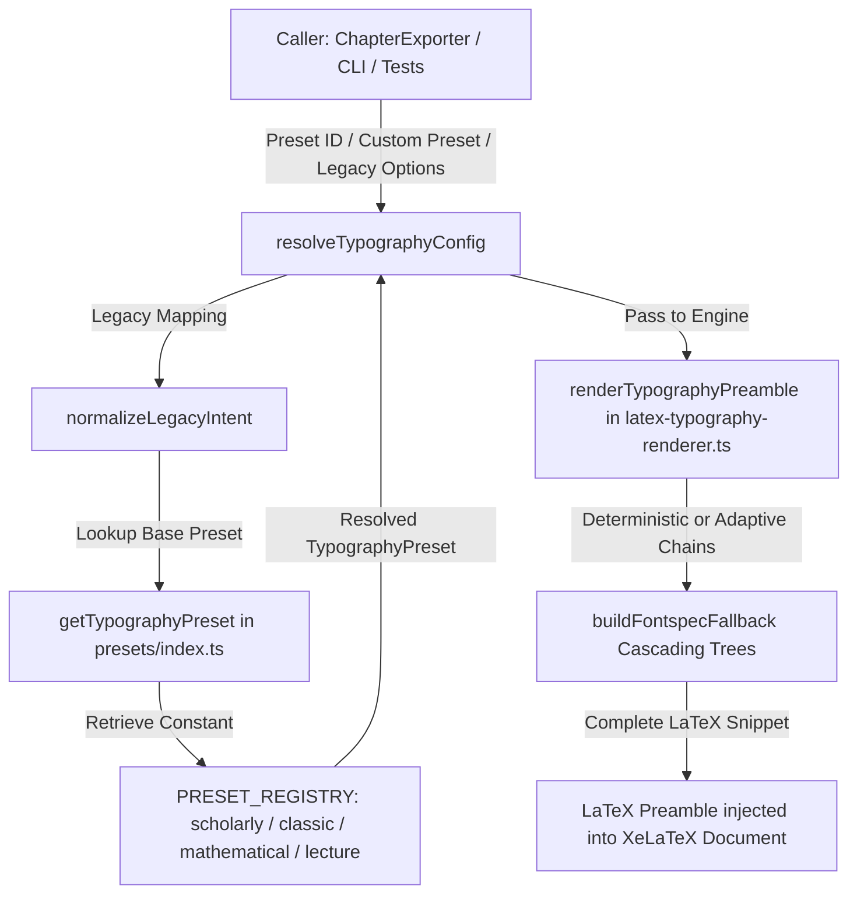

# AstroLib Academic Typography System (学术导出字体体系) 架构规范

## 1. 架构定位与核心原则 (Architecture Positioning)

AstroLib 学术导出字体体系是面向大学教材、学术专著、理论论文与研讨讲义的独立出版排版基础设施 (Publishing Domain Layer 3 Infrastructure)。

### 1.1 核心设计纪律
1. **Publishing Independence (Rule 2)**: 字体排版体系为纯粹的出版基础设施，零 UI 依赖、零 AST 依赖、零 Shell 运行时脚本依赖。
2. **Semantic Role != UI Component (Rule 1)**: 字体面向学术语义角色 (`body`, `heading`, `math`, `monospace`, `kaiFont`, `solutionLabel`) 统一绑定，严禁为特定前端盒子散落硬编码字体。
3. **Preset-Driven Publishing**: 一律通过强类型的预设 (Preset) 统一驱动，杜绝零散参数配置与通用的无约束字体选择器。
4. **Deterministic Publishing & Dual-State Resolution**:
   - `deterministic` (确定性模式): 用于 CI、Release 生产包、Golden PDF 回归测试。严禁依赖任何宿主机系统字体，仅使用受控项目资产或 TeX Live 官方发行版稳定包含且经验证的静态字体。
   - `adaptive` (自适应模式): 用于本地开发与读者预览。允许探测并优先匹配宿主机已安装的高质量系统字体。
5. **Static Fonts Only (排版安全绝对防线)**:
   - `StaticFontOnlyForPublishing = true`
   - 经过真实 XeLaTeX / xdvipdfmx 引擎验证，OpenType Variable Font (如 `NotoSerifSC-VF.ttf`) 会在双遍编译或多页排版时引发 `xdvipdfmx:fatal: Invalid font: -1` 严重崩溃。体系内所有字体规格与候选链中全面剔除 Variable Font，100% 采用静态 OTF/TTF 资产。

---

## 2. 官方学术排版预设体系 (Preset Registry)

体系正式确立 **3 套 Core (核心通用) + 1 套 Specialized (专门场景)** 架构，共 4 套官方预设。

### 2.1 预设对比矩阵

| 预设标识 (ID) | 架构分类 | 学术定位 | 适用学科与场景 | 中文正文 (设计 / 确定性 / 自适应) | 西文与公式 | 行距与段落 |
| :--- | :--- | :--- | :--- | :--- | :--- | :--- |
| **`scholarly`** *(默认)* | `core` | 现代学术教材 | 数学分析、高等代数、大学物理教材与严肃学术讲义 | **思源宋体**<br>• Det: `SourceHanSerifSC` / `FandolSong`<br>• Adapt: 思源宋体 / Noto Serif CJK / SimSun | STIX Two Text<br>STIX Two Math | 行距: 1.25<br>缩进: 2em |
| **`classic`** | `core` | 经典 TeX 专著 | 传统纯数学专著、抽象代数、CTAN 纯正 TeX 出版物 | **Fandol 中文**<br>• Det: `FandolSong-Regular.otf`<br>• Adapt: FandolSong / 中易宋体 | Latin Modern Roman<br>Latin Modern Math | 行距: 1.22<br>缩进: 2em |
| **`mathematical`** | `core` | 数理专版 | 拓扑学、微分几何、泛函分析、理论物理专著 | **思源宋体**<br>• Det: `SourceHanSerifSC` / `FandolSong`<br>• Adapt: 思源宋体 / Noto Serif CJK / SimSun | Libertinus Serif<br>Libertinus Math | 行距: 1.25<br>缩进: 2em |
| **`lecture`** | `specialized` | 大学讲义/笔记 | 随堂讲义、课程期末复习指南、助教研讨习题解答 (非正式 Textbook 默认) | **霞鹜文楷 GB Lite**<br>• Det: `LXGWWenKaiGBLite` / `FandolKai`<br>• Adapt: 霞鹜文楷 / 楷体 | STIX Two Text<br>STIX Two Math | 行距: 1.30<br>缩进: 2em |

---

## 3. 移除 `international` 的技术与设计理由

在 Phase 4.5 Specimen 真实物理编译与字体嵌入审计中，经过严密论证，正式将 `international` 从生产注册表与类型联合体中彻底移除。主要依据如下：

1. **85% 以上视觉与数学符号高度冗余**:
   - `international` 原设计为 `Noto Serif CJK + Noto Serif + STIX Two Math`。
   - 而核心预设 `scholarly` 为 `Source Han Serif CJK + STIX Two Text + STIX Two Math`。
   - 二者在公式层完全同源同构（均使用 STIX Two Math），西文层面 Noto Serif 与 STIX Two Text 在正文字阶下的学术差异极小。
2. **极端减法原则 (Radical Subtraction Principles)**:
   - 遵循工作区核心准则 Rule 5.3：“*If removed, does the reader lose necessary academic/mathematical information? If not, remove it.*”
   - 用户及读者在阅读国际化数学教材时，`scholarly`（思源宋体 + STIX Two）在字重完备度、中西文字高光学对齐和多语种表现上已完全覆盖且优于旧有的 `international`。
3. **消除注册表虚胖与认知负担**:
   - 预设数量不是衡量系统价值的指标。保持 3 套 Core（现代、古典、数理）与 1 套 Specialized（手写讲义）具备极高的正交性与互补性。
4. **彻底清理生产路径**:
   - `TypographyPresetId` 联合体中剔除 `'international'`；
   - 注册表中若遇到历史遗留或未知 `'international'`，自动且安全地回退至 `DEFAULT_TYPOGRAPHY_PRESET` (`scholarly`)，并在严格校验模式下抛出非法预设异常。

---

## 4. 模块解耦与调用流架构 (Decoupled Architecture)

在 Phase 5 中，预设数据定义从 LaTeX 渲染引擎中完全剥离，形成单向清晰的依赖流水线：

```
src/publishing/typography/
├── types.ts                      (领域模型与数据契约，定义 TypographyPreset, TypographyFontSpec)
├── metadata.ts                   (开源许可证与字体资产权威清单)
├── presets/                      (预设模块层)
│   ├── scholarly.ts              (现代学术教材 Core Preset)
│   ├── classic.ts                (经典 TeX Core Preset)
│   ├── mathematical.ts           (数理专版 Core Preset)
│   ├── lecture.ts                (大学讲义 Specialized Preset)
│   └── index.ts                  (注册表门面: PRESET_REGISTRY, getTypographyPreset, listTypographyPresets)
├── latex-typography-renderer.ts  (无状态渲染器: 接收 Preset，生成级联 \IfFontExistsTF 回退树与 Preamble)
└── index.ts                      (Typography 统一对外暴露门面)
```

### 4.1 调用数据流 (Data Flow)



### 4.2 职责边界划分
- **`presets/*.ts`**: 纯数据声明，仅持有每套预设的学术属性、度量数值与双态字体名。
- **`presets/index.ts`**: 单例只读注册表，提供类型守卫 `isTypographyPresetId` 与安全检索引擎 `getTypographyPreset`。
- **`latex-typography-renderer.ts`**: 无状态纯编译函数，专注于将 `TypographyPreset` 转换为健壮、容错、跨平台的 XeLaTeX 宏包引导区代码。
- **`latex-generator.ts`**: （Phase 7 接入）仅负责文档组装，不得侵入字体解析细节。

---

## 5. 质量保证与自动化测试 (Verification Suite)

体系建立了分层严密的自动化验证网：

1. **Preset Contract Test (`scripts/test-typography-presets.mjs`)**:
   - 127 项细粒度断言：验证 4 套预设注册完整性、完全排除 `international`、Core/Specialized 分类正确性、双态候选链完备性、彻底排查 Variable Font、API 异常回退行为。
2. **Phase 4/4.5 Gate Specimen Test (`scripts/test-phase4-gate.mjs`)**:
   - 4 套预设 × 双态解析 = 8 组真机物理编译测试；
   - 2 CJK × 4 Math = 8 组 Legacy 正交矩阵编译测试。全部 16 组通过真实 XeLaTeX 双遍物理编译。
3. **Full Typography Specimen Test (`scripts/test-typography-specimen.mjs`)**:
   - 全要素真机排版测试：中文、英文、微积分极限公式、分块矩阵、定理环境、严谨证明、解题步骤【解】、学术题注与数字资源流式排版。双遍物理编译生成无损 PDF。
4. **Publishing Pipeline Regression Test (`scripts/test-export-acceptance.mjs`)**:
   - 36 项全链路导出验收测试 100% 通过，确保既有章节/习题导出与 UI 契约零回归。
