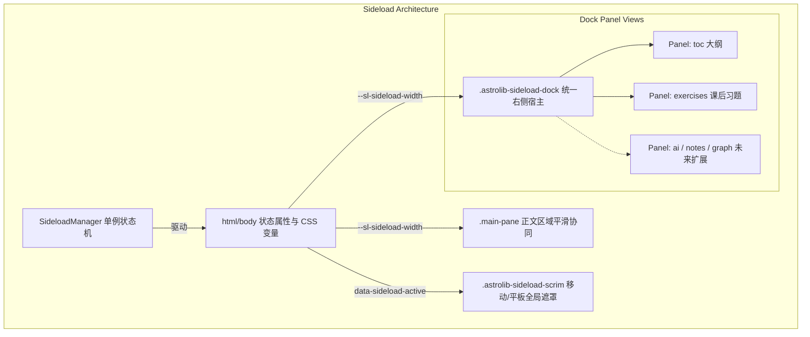

# Sideload Dock 统一侧载架构与多功能扩展交接文档

## 1. 架构背景与解决的问题

在理科教辅与学术教材数字化平台（AstroLib）中，页面右侧区域具有极高密度的信息承载需求：
- **学术导航**：本节大纲（TOC）、例题/定理/公式关键锚点；
- **练习系统**：分节课后习题、真题自测、推导展开与答题草稿；
- **未来功能**：AI 书内问答助手、知识图谱速查、随堂笔记等。

在旧版实现中，由于缺乏统一的底座协调机制，存在严重的架构硬伤：
1. **状态冲突与互相强杀**：设置面板打开时硬编码强杀习题面板；点击设置时因 CSS 样式污染导致顶栏冒出“本节大纲”图标；
2. **断崖式宽度跳跃与公式重排抖动**：旧样式使用无效选择器 `:global(...)` 导致回退，切习题时正文宽度突变，导致 KaTeX 数学公式大面积重排与断行闪烁；
3. **嵌套容器内部锁死**：父级容器扩展到 391px 时，子级 `.custom-page-sidebar` 被样式死锁在 264px，造成右侧 127px 空白浪费，习题卡片挤在窄带中；
4. **移动端撑爆视口**：移动端设定固定 `min-width: 24rem`，在 375px 视口下横向溢出。

为此，本项目抽象并实现了 **Sideload Dock（统一侧载底座）**，作为全站所有右侧交互功能的统一底层支撑。

---

## 2. 核心架构设计（Four Invariants）



### 2.1 Single Host, Multi-Views（同宿主多视图）
- 右侧边栏物理容器严格统一为 `.astrolib-sideload-dock`（位于 `PageSidebarOverride.astro`）。
- 每一个业务功能作为一个独立的 `<section class="sideload-panel-view" data-panel-id="...">` 声明在宿主内部。
- 视图切换在宿主内部无缝过渡，不触发 DOM 销毁与重建，完整保留读者的滚动高度、输入草稿与状态数据。
- 严禁任何业务模块脱离该宿主而在 `body` 下自造并列的全高侧边栏。

### 2.2 SideloadManager as the Sole Arbiter（单例状态机唯一裁决）
- 模块路径：[`src/components/sideload/sideload-manager.ts`](file:///d:/Antigravity/project/AstroLib/src/components/sideload/sideload-manager.ts)。
- 唯一负责调度面板开合、宽度阶梯换算、`:root` 级 CSS 变量同步与事件派发。
- 严禁业务 Controller 直接操作 `document.body.className` 或手动修改容器的 CSS 宽度。

### 2.3 TOC Fallback & Three-Way Exit Loop（大纲基准与三退出闭环）
- 本节大纲（`toc`）是右侧的常驻默认基准视图。
- 任何非大纲面板被激活后，必须为读者提供明确的三通道退回大纲能力：
  1. **UI 按钮**：面板头部内置 Google M3 标准 28px 圆形返回按钮（`#sideload-back-to-toc` 或 `sideloadManager.switchToDefault()`）；
  2. **键盘操作**：全局监听 `Escape` 键，秒切回大纲；
  3. **遮罩操作**：移动/平板端点击背景遮罩（`.astrolib-sideload-scrim`）平滑退回大纲。

### 2.4 Viewport Sheet Transformation（视口自适应分流）
- **桌面端 (≥ 72rem / 1152px)**：采用 Docked 协同分栏，正文 `.main-pane` 宽度与右栏联动，通过 CSS 变量 `--sl-sideload-width` 实现微阻尼平滑过渡（`cubic-bezier(0.2, 0, 0, 1)`），杜绝重排抖动。
- **平板端 (50rem - 72rem / 800px - 1152px)**：非大纲面板激活时，自动转为 Material Design 3 标准 **Side Sheet 侧边浮层**（`position: fixed; width: min(25rem, 85vw); z-index: 400;`），伴随半透明 Scrim 遮罩，正文宽度保持稳定不被挤压。
- **移动端 (< 50rem / 800px)**：非大纲面板激活时，自动转为 Material Design 3 标准 **Bottom Sheet 底部抽屉**（`position: fixed; width: 100vw; max-height: 85vh; border-radius: 16px 16px 0 0;`），彻底解决窄屏横向撑爆问题。

---

## 3. 宽度分级体系（Width Tiers）

`SideloadManager` 内置 4 档标准宽度阶梯，正文区域自动自适应计算空间：

| 阶梯等级 | 预设宽度 | 适用场景 | 说明 |
| :--- | :--- | :--- | :--- |
| `compact` | `16.5rem` (264px) | 本节大纲 (`toc`)、轻量书签 | 默认基准宽度，极致紧凑，为数学正文留出最大阅读画幅 |
| `medium` | `20rem` (320px) | 随堂笔记、快速术语释义、简易问答 | 中等宽度，适合纯文本流与简短列表 |
| `wide` | `24.5rem` (392px) | 课后习题 (`exercises`)、公式推导对比 | 宽面板，确保复杂数学长公式与选项不被折断压缩 |
| `full` | `28rem` (448px) | 知识图谱深度展开、代码编辑器分栏 | 超大工作区 |

---

## 4. 业务接入指南（以新增 AI 学术问答为例）

接入新功能只需极简两步：

### 第一步：在 `PageSidebarOverride.astro` 挂载视图

```astro
<!-- src/components/PageSidebarOverride.astro -->
<aside class="astrolib-sideload-dock custom-page-sidebar" id="astrolib-sideload-dock" ...>
  <!-- 现有视图：toc 与 exercises -->
  ...

  <!-- 新增视图：AI 学术问答 -->
  <section class="sideload-panel-view" data-panel-id="ai-assistant" aria-hidden="true">
    <div class="ai-panel-header">
      <button
        type="button"
        class="sideload-back-btn"
        id="ai-back-to-toc"
        title="返回本节大纲 (Esc)"
        aria-label="返回本节大纲"
      >
        <svg viewBox="0 0 24 24" width="18" height="18" fill="none" stroke="currentColor" stroke-width="2">
          <path d="m15 18-6-6 6-6" />
        </svg>
      </button>
      <h3 class="ai-panel-title">AI 学术助手</h3>
    </div>
    <div class="ai-panel-content">
      <!-- 问答对话组件挂载点 -->
    </div>
  </section>
</aside>
```

### 第二步：在业务 Controller 中调用管理单例

```ts
import { sideloadManager } from '@/components/sideload/sideload-manager';

// 1. 注册面板规格
sideloadManager.register({
  id: 'ai-assistant',
  title: 'AI 问答',
  widthTier: 'wide', // 或 'medium' / 'full'
});

// 2. 绑定返回按钮
document.getElementById('ai-back-to-toc')?.addEventListener('click', () => {
  sideloadManager.switchToDefault();
});

// 3. 业务触发打开面板
export function openAiAssistant(initialQuery?: string) {
  sideloadManager.open('ai-assistant', { query: initialQuery });
}
```

底层系统会自动向 `<html>` 同步 `data-sideload-active="ai-assistant"`，并更新 `--sl-sideload-width`，正文与视口将自动完成平滑联动，无需开发者额外编写响应式与遮罩代码。

---

## 5. 核心关联文件索引

- **侧载调度状态机**：[`src/components/sideload/sideload-manager.ts`](file:///d:/Antigravity/project/AstroLib/src/components/sideload/sideload-manager.ts)
- **右侧侧边栏宿主组件**：[`src/components/PageSidebarOverride.astro`](file:///d:/Antigravity/project/AstroLib/src/components/PageSidebarOverride.astro)
- **习题侧边栏控制器**：[`src/components/exercises/exercise-sidebar-controller.ts`](file:///d:/Antigravity/project/AstroLib/src/components/exercises/exercise-sidebar-controller.ts)
- **Material You 主题侧载样式**：[`src/themes/material-you/theme.css`](file:///d:/Antigravity/project/AstroLib/src/themes/material-you/theme.css)（搜索 `Sideload` 锚点）
- **自动化无头测试脚本**：`scratch/test_sidebar_behavior.cjs` 与 `scratch/test_viewports.cjs`
