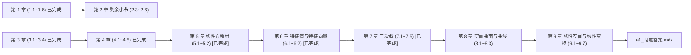

# 《线性代数与几何（第2版）》原书视觉数字化重构与导入交接文档

## 1. 项目背景与书籍基本档案

本项目致力于将经典理工科大学教材通过高保真视觉数字化流水线导入 AstroLib 知识库。《线性代数与几何（第2版）》是北京邮电大学“十三五”规划精品教材，系统融合了线性代数运算体系与解析几何直观空间。

### 1.1 书籍元数据与系统配置

| 属性 | 详细规格 / 路径 |
| :--- | :--- |
| **书名** | 《线性代数与几何（第2版）》 |
| **编著者** | 刘吉佑、莫骄 编 |
| **出版单位** | 北京邮电大学出版社 |
| **版次** | 2018年9月第2版（2019年8月第2次印刷） |
| **ISBN** | 978-7-5635-5587-1 |
| **原始源文件** | `task/线性代数与几何.pdf`（高清双层/单层纯扫描 300 DPI 原版 PDF，共 239 页） |
| **中央书库注册** | [src/config/collections.config.mjs](file:///d:/Antigravity/project/AstroLib/src/config/collections.config.mjs) (`linear-algebra-geometry`) |
| **合集分类** | `math`（数学类本科生教材） |
| **路由 Slug** | `linear_algebra_geometry` |
| **入口页面** | `00_内容简介` |
| **正文 MDX 目录** | `src/content/docs/collections/math/linear_algebra_geometry/` |
| **插图资产目录** | `src/content/docs/collections/math/linear_algebra_geometry/images/` |
| **封面资产** | `public/covers/linear_algebra_geometry.jpg` (1182 × 1654 物理原书高清纯净切图) |

---

## 2. 物理原图切片与核心映射公式

### 2.1 物理页码与正本书页映射公式（Ground Truth）

原书扫描件存在 10 页的前置非正文页（封一、扉页、版权页、CIP 数据、前言、目录），因此正文部分的物理页码与印刷书页具有严格的一阶线性位移常数：

$$
\mathbf{PHYSICAL\_PAGE} = \mathbf{BOOK\_PAGE} + 10
$$

即：
- 印刷页码 $P_{\text{book}} = 1$（第 1 章 行列式起始页）$\longleftrightarrow$ 物理页码 $P_{\text{phys}} = 11$；
- 印刷页码 $P_{\text{book}} = 32$（第 2 章 矩阵起始页）$\longleftrightarrow$ 物理页码 $P_{\text{phys}} = 42$；
- 印刷页码 $P_{\text{book}} = 209$（习题答案起始页）$\longleftrightarrow$ 物理页码 $P_{\text{phys}} = 219$。

### 2.2 物理切片资产状态

全书 239 页切片已通过专用脚本切片就绪，存储于本地临时工作区：
- **切片工具**：[scripts/vision_reconstruct/slice_lag_pdf.py](file:///d:/Antigravity/project/AstroLib/scripts/vision_reconstruct/slice_lag_pdf.py)
- **切片目录**：`test/data/lag_pages/`
- **文件分布**：`phys_1.jpg` 至 `phys_239.jpg` 全部就绪，每张图像分辨率为 150 DPI（足以支持文字与公式微结构的高清识别），后续 Agent **无需重复切片**。

---

## 3. 当前已完成工作清单（截至第 4 章完成）

当前阶段已严格按照 AstroLib 出版级标准完成前置导读、第 1 章全章、第 2 章前 2 节、**第 3 章全章**以及**第 4 章全章**的高保真数字化重构：

### 3.1 已生成文件与内容概览

| 文件路径 | 对应章节与原书页码 | 核心内容与嵌入资产 |
| :--- | :--- | :--- |
| `00_内容简介.mdx` | 扉页 / 导言 | 课程地位、四大学习特色、九大知识模块思维导图、全书阅读指南。 |
| `00_前言.mdx` | Phys 5~7 (前言 i~iv) | 完整收录第2版前言与初版前言，详细阐明几何与代数交融的编写初衷。 |
| `1.1_二三阶行列式.mdx` | Phys 11~14 (Book 1~4) | 二元/三元线性方程组求解、对角线法则、嵌入高精裁剪图 `./images/fig_1_1.png`。 |
| `1.2_全排列及其逆序数.mdx` | Phys 14~15 (Book 4~5) | 排列逆序数计算、奇排列与偶排列定义、对换改变奇偶性定理与推论。 |
| `1.3_n阶行列式的概念.mdx` | Phys 15~18 (Book 5~8) | $n$ 阶行列式一般代数定义、上/下三角行列式与对角行列式展开求值。 |
| `1.4_行列式的性质.mdx` | Phys 18~23 (Book 8~13) | 转置保值性、两行互换反号、数乘提公因式、单行拆项、初等行变换保值性。 |
| `1.5_行列式的展开定理.mdx` | Phys 24~32 (Book 14~22) | 余子式与代数余子式、拉普拉斯展开定理、爪型/递推/Vandermonde 行列式技巧。 |
| `1.6_克拉默法则.mdx` | Phys 33~36 (Book 23~26) | Cramer's Rule 证明与系数行列式非零判定、齐次方程组非零解充要条件。 |
| `2.1_矩阵的概念.mdx` | Phys 42~45 (Book 32~35) | 物资调运模型、嵌入四点通信网络拓扑图 `./images/fig_2_1.png`、特殊矩阵汇总。 |
| `2.2_矩阵的运算.mdx` | Phys 45~54 (Book 35~44) | 矩阵加减、数乘、乘法非交换性与消去律失效、网络步长应用、转置与方阵行列式。 |
| `3.1_向量及其线性运算.mdx` | Phys 82~89 (Book 72~79) | 向量模与方向、三角形/平行四边形法则、空间直角坐标系、两点间距离与定比分点。嵌入 `./images/fig_3_1.png` ~ `fig_3_11.png`。 |
| `3.2_向量的数量积向量积混合积.mdx` | Phys 89~95 (Book 79~85) | 数量积与投影、向量积与右手系、混合积与平行六面体体积、共线共面判定。嵌入 `./images/fig_3_12.png` ~ `fig_3_18.png`。 |
| `3.3_平面及其方程.mdx` | Phys 95~98 (Book 85~88) | 点法式、一般式、截距式方程、两平面夹角与位置关系、点到平面距离公式。嵌入 `./images/fig_3_19.png`, `fig_3_20.png`。 |
| `3.4_空间直线的方程.mdx` | Phys 98~103 (Book 88~93) | 一般方程、对称式与参数方程、两直线夹角与相交判定、直线与平面夹角、平面束方程。嵌入 `./images/fig_3_21.png` ~ `fig_3_23.png`。 |
| `4.1_n维向量的概念及其线性运算.mdx` | Phys 107~109 (Book 97~99) | $n$ 维向量定义、行向量与列向量、零向量/负向量/相等、加法与数乘 8 大线性运算律。 |
| `4.2_向量组的线性相关性.mdx` | Phys 109~114 (Book 99~104) | 线性组合与线性表出（嵌入 `./images/fig_4_1.png`）、向量组概念、线性相关与无关定义及充要条件。 |
| `4.3_线性相关性的判别定理.mdx` | Phys 114~116 (Book 104~106) | 部分与整体相关性定理、分量重排定理、截短与接长定理、矩阵秩与行列式判定准则。 |
| `4.4_向量组的秩.mdx` | Phys 116~122 (Book 106~112) | 向量组等价、极大线性无关组与向量组秩、矩阵行秩列秩定理、初等变换求极大无关组。 |
| `4.5_向量空间.mdx` | Phys 122~125 (Book 112~115) | 向量空间与子空间定义、生成子空间 $L(\boldsymbol{\alpha}_1, \dots, \boldsymbol{\alpha}_m)$、基与维数、向量在基下的坐标。 |
| `5.1_齐次线性方程组.mdx` | Phys 129~135 (Book 119~125) | 齐次线性方程组解的性质、解空间、基础解系存在性与求法、通解结构定理。 |
| `5.2_非齐次线性方程组.mdx` | Phys 135~140 (Book 125~130) | 非齐次线性方程组有解判别定理、解的结构定理（特解加导出组通解）、行初等变换通解求法。 |
| `6.1_特征值与特征向量.mdx` | Phys 143~148 (Book 133~138) | 特征值与特征向量定义、特征多项式求法、特征值性质（和等于迹、积等于行列式）、相异特征值的特征向量线性无关。 |
| `6.2_方阵的相似化简.mdx` | Phys 148~154 (Book 138~144) | 相似矩阵概念与性质、方阵可相似对角化充要条件（$n$ 个线性无关特征向量）、相似对角化算法步骤。 |
| `7.1_标准正交基.mdx` | Phys 157~164 (Book 147~154) | 向量内积与模长、正交基与标准正交基、Schmidt 正交化方法、正交矩阵与正交变换。嵌入 `./images/fig_7_1.png` ~ `fig_7_3.png`。 |
| `7.2_实对称矩阵的对角化.mdx` | Phys 164~168 (Book 154~158) | 实对称矩阵特征值为实数、相异特征值特征向量正交、正交相似对角化定理及正交矩阵求法。 |
| `7.3_实二次型及其标准形.mdx` | Phys 168~174 (Book 158~164) | 二次型及其矩阵表示 $\boldsymbol{x}^\mathrm{T}\boldsymbol{A}\boldsymbol{x}$、合同矩阵与性质、正交变换化标准形、配方法化标准形。 |
| `7.4_实二次型的规范形.mdx` | Phys 174~176 (Book 164~166) | 二次型规范形、Sylvester 惯性定理、正负惯性指数与符号差、实对称矩阵合同充要条件与分类。 |
| `7.5_正定二次型与正定矩阵.mdx` | Phys 176~180 (Book 166~170) | 正定二次型与正定矩阵定义、标准形/特征值判别法、Sylvester 顺序主子式判别法、半正定与负定二次型。 |

### 3.2 已制作的高精图片资产

1. **封面**：`public/covers/linear_algebra_geometry.jpg`（1182 × 1654 像素）
2. **第 1 章**：`fig_1_1.png`（三阶行列式对角线法则示意图）
3. **第 2 章**：`fig_2_1.png`（四节点通信网络连通拓扑图）
4. **第 3 章**：`fig_3_1.png` 至 `fig_3_23.png` 全量 23 张空间解析几何高精无文字注图
5. **第 4 章**：`fig_4_1.png`（线性组合平行四边形示意图）
6. **第 7 章**：`fig_7_1.png`（第 7 章引言二次曲面主轴对角化图）、`fig_7_2.png`（Schmidt 二维正交投影分解图）、`fig_7_3.png`（Schmidt 三维平行六面体正交化图）

### 3.3 质检验收状态

运行全自动 MDX 语法与 KaTeX 编译器验证命令：
```bash
node scripts/scan-mdx.mjs src/content/docs/collections/math/linear_algebra_geometry
```
**结果**：28 / 28 个 MDX 文件全部通过语法、AST 卡片闭合、KaTeX 公式与相对图片路径校验，错误数为 0，警告数为 0。

---

## 4. 下一任 Agent 工作断点与全书任务规划

### 4.1 精确断点位置

> [!IMPORTANT]
> 截至当前，**第 1、3、4、5、6、7 章已 100% 重构完成**。
> 下一步推荐推进路径：
> 1. 回溯补齐 **第 2 章 剩余小节（2.3 ~ 2.6）**（Phys 54 ~ 76）；或
> 2. 向前推进 **第 8 章 空间曲面与曲线（8.1 ~ 8.3）**（Phys 184 ~ 194）。

### 4.2 全书后续章节与物理页码对应表



#### 阶段 A：第 2 章 矩阵（剩余小节）
- `2.3_逆矩阵.mdx`：Phys 54~59 (Book 44~49)
  - 伴随矩阵 $\boldsymbol{A}^*$、可逆充要条件 $|\boldsymbol{A}| \neq 0$、公式法求逆 $\boldsymbol{A}^{-1} = \frac{1}{|\boldsymbol{A}|}\boldsymbol{A}^*$、可逆矩阵的性质与运算律。
- `2.4_矩阵的秩与初等变换.mdx`：Phys 59~65 (Book 49~55)
  - $k$ 阶子式与矩阵的秩 $R(\boldsymbol{A})$、初等行/列变换、行阶梯形与行最简形、初等变换法求秩与解线性方程组初步。
- `2.5_初等矩阵.mdx`：Phys 65~69 (Book 55~59)
  - 三类初等矩阵定义、初等变换等价于左/右乘初等矩阵定理、初等变换法求逆矩阵 $(\boldsymbol{A} \mid \boldsymbol{E}) \to (\boldsymbol{E} \mid \boldsymbol{A}^{-1})$。
- `2.6_矩阵的分块法.mdx`：Phys 69~76 (Book 59~66)
  - 分块加法、数乘、分块转置、分块乘法、准对角矩阵求逆与分块初等变换。
  - **截断**：遇到第 76 页（Book 66）的“习题二”大标题立即截断正文，不得平铺课后习题。

#### 阶段 B：第 3 章 向量代数、平面与直线（100% 已完成）
- `3.1_向量及其线性运算.mdx`：Phys 82~89 (Book 72~79) [已完成]
- `3.2_向量的数量积向量积混合积.mdx`：Phys 89~95 (Book 79~85) [已完成]
- `3.3_平面及其方程.mdx`：Phys 95~98 (Book 85~88) [已完成]
- `3.4_空间直线的方程.mdx`：Phys 98~103 (Book 88~93) [已完成]

#### 阶段 C：第 4 章 向量组的线性相关性（100% 已完成）
- `4.1_n维向量的概念及其线性运算.mdx`：Phys 107~109 (Book 97~99) [已完成]
- `4.2_向量组的线性相关性.mdx`：Phys 109~114 (Book 99~104) [已完成]
- `4.3_线性相关性的判别定理.mdx`：Phys 114~116 (Book 104~106) [已完成]
- `4.4_向量组的秩.mdx`：Phys 116~122 (Book 106~112) [已完成]
- `4.5_向量空间.mdx`：Phys 122~125 (Book 112~115) [已完成]

#### 阶段 D：第 5 章 线性方程组（100% 已完成）
- `5.1_齐次线性方程组.mdx`：Phys 129~135 (Book 119~125) [已完成]（解空间、基础解系、通解结构定理）
- `5.2_非齐次线性方程组.mdx`：Phys 135~140 (Book 125~130) [已完成]（有解判别定理、特解与导出组通解相加）

#### 阶段 E：第 6 章 特征值与特征向量（100% 已完成）
- `6.1_特征值与特征向量.mdx`：Phys 143~148 (Book 133~138) [已完成]
- `6.2_方阵的相似化简.mdx`：Phys 148~154 (Book 138~144) [已完成]（相似矩阵、相似对角化充要条件）

#### 阶段 F：第 7 章 二次型（100% 已完成）
- `7.1_标准正交基.mdx`：Phys 157~164 (Book 147~154) [已完成]（内积、Schmidt 正交化、正交矩阵）
- `7.2_实对称矩阵的对角化.mdx`：Phys 164~168 (Book 154~158) [已完成]
- `7.3_实二次型及其标准形.mdx`：Phys 168~174 (Book 158~164) [已完成]（配方法、初等变换法、正交变换法）
- `7.4_实二次型的规范形.mdx`：Phys 174~176 (Book 164~166) [已完成]（惯性定理、符号差）
- `7.5_正定二次型与正定矩阵.mdx`：Phys 176~180 (Book 166~170) [已完成]（Sylvester 顺序主子式判别法）

#### 阶段 G：第 8 章 空间曲面与曲线（密集二次曲面图）
- `8.1_空间曲面及其方程.mdx`：Phys 184~187 (Book 174~177)（球面、旋转曲面、柱面）
- `8.2_二次曲面及其分类.mdx`：Phys 187~192 (Book 177~182)（椭球面、单双叶双曲面、椭圆抛物面等）
- `8.3_空间曲线及其方程.mdx`：Phys 192~194 (Book 182~184)（一般方程、参数方程、空间曲线在坐标面上的投影）
- **注意**：二次曲面图形需裁剪为 `images/fig_8_*.png` 并准确配图。

#### 阶段 H：第 9 章 线性空间与线性变换
- `9.1_线性空间的概念与基本性质.mdx`：Phys 197~200 (Book 187~190)
- `9.2_线性空间的基与坐标.mdx`：Phys 200~201 (Book 190~191)
- `9.3_基变换与坐标变换.mdx`：Phys 201~203 (Book 191~193)
- `9.4_线性变换的概念与基本性质.mdx`：Phys 203~205 (Book 193~195)
- `9.5_线性变换的矩阵表示.mdx`：Phys 205~208 (Book 195~198)
- `9.6_欧氏空间.mdx`：Phys 208~213 (Book 198~203)
- `9.7_线性空间的同构.mdx`：Phys 213~215 (Book 203~205)

#### 阶段 I：习题答案
- `a1_习题答案.mdx`：Phys 219~237 (Book 209~227)
  - 将各章课后习题参考答案统一结构化整合为附录，供读者查阅对照。

---

## 5. 六大出版级排版铁律契约（不可违背）

为了确保全书具有统一的大学学术教材美感，后续 Agent 编写 MDX 时必须无条件贯彻以下 6 条核心原则：

### 契约 1：边栏批注彻底抽离为 `<SideNote>`
- 原书在印刷版面中常在右边栏放置“注”、“注意”、“思考”、“说明”等批注；
- **铁律**：必须将其彻底从正文主干推导中剥离出来，封装为 `<SideNote title="...">...</SideNote>`，放置在对应段落开头或卡片内部；
- 严禁让边栏批注横插在主栏句子中间，破坏定理证明的连贯性。

### 契约 2：语义卡片闭合与层级规范（杜绝错位与嵌套）
- **定理 / 定义**：统一使用 `<Knowledge title="定义 X ...">...</Knowledge>` 或 `<Knowledge title="定理 X ...">...</Knowledge>`；
- **定理证明**：统一使用 `<Solution title="证明">...</Solution>`；
- **例题题面**：统一使用 `<Example title="例 X ...">...</Example>`；
- **例题解答**：统一使用 `<Solution title="解">...</Solution>`；
- **长题干分流原则**：当例题题面超过 60 个汉字时，`title` 属性中仅写简短前缀（如 `title="例 2"`），将长题干移入 `<Example>` 卡片主体内部，避免全局文本加粗；
- **严禁卡片包裹大纲**：原书各节下的“一、...”、“二、...”等小标题必须使用标准的 Markdown 二级标题 `##` 或三级标题 `###`，严禁用 `<Knowledge>` 卡片包裹大纲标题。

### 契约 3：100% 工业级 KaTeX 纯净度与独立块级
- 变量符号统一用 `$...$`（如 $\boldsymbol{A}, \boldsymbol{x}, \lambda$），矩阵和向量统一采用粗斜体黑体 `\boldsymbol{...}`；
- **带编号公式**：所有包含 `\tag{X.Y}` 的公式必须作为独立块级 `$$`，且前后必须严格保留空行：
  ```markdown
  $$
  \boldsymbol{A}\boldsymbol{x} = \boldsymbol{b} \tag{2.1}
  $$
  ```
- **严防嵌套 tag**：在 `aligned`、`cases` 或矩阵环境内部严禁使用 `\tag`，内部公式编号统一采用对齐符与括号文本（如 `& (1) \\ & (2)`）；
- **去除带圈字符**：禁止在公式内使用 Unicode 带圈数字（如 `①, ②`），统一使用标准 ASCII `(1), (2)`。

### 4. 响应式配图规范
- 原书中的几何图形与拓扑图必须包裹在 `<figure class="vp-figure">` 中：
  ```markdown
  <figure class="vp-figure">
    
    <figcaption>图 X.Y 详细图名</figcaption>
  </figure>
  ```
- 裁剪图片时紧贴图形主体边缘，**严禁将印刷在书页上的文字“图 X.Y”裁剪进图片中**（因为 `<figcaption>` 会以纯净排版呈现）。

### 契约 5：课后习题平铺彻底隔离
- 正文小节（如 `1.6`, `2.6`, `3.4`, `4.5`, `5.2`, `6.2`, `7.5`, `8.3`, `9.7`）在正文完结处遇到“习题 X”大标题时，**必须立即停止正文生成**；
- 尾部统一挂载交互式自测触发器：
  ```markdown
  <ExerciseTrigger chapter={2} section="2.3" title="2.3 逆矩阵 课后真题与自测练习" />
  ```

### 契约 6：路由与 Slug 严格规范
- 文件命名规范为：`X.Y_章节名称.mdx`（如 `2.3_逆矩阵.mdx`）；
- 系统底层的 `cleanSlug()` 工具会自动将其规范化为洁净 URL，页面标题在 Frontmatter 中声明为 `title: '2.3 逆矩阵'`。

---

## 6. 接任 Agent 推荐操作流水线

接任 Agent 可直接按以下三步推进后续章节开发：

### 第一步：阅读物理原图（无需额外 API）
直接使用环境内建的 `view_file` 工具查看 `test/data/lag_pages/phys_*.jpg`，视觉阅读原书版面与公式。例如，编写第 2.3 节时：
```
view_file: test/data/lag_pages/phys_54.jpg
view_file: test/data/lag_pages/phys_55.jpg
view_file: test/data/lag_pages/phys_56.jpg
view_file: test/data/lag_pages/phys_57.jpg
view_file: test/data/lag_pages/phys_58.jpg
view_file: test/data/lag_pages/phys_59.jpg
```

### 第二步：编写 MDX 并校验
使用 `write_to_file` 在 `src/content/docs/collections/math/linear_algebra_geometry/` 目录下生成对应 MDX 文件，随后立即运行自动化扫描检查：
```bash
node scripts/scan-mdx.mjs src/content/docs/collections/math/linear_algebra_geometry/2.3_逆矩阵.mdx
```

### 第三步：切图（若有几何图形）
如遇到几何章节（第 3、8 章），可使用 PyMuPDF 对原 PDF 进行精确像素裁剪，保存至 `./images/fig_X_Y.png`。脚本参考模板：
```python
import pymupdf

doc = pymupdf.open("task/线性代数与几何.pdf")
page = doc[phys_page_index]  # 0-indexed, 即 phys_page - 1
clip = pymupdf.Rect(x0, y0, x1, y1)  # 坐标框
pix = page.get_pixmap(dpi=300, clip=clip)
pix.save(
    "src/content/docs/collections/math/linear_algebra_geometry/images/fig_X_Y.png"
)
```

---

## 7. 验收与交付指标

在全部章节重构完成后，须通过以下两级质检门禁：
1. **Level 1 语法与公式门禁**：
   ```bash
   node scripts/scan-mdx.mjs src/content/docs/collections/math/linear_algebra_geometry
   ```
   要求通过率 100%，0 语法警告。
2. **Level 2 端到端路由与渲染门禁**：
   在后台启动开发服务器后运行测试：
   ```bash
   node scripts/test_real_scenario.mjs
   ```
   验证页面加载 HTTP 200，无 KaTeX 解析错误标签（`.katex-error`），无损坏图片链接。
