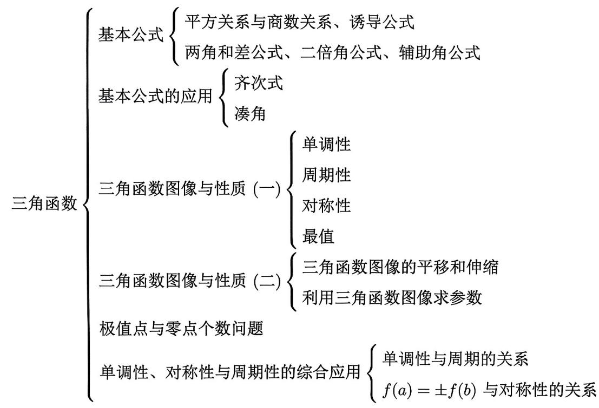

import Guide from '@/components/Guide.astro';
import Knowledge from '@/components/Knowledge.astro';
import Example from '@/components/Example.astro';
import Analysis from '@/components/Analysis.astro';
import Solution from '@/components/Solution.astro';
import Variant from '@/components/Variant.astro';
import Note from '@/components/Note.astro';
import Block from '@/components/Block.astro';

<Guide>

在以往的高考中, 只要能够熟练掌握三角函数公式, 基本上可以轻松解决与三角函数相关的考题. 然而, 对于当前的新高考, 仅仅依靠死记硬背公式已经不能满足要求了. 从最近几年的高考题可以看出, 新高考对三角函数的考查越来越深入, 三角函数题目甚至常常出现在选填题的压轴位置. 因此, 我们必须充分重视三角函数这一章节.

</Guide>