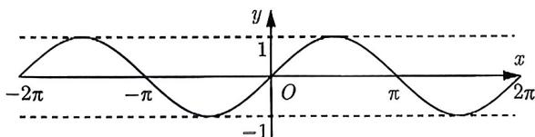
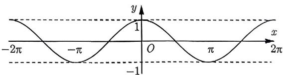
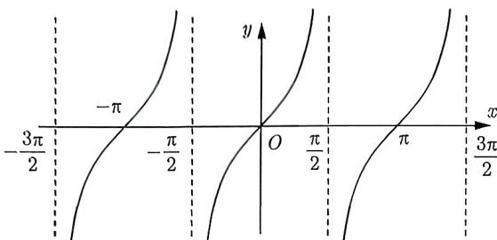

import Guide from '@/components/Guide.astro';
import Knowledge from '@/components/Knowledge.astro';
import Example from '@/components/Example.astro';
import Analysis from '@/components/Analysis.astro';
import Solution from '@/components/Solution.astro';
import Variant from '@/components/Variant.astro';
import Note from '@/components/Note.astro';
import Block from '@/components/Block.astro';

三角函数的本质还是函数, 函数可谓是 “得图像者得天下”, 所以能够掌握好三角函数的图像, 很多问题便迎刃而解. 在本节中, 我们将介绍正弦函数、余弦函数和正切函数这三个最基本函数的图像 (如图 1-1～图 1-3 所示) 及其性质. 我们将逐一讨论它们的单调性、周期性、奇偶性、对称性和最值这五个性质. 至于三角函数图像的平移和伸缩, 我们将在下一节进行讨论.

  
图1-1

  
图1-2

  
图1-3
