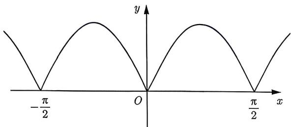
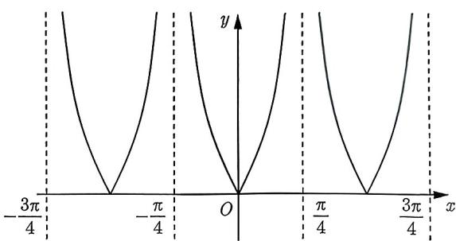
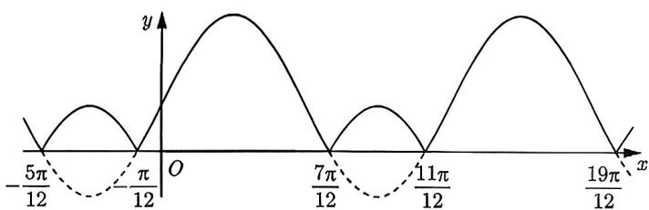
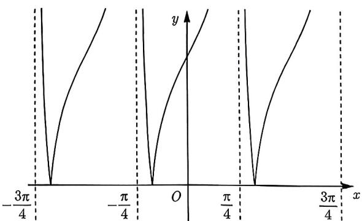
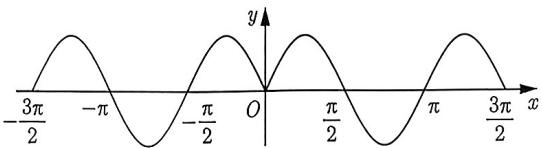
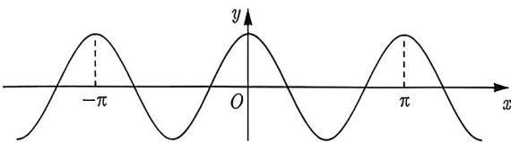
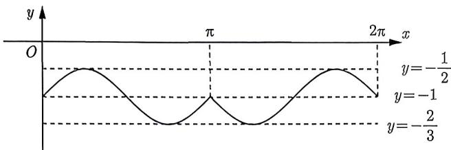

import Guide from '@/components/Guide.astro';
import Knowledge from '@/components/Knowledge.astro';
import Example from '@/components/Example.astro';
import Analysis from '@/components/Analysis.astro';
import Solution from '@/components/Solution.astro';
import Variant from '@/components/Variant.astro';
import Note from '@/components/Note.astro';
import Block from '@/components/Block.astro';

<Knowledge title="知识点 1.6">
（1）函数 $y = A \sin(\omega x + \varphi)$ 的最小正周期 $T = \frac{2\pi}{|\omega|}$ ; (2) 函数 $y = A \cos(\omega x + \varphi)$ 的最小正周期 $T = \frac{2\pi}{|\omega|}$ ; (3) 函数 $y = A \tan(\omega x + \varphi)$ 的最小正周期 $T = \frac{\pi}{|\omega|}$ .
</Knowledge>

<Example title="例 1.34">
（2018 全国Ⅲ文 6）函数 $f(x)=\frac{\tan x}{1+\tan^{2}x}$ 的最小正周期为（）.
A. $\frac{\pi}{4}$ B. $\frac{\pi}{2}$ C. $\pi$ D. $2\pi$

<Solution>
 $f(x) = \frac{\tan x}{1 + \tan^2x} = \frac{\frac{\sin x}{\cos x}}{1 + \frac{\sin^2x}{\cos^2x}} = \sin x\cos x = \frac{1}{2}\sin 2x.$ 因此 $T = \frac{2\pi}{2} = \pi$ ，故选C.
</Solution>
</Example>

如果将知识点1.6中的三个函数都加绝对值, 那么三个函数的最小正周期是否发生变化呢? 我们先看形如 $|f(x)|$ 的函数, 其图像可以通过上下翻折变换得到.

<Example title="例 1.35">
下列函数是否为周期函数, 如果是周期函数, 求最小正周期:
(I) $f(x)=|\sin2x|$ ; (II) $f(x)=|\tan2x|$ .

<Solution>
(I) 先画出 $y = \sin 2x$ 的图像, 保留 $x$ 轴上方图像, 再将 $y = \sin 2x$ 的下方的图像沿 $x$ 轴翻折到上方, 得到 $y = |\sin 2x|$ 的图像, 如图 1-4所示. 观察图像可知 $y = |\sin 2x|$ 的最小正周期是 $y = \sin 2x$ 的一半, 即为 $T = \frac{\pi}{2}$ .

(II) 先画出 $y = \tan 2x$ 的图像, 保留 $x$ 轴上方图像, 再将 $y = \tan 2x$ 的下方的图像沿 $x$ 轴翻折到上方, 得到 $y = |\tan 2x|$ 的图像, 如图1-5所示, 观察图像可知 $y = |\tan 2x|$ 的最小正周期和 $y = \tan 2x$ 相同, 都为 $T = \frac{\pi}{2}$ .

  
图1-4

  
图1-5
</Solution>
</Example>

<Example title="例 1.36">
（I） $y = \left|\sin 2x + \frac{1}{2}\right|$ （Ⅱ） $f(x) = |\tan 2x + 2|$

<Solution>
(I) 先画出 $y = \sin 2x + \frac{1}{2}$ 的图像, 再通过翻折变换得到 $y = \left|\sin 2x + \frac{1}{2}\right|$ 的图像, 如图 1-6 所示. 观察图像可知 $y = \left|\sin 2x + \frac{1}{2}\right|$ 的周期和 $y = \sin 2x + \frac{1}{2}$ 的周期相等, 即为 $T = \pi$ .

(II) 先画出 $y = \tan 2x + 2$ 的图像, 再通过翻折变换得到 $y = |\tan 2x + 2|$ 的图像, 如图1-7所示. 观察图像可知 $y = |\tan 2x + 2|$ 的周期和 $y = \tan 2x + 2$ 相等, 即为 $T = \frac{\pi}{2}$ .

  
图1-6

  
图1-7
</Solution>
</Example>

例1.35和例1.36是 $y = |\sin (\omega x + \varphi) + k|, y = |\cos (\omega x + \varphi) + k|, y = |\tan (\omega x + \varphi) + k|$ 中 $\varphi = 0$ 的两类特殊情况。现在的问题是，如果 $\varphi \neq 0$ 时，类似结论还成立吗？经过画图验证，它们依然满足这两道例题的结论，现总结如下：

<Block title="经验总结 1.4">
（1） $y = |A\sin (\omega x + \varphi) + k|$ ，当 $k = 0$ 时， $T = \frac{\pi}{|\omega|}$ ；当 $k\neq 0$ 时， $T = \frac{2\pi}{|\omega|}$ (2） $y = |A\cos (\omega x + \varphi) + k|$ ，当 $k = 0$ 时， $T = \frac{\pi}{|\omega|}$ ；当 $k\neq 0$ 时， $T = \frac{2\pi}{|\omega|}$ (3） $y = |A\tan (\omega x + \varphi) + k|$ ， $T = \frac{\pi}{|\omega|}$
</Block>

翻折变换还有一种常见的形式, 由 $f(x)$ 得到 $f(|x|)$ , 其图像可以通过左右翻折变换得到.

<Example title="例 1.37">
下列函数是否为周期函数, 如果是周期函数, 求最小正周期:

(I) $f(x) = \sin |2x|$ ; (II) $f(x) = \cos |2x|$ .

<Solution>
(I) 先画出 $y = \sin 2x$ 的图像, 去掉 $y$ 轴左侧图像, 保留 $y$ 轴右侧图像, 再将 $y$ 轴右侧图像沿 $y$ 轴翻折, 得到 $y = \sin |2x|$ 的图像, 如图 1-8 所示. 观察图像可知其不是周期函数.

(Ⅱ) 先画出 $y = \cos 2x$ 的图像, 发现 $y = \cos 2x$ 的图像关于 $y$ 轴对称, 故去掉左侧图像, 保留右侧图像, 再将右侧图像沿 $y$ 轴翻折后, 得到 $y = \cos |2x|$ 的图像与 $y = \cos 2x$ 的图像相同, 如图 1-9 所示. 因此 $y = \cos |2x|$ 的最小正周期 $T = \pi$ .

  
图1-8

  
图1-9
</Solution>
</Example>

将例1.37扩展到一般情形, 我们得到以下结论:

<Block title="经验总结 1.5">
设 $f(x) = A\sin (\omega x + \varphi), g(x) = A\cos (\omega x + \varphi), h(x) = A\tan (\omega x + \varphi).$

(1) 如果 $f(x)$ 或 $g(x)$ 的图像关于 $y$ 轴对称, 那么 $f(|x|)$ 或 $g(|x|)$ 的 $T = \frac{2\pi}{|\omega|}$ .

(2) 如果 $f(x)$ 或 $g(x)$ 的图像不关于 $y$ 轴对称, 那么 $f(|x|)$ 或 $g(|x|)$ 不是周期函数.

(3) $h(|x|)$ 不是周期函数.
</Block>

如果解析式含有绝对值 (或化简后含有绝对值), 且不是 $|f(x)|$ 或 $f(|x|)$ 的形式, 那么作图过程: 先去绝对值, 得到一个分段函数, 将每段都化简为 “ $y = A \sin(\omega x + \varphi)$ ” 的形式; 再画函数图像; 最后通过图像判断函数的最小正周期. 需要强调的是, 如果我们能先找到一个周期, 那么只需画出这个周期内的图像, 比如下面例题:

<Example title="例 1.38">
函数 $f(x)=|\sin x|\cos x-1$ 的最小正周期与最大值的和为 \_\_\_\_.

<Solution>
先找到 $f(x)$ 的一个周期, 因为

$$
f (x + 2 \pi) = | \sin (x + 2 \pi) | \cos (x + 2 \pi) - 1 = | \sin x | \cos x - 1 = f (x).
$$

所以 $2\pi$ 是 $f(x)$ 的一个周期, 但无法确定 $2\pi$ 是不是最小正周期, 故下一步需要画出 $f(x)$ 在 $[0, 2\pi]$ 内的图像, 由于 $f(x)$ 含有绝对值, 故考虑按绝对值内的正负进行讨论, 去掉绝对值.

(1) 当 $x \in [0, \pi)$ 时, $y = \sin x \cos x - 1 = \frac{1}{2} \sin 2x - 1$ ; (2) 当 $x \in [\pi, 2\pi]$ 时, $y = -\sin x \cos x - 1 = -\frac{1}{2} \sin 2x - 1$ , 由 (1) 与 (2) 可得 $f(x) = \left\{ \begin{array}{ll}\frac{1}{2} \sin 2x - 1, & x \in [0, \pi)\\ -\frac{1}{2} \sin 2x - 1, & x \in [\pi, 2\pi ] \end{array} \right.$ , 如图 1-10 所示.

  
图1-10

由图像得函数的最小正周期为 $2\pi$ ，最大值为 $-\frac{1}{2}$ 。所以最小正周期与最大值的和为 $2\pi - \frac{1}{2}$ 。
</Solution>
</Example>

<Variant title="变式 1.38.1">
函数 $f(x) = \sqrt{1 + \cos x} + \sqrt{1 - \cos x}$ 的最小正周期为 \_\_\_\_.
</Variant>
