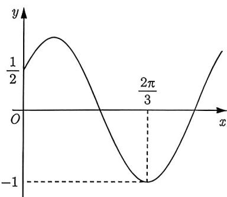
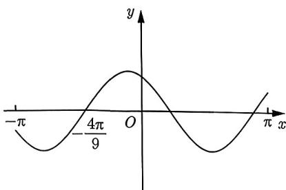
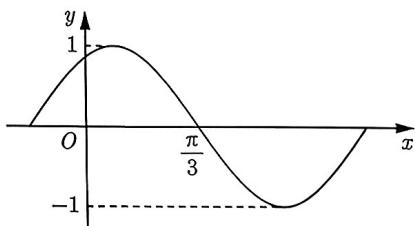
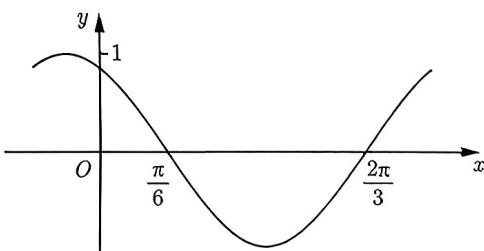
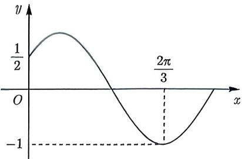
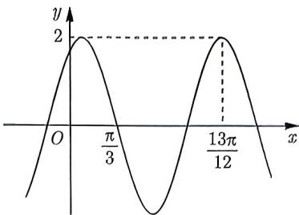
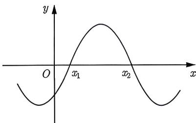
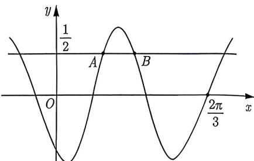

import Guide from '@/components/Guide.astro';
import Knowledge from '@/components/Knowledge.astro';
import Example from '@/components/Example.astro';
import Analysis from '@/components/Analysis.astro';
import Solution from '@/components/Solution.astro';
import Variant from '@/components/Variant.astro';
import Note from '@/components/Note.astro';
import Block from '@/components/Block.astro';

近年来, 利用三角函数的部分图像求解析式中的参数已成为高考数学中的热点问题, 其难度也不容小觑. 这类问题的总体思路是观察图像上的特殊点, 例如零点和极值点, 然后将这些点代入函数中以尝试获取参数的值. 然而, 在一般情况下, 可能会出现所谓的“增根”情况. 因此, 如何排除这些“增根”是我们本节的重点内容. 我们将介绍三种方法, 并通过例题逐步引入这些方法, 以帮助大家理解它们的必要性. 希望同学们能认真体会并掌握这些内容.

<Example title="例 1.50">
(2023 日照二模) 已知函数 $f(x)=\sin2\omega x\cos\varphi+\cos2\omega x\sin\varphi\left(\omega>0,0<\varphi<\frac{\pi}{2}\right)$ 的部分图像如图 1-11 所示，则 $\varphi=$ \_\_\_\_， $\omega=$ \_\_\_\_.

图1-11

<Solution>
由正弦的两角和公式得 $f(x)=\sin(2\omega x+\varphi)$ ，观察图像可知 $f(x)$ 过点 $\left(0,\frac{1}{2}\right)$ ，则 $\sin\varphi=\frac{1}{2}$ ，又 $0<\varphi<\frac{\pi}{2}$ ，所以 $\varphi=\frac{\pi}{6}$ 。又由图像可知 $f(x)$ 过 $\left(\frac{2\pi}{3},-1\right)$ ，则 $\sin\left(2\omega\cdot\frac{2\pi}{3}+\frac{\pi}{6}\right)=-1$ ，即 $2\omega\cdot\frac{2\pi}{3}+\frac{\pi}{6}=\frac{3\pi}{2}+2k\pi, k\in\mathbb{Z}$ ，解得 $\omega=1+\frac{3}{2}k, k\in N$ 。我们需要寻找图像上的信息确定 k 的值。注意到函数 $f(x)$ 的周期 T 满足 $T>\frac{2\pi}{3}$ 且 $\frac{T}{2}<\frac{2\pi}{3}$ ，即 $\frac{3}{4}<\omega<\frac{3}{2}$ 。又因为 $\omega=1+\frac{3}{2}k, k\in N$ ，所以只能取 k=0，即 $\omega=1$ 。故填 $\frac{\pi}{6};1$ 。
</Solution>
</Example>

例1.50中同学们容易将 $\omega = 1 + \frac{3}{2} k, k \in \mathbb{N}$ 作为最后结果, 这样就产生了“增根”, 而例1.50中去掉“增根”的方法, 同学们需要掌握, 现总结如下:

<Block title="去“增根”方法一">
通过图中两特殊点横坐标的距离来确定周期的范围.
</Block>

<Example title="例 1.51">
(2020 全国 I 文理 7) 设函数 $f(x)=\cos\left(\omega x+\frac{\pi}{6}\right)$ 在 $[-π,π]$ 上的图像大致如图 1-12 所示, 则 $f(x)$ 的最小正周期为 ( ).

A. $\frac{10\pi}{9}$ B. $\frac{7\pi}{6}$ C. $\frac{4\pi}{3}$ D. $\frac{3\pi}{2}$

<Solution>
因为 $x = -\frac{4\pi}{9}$ 是 $f(x)$ 的零点, 所以 $-\frac{4\pi}{9}\omega + \frac{\pi}{6} = k\pi + \frac{\pi}{2}, k \in \mathbb{Z}$ , 解得 $\omega = -\frac{9k + 3}{4}, k \in \mathbb{Z}$ . 再由图像可知, $f(x)$ 的最小正周期 $T$ 满足 $\pi < T < 2\pi$ , 即 $\pi < \frac{2\pi}{|\omega|} < 2\pi$ , 解得 $1 < |\omega| < 2$ . 于是 $4 < |9k + 3| < 8, k \in \mathbb{Z}$ , 满足该不等式的 $k$ 只有 $-1$ , 即 $\omega = \frac{3}{2}$ , 所以函数的最小正周期为 $T = \frac{4\pi}{3}$ , 故选 C.
</Solution>
</Example>

并不是参数的所有增根都能用去“增根”方法一去掉的, 比如下面的例题:

<Example title="例 1.52">
如图 1-13 所示是函数 $f(x)=\sin(2x+\varphi)(x\in\mathbb{R},|\varphi|<\pi)$ 的部分图像, 求 $\varphi$ .

<Solution>
由图1-13可知 $\left(\frac{\pi}{3}, 0\right)$ 是 $f(x)$ 的一个零点, 故 $2 \times \frac{\pi}{3} + \varphi = k\pi, k \in \mathbb{Z}$ , 即 $\varphi = k\pi - \frac{2\pi}{3}, k \in \mathbb{Z}$ . 当 $k = 0$ 时, $\varphi = -\frac{2\pi}{3}$ ; 当 $k = 1$ 时, $\varphi = \frac{\pi}{3}$ , 这两个值满足 $|\varphi| < \pi$ , 是否都正确呢? 我们再观察图像, 发现 $f(0) > 0$ , 而当 $\varphi = -\frac{2\pi}{3}$ 时 $f(0) < 0$ , 故 $\varphi$ 只能取 $\frac{\pi}{3}$ .
</Solution>

  
图1-12

  
图1-13
</Example>

通过 $f(0)$ 的正负来找出 $\varphi$ 的增根, 也是我们常用的方法, 现总结如下:

<Block title="去“增根”方法二">
通过图中特殊点处的正负, 可以尝试去掉增根, 特殊点一般是在原点.
</Block>

<Example title="例 1.53">
（2020 新高考 I 11-多选题）如图 1-14 所示是函数 $y = \sin(\omega x + \varphi)$ 的部分图像，则 $\sin(\omega x + \varphi) = (\quad)$ .
A. $\sin\left(x+\frac{\pi}{3}\right)$ B. $\sin\left(\frac{\pi}{3}-2x\right)$ C. $\cos\left(2x+\frac{\pi}{6}\right)$ D. $\cos\left(\frac{5\pi}{6}-2x\right)$

<Solution>
因为 $\frac{\pi}{6}$ 和 $\frac{2\pi}{3}$ 是两相邻零点, 则 $2\left(\frac{2\pi}{3} - \frac{\pi}{6}\right) = \frac{2\pi}{|\omega|}$ , 所以 $\omega = \pm 2$ 。从选项上看, 直接排除 A, 只考虑 B. 因为 $y = \sin \left(-2x + \frac{\pi}{3}\right)$ 满足在 $x = \frac{\pi}{6}$ 处为零且在 $x = 0$ 处为正, 故 B 正确。至于 C, D 选项, 它们均由余弦给出, 因此会想到诱导公式 $\sin x = \cos \left(\frac{\pi}{2} - x\right)$ , 即 $\sin \left(-2x + \frac{\pi}{3}\right) = \cos \left(2x + \frac{\pi}{6}\right)$ , 故 C 正确。故选 BC.
</Solution>

  
图1-14
</Example>

我们可以利用图中某些特殊点处的正负, 尝试去掉增根. 但是对于有些题来说, 仅仅靠特殊点的符号还不够, 此时我们需要进一步观察函数在某些特殊点的导数的正负来去掉增根.

<Example title="例 1.54">
(2023 深圳二模-多选题) 已知 $f(x)$ 是定义在闭区间上的偶函数, 且图 1-15 中 y 轴右侧的图像是 $y = \sin(\omega x + \varphi)(\omega > 0, 0 < \varphi < \pi)$ 图像的一部分, 则 ( ).

A. $f(x)$ 的定义域为 $[- \pi, \pi]$ B. 当 $x = \frac{\pi}{6}$ 时， $f(x)$ 取得最大值  
C. 当 $x < 0$ 时， $f(x)$ 的单调递增区间为 $\left[-\frac{2\pi}{3}, -\frac{\pi}{6}\right]$ D. 当 $x < 0$ 时， $f(x)$ 有且只有两个零点 $-\frac{5\pi}{12}$ 和 $-\frac{11\pi}{12}$

<Solution>
由图1-15可知 $f(0) = \frac{1}{2}$ ，则 $\sin \varphi = \frac{1}{2}$ ，又

图1-15

$0 < \varphi < \pi$ , 所以 $\varphi = \frac{\pi}{6}$ 或 $\varphi = \frac{5\pi}{6}$ , $\varphi$ 算出了两个值, 是否产生了“增根”呢? 我们进一步观察图像, 发现 $x = 0$ 在单调递增区间上, 故 $f'(0) = \omega \cos \varphi > 0$ , 又 $\omega > 0$ , 所以 $\varphi$ 只能为 $\frac{\pi}{6}$ . 由图像可知 $\frac{2\pi}{\omega} > \frac{2\pi}{3}$ , 解得 $0 < \omega < 3$ , 又 $\frac{2\pi}{3}\omega + \frac{\pi}{6} = \frac{3\pi}{2} + 2k\pi, k \in \mathbb{Z}$ , 解得 $\omega = 2 + 3k, k \in \mathbb{Z}$ . 因为 $0 < \omega < 3$ , 所以只有当 $k = 0$ 时, $\omega = 2$ 才符合要求. 因此, 当 $x > 0$ 时, $y = \sin\left(2x + \frac{\pi}{6}\right)$ .

选项 A, 由图 1-15 可知区间右端点为零点, 与它相邻的极值点 $\frac{2\pi}{3}$ 相差四分之一个周期, 于是右端点为 $\frac{2\pi}{3} + \frac{1}{4} \times \frac{2\pi}{\omega} = \frac{11\pi}{12}$ , 所以 $f(x)$ 的定义域为 $\left[-\frac{11\pi}{12}, \frac{11\pi}{12}\right]$ , 故 A 错误.

选项 B, 因为 $f\left(\frac{\pi}{6}\right)=\sin\left(2\times\frac{\pi}{6}+\frac{\pi}{6}\right)=1$ , 故 B 正确.

选项 C, 因为偶函数关于 y 轴对称的区间单调性相反, 所以我们只需找出 $f(x)$ 在 x > 0 的单调递减区间, 于是我们需要找出图中最高点所对应的 $x_{0}$ . 令 $2x_{0} + \frac{\pi}{6} = 2k\pi + \frac{\pi}{2}$ , 解得 $x_{0} = k\pi + \frac{\pi}{6}$ , $k \in Z$ . 又因为 $0 < x_{0} < \frac{2\pi}{3}$ , 所以只能取 k = 0, 即 $x_{0} = \frac{\pi}{6}$ . 于是 $f(x)$ 在 $\left[\frac{\pi}{6}, \frac{2\pi}{3}\right]$ , 上单调递减. 因为 $f(x)$ 是偶函数, 所以当 x < 0 时, $f(x)$ 的单调递增区间为 $\left[-\frac{2\pi}{3}, -\frac{\pi}{6}\right]$ , 故 C 正确.

选项 D, 当 x > 0 时, $f(x)$ 的零点为 $x = \frac{2\pi}{3} - \frac{1}{4} \times \frac{2\pi}{\omega}$ 和 $x = \frac{2\pi}{3} + \frac{1}{4} \times \frac{2\pi}{\omega}$ , 即 $x = \frac{5\pi}{12}$ 和 $x = \frac{11\pi}{12}$ , 因为 $f(x)$ 是偶函数, 所以当 x < 0 时, $f(x)$ 的两个零点为 $-\frac{5\pi}{12}$ 和 $-\frac{11\pi}{12}$ , 故 D 正确.

综上所述, 选 BCD.
</Solution>
</Example>

通过例1.54, 我们总结如下:

<Block title="去“增根”方法三">
通过图中特殊点处函数导数的正负, 可以尝试去掉增根.
</Block>

<Variant title="变式 1.54.1">
(2021 全国 II 文 15) 已知函数 $f(x) = 2 \cos(\omega x + \varphi)$ 的部分图像如图 1-16 所示，则 $f\left(\frac{\pi}{2}\right) =$ \_\_\_\_.

  
图 1-16
</Variant>

如果已知两个零点, 那么对两个零点作差, 我们能够求出周期, 从而得到 $\omega$ 的值, 在此基础上, 我们不妨思考: 对两个零点作和、作商、作积, 我们能求出什么? 作和问题我们在 1.6 节有详细介绍, 先看作商, 请看下面例题:

<Example title="例 1.55">
已知 $f(x)=A\sin(\omega x+\varphi)$ 的部分图像如图 1-17 所示, 其中 A>0, $\omega>0$ , $-\frac{\pi}{2}<\varphi<0$ . 在已知 $\frac{x_{2}}{x_{1}}$ 为大于 3 的常数的条件下, 下列选项中可以确定其值的量为 ( ) .
A. $\omega$ B. $\varphi$ C. $\frac{\varphi}{\omega}$ D. $A\sin\varphi$

<Solution>
由图可知 $\omega x_{1} + \varphi = k\pi, k \in \mathbb{Z}, \omega x_{2} + \varphi = \pi + k\pi, k \in \mathbb{Z}$ , 则

$$
\left\{ \begin{array}{l l} \omega x _ {1} = k \pi - \varphi \\ \omega x _ {2} = k \pi + \pi - \varphi \end{array} \right. \Rightarrow \frac {x _ {2}}{x _ {1}} = \frac {k \pi + \pi - \varphi}{k \pi - \varphi}, k \in \mathbb {Z}.
$$

因为 $\frac{x_2}{x_1}$ 为大于3的常数, 不妨设 $\frac{x_2}{x_1} = t (t > 3)$ , 则 $\frac{k\pi + \pi - \varphi}{k\pi - \varphi} = t$ , 解得 $\varphi = k\pi + \frac{-\pi}{t - 1}$ , 其中 $k \in \mathbb{Z}$ . 显然, $\varphi$ 是关于 $t$ 的增函数, 且其定义域为 $(3, +\infty)$ . 由于 $\frac{-\pi}{t - 1}$ 是关于 $t$ 单调递增的函数, 故有

$$
k \pi - \frac {\pi}{2} <   \varphi <   k \pi , \qquad k \in \mathbb {Z}.
$$

要使 $\varphi$ 落在区间 $\left(-\frac{\pi}{2}, 0\right)$ 内, 显然当且仅当 $k = 0$ 时该区间与上述不等式有交集, 故选 B.
</Solution>

  
图 1-17
</Example>

例1.55中, 在已知 $\frac{x_2}{x_1}$ 为大于3的常数的条件下, 我们能确定 $\varphi$ 值的关键是通过除法可以约掉 $\omega$ ，但是如果作积, 我们得到 $\omega^2 x_1 x_2 = (2k\pi - \varphi)(2k\pi + \pi - \varphi), k \in \mathbb{Z}$ ，这个式子既有 $\omega$ ，也有 $\varphi$ ，故当 $x_1 x_2$ 为定值时, 我们无法确定 $\omega$ 和 $\varphi$ 中的任何一个.

通过大量机械刷题很难适应现在的新高考了, 当然高考题还是要研究的, 研究的方法就是像例 1.55 那样, 对教材上的题或高考题联想、延伸、扩展. 下面继续我们的联想之路: 我们前面研究的零点都是对称点, 也是与 $x$ 轴的交点, 通过对这两个零点作差, 我们就能求出 $\omega$ 的值, 现在我们不妨延伸一下, 如果三角函数的图像与平行于 $x$ 轴的直线相交, 得到交点不是对称点, 那么该如何求 $\omega$ 呢? 其实本质方法一样, 都是作差, 请看下面例题:

<Example title="例 1.56">
(2023 新高考 II 16) 已知函数 $f(x) = \sin(\omega x + \varphi)$ ，如图 1-18 所示， $A, B$ 是直线 $y = \frac{1}{2}$ 与曲线 $y = f(x)$ 的两个交点，若 $|AB| = \frac{\pi}{6}$ ，则 $f(\pi) =$ \_\_\_\_.

图1-18

<Solution>
设 $A\left(x_{1},\frac{1}{2}\right),B\left(x_{2},\frac{1}{2}\right)$ ，由 $|AB| = \frac{\pi}{6}$ 得 $x_{2} - x_{1} =$ $\frac{\pi}{6}$ 另外， $|AB|$ 不超过一个周期，所以存在 $k\in \mathbb{Z}$ 使得：

(1) 当 $\omega > 0$ 时, $\omega x_{1} + \varphi = 2k\pi + \frac{\pi}{6}$ , $\omega x_{2} + \varphi = 2k\pi + \frac{5\pi}{6}$ , $k \in \mathbb{Z}$ , 于是

$$
(\omega x _ {2} + \varphi) - (\omega x _ {1} + \varphi) = \frac {2 \pi}{3} \Longrightarrow \omega (x _ {2} - x _ {1}) = \frac {2 \pi}{3},
$$

将 $x_{2} - x_{1} = \frac{\pi}{6}$ 代入解得 $\omega = 4$ 。又因为 $x = \frac{2\pi}{3}$ 是 $f(x)$ 的零点，所以 $4 \times \frac{2\pi}{3} + \varphi = k\pi, k \in \mathbb{Z}$ ，解得 $\varphi = -\frac{8\pi}{3} + k\pi, k \in \mathbb{Z}$ ，因此 $f(x) = \sin \left(4x - \frac{8\pi}{3} + k\pi\right) = \sin \left(4x - \frac{2\pi}{3} + k\pi\right)$ 。由于周期性，我们只需考虑 $k = 0$ 与 $k = 1$ 。注意到 $f(0)$ 为负，所以 $k = 0$ ，即 $f(x) = \sin \left(4x - \frac{2\pi}{3}\right)$ ，于是 $f(\pi) = \sin \left(4\pi - \frac{2\pi}{3}\right) = -\sin \left(\frac{2\pi}{3}\right) = -\frac{\sqrt{3}}{2}$ 。

(2) 当 $\omega < 0$ 时, 可类似得到 $f(\pi) = -\frac{\sqrt{3}}{2}$ .

综上所述, 故填 $-\frac{\sqrt{3}}{2}$ .
</Solution>
</Example>

水平直线与一个函数图像的交点问题还是比较容易理解的, 如果是水平直线与两个函数的图像相交, 求与这两个交点的距离有关的问题, 就没那么简单了. 当然, 此类问题的本质还是作差, 只不过中间需要一些转化, 请看下面例题:

<Example title="例 1.57">
(2015 湖南理 9) 将函数 $f(x)=\sin 2x$ 的图像向右平移 $\varphi\left(0<\varphi<\frac{\pi}{2}\right)$ 个单位后得到函数 $g(x)$ 的图像, 若对满足 $\left|f(x_{1})-g(x_{2})\right|=2$ 的 $x_{1}, x_{2}$ , 有 $\left|x_{1}-x_{2}\right|_{\min}=\frac{\pi}{3}$ , 则 $\varphi$ 等于 ( ). A. $\frac{5\pi}{12}$ B. $\frac{\pi}{3}$ C. $\frac{\pi}{4}$ D. $\frac{\pi}{6}$

<Solution>
首先 $g(x) = \sin (2x - 2\varphi)$ ，然后 $|f(x_1) - g(x_2)| = 2$ 只可能有两种情形： $f(x_1) = 1, g(x_2) = -1$ 或者 $f(x_1) = -1, g(x_2) = 1$ .

假设 $f(x_{1}) = 1, g(x_{2}) = -1$ ，则 $2x_{1} = \frac{\pi}{2} + 2k\pi (k \in \mathbb{Z}), 2x_{2} - 2\varphi = -\frac{\pi}{2} + 2m\pi (m \in \mathbb{Z})$ ，于是 $|x_{1} - x_{2}| = \left|\frac{\pi}{2} - \varphi + (k - m)\pi\right|$ . 接下来对 $k - m$ 的正负分类讨论，注意到 $0 < \varphi < \frac{\pi}{2}$ .

(1) 若 $k - m$ 为正整数, , 则 $|x_{1} - x_{2}| = \frac{\pi}{2} - \varphi + (k - m)\pi > \pi$ , 这与 $|x_{1} - x_{2}|_{\min} = \frac{\pi}{3}$ 矛盾.

(2) 若 $k - m = 0$ , 则 $|x_{1} - x_{2}| = \frac{\pi}{2} - \varphi$ , 由 $|x_{1} - x_{2}|_{\min} = \frac{\pi}{3}$ 可知 $\varphi = \frac{\pi}{6}$ .

(3) 若 $k - m$ 为负整数, 则 $|x_{1} - x_{2}| = -\frac{\pi}{2} + \varphi + (m - k)\pi > \frac{\pi}{2}$ , 这与 $|x_{1} - x_{2}|_{\min} = \frac{\pi}{3}$ 矛盾. 综上所述, $\varphi = \frac{\pi}{6}$ , 故选 D.
</Solution>
</Example>

<Variant title="变式 1.57.1">
（2014 天津文 8）已知函数 $f(x)=2\sin\left(\omega x+\frac{\pi}{6}\right)(\omega>0)$ ，在曲线 $y=f(x)$ 与直线 y=1 的交点中，若相邻交点距离的最小值为 $\frac{\pi}{3}$ ，则 $f(x)$ 的最小正周期为（）.
A. $\frac{\pi}{2}$ B. $\frac{2\pi}{3}$ C. $\pi$ D. $2\pi$
</Variant>
