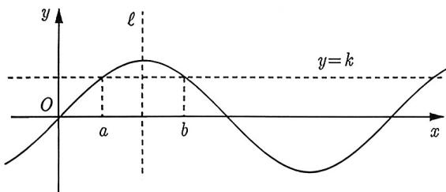
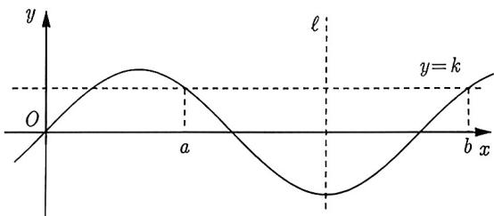
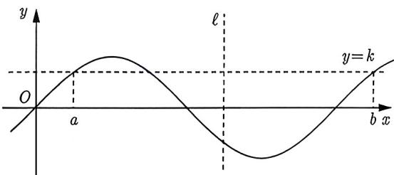
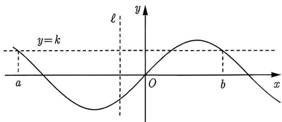
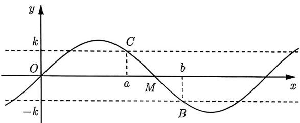
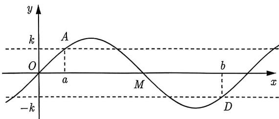
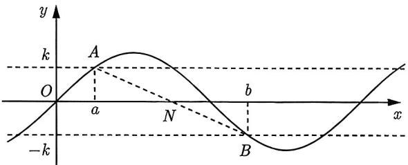
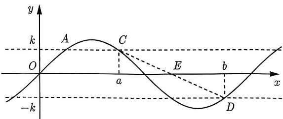

import Guide from '@/components/Guide.astro';
import Knowledge from '@/components/Knowledge.astro';
import Example from '@/components/Example.astro';
import Analysis from '@/components/Analysis.astro';
import Solution from '@/components/Solution.astro';
import Variant from '@/components/Variant.astro';
import Note from '@/components/Note.astro';
import Block from '@/components/Block.astro';
import Summary from '@/components/Summary.astro';

我们都知道，正弦与余弦函数的图像具有对称性。换句话说，若 $x = x_0$ 是 $f(x)$ 的对称轴且 $a + b = 2x_0$ ，则必有 $f(a) = f(b)$ 。现在的问题是，若已知 $f(a) = f(b)$ ，我们能否得到 $x = \frac{a + b}{2}$ 是对称轴呢？这个问题比较复杂，我们先从下面例题开始研究。

<Example title="例 1.71">
函数 $f(x) = \sin \omega x, f\left(\frac{\pi}{12}\right) = f\left(\frac{13\pi}{12}\right)$ ，是否存在 $\omega$ ，满足 $0 < \omega < 3$ 且 $\omega \in \mathbb{Z}$ 。

<Solution title="解析1">
因为 $f\left(\frac{\pi}{12}\right) = f\left(\frac{13\pi}{12}\right)$ ，所以 $f(x)$ 的一条对称轴为 $x = \frac{1}{2} \times \left(\frac{\pi}{12} + \frac{13\pi}{12}\right) = \frac{7\pi}{12}$ ，则存在 $k \in \mathbb{Z}$ 使得 $\frac{7\pi}{12}\omega = \frac{\pi}{2} + k\pi (k \in \mathbb{Z})$ ，即 $\omega = \frac{6 + 12k}{7} (k \in \mathbb{Z})$ 。又因为 $0 < \omega < 3$ ，所以 $0 < \frac{6 + 12k}{7} < 3$ ，即 $-\frac{1}{2} < k < \frac{5}{4}$ ，故 $k = 0, 1$ 。当 $k = 0$ 时，$\omega = \frac{6}{7} \notin \mathbb{Z}$ ，舍去；当 $k = 1$ 时，$\omega = \frac{18}{7} \notin \mathbb{Z}$ ，舍去。故不存在 $\omega$ 满足题意。
</Solution>
</Example>

相信有部分同学也是按照解析 1 的思路来解题的，但是很遗憾地告诉大家，解析 1 是错的。

错在哪里呢？错就错在 $f\left(\frac{\pi}{12}\right) = f\left(\frac{13\pi}{12}\right)$ 并不能推出 $x = \frac{1}{2} \times \left(\frac{\pi}{12} + \frac{13\pi}{12}\right) = \frac{7\pi}{12}$ 是它的一条对称轴。或许有同学就更加困惑了，我们不是有这样的结论吗？即若 $f(x) = f(2a - x)$ ，则 $f(x)$ 关于 $x = a$ 对称。不错，这个结论确实没有问题，那是因为 $f(x) = f(2a - x)$ 蕴含了对任意的 $x$ 都成立，而例1.71中的 $f\left(\frac{\pi}{12}\right) = f\left(\frac{13\pi}{12}\right)$ 明显不满足 $x$ 的任意性，故 $x = \frac{7\pi}{12}$ 就不一定是 $f(x) = \sin \omega x$ 的对称轴。

现在回到本节的核心问题之一：

<Block title="问题 1">
若正、余弦函数 $f(x)$ 满足 $f(a) = f(b)$ ，则 $x = \frac{a + b}{2}$ 何时是 $f(x)$ 的对称轴?

我们以最简单的三角函数，$f(x) = \sin x$ 来作说明。首先通过图 1-29～图 1-32 来直观感受一下。

  
图1-29

  
图1-30

  
图1-31

  
图1-32

图1-29和图1-30说明 $x = \frac{a + b}{2}$ 可以是 $f(x)$ 的对称轴；图1-31和图1-32说明 $x = \frac{a + b}{2}$ 也可以不是 $f(x)$ 的对称轴，虽然它们都满足 $f(a) = f(b)$ 。

也就是说，仅仅只有 $f(a) = f(b)$ 不足以判断 $x = \frac{a + b}{2}$ 是否为 $f(x)$ 的对称轴。因此我们需要加条件。下面，我们以最简单的 $f(x) = \sin x$ 为例来推导这个条件。

由 $\sin a = \sin b$ 可知 $a + b = 2k\pi +\pi$ 或 $a - b = 2k\pi .$ 要想保证 $x = \frac{a + b}{2}$ 是 $\sin x$ 的对称轴，就必须有 $\frac{a + b}{2} = k\pi + \frac{\pi}{2}$ ，即此时一定要排除 $a - b = 2k\pi$ 的情形。也就是说，若能添加条件 $a - b \neq 2k\pi$ ，就可以从 $\sin a = \sin b$ 推导出 $x = \frac{a + b}{2}$ 是 $\sin x$ 的对称轴。
</Block>

若正弦或余弦函数 $f(x)$ 的周期为 $T$，且满足 $f(a)=f(b)$，若 $x=a$ 与 $x=b$ 都不是对称轴，则 $x=\frac{a+b}{2}$ 是 $f(x)$ 的对称轴 $\iff b-a \neq kT\ (k \in \mathbb{Z})$。

对于一般形式的正弦或余弦函数也可以类似推导，具体细节请同学们完成，总结如下：

<Note>
条件“a, b 都不是对称轴”是必要的。因为若 a, b 都是对称轴且 $f(a) = f(b)$ ，则 $x = \frac{a + b}{2}$ 必是它的对称轴，但此时 b - a = kT，这与结论正好相悖。另外

$$
x = \frac {a + b}{2} \text {不是} f (x) \text {的对称轴} \Longleftrightarrow b - a = k T (k \in \mathbb {Z}).
$$
</Note>

下面我们给出例1.71的正确解析。

<Solution title="解析2">
记 $x_0 = \frac{1}{2}\times \left(\frac{\pi}{12} +\frac{13\pi}{12}\right) = \frac{7\pi}{12}.$

(1) 若 $x = x_0$ 是 $f(x)$ 的对称轴，此时解法同解析 1，不符合要求。

(2) 若 $x = x_0$ 不是 $f(x)$ 的对称轴，则 $\frac{13\pi}{12} - \frac{\pi}{12} = k \cdot \frac{2\pi}{\omega}$ ，即 $\omega = 2k (k \in \mathbb{N}^*)$ 。因为 $0 < \omega < 3$ ，所以 $\omega = 2$ ，故 $f(x) = \sin 2x$ ，经检验，此时 $f\left(\frac{\pi}{12}\right) = f\left(\frac{13\pi}{12}\right) = \frac{1}{2}$ ，符合题意。

(3) 若 $x = \frac{\pi}{12}$ 与 $x = \frac{13\pi}{12}$ 都是对称轴，则 $x = x_0$ 也是对称轴，由 (1) 可知此种情形不成立。

综上所述，可知 $\omega = 2$ 。
</Solution>

如果你觉得结论总结 1.4 的表述略显复杂，可以将其简单理解为：若 $f(x)$ 为正弦或余弦函数且 $f(a) = f(b)$ ，则要么 $a$ 与 $b$ 相差一个周期的整数倍；要么 $a$ 与 $b$ 关于 $f(x)$ 的对称轴对称。

<Example title="例 1.72">
(2025 新高考 I 19 节选) 求 $f(x)=5\cos x-\cos 5x$ 在 $\left[0,\frac{\pi}{4}\right]$ 上的最大值。

<Solution>
对 $f(x)$ 求导可得

$$
f ^ {\prime} (x) = - 5 \sin x + 5 \sin 5 x.
$$

令 $f'(x) = 0$ ，可得 $\sin x = \sin 5x$ 。因为 $x \in \left[0, \frac{\pi}{4}\right]$ ，所以 $5x \in \left[0, \frac{5\pi}{4}\right]$ ，两者不可能相差 $2\pi$ 的整数倍，因此二者只能关于 $y = \sin x$ 的对称轴对称。

显然，$y = \sin x$ 在 $\left[0, \frac{5\pi}{4}\right]$ 内的对称轴只有 $\frac{\pi}{2}$ ，因此 $\frac{5x + x}{2} = \frac{\pi}{2}$ ，解得 $x = \frac{\pi}{6}$ 。故 $f(x)$ 的最大值可能出现在端点 $x = 0$ 、 $x = \frac{\pi}{4}$ 及 $x = \frac{\pi}{6}$ 处，计算得

$$
\max _ {x \in \left[ 0, \frac {\pi}{4} \right]} f (x) = \max \left\{f (0), f \left(\frac {\pi}{6}\right), f \left(\frac {\pi}{4}\right) \right\} = 3 \sqrt {3}.
$$

故 $f(x)$ 在 $\left[0, \frac{\pi}{4}\right]$ 上的最大值为 $3\sqrt{3}$ 。
</Solution>
</Example>

<Example title="例 1.73">
(2023 四省适应性考试) 已知函数 $f(x)=\sin(\omega x+\varphi)$ 在区间 $\left(\frac{\pi}{6},\frac{\pi}{2}\right)$ 上单调，其中 $\omega$ 为正整数，$|\varphi|<\frac{\pi}{2}$ ，且 $f\left(\frac{\pi}{2}\right)=f\left(\frac{2\pi}{3}\right)$ 。

(I) 求 $y = f(x)$ 图像的一条对称轴；

(Ⅱ) 若 $f\left(\frac{\pi}{6}\right)=\frac{\sqrt{3}}{2}$ ，求 $\varphi$ 。

<Solution>
(I) 因为函数 $f(x) = \sin (\omega x + \varphi)$ 在区间 $\left(\frac{\pi}{6}, \frac{\pi}{2}\right)$ 上单调，所以 $f(x)$ 的最小正周期 $T \geqslant 2 \times \left(\frac{\pi}{2} - \frac{\pi}{6}\right) = \frac{2\pi}{3}$ 。又因为 $f\left(\frac{\pi}{2}\right) = f\left(\frac{2\pi}{3}\right)$ ，且 $\frac{2\pi}{3} - \frac{\pi}{2} < \frac{2\pi}{3} < T$ ，所以 $x = \frac{1}{2} \times \left(\frac{\pi}{2} + \frac{2\pi}{3}\right) = \frac{7\pi}{12}$ 为 $f(x)$ 图像的一条对称轴。

(Ⅱ) 由 (I) 知 $T \geqslant \frac{2\pi}{3}$ ，故 $\omega = \frac{2\pi}{T} \leqslant 3$ ，由 $\omega \in \mathbb{N}^*$ ，得 $\omega = 1, 2$ 或 3。

因为 $x = \frac{7\pi}{12}$ 为 $f(x)$ 的对称轴，所以 $\frac{7\pi}{12}\omega + \varphi = \frac{\pi}{2} + k_1\pi, k_1 \in \mathbb{Z}$ 。又因为 $f\left(\frac{\pi}{6}\right) = \frac{\sqrt{3}}{2}$ ，所以 $\frac{\pi}{6}\omega + \varphi = \frac{\pi}{3} + 2k_2\pi$ 或 $\frac{\pi}{6}\omega + \varphi = \frac{2\pi}{3} + 2k_3\pi, k_2, k_3 \in \mathbb{Z}$ 。

(1) 若 $\frac{\pi}{6}\omega + \varphi = \frac{\pi}{3} + 2k_2\pi,$ 则 $\frac{5\pi}{12}\omega = \frac{\pi}{6} + (k_1 - 2k_2)\pi,$ 即 $\omega = \frac{2 + 12(k_1 - 2k_2)}{5}$ ，因此不存在整数 $k_1, k_2$ ，使得 $\omega = 1, 2$ 或 3。

(2) 若 $\frac{\pi}{6}\omega + \varphi = \frac{2\pi}{3} + 2k_2\pi,$ 则 $\frac{5\pi}{12}\omega = -\frac{\pi}{6} + (k_1 - 2k_3)\pi,$ 即 $\omega = \frac{12(k_1 - 2k_3) - 2}{5}$ 。显然不存在整数 $k_1, k_3$ ，使得 $\omega = 1$ 或 3。当 $k_1 = 2k_3 + 1$ 时，$\omega = 2$ ，此时 $\varphi = \frac{\pi}{3} + 2k_3\pi,$ 由 $|\varphi| < \frac{\pi}{2}$ ，得 $\varphi = \frac{\pi}{3}$ 。
</Solution>
</Example>

<Variant title="变式 1.73.1">
（2023 福建模考）已知函数 $f(x)=2\sin(\omega x+\varphi)\left(\omega>0,|\varphi|<\frac{\pi}{2}\right)$ 的图像过点 $B(0,\sqrt{3})$ ，且在 $\left(\frac{\pi}{12},\frac{5\pi}{12}\right)$ 上单调，把 $f(x)$ 的图像向右平移 $\pi$ 个单位之后与原来的图像重合，当 $x_{1},x_{2}\in\left(\frac{2\pi}{3},\frac{4\pi}{3}\right)$ 且 $x_{1}\neq x_{2}$ 时， $f(x_{1})=f(x_{2})$ ，则 $f(x_{1}+x_{2})=(\quad)$ 。
A. $-\sqrt{3}$ B. $\sqrt{3}$ C. -1

D. 1
</Variant>

<Variant title="变式 1.73.2">
（2023 黑龙江模拟）已知函数 $f(x)=3\sin\left(2x-\frac{\pi}{3}\right)-2\cos^{2}\left(x-\frac{\pi}{6}\right)+1$ ，将函数 $f(x)$ 的图像向左平移 $\frac{\pi}{6}$ 个单位长度，得到函数 $g(x)$ 的图像，若 $x_{1}, x_{2}$ 是关于 x 的方程 $g(x)=a$ 在 $\left[0, \frac{\pi}{2}\right]$ 内的两根，则 $\sin\left(2x_{1}+2x_{2}\right)=(\quad)$ 。
A. $\frac{3}{5}$ B. $\frac{\sqrt{10}}{10}$ C. $-\frac{\sqrt{10}}{10}$ D. $-\frac{3}{5}$
</Variant>

下面我们探讨对称中心问题，也就是本节另外一个核心问题：

<Block title="问题 2">
若正、余弦函数 $f(x)$ 满足 $f(a) = -f(b)$ ，则 $\left(\frac{a + b}{2}, 0\right)$ 何时是 $f(x)$ 的对称中心？

同样地，我们以最简单的三角函数 $f(x) = \sin x$ 的图像 (见图 1-33～图 1-36) 来直观感受一下。

  
图 1-33

  
图1-34

  
图1-35

  
图1-36

同样地，仅仅只有 $f(a) = -f(b)$ 也不足以判断 $\left(\frac{a + b}{2}, 0\right)$ 是 $f(x)$ 的对称中心。
</Block>

若函数 $f(x) = A\sin (\omega x + \varphi)$ 满足 $f(a) = -f(b)$ ，则 $\left(\frac{a + b}{2}, 0\right)$ 是 $f(x)$ 的对称中心 $\Longleftrightarrow f'(a)f'(b) \geqslant 0$ 。

<Example title="例 1.74">
(2014 北京理 14) 设函数 $f(x)=A\sin(\omega x+\varphi)(A>0,\omega>0)$ ，若 $f(x)$ 在区间 $\left[\frac{\pi}{6},\frac{\pi}{2}\right]$ 上具有单调性，且 $f\left(\frac{\pi}{2}\right)=f\left(\frac{2\pi}{3}\right)=-f\left(\frac{\pi}{6}\right)$ ，则 $f(x)$ 的最小正周期为 \_\_\_\_。

<Solution>
首先，因为 $f(x)$ 在 $\left[\frac{\pi}{6}, \frac{\pi}{2}\right]$ 上单调，所以 $T \geqslant 2\left(\frac{\pi}{2} - \frac{\pi}{6}\right) = \frac{2\pi}{3}$ 。然后，因为 $f\left(\frac{\pi}{2}\right) = f\left(\frac{2\pi}{3}\right)$ ，且 $\frac{2\pi}{3} - \frac{\pi}{2} = \frac{\pi}{6} < T$ ，所以 $x = \frac{1}{2}\left(\frac{2\pi}{3} + \frac{\pi}{2}\right) = \frac{7\pi}{12}$ 为它的一条对称轴。再然后，因为 $f\left(\frac{\pi}{2}\right) = -f\left(\frac{\pi}{6}\right)$ ，且 $f(x)$ 在 $\left[\frac{\pi}{6}, \frac{\pi}{2}\right]$ 上具有单调性，故 $f(x)$ 的一个对称中心的横坐标为 $x = \frac{1}{2}\left(\frac{\pi}{6} + \frac{\pi}{2}\right) = \frac{\pi}{3}$ 。最后，因为 $\frac{7\pi}{12} - \frac{\pi}{3} = \frac{\pi}{4} < \frac{T}{2}$ ，所以中心对称点 $\left(\frac{\pi}{3}, 0\right)$ 与对称轴 $x = \frac{7\pi}{12}$ 相邻，于是 $f(x)$ 的最小正周期为 $T = 4\left(\frac{7\pi}{12} - \frac{\pi}{3}\right) = \pi$ ，故填 $\pi$ 。
</Solution>

<Note>
能否由 $f\left(\frac{2\pi}{3}\right) = -f\left(\frac{\pi}{6}\right)$ 得到另一个对称中心的横坐标为 $x = \frac{1}{2}\left(\frac{\pi}{6} +\frac{2\pi}{3}\right)$ 呢？

答案是否定的！因为通过解析我们知道 $f(x)$ 在 $\left[\frac{\pi}{6}, \frac{7\pi}{12}\right]$ 上单调，且关于 $x = \frac{7\pi}{12}$ 对称，而 $\frac{2\pi}{3}$ 恰好在 $\left[\frac{\pi}{6}, \frac{7\pi}{12}\right]$ 关于 $x = \frac{7\pi}{12}$ 对称的区间上，所以 $\frac{\pi}{6}$ 和 $\frac{2\pi}{3}$ 所在的区间单调性相反。故根据结论总结1.5我们可知这个答案是错的。
</Note>
</Example>

<Variant title="变式 1.74.1">
（2022 湖南模考-多选题）已知函数 $f(x)=\sin(\omega x+\varphi)(\omega>0,\varphi\in\mathbb{R})$ 在区间 $\left(\frac{7\pi}{12},\frac{5\pi}{6}\right)$ 上单调，且满足 $f\left(\frac{7\pi}{12}\right)=-f\left(\frac{3\pi}{4}\right)$ ，则下列结论正确的是（）。
A. $f\left(\frac{2\pi}{3}\right)=0$ B. 若 $f\left(\frac{5\pi}{6}-x\right)=f(x)$ ，则函数 $f(x)$ 的最小正周期为 $\pi$ C. 关于 x 的方程 $f(x)=1$ 在区间 $[0,2\pi)$ 上最多有 4 个不相等的实数解
D. 若函数 $f(x)$ 在区间 $\left[\frac{2\pi}{3},\frac{13\pi}{6}\right)$ 上恰有 5 个零点，则 $\omega$ 的取值范围为 $\left(\frac{8}{3},3\right]$
</Variant>

<Variant title="变式 1.74.2">
（2022 上海模拟）已知函数 $f(x)=\sin x+a\cos x$ 满足 $f(x)\leqslant f\left(\frac{\pi}{6}\right)$ ，若 $f(x)$ 在 $[x_{1},x_{2}]$ 上单调，且 $f(x_{1})+f(x_{2})=0$ ，则 $|x_{1}+x_{2}|$ 的最小值为（）。
A. $\frac{\pi}{6}$ B. $\frac{\pi}{3}$ C. $\frac{2\pi}{3}$ D. $\frac{4\pi}{3}$
</Variant>

