import Guide from '@/components/Guide.astro';
import Knowledge from '@/components/Knowledge.astro';
import Example from '@/components/Example.astro';
import Analysis from '@/components/Analysis.astro';
import Solution from '@/components/Solution.astro';
import Variant from '@/components/Variant.astro';
import Note from '@/components/Note.astro';
import Block from '@/components/Block.astro';

在实践中, 我们经常会遇到测量距离、高度、角度等的实际问题. 具体测量时, 常常会遇到 “不能到达” 的困难. 首先, 我们看看 “底部不可达” 的高度测量问题.

$$
\angle A C B = \alpha , \angle A D B = \beta , C D = a,
$$

则 $AB = \frac{a\tan\alpha\tan\beta}{\tan\beta - \tan\alpha}$

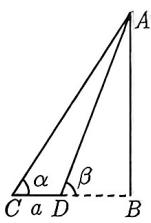  
图2-11

<Solution>
在 Rt△ABC 中, 由 $\tan\alpha=\frac{AB}{BC}$ , 可得 $BC=\frac{AB}{\tan\alpha}$ , 同理在 Rt△ABD 中, 得 $BD=\frac{AB}{\tan\beta}$ , 故 BC-BD= $\frac{AB}{\tan\alpha}-\frac{AB}{\tan\beta}$ , 解得 $AB=\frac{a\tan\alpha\tan\beta}{\tan\beta-\tan\alpha}$ .
</Solution>

知识点2.5中的结论无需记住, 但需要掌握它的推导过程. 为了节省篇幅, 在接下来的例题和变式中, 我们将直接应用这个结论. 但是, 在进行个人练习时, 请记得先推导出该结论.

<Example title="例 2.34">
(2014 四川理 13) 如图 2-12 所示, 从气球 A 上测得正前方的河流的两岸 B, C 的俯角分别为 $75^{\circ}, 30^{\circ}$ , 此时气球的高是 60m, 则河流的宽度 BC 等于 \_\_\_\_ m.

<Solution>
如图2-13所示,由题意知 $\angle ACD = 30^{\circ},\angle ABD = 75^{\circ}$ ，则 $AD = \frac{BC\tan\angle ACD\tan\angle ABD}{\tan\angle ABD - \tan\angle ACD},$ $BC = \frac{AD(\tan\angle ABD - \tan\angle ACD)}{\tan\angle ACD\tan\angle ABD} = \frac{60(\tan75^{\circ} - \tan30^{\circ})}{\tan30^{\circ}\tan75^{\circ}} = 120(\sqrt{3} -1).$ 故填 $120(\sqrt{3} -1).$

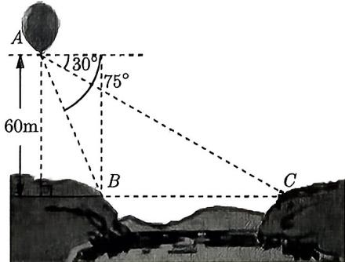  
图2-12

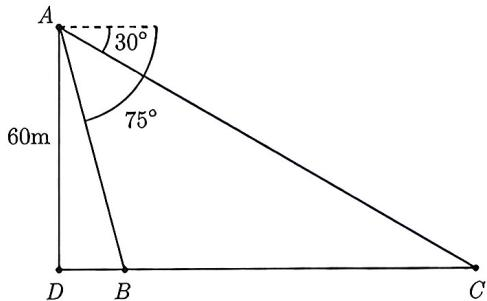  
图2-13
</Solution>
</Example>

<Variant title="变式 2.34.1">
(2021 全国乙理 9) 魏晋时期刘徽撰写的《海岛算经》是关于测量的数学著作, 其中第一题是测量海岛的高. 如图 2-14 所示, 点 E, H, G 在水平线 AC 上, DE 和 FG 是两个垂直于水平面且等高的测量标杆的高度, 称为 “表高”, EG 称为 “表距”, GC 和 EH 都称为 “表目距”, GC 与 EH 的差称为 “表目距的差”, 则海岛的高 AB = ( ). A. 表高 × 表距 + 表高 B. 表高 × 表距 - 表高 C. 表高 × 表距 + 表距 D. 表高 × 表距 - 表距

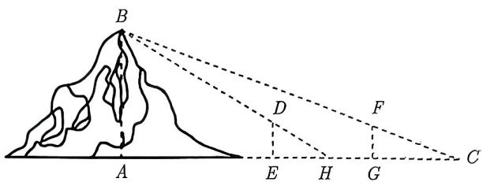  
图2-14
</Variant>

例2.34及其变式属于知识点2.5中的“底部不可达”问题, 我们可以直接应用该问题的结论. 然而, 并不是所有的高度测量都符合这个模型. 如果不符合, 同学们只需要记住一点: 测量高度一定与解直角三角形有关. 请看下面的例题.

<Example title="例 2.35">
(2021 全国甲理 8) 2020 年 12 月 8 日, 中国和尼泊尔联合公布珠穆朗玛峰最新高程为 8848.86 (单位: m), 三角高程测量法是珠峰高程测量方法之一. 图 2-15 是三角高程测量法的一个示意图, 现有 A, B, C 三点, 且 A, B, C 在同一水平面上的投影 $A', B', C'$ 满足 $\angle A'C'B' = 45^{\circ}, \angle A'B'C' = 60^{\circ}$ . 由 C 点测得 B 点的仰角为 $15^{\circ}, BB'$ 与 $CC'$ 的差为 100; 由 B 点测得 A 点的仰角为 $45^{\circ}$ , 则 A, C 两点到水平面 $A'B'C'$ 的高度差 $AA' - CC'$ 约为 ( ). ( $\sqrt{3} \approx 1.732$ )

A. 346

B. 373

C. 446

D. 473

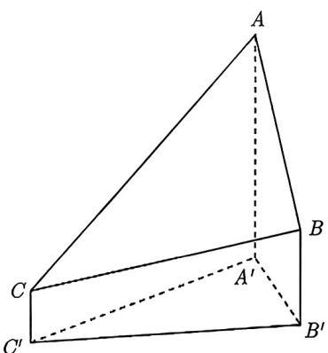  
图2-15

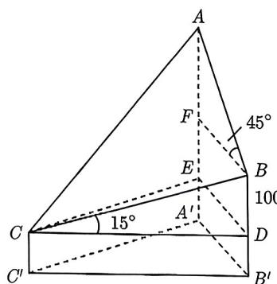  
图2-16

<Solution>
如图2-16所示, 过 $C$ 作 $CD \perp BB'$ , 垂足为 $D$ , 过 $D$ 作 $DE \perp AA'$ , 垂足为 $E$ , 连接 $CE$ , 过 $B$ 作 $BF \perp AA'$ , 垂足为 $F$ , 则由题意可得 $\angle BCD = 15^\circ$ , $\angle ABF = 45^\circ$ , $BD = BB' - CC' = 100$ , $AF = BF$ , 所以 $AA' - CC' = AF + EF = BF + BD = A'B' + 100$ .

在 Rt△BCD 中, $CD = \frac{BD}{\tan \angle BCD} = \frac{100}{\tan 15^{\circ}}$ .

在 $\triangle A'B'C'$ 中， $B'C' = CD$ ， $\angle B'A'C' = 180^\circ - 45^\circ - 60^\circ = 75^\circ$ ，由正弦定理得

$$
\frac {B ^ {\prime} C ^ {\prime}}{\sin \angle B ^ {\prime} A ^ {\prime} C ^ {\prime}} = \frac {A ^ {\prime} B ^ {\prime}}{\sin \angle A ^ {\prime} C ^ {\prime} B ^ {\prime}} \Longrightarrow A ^ {\prime} B ^ {\prime} = \frac {B ^ {\prime} C ^ {\prime} \sin \angle A ^ {\prime} C ^ {\prime} B ^ {\prime}}{\sin \angle B ^ {\prime} A ^ {\prime} C ^ {\prime}} = \frac {1 0 0 \sin 4 5 ^ {\circ}}{\tan 1 5 ^ {\circ} \sin 7 5 ^ {\circ}} = \frac {5 0 \sqrt {2}}{\sin 1 5 ^ {\circ}}.
$$

而 $\sin 15^{\circ} = \sin (45^{\circ} - 30^{\circ}) = \sin 45^{\circ}\cos 30^{\circ} - \cos 45^{\circ}\sin 30^{\circ} = \frac{\sqrt{6} - \sqrt{2}}{4}$ ，所以

$$
A ^ {\prime} B ^ {\prime} = 5 0 \sqrt {2} \times \frac {4}{\sqrt {6} - \sqrt {2}} = 1 0 0 (\sqrt {3} + 1) \approx 2 7 3.
$$

因 $AA' - CC' = A'B' + 100 \approx 373$ . 故选 B.
</Solution>
</Example>

<Variant title="变式 2.35.1">
(2014 全国 I 文 16) 如图 2-17 所示, 为测量山高 MN, 选择 A 和另一座山的山顶 C 为测量观测点. 从 A 点测得 M 点的仰角 $\angle MAN = 60^{\circ}$ , C 点的仰角 $\angle CAB = 45^{\circ}$ 以及 $\angle MAC = 75^{\circ}$ , 从 $\sim$ 点测得 $\angle MCA = 60^{\circ}$ . 已知山高 BC = 100m, 则山高 MN = \_\_\_\_ m.

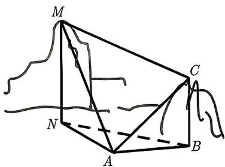  
图2-17
</Variant>

除了测量高度, 测量距离也在高考中出现过, 常见三种题型: 山两侧、河两岸、河对岸.

<Knowledge title="知识点 2.6">
(1) 山两侧 AB: 如图 2-18 所示, 选定一点 C, 测得 $\angle ACB = \alpha, AC = b, BC = a$ , 则通过余弦定理得 $AB = \sqrt{a^{2} + b^{2} - 2ab \cos \alpha}$ .
(2) 河两岸 AB: 如图 2-19 所示, 在 A 的对岸选定一点 C, 测得 $\angle ACB = \alpha, \angle ABC = \beta, BC = a$ , 则在 $\triangle ABC$ 中已知两角和一边, 故可用正弦定理求出 AB.
(3) 河对岸 AB: 如图 2-20 所示, 在 A, B 两点的对岸选定两点 C, D, 测得 CD = a, $\angle ADC = \alpha, \angle BDC = \beta, \angle BCD = \gamma, \angle ACD = \delta$ , 则在 $\triangle ADC$ 和 $\triangle BDC$ 中都是已知两角和一边, 可用正弦定理分别求出 AC 和 BC, 从而在 $\triangle ABC$ 中已知两边和夹角, 故用余弦定理可以求出 AB.

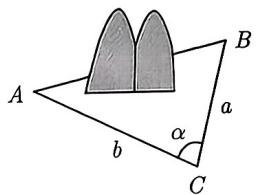  
图2-18

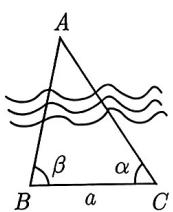  
图2-19

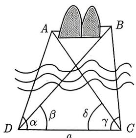  
图2-20
</Knowledge>

<Example title="例 2.36">
为了测量两山顶 M, N 间的距离, 飞机沿水平方向在 A, B 两点进行测量, A, B, M, N 在同一个铅锤面内, 如图 2-21 所示. 能够测量的数据有俯角和 A, B 间的距离. 请设计一个方案, 包括:

(I) 指出需要测量的数据 (用字母表示, 并在图中标出);

(Ⅱ) 用文字和公式写出计算 M, N 间的距离的步骤.

<Analysis>
 $M, N$ 不可到达，飞机通过飞行可以测量 $AB$ 的长度，且可以在 $A, B$ 两点分别测量到 $M, N$ 的俯角，明显这是“河对岸”模型.
</Analysis>

<Solution>
(I) 需要测量的数据有: 点 $A$ 到点 $M, N$ 的俯角 $\alpha_{1}, \beta_{1}$ ; 点 $B$ 到点 $M, N$ 的俯角 $\alpha_{2}, \beta_{2}; A, B$ 间的距离 $d$ (图 2-22).

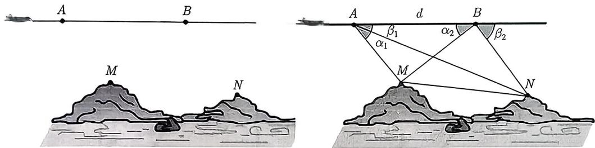  
图2-21  
图2-22

(Ⅱ) 第一步: 计算 $AM$ , 在 $\triangle ABM$ 中, $AB = d$ , $\angle BAM = \alpha_{1}$ , $\angle ABM = \alpha_{2}$ , 由正弦定理得

$$
\frac {A M}{\sin \angle A B M} = \frac {A B}{\sin \angle A M B} \Longrightarrow A M = \frac {A B \sin \angle A B M}{\sin \angle A M B} = \frac {d \sin \alpha_ {2}}{\sin (\alpha_ {1} + \alpha_ {2})}.
$$

第二步: 计算 $AN$ , 在 $\triangle ABN$ 中, $AB = d$ , $\angle BAN = \beta_1$ , $\angle ABN = 180^\circ - \beta_2$ , 由正弦定理得

$$
\frac {A N}{\sin \angle A B N} = \frac {A B}{\sin \angle A N B} \Longrightarrow A N = \frac {A B \sin \angle A B N}{\sin \angle A N B} = \frac {d \sin \beta_ {2}}{\sin (\beta_ {1} + \beta_ {2})}.
$$

第三步: 计算 $MN$ , 在 $\triangle AMN$ 中, $\angle MAN = \alpha_{1} - \beta_{1}$ , 由余弦定理得

$$
M N = \sqrt {A M ^ {2} + A N ^ {2} - 2 A M \cdot A N \cos (\alpha_ {1} - \beta_ {1})}.
$$
</Solution>
</Example>

如果测量高度与测量距离结合, 我们只需找到对应的模型, 然后分别求出即可, 比如下面例题, 先是 “河两岸” 模型求出 C, B 距离, 再求出高度 CD.

<Example title="例 2.37">
（2015 湖北文 15）如图 2-23 所示，一辆汽车在一条水平的公路上向正西行驶，到 A 处时测得公路北侧一山顶 D 在西偏北 $30^{\circ}$ 的方向上，行驶 600m 后到达 B 处，测得此山顶在西偏北 $75^{\circ}$ 的方向上，仰角为 $30^{\circ}$ ，则此山的高度为 \_\_\_\_ m.

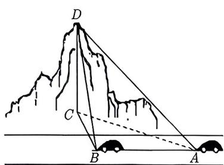  
图2-23

<Solution>
依题意有 $AB = 600\mathrm{m}, \angle CAB = 30^{\circ}, \angle CBA = 180^{\circ} - 75^{\circ} = 105^{\circ}, \angle DBC = 30^{\circ}, DC \perp CB,$ 故 $\angle ACB = 45^{\circ}$ . 在 $\triangle ABC$ 中, 由正弦定理得

$$
\frac {A B}{\sin \angle A C B} = \frac {C B}{\sin \angle C A B} \Longrightarrow C B = \frac {A B \sin \angle C A B}{\sin \angle A C B} = \frac {6 0 0 \sin 3 0 ^ {\circ}}{\sin 4 5 ^ {\circ}} = 3 0 0 \sqrt {2}.
$$

所以在 Rt△BCD 中, $CD = CB \tan 30^{\circ} = 100\sqrt{6}m$ , 故此山的高度 CD 为 $100\sqrt{6}m$ .
</Solution>
</Example>

<Variant title="变式 2.37.1">
如图 2-24 所示, 测量河对岸的塔高 AB 时, 可以选取与塔底 B 在同一水平内的两个测量基点 C 与 D. 现测得 $\angle BCD = \alpha, \angle BDC = \beta, CD = s$ , 在点 C 测得塔顶 A 的仰角为 $\theta$ , 求塔高 AB.

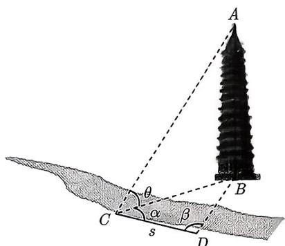  
图2-24
</Variant>

<Variant title="变式 2.37.2">
(2014 上海 11) 某货船在 A 处看灯塔 M 在北偏东 $30^{\circ}$ 方向, 它以 18 海里每小时的速度向正北方向航行, 经过 40 分钟到达 B 处, 看到灯塔 M 在北偏东 $75^{\circ}$ 方向, 此时货船到灯塔 M 的距离为 \_\_\_\_ 海里.
</Variant>
