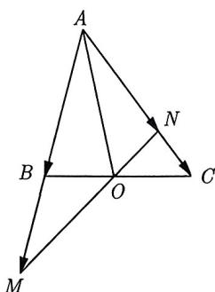
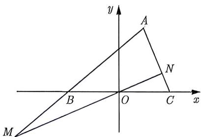
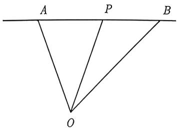
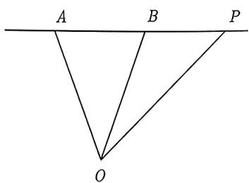
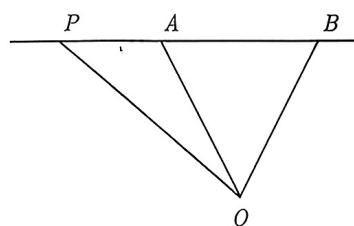

import Guide from '@/components/Guide.astro';
import Knowledge from '@/components/Knowledge.astro';
import Example from '@/components/Example.astro';
import Analysis from '@/components/Analysis.astro';
import Solution from '@/components/Solution.astro';
import Variant from '@/components/Variant.astro';
import Note from '@/components/Note.astro';
import Block from '@/components/Block.astro';
import Summary from '@/components/Summary.astro';

在 3.2 节和 3.3 节, 我们一直不遗余力地向同学们灌输这样一个思想: 在处理向量问题时, 优先考虑建立坐标系.

<Example title="例 3.35">
(2007 江西 15) 如图 3-26 所示, 在 $\triangle ABC$ 中, 点 $O$ 是 $BC$ 的中点, 过点 $O$ 的直线分别交直线 $AB$ , $AC$ 于不同的两点 $M, N$ . 若 $\overrightarrow{AB} = m\overrightarrow{AM}, \overrightarrow{AC} = n\overrightarrow{AN}$ , 则 $m + n$ 的值为 \_\_\_\_.

  
图3-26

  
图3-27

<Solution>
以点 O 为坐标原点, BC 所在直线为 x 轴, BC 的垂直平分线为 y 轴建立直角坐标系, 如图 3-27 所示. 设 BC = 2, 则 $B(-1,0)$ , $C(1,0)$ , 设点 A 坐标为 $(x_{0},y_{0})$ , 再设 $M(x_{1},y_{1})$ , $N(x_{2},y_{2})$ . 由 $\overrightarrow{AB} = m\overrightarrow{AM}$ , 可得 $\left\{\begin{aligned}x_{1}&=\frac{(m-1)x_{0}-1}{m}\\ y_{1}&=\frac{(m-1)y_{0}}{m}\end{aligned}\right.$ . 由 $\overrightarrow{AC}=n\overrightarrow{AN}$ 可得 $\left\{\begin{aligned}x_{2}&=\frac{(n-1)x_{0}+1}{n}\\ y_{2}&=\frac{(n-1)y_{0}}{n}\end{aligned}\right.$ . 又因为点 M, O, N 三点共线, 则 $\overrightarrow{OM}=\lambda\overrightarrow{ON}$ , 可得 $x_{1}y_{2}=x_{2}y_{1}$ , 于是

$$
\frac {(m - 1) x _ {0} - 1}{m} \cdot \frac {(n - 1) y _ {0}}{n} = \frac {(n - 1) x _ {0} + 1}{m} \cdot \frac {(m - 1) y _ {0}}{n},
$$

化简可得 $[(m - 1)x_0 - 1](n - 1) = [(n - 1)x_0 + 1](m - 1)$ , 解得 $m + n = 2$ , 故填 2.
</Solution>
</Example>

从例3.35的解析中可以看出, 其计算量不小. 然而, 如果我们采用几何法, 计算量将大大减少 (见例3.36). 因此, 我们不能盲目地建立坐标系, 而是要考虑建系是否方便和计算量会不会过大. 如果建系会导致巨大的计算量, 强行建系是不可取的. 在这种情况下, 可以考虑采用几何法. 然而, 几何法多种多样, 为了最小化代价, 本书的后几节将介绍一些最常见、最基本的几何法.

我们先从三点共线开始.

如果 $A, P, B$ 三点共线，由共线定理可知，必然存在 $\lambda$ ，使得 $\overrightarrow{AP} = \lambda \overrightarrow{PB}$ 成立。反之，如果 $\overrightarrow{AP} = \lambda \overrightarrow{PB}$ ，那么由共线定理可知向量 $\overrightarrow{AP}$ 与向量 $\overrightarrow{PB}$ 共线，因为这两个有向线段有公共点，所以可知 $A, P, B$ 三点共线。若对 $\overrightarrow{AP} = \lambda \overrightarrow{PB}$ 进行减法变形，我们会得到如下结论：

A, P, B 三点共线 $\Longleftrightarrow \overrightarrow{AP} = \lambda \overrightarrow{PB} \Longleftrightarrow \overrightarrow{OP} = x \overrightarrow{OA} + y \overrightarrow{OB} (x + y = 1)$ .

对于这个结论, 一定要熟练掌握, 它是高考中的高频考点, 下面给出 $\overrightarrow{AP} = \lambda \overrightarrow{PB}$ 是 $\overrightarrow{OP} = x\overrightarrow{OA} + y\overrightarrow{OB}(x + y = 1)$ 充要条件的证明.

<Block title="证明">
(1) 先证充分性: 因为 $\overrightarrow{AP} = \lambda \overrightarrow{PB}$ , 故由向量的减法可得

$$
\overrightarrow {O P} - \overrightarrow {O A} = \lambda (\overrightarrow {O B} - \overrightarrow {O P}) \Longrightarrow \overrightarrow {O P} = \frac {1}{1 + \lambda} \overrightarrow {O A} + \frac {\lambda}{1 + \lambda} \overrightarrow {O B}.
$$

令 $x = \frac{1}{1 + \lambda}, y = \frac{\lambda}{1 + \lambda}$ , 则 $x + y = 1$ .

(2) 再证必要性: 因为 $\overrightarrow{OP} = x\overrightarrow{OA} + y\overrightarrow{OB}$ 且 $x + y = 1$ , 所以可以将其改写为 $x\overrightarrow{OP} + (1 - x)\overrightarrow{OP} = x\overrightarrow{OA} + (1 - x)\overrightarrow{OB}$ , 于是

$$
x \left(\overrightarrow {O P} - \overrightarrow {O A}\right) = (1 - x) \left(\overrightarrow {O B} - \overrightarrow {O P}\right) \Longrightarrow x \overrightarrow {A P} = (1 - x) \overrightarrow {P B}.
$$

令 $\lambda = \frac{1 - x}{x} = \frac{y}{x}$ , 可得 $\overrightarrow{AP} = \lambda \overrightarrow{PB}$ .
</Block>

从上面的证明过程可以看出, 若点 $P$ 落在线段 $AB$ 之间, 如图 3-28 所示, 则 $\lambda > 0$ , 此时 $x = \frac{1}{1 + \lambda} > 0$ , $y = \frac{\lambda}{1 + \lambda} > 0$ ; 若点 $P$ 落在线段 $AB$ 的延长线上, 如图 3-29 所示, 则 $\lambda < -1$ , 此时 $x = \frac{1}{1 + \lambda} < 0$ , $y = \frac{\lambda}{1 + \lambda} > 0$ ; 若点 $P$ 落在线段 $AB$ 的反向延长线上, 如图 3-30 所示, 则 $-1 < \lambda < 0$ , 此时 $x = \frac{1}{1 + \lambda} > 0$ , $y = \frac{\lambda}{1 + \lambda} < 0$ .

  
图3-28

  
图3-29

  
图3-30

我们也可以这样来理解记忆, 若 $P$ 落在线段 $AB$ 之间, 则 $x, y > 0$ ; 若 $P$ 落在线段 $AB$ 之外, $x$ 与 $y$ 有一个为负数, 至于谁负, 就看 $P$ 离谁远. 若 $P$ 在 $AB$ 之外且离 $A$ 远, 则 $x < 0$ ; 若 $P$ 在 $AB$ 之外且离 $B$ 远, 则 $y < 0$ .
