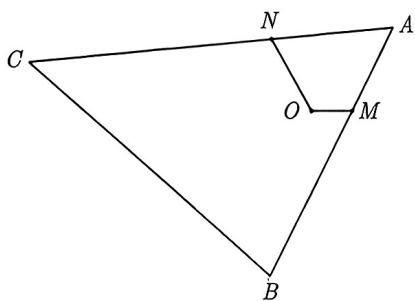
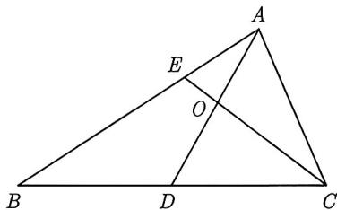
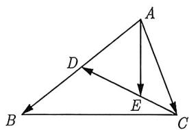

import Guide from '@/components/Guide.astro';
import Knowledge from '@/components/Knowledge.astro';
import Example from '@/components/Example.astro';
import Analysis from '@/components/Analysis.astro';
import Solution from '@/components/Solution.astro';
import Variant from '@/components/Variant.astro';
import Note from '@/components/Note.astro';
import Block from '@/components/Block.astro';

对于求向量数量积问题, 关键在于如何选取合适的两个向量作为基底, 而基底向量往往在题中会给出明确的提示.

<Example title="例 3.48">
(2018 天津文 8) 在如图 3-46 所示的平面图形中, 已知 OM = 1, ON = 2, $\angle MON = 120^{\circ}$ , $\overrightarrow{BM} = 2\overrightarrow{MA}$ , $\overrightarrow{CN} = 2\overrightarrow{NA}$ , 则 $\overrightarrow{BC} \cdot \overrightarrow{OM}$ 的值为 ( ).

图3-46
A. -15
B. -9
C. -6
D. 0

<Analysis>
本题中 $|\overrightarrow{BC}|$ , $\overrightarrow{BC}$ 与 $\overrightarrow{OM}$ 的夹角都是未知的, 因此不能直接利用数量积的定义求解. 而 $\overrightarrow{OM}, \overrightarrow{ON}$ 的模长和夹角都是已知的, 故我们考虑选 $\{\overrightarrow{OM}, \overrightarrow{ON}\}$ 为基向量, 也就是用 $\overrightarrow{OM}$ 和 $\overrightarrow{ON}$ 来表示 $\overrightarrow{BC}$ .
</Analysis>

<Solution>
由 $OM = 1, ON = 2, \angle MON = 120^{\circ}$ , 可得 $\overrightarrow{OM} \cdot \overrightarrow{ON} = |\overrightarrow{OM}| \cdot |\overrightarrow{ON}|\cos 120^{\circ} = -1$ . 因此我们选择 $\overrightarrow{OM}, \overrightarrow{ON}$ 为基

底, 接下来需要用 $\overrightarrow{OM}$ , $\overrightarrow{ON}$ 把 $\overrightarrow{BC}$ 表示出来. 因为 $\overrightarrow{BM} = 2\overrightarrow{MA}$ , $\overrightarrow{CN} = 2\overrightarrow{NA}$ , 所以 $\overrightarrow{BC} = 3\overrightarrow{MN}$ , 则 $\overrightarrow{BC} \cdot \overrightarrow{OM} = 3\overrightarrow{MN} \cdot \overrightarrow{OM} = 3\left(\overrightarrow{ON} - \overrightarrow{OM}\right) \cdot \overrightarrow{OM} = 3\overrightarrow{OM} \cdot \overrightarrow{ON} - 3\overrightarrow{OM}^2 = -6$ , 故选 C.
</Solution>

</Example>

诚如例3.48的解析那样, 若要求解数量积的值, 则需将数量积中的向量用合适的基底来表示, 一般来说, 基底向量的选择往往以下列特征为标准.

<Block title="经验总结 3.5">
基底一般选择模长和夹角都确定的向量, 然后用基底表示相关的向量.
</Block>

有时候命题者未必会根据你的意愿同时给出向量的模长和夹角, 如果没有同时给出, 该怎么办呢?

<Example title="例 3.49">
设四边形 ABCD 为平行四边形, AB = 6, AD = 4. 若点 M, N 满足 $\overrightarrow{BM} = 3\overrightarrow{MC}, \overrightarrow{DN} = 2\overrightarrow{NC}$ , 则 $\overrightarrow{AM} \cdot \overrightarrow{NM} = (\quad)$ .

A. 20 B. 15 C. 9 D. 6

<Analysis>
题中线段 $AM, NM$ 的值未知, 同样 $\overrightarrow{AM}$ 与 $\overrightarrow{NM}$ 的夹角也未知, 所以不能用数量积的定义求解, 故考虑用基底来表示向量 $\overrightarrow{AM}$ 与 $\overrightarrow{NM}$ . 而题中只给出了 $AB = 6, AD = 4$ , 并没有给出 $\overrightarrow{AB}$ 与 $\overrightarrow{AD}$ 的夹角的大小, 而且题中并没有其他信息, 故考虑选择 $\overrightarrow{AB}, \overrightarrow{AD}$ 作为基底表示其他向量.
</Analysis>

<Solution>
因为 $\overrightarrow{AM} = \overrightarrow{AB} +\overrightarrow{BM}$ ，又因为 $\overrightarrow{BM} = 3\overrightarrow{MC}$ ，所以 $\overrightarrow{BM} = \frac{3}{4}\overrightarrow{AD}$ ，则 $\overrightarrow{AM} = \overrightarrow{AB} +\frac{3}{4}\overrightarrow{AD},$ 又 $\overrightarrow{NM} = \overrightarrow{NC} +\overrightarrow{CM},$ 由 $\overrightarrow{DN} = 2\overrightarrow{NC},$ 可得 $\overrightarrow{NC} = \frac{1}{3}\overrightarrow{AB},$ 由 $\overrightarrow{BM} = 3\overrightarrow{MC},$ 可得 $\overrightarrow{CM} = -\frac{1}{4}\overrightarrow{AD},$ 从而 $\overrightarrow{NM} = \frac{1}{3}\overrightarrow{AB} -\frac{1}{4}\overrightarrow{AD},$ 则

$$
\overrightarrow {A M} \cdot \overrightarrow {N M} = \left(\overrightarrow {A B} + \frac {3}{4} \overrightarrow {A D}\right) \left(\frac {1}{3} \overrightarrow {A B} - \frac {1}{4} \overrightarrow {A D}\right) = \frac {1}{3} | \overrightarrow {A B} | ^ {2} - \frac {3}{1 6} | \overrightarrow {A D} | ^ {2} = 9.
$$

所以 $\overrightarrow{AM} \cdot \overrightarrow{NM}$ 的值为 9, 故选 C.
</Solution>

</Example>

例3.48与例3.49都给出了两向量的模长, 我们会选择已知模长的两个向量作为基底. 若题中没给出任何向量的模长和夹角, 那么基底又该如何选取呢?

<Example title="例 3.50">
(2019 江苏 12) 如图 3-47 所示, 在 $\triangle ABC$ 中, $D$ 是 $BC$ 的中点, $E$ 在边 $AB$ 上, $BE = 2EA$ , $AD$ 与 $CE$ 交于点 $O$ . 若 $\overrightarrow{AB} \cdot \overrightarrow{AC} = 6\overrightarrow{AO} \cdot \overrightarrow{EC}$ , 则 $\frac{AB}{AC}$ 的值是 \_\_\_\_.

图3-47

<Analysis>
因为所求的是 $\frac{AB}{AC}$ , 且已知含有 $\overrightarrow{AB} \cdot \overrightarrow{AC} = 6\overrightarrow{AO} \cdot \overrightarrow{EC}$ , 由于 $\overrightarrow{AO}$ 与 $\overrightarrow{EC}$ 不是共起点的, 故不会选择 $\overrightarrow{AO}$ 与 $\overrightarrow{EC}$ 作

为基底. 因此考虑选择 $\{\overrightarrow{AB}, \overrightarrow{AC}\}$ 作为基底. 下面需要解决的是如何把 $\overrightarrow{EC}$ 与 $\overrightarrow{AO}$ 用 $\{\overrightarrow{AB}, \overrightarrow{AC}\}$ 表示.
</Analysis>

<Solution>
因为线段 $AD$ 和线段 $EC$ 组成的图形是“X”形 (在3.4.1节讨论过), 故可以用两次三点共线定理. 由 $E, O, C$ 三点共线可得 $\overrightarrow{AO} = \lambda \overrightarrow{AE} + (1 - \lambda) \overrightarrow{AC}$ . 因为 $BE = 2EA$ , 所以 $\overrightarrow{AE} = \frac{1}{3} \overrightarrow{AB}$ , 则 $\overrightarrow{AO} = \frac{\lambda}{3} \overrightarrow{AB} + (1 - \lambda) \overrightarrow{AC}$ . 因为 $A, O, D$ 三点共线, 假设 $\overrightarrow{AD} = \mu \overrightarrow{AO}$ , 则

$$
\overrightarrow {A D} = \frac {\lambda \mu}{3} \overrightarrow {A B} + (1 - \lambda) \mu \overrightarrow {A C}.\tag{3.5.1}
$$

又因为 $D$ 是 $BC$ 的中点, 所以

$$
\overrightarrow {A D} = \frac {1}{2} \overrightarrow {A B} + \frac {1}{2} \overrightarrow {A C}.\tag{3.5.2}
$$

由式(3.5.1)、式(3.5.2)和向量的基本定理可知

$$
\left\{ \begin{array}{l} \frac {\lambda \mu}{3} = \frac {1}{2} \\ (1 - \lambda) \mu = \frac {1}{2} \end{array} \right. \Longrightarrow \left\{ \begin{array}{l} \lambda = \frac {3}{4} \\ \mu = 2 \end{array} \right..
$$

所以 $\overrightarrow{AO} = \frac{1}{4}\overrightarrow{AB} +\frac{1}{4}\overrightarrow{AC}$ ，而 $\overrightarrow{EC} = \overrightarrow{AC} -\overrightarrow{AE} = -\frac{1}{3}\overrightarrow{AB} +\overrightarrow{AC},$ 则

$$
6 \overrightarrow {A O} \cdot \overrightarrow {E C} = 6 \left(\frac {1}{4} \overrightarrow {A B} + \frac {1}{4} \overrightarrow {A C}\right) \cdot \left(- \frac {1}{3} \overrightarrow {A B} + \overrightarrow {A C}\right) = - \frac {1}{2} | \overrightarrow {A B} | ^ {2} + \frac {3}{2} | \overrightarrow {A C} | ^ {2} + \overrightarrow {A B} \cdot \overrightarrow {A C}.
$$

由 $\overrightarrow{AB} \cdot \overrightarrow{AC} = 6\overrightarrow{AO} \cdot \overrightarrow{EC}$ 可得 $\frac{1}{2} |\overrightarrow{AB}|^2 = \frac{3}{2} |\overrightarrow{AC}|^2$ ，整理得 $\frac{|\overrightarrow{AB}|}{|\overrightarrow{AC}|} = \sqrt{3}$ . 故填 $\sqrt{3}$ .
</Solution>

</Example>

例3.48～例3.50这三个例子都使用了向量的基底运算作为首选方法，而不是建立坐标系进行运算。尽管在3.2节和3.3节中，我们强调了要将建系作为首选方法，但这是建立在建立直角坐标系方便且运算量不大的前提下。对于本小节中的这三个例子，建系后点的坐标不容易标注；并且运算过程比较烦琐，而使用基底表示进行运算却非常方便。因此，建系并不是万能的解题方法，我们需要学习建系之外的方法来解决这些向量问题。

<Variant title="变式 3.50.1">
(2025 天津 14) 如图 3-48 所示, $\triangle ABC$ 中, $D$ 为 $AB$ 边中点, $\overrightarrow{CE} = \frac{1}{3}\overrightarrow{CD}$ , $\overrightarrow{AB} = a$ , $\overrightarrow{AC} = b$ , 则 $\overrightarrow{AE} =$ (用 $a, b$ 表示); 若 $|\overrightarrow{AE}| = 5$ , $AE \perp CB$ , 则 $\overrightarrow{AE} \cdot \overrightarrow{CD} =$ .

  
图3-48
</Variant>
