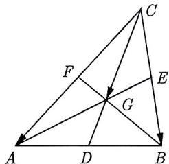
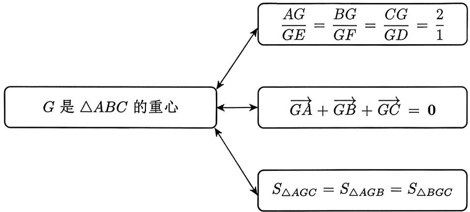

import Guide from '@/components/Guide.astro';
import Knowledge from '@/components/Knowledge.astro';
import Example from '@/components/Example.astro';
import Analysis from '@/components/Analysis.astro';
import Solution from '@/components/Solution.astro';
import Variant from '@/components/Variant.astro';
import Note from '@/components/Note.astro';
import Block from '@/components/Block.astro';

让我们从重心开始, 从高考的角度来看这是最重要的一个心.

<Knowledge title="知识点 3.15">
如图 3-78 所示，在 $\triangle ABC$ 中，三条中线 AE, CD, BF 的交点 G 叫重心.

  
图3-78

</Knowledge>

<Block title="框架 1.7-1">
已知 G 为 $\triangle ABC$ 所在平面上一点，D, E, F 分别为 AB, BC, AC 的中点，如图 3-78 所示，则有如下框架图所示的结论：

</Block>

<Solution>
下面我们给出第一个式子的证明，其他都可以由这个得出．连接 $EF$ ，因为 $EF$ 为中位线，所以 $EF = \frac{1}{2} AB$ ，即 $\frac{AG}{GE} = \frac{AB}{EF} = 2$ ，亦即 $AG = 2GE$ ．同理 $CG = 2GD, BG = 2GF$ ，即 $\frac{AG}{GE} = \frac{BG}{GF} = \frac{CG}{GD} = \frac{2}{1}$
</Solution>

<Example title="例 3.79">
(2023 浙江模考) 设 G 是 $\triangle ABC$ 的重心, 且 $(56 \sin A) \overrightarrow{GA} + (40 \sin B) \overrightarrow{GB} + (35 \sin C) \overrightarrow{GC} = 0$ , 则 B = \_\_\_\_.

<Solution>
因为 G 是 $\triangle ABC$ 的重心, 所以 $\overrightarrow{GA} + \overrightarrow{GB} + \overrightarrow{GC} = 0$ . 根据题中条件可得 $56 \sin A : 40 \sin B : 35 \sin C = 1 : 1 : 1$ , 即 $\sin A : \sin B : \sin C = 5 : 7 : 8$ . 又由正弦定理可知 $a : b : c = \sin A : \sin B : \sin C = 5 : 7 : 8$ . 设 a = 5k, b = 7k, c = 8k, 由余弦定理可得

$$
\cos B = \frac {a ^ {2} + c ^ {2} - b ^ {2}}{2 a c} = \frac {2 5 k ^ {2} + 6 4 k ^ {2} - 4 9 k ^ {2}}{2 \times 5 k \cdot 8 k} = \frac {1}{2}.
$$

又因为 $B \in (0, \pi)$ , 所以 $B = \frac{\pi}{3}$ , 故填 $B = \frac{\pi}{3}$ .
</Solution>

</Example>

如果 $G$ 为 $\triangle ABC$ 的重心, 则 $\overrightarrow{GA} + \overrightarrow{GB} + \overrightarrow{GC} = 0$ , 这个是三角形重心最重要的标志! 如果在平面直角坐标系中, 设 $A(x_1, y_1)$ , $B(x_2, y_2)$ , $C(x_3, y_3)$ , $G(x, y)$ , 由

$$
\overrightarrow {G A} + \overrightarrow {G B} + \overrightarrow {G C} = \mathbf {0} \Longrightarrow \left\{ \begin{array}{l l} x = \frac {x _ {1} + x _ {2} + x _ {3}}{3} \\ y = \frac {y _ {1} + y _ {2} + y _ {3}}{3} \end{array} \right.,
$$

即重心坐标为 $G\left(\frac{x_1 + x_2 + x_3}{3}, \frac{y_1 + y_2 + y_3}{3}\right)$ . 重心这个点的性质绝不仅仅局限于这个框架图, 见下面这个例子.

<Example title="例 3.80">
在 $\triangle ABC$ 内存在一点 P，使 $\overrightarrow{AP^{2}} + \overrightarrow{BP^{2}} + \overrightarrow{CP^{2}}$ 取得最小值，则该点是 $\triangle ABC$ 的 ( ). A. 重心 B. 内心 C. 垂心 D. 外心

<Solution>
在平面直角坐标系中, 设 $A(x_{1},y_{1}), B(x_{2},y_{2}), C(x_{3},y_{3})$ , 点 $P$ 的坐标为 $(x,y)$ , 令 $S = \overrightarrow{AP^2} + \overrightarrow{BP^2} + \overrightarrow{CP^2}$ , 则

$$
S = 3 x ^ {2} + 3 y ^ {2} - 2 (x _ {1} + x _ {2} + x _ {3}) x - 2 (y _ {1} + y _ {2} + y _ {3}) y + x _ {1} ^ {2} + x _ {2} ^ {2} + x _ {3} ^ {2} + y _ {1} ^ {2} + y _ {2} ^ {2} + y _ {3} ^ {2}
$$

配方后可得

$$
S = 3 \left(x - \frac {x _ {1} + x _ {2} + x _ {3}}{3}\right) ^ {2} + 3 \left(y - \frac {y _ {1} + y _ {2} + y _ {3}}{3}\right) ^ {2} +
$$

$$
\frac {1}{3} \left[ (x _ {1} - x _ {2}) ^ {2} + (x _ {2} - x _ {3}) ^ {2} + (x _ {1} - x _ {3}) ^ {2} + (y _ {1} - y _ {2}) ^ {2} + (y _ {2} - y _ {3}) ^ {2} + (y _ {1} - y _ {3}) ^ {2} \right],
$$

可知当 $x = \frac{x_1 + x_2 + x_3}{3}$ 且 $y = \frac{y_1 + y_2 + y_3}{3}$ 时有最小值, 此时点 $P$ 刚好为 $\triangle ABC$ 的重心. 故选 A.
</Solution>

</Example>

在例3.80中我们通过建系, 利用坐标得出点 $P$ 到三角形三个顶点距离, 而得到的式子结构特征很明显, 这个点 $P$ 为三角形的重心时取得最小值. 由此我们可以得到三角形的重心到三角形的 3 个顶点的距离的平方和最小.

<Variant title="变式 3.80.1">
(2022 全国模考) 过 $\triangle ABC$ 的重心 O 的直线 PQ 交 AC 于点 P, 交 BC 于点 Q, $\overrightarrow{PC} = \frac{3}{4}\overrightarrow{AC}, \overrightarrow{QC} = n\overrightarrow{BC}$ , 则 n 的值为 \_\_\_\_.
</Variant>

<Example title="例 3.81">
已知 O 是平面上一定点, A, B, C 是平面上不共线的三个点, 动点 P 满足 $\overrightarrow{OP} = \overrightarrow{OA} + \lambda \left( \frac{\overrightarrow{AB}}{|\overrightarrow{AB}| \sin B} + \frac{\overrightarrow{AC}}{|\overrightarrow{AC}| \sin C} \right)$ , $\lambda \in [0, +\infty)$ , 则 P 的轨迹一定通过 $\triangle ABC$ 的 ( ).

A. 外心    B. 内心    C. 重心    D. 垂心

<Solution>
由题意可得 $\overrightarrow{AP} = \lambda \left( \frac{\overrightarrow{AB}}{|\overrightarrow{AB}|\sin B} + \frac{\overrightarrow{AC}}{|\overrightarrow{AC}|\sin C} \right)$ . 再由正弦定理可知 $|\overrightarrow{AB}| \sin B = |\overrightarrow{AC}| \sin C$ , 所以 $\overrightarrow{AP} = \frac{\lambda}{|\overrightarrow{AB}|\sin B} \left( \overrightarrow{AB} + \overrightarrow{AC} \right)$ . 设 $BC$ 的中点为 $D$ , 所以 $\overrightarrow{AP} = \frac{2\lambda}{|\overrightarrow{AB}|\sin B}\overrightarrow{AD}$ , 则由平行四边形法则可知, 点 $P$ 在 $BC$ 的中线 $AD$ 所在的射线上, 则 $P$ 的轨迹一定通过 $\triangle ABC$ 的重心, 故选 C.
</Solution>

</Example>

<Variant title="变式 3.81.1">
已知 O 是平面上一定点, A, B, C 是平面上不共线的三个点, 动点 P 满足 $\overrightarrow{OP} = \frac{\overrightarrow{OB} + \overrightarrow{OC}}{2} + \lambda \overrightarrow{AP}$ , 则 P 的轨迹一定通过 $\triangle ABC$ 的 ( ).

A. 内心    B. 外心    C. 垂心    D. 重心
</Variant>
