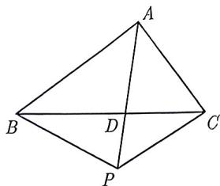

import Guide from '@/components/Guide.astro';
import Knowledge from '@/components/Knowledge.astro';
import Example from '@/components/Example.astro';
import Analysis from '@/components/Analysis.astro';
import Solution from '@/components/Solution.astro';
import Variant from '@/components/Variant.astro';
import Note from '@/components/Note.astro';
import Block from '@/components/Block.astro';

<Example title="例 3.82">
已知 O 是平面上一定点, A, B, C 是平面上不共线的三个点, 动点 P 满足 $\overrightarrow{OP} = \overrightarrow{OA} + \lambda \left( \frac{\overrightarrow{AB}}{|\overrightarrow{AB}|} + \frac{\overrightarrow{AC}}{|\overrightarrow{AC}|} \right)$ , $\lambda \in [0, +\infty)$ , 则点 P 的轨迹一定通过 $\triangle ABC$ 的 ( ).

A. 外心    B. 内心    C. 重心    D. 垂心

<Solution title="解析">
因为 $\frac{\overrightarrow{AB}}{|\overrightarrow{AB}|}$ ， $\frac{\overrightarrow{AC}}{|\overrightarrow{AC}|}$ 分别表示 $\overrightarrow{AB}$ ， $\overrightarrow{AC}$ 方向上的单位向量，所以 $\frac{\overrightarrow{AB}}{|\overrightarrow{AB}|} + \frac{\overrightarrow{AC}}{|\overrightarrow{AC}|}$ 与 $\angle BAC$ 的角平分线共线。由 $\overrightarrow{OP} = \overrightarrow{OA} + \lambda \left( \frac{\overrightarrow{AB}}{|\overrightarrow{AB}|} + \frac{\overrightarrow{AC}}{|\overrightarrow{AC}|} \right)$ ，可得 $\overrightarrow{AP} = \lambda \left( \frac{\overrightarrow{AB}}{|\overrightarrow{AB}|} + \frac{\overrightarrow{AC}}{|\overrightarrow{AC}|} \right)$ ，所以 $\overrightarrow{AP}$ 与 $\angle BAC$ 的角平分线共线，则点 P 的轨迹一定通过 $\triangle ABC$ 的内心。故选 B.
</Solution>
</Example>

内心与角平分线密切相关, 而角平分线有一个很重要的定理: 角平分线定理.

<Block title="角平分线定理">
在 $\triangle ABC$ 中, $AD$ 为 $\angle BAC$ 的角平分线, 则 $\frac{AB}{AC} = \frac{BD}{CD}$ .
</Block>

<Example title="例 3.83">
已知 $\triangle ABC$ 中, AB = 3, AC = 2, D 是 BC 边上一点. A, P, D 三点共线, 若 $\overrightarrow{AP} = \frac{2\overrightarrow{AB}}{|\overrightarrow{AB}|} + \frac{2\overrightarrow{AC}}{|\overrightarrow{AC}|}$ , 则 $\triangle BPD$ 与 $\triangle CPD$ 的面积比为 ( ). A. $\frac{3}{2}$ B. $\frac{\sqrt{3}}{2}$ C. $\frac{9}{4}$ D. $\frac{4}{9}$

<Solution title="解析">
由 $\overrightarrow{AP} = \frac{2\overrightarrow{AB}}{|\overrightarrow{AB}|} +\frac{2\overrightarrow{AC}}{|\overrightarrow{AC}|}$ ，可知 $P$ 在 $\angle BAC$ 的角平分线上，如图3-79所示．又由于 $A,P,D$ 三点共线，且 $D$ 是 $BC$ 边上一点，所以根据角平分线定理得 $\frac{BD}{DC} = \frac{AB}{AC} = \frac{3}{2}$ ，从而 $\frac{S_{\triangle BPD}}{S_{\triangle CPD}} = \frac{BD}{CD} = \frac{3}{2}$ 故选A.

  
图3-79
</Solution>
</Example>

<Variant title="变式 3.83.1">
设 O 是 $\triangle ABC$ 的内心, AB = c, AC = b, 若 $\overrightarrow{AO} = \lambda_{1}\overrightarrow{AB} + \lambda_{2}\overrightarrow{AC}$ , 则 ( ). A. $\frac{\lambda_{1}}{\lambda_{2}} = \frac{b}{c}$ B. $\frac{\lambda_{1}^{2}}{\lambda_{2}^{2}} = \frac{b}{c}$ C. $\frac{\lambda_{1}}{\lambda_{2}} = \frac{c^{2}}{b^{2}}$ D. $\frac{\lambda_{1}^{2}}{\lambda_{2}^{2}} = \frac{c}{b}$
</Variant>
