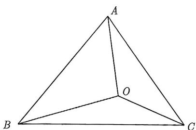
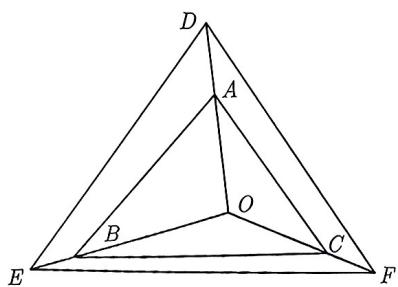
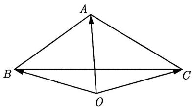
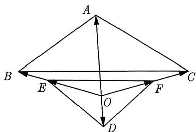
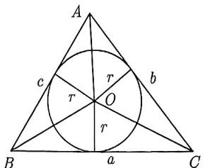
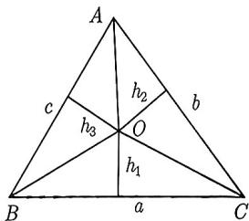

import Guide from '@/components/Guide.astro';
import Knowledge from '@/components/Knowledge.astro';
import Example from '@/components/Example.astro';
import Analysis from '@/components/Analysis.astro';
import Solution from '@/components/Solution.astro';
import Variant from '@/components/Variant.astro';
import Note from '@/components/Note.astro';
import Block from '@/components/Block.astro';

在重心那里, 我们有这么一个结论: $G$ 是 $\triangle ABC$ 的重心等价于 $\overrightarrow{GA} + \overrightarrow{GB} + \overrightarrow{GC} = 0$ . 但是当点 $G$ 动起来, 变成任意点时, 这个结论要做相应的修改. 为此, 我们先看下面的例题.

<Example title="例 3.87">
已知 O 为 $\triangle ABC$ 内的一点, 如图 3-80 所示, $\triangle BOC, \triangle AOC, \triangle AOB$ 的面积分别为 $S_{\triangle BOC}, S_{\triangle AOC}, S_{\triangle AOB}$ . 证明: $S_{\triangle BOC}\overrightarrow{OA} + S_{\triangle AOC}\overrightarrow{OB} + S_{\triangle AOB}\overrightarrow{OC} = 0$ .

<Solution>
作 $\overrightarrow{OD} = S_{\triangle BOC}\overrightarrow{OA},\overrightarrow{OE} = S_{\triangle AOC}\overrightarrow{OB},\overrightarrow{OF} = S_{\triangle AOB}\overrightarrow{OC}$ ，得到 $\triangle DEF$ ，如图3-81所示，则

$$
S _ {\triangle E O F} = \frac {1}{2} | \overrightarrow {O E} | | \overrightarrow {O F} | \sin \angle E O F = \frac {1}{2} S _ {\triangle A O C} | \overrightarrow {O B} | S _ {\triangle A O B} | \overrightarrow {O C} | \sin \angle E O F = S _ {\triangle A O C} S _ {\triangle A O B} S _ {\triangle B O C},
$$

$$
S _ {\triangle F O D} = \frac {1}{2} | \overrightarrow {O F} | | \overrightarrow {O D} | \sin \angle F O D = \frac {1}{2} S _ {\triangle A O B} | \overrightarrow {O C} | S _ {\triangle B O C} | \overrightarrow {O A} | \sin \angle F O D = S _ {\triangle A O C} S _ {\triangle A O B} S _ {\triangle B O C},
$$

$$
S _ {\triangle D O E} = \frac {1}{2} | \overrightarrow {O E} | | \overrightarrow {O D} | \sin \angle E O D = \frac {1}{2} S _ {\triangle A O C} | \overrightarrow {O B} | S _ {\triangle B O C} | \overrightarrow {O A} | \sin \angle E O D = S _ {\triangle A O C} S _ {\triangle A O B} S _ {\triangle B O C}.
$$

所以 $S_{\triangle EOF} = S_{\triangle FOD} = S_{\triangle DOE}$ . 由重心的基本性质可知 O 为 $\triangle DEF$ 的重心, 故 $\overrightarrow{OD} + \overrightarrow{OE} + \overrightarrow{OF} = 0$ , 因此 $S_{\triangle BOC} \overrightarrow{OA} + S_{\triangle AOC} \overrightarrow{OB} + S_{\triangle AOB} \overrightarrow{OC} = 0$ .

  
图3-80

  
图3-81

观察图 3-80, 因为它非常像奔驰汽车的标志, 所以我们将例3.87中的结论称为奔驰定理.
</Solution>
</Example>

<Block title="奔驰定理1">
设 $O$ 为 $\triangle ABC$ 内的一点, 则 $S_{\triangle BOC} \overrightarrow{OA} + S_{\triangle AOC} \overrightarrow{OB} + S_{\triangle AOB} \overrightarrow{OC'} = 0$ .
</Block>

<Note>
首先, 点 $O$ 在 $\triangle ABC$ 内很重要, 否则结论需要作修改, 具体见后面的奔驰定理 2. 其次, 这个结论非常对称, 建议记住. 如果记 $S_A = S_{\triangle BOC}, S_B = S_{\triangle AOC}, S_C = S_{\triangle AOB}$ , 则奔驰定理 1 可以改写为 $S_A \overrightarrow{OA} + S_B \overrightarrow{OB} + S_C \overrightarrow{OC} = 0$ , 这样或许更方便记忆.
</Note>

<Example title="例 3.88">
已知点 P 是 $\triangle ABC$ 内一点，且 $\overrightarrow{PA} + \overrightarrow{PB} + 3\overrightarrow{PC} = 0$ ，若 $\triangle ABC$ 的面积为 S，则 $\triangle PAC$ 的面积为（）.
A. $\frac{3}{8}S$ B. $\frac{1}{3}S$ C. $\frac{3}{10}S$ D. $\frac{1}{5}S$

<Solution>
由奔驰定理可知 $S_{\triangle PBC}: S_{\triangle PAC}: S_{\triangle PAB} = 1:1:3$ ，所以 $S_{\triangle PAC} = \frac{1}{5} S_{\triangle ABC} = \frac{1}{5} S$ ，故选D.
</Solution>
</Example>

我们再来看看当 O 在 $\triangle ABC$ 外时的情况.

<Example title="例 3.89">
如图 3-82 所示, O 为 $\triangle ABC$ 外一点, 且 OA 在 OB 和 OC 之间, 求证: $-S_{\triangle OBC} \overrightarrow{OA} + S_{\triangle AOC} \overrightarrow{OB} + S_{\triangle AOB} \overrightarrow{OC} = 0$ .

<Solution>
作 $\overrightarrow{OD} = -S_{\triangle BOC}\overrightarrow{OA},\overrightarrow{OE} = S_{\triangle AOC}\overrightarrow{OB},\overrightarrow{OF} = S_{\triangle AOB}\overrightarrow{OC}$ ，得到 $\triangle DEF$ ，如图3-83所示，则

$$
S _ {\triangle E O F} = \frac {1}{2} | \overrightarrow {O E} | | \overrightarrow {O F} | \sin \angle E O F = \frac {1}{2} S _ {\triangle A O C} | \overrightarrow {O B} | S _ {\triangle A O B} | \overrightarrow {O C} | \sin \angle E O F = S _ {\triangle A O C} S _ {\triangle A O B} S _ {\triangle B O C},
$$

$$
S _ {\triangle F O D} = \frac {1}{2} | \overrightarrow {O F} | | \overrightarrow {O D} | \sin \angle F O D = \frac {1}{2} S _ {\triangle A O B} | \overrightarrow {O C} | S _ {\triangle B O C} | \overrightarrow {O A} | \sin \angle F O D = S _ {\triangle A O C} S _ {\triangle A O B} S _ {\triangle B O C},
$$

$$
S _ {\triangle D O E} = \frac {1}{2} | \overrightarrow {O E} | | \overrightarrow {O D} | \sin \angle E O D = \frac {1}{2} S _ {\triangle A O C} | \overrightarrow {O B} | S _ {\triangle B O C} | \overrightarrow {O A} | \sin \angle E O D = S _ {\triangle A O C} S _ {\triangle A O B} S _ {\triangle B O C}.
$$

所以 $S_{\triangle EOF} = S_{\triangle FOD} = S_{\triangle DOE}$ . 由重心的基本性质可知 O 为 $\triangle DEF$ 的重心, 故 $\overrightarrow{OD} + \overrightarrow{OE} + \overrightarrow{OF} = 0$ , 因此 $-S_{\triangle BOC} \overrightarrow{OA} + S_{\triangle AOC} \overrightarrow{OB} + S_{\triangle AOB} \overrightarrow{OC} = 0$ .

  
图3-82

  
图3-83

观察图 3-83, 我们发现 O, A 分别在 BC 两侧, 此时 $-S_{\triangle OBC} + S_{\triangle AOC} + S_{\triangle AOB} = S_{\triangle ABC}$ , 还有一种情况请同学们画图验证, 如果 $O, A$ 都在 $BC$ 同侧, 且 $O$ 在 $\triangle ABC$ 外, 那么 $-S_{\triangle OBC} + S_{\triangle AOC} + S_{\triangle AOB} = -S_{\triangle ABC}$ . 由此, 我们得到如下更一般形式的奔驰定理.
</Solution>
</Example>

<Block title="奔驰定理2">
设 $O$ 为 $\triangle ABC$ 所在平面上的一点且 $\alpha \overrightarrow{OA} + \beta \overrightarrow{OB} + \gamma \overrightarrow{OC} = 0$ , 则 $S_{\triangle BOC}: S_{\triangle AOC}: S_{\triangle AOB} = |\alpha|: |\beta|: |\gamma|$ , 且 $\alpha + \beta + \gamma = tS_{\triangle ABC}(t \in \mathbb{R})$ 为定值.
</Block>

<Note>
若 $O$ 在 $\triangle ABC$ 内, 则 $\alpha, \beta, \gamma$ 都是正实数; 若 $O$ 在 $\triangle ABC$ 外, 则 $\alpha, \beta, \gamma$ 有一个为负且与之相乘的向量夹在其余两个向量之间. 比如, 如果 $OA$ 在 $OB$ 和 $OC$ 之间, 则 $\alpha < 0$ , 反之亦然. 其他情形可类似得到.
</Note>

<Example title="例 3.90">
设 P 为 $\triangle ABC$ 所在平面上一点, 且满足 $3\overrightarrow{PA} + 4\overrightarrow{PC} = m\overrightarrow{AB} (m > 0)$ , 若 $\triangle ABP$ 的面积为 8, 则 $\triangle ABC$ 的面积为 \_\_\_\_.

<Solution>
由 $3\overrightarrow{PA}+4\overrightarrow{PC}=m\overrightarrow{AB}$ 可得 $3\overrightarrow{PA}+4\overrightarrow{PC}=m\overrightarrow{PB}-m\overrightarrow{PA}$ ，即 $(m+3)\overrightarrow{PA}-m\overrightarrow{PB}+4\overrightarrow{PC}=0$ ，由奔驰定理 2 得 $S_{\triangle PBC}:(-S_{\triangle PAC}):S_{\triangle PAB}=(m+3):(-m):4,$ 从而

$$
\frac {S _ {\triangle P A B}}{S _ {\triangle P B C} - S _ {\triangle P A C} + S _ {\triangle P A B}} = \frac {4}{(m + 3) - m + 4} \Rightarrow \frac {8}{S _ {\triangle A B C}} = \frac {4}{7},
$$

解得 $S_{\triangle ABC} = 14$ 故填14.
</Solution>
</Example>

<Example title="例 3.91">
已知 $\triangle ABC$ 的三个内角 A, B, C 所对边的长分别为 a, b, c, O 为 $\triangle ABC$ 所在平面上一点, 求证: 点 O 是 $\triangle ABC$ 的内心是 $a\overrightarrow{OA} + b\overrightarrow{OB} + c\overrightarrow{OC} = 0$ 的充要条件.

<Solution>
充分性: 如图 3-84 所示, O 为 $\triangle ABC$ 的内心, 设 $\triangle ABC$ 内切圆半径为 r, 可知 $S_{\triangle BOC} = \frac{1}{2} ar$ , $S_{\triangle AOC} = \frac{1}{2} br$ , $S_{\triangle AOB} = \frac{1}{2} cr$ , 即 $S_{\triangle BOC}: S_{\triangle AOC}: S_{\triangle AOB} = a:b:c$ . 由奔驰定理 1 可得

$$
S _ {\triangle B O C} \overrightarrow {O A} + S _ {\triangle A O C} \overrightarrow {O B} + S _ {\triangle A O B} \overrightarrow {O C} = \mathbf {0} \Rightarrow a \overrightarrow {O A} + b \overrightarrow {O B} + c \overrightarrow {O C} = \mathbf {0}.
$$

必要性: 如图 3-85所示, 设 $S_{\triangle BOC}, S_{\triangle AOC}, S_{\triangle AOB}$ 的高分别为 $h_1, h_2, h_3$ . 由奔驰定理 2 可知 $S_{\triangle BOC}: S_{\triangle AOC}: S_{\triangle AOB} = a:b:c$ , 即 $h_1 = h_2 = h_3$ , 即 $O$ 到三边的距离相等, 故 $O$ 为 $\triangle ABC$ 的内心.

  
图3-84

  
图3-85
</Solution>
</Example>

<Variant title="变式 3.91.1">
设点 P 在 $\triangle ABC$ 内且为 $\triangle ABC$ 的外心, $A = 30^{\circ}$ , 若 $\triangle PBC, \triangle PCA, \triangle PAB$ 的面积分别为 $\frac{1}{2}, x, y$ , 则 $x + y$ 的最大值是 \_\_\_\_.
</Variant>
