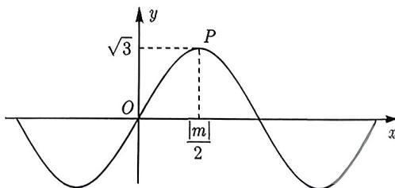

import Guide from '@/components/Guide.astro';
import Knowledge from '@/components/Knowledge.astro';
import Example from '@/components/Example.astro';
import Analysis from '@/components/Analysis.astro';
import Solution from '@/components/Solution.astro';
import Variant from '@/components/Variant.astro';
import Note from '@/components/Note.astro';
import Block from '@/components/Block.astro';

<Knowledge title="知识点 4.4">
设 $P_{1}(x_{1},y_{2})$ , $P_{1}(x_{2},y_{2})$ ，则 $|P_{1}P_{2}|=\sqrt{(x_{1}-x_{2})^{2}+(y_{1}-y_{2})^{2}}$ .
</Knowledge>

三种距离公式中, 两点间的距离用得最多, 也最重要, 我们先从一道简单的例题开始.

<Example title="例 4.9">
（2022 江苏期中）已知 $A(a,2)$ , $B(-2,-3)$ , $C(1,6)$ 三点，且 $|AB|=|AC|$ ，则实数 a 的值为 \_\_\_\_.

<Solution>
由 $|AB| = |AC|$ 可得 $\sqrt{(a + 2)^2 + (2 + 3)^2} = \sqrt{(a - 1)^2 + (2 - 6)^2}$ , 解得 $a = -2$ , 故填-2.
</Solution>
</Example>

有时候出题人不直接体现出两点间的距离, 而是要求同学们根据公式的结构特征来构造两点间的距离公式, 比如下面的例题:

<Example title="例 4.10">
(2014 全国 II 理 12) 设函数 $f(x)=\sqrt{3}\sin\frac{\pi x}{m}$ . 若存在 $f(x)$ 的极值点 $x_{0}$ 满足 $x_{0}^{2}+[f(x_{0})]^{2}<m^{2}$ ，则 m 的取值范围是（）.

A. $(-∞,-6)∪(6,+∞)$ B. $(-∞,-4)∪(4,+∞)$ C. $(-∞,-2)∪(2,+∞)$ D. $(-∞,-1)∪(4,+∞)$

<Solution>
极值点 $x_0$ 满足 $x_0^2 + [f(x_0)]^2 < m^2$ ，即 $(x_0 - 0)^2 + [f(x_0) - 0]^2 < m^2$ ，其等价于 $(x_0, f(x_0))$ 到 $(0, 0)$ 距离的平方小于 $m^2$ ，画出 $f(x) = \sqrt{3} \sin \frac{\pi x}{m}$ 的图像，如图4-2所示，则题意等价于 $|OP|^2 < m^2$ 。因为 $f(x)$ 的最小正周期为 $T = \frac{2\pi}{\frac{\pi}{|m|}} = |2m|$ ，所以点 $P$ 的横坐标为 $\frac{1}{4} \times |2m| = \frac{|m|}{2}$ ，故点 $P$ 坐标为 $\left(\frac{|m|}{2},\sqrt{3}\right)$ ，因此 $\left(\frac{|m|}{2} -0\right)^2 +(\sqrt{3} -0)^2 < m^2,$ 解得 $m < -2$ 或 $m > 2$ ，故选C.
</Solution>
</Example>

  
图4-2

这种通过平方和来构造两点间距离的方法, 同学们务必要熟悉, 用到这种方法的高考题往往出现在选填的压轴位置.

<Block title="经验总结 4.1">
形如 $(x-a)^{2}+[f(x)-b]^{2}$ 的方程,一般转化为 $(x,f(x))$ 到 $(a,b)$ 距离的平方.
</Block>
