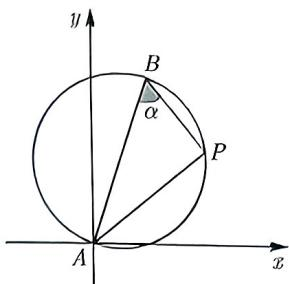
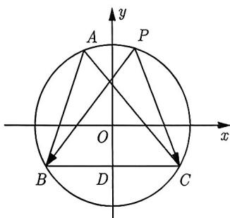

import Guide from '@/components/Guide.astro';
import Knowledge from '@/components/Knowledge.astro';
import Example from '@/components/Example.astro';
import Analysis from '@/components/Analysis.astro';
import Solution from '@/components/Solution.astro';
import Variant from '@/components/Variant.astro';
import Note from '@/components/Note.astro';
import Block from '@/components/Block.astro';

<Knowledge title="知识点 4.11">
在平面直角坐标系中, 已知 $A(x_{1}, y_{1}), B(x_{2}, y_{2})$ , 则以线段 AB 为直径的圆的轨迹方程为 $(x - x_{1})(x - x_{2}) + (y - y_{1})(y - y_{2}) = 0$ .
</Knowledge>

<Solution>
设圆上任一点 $P(x,y)$ ，因为直径所对的圆周角为直角，所以 $\overrightarrow{PA} \cdot \overrightarrow{PB} = 0$ ，故 $(x - x_{1})(x - x_{2}) + (y - y_{1})(y - y_{2}) = 0$ .
</Solution>

<Example title="例 4.23">
(2018 江苏) 在平面直角坐标系 $xOy$ 中, $A$ 为直线 $\ell: y = 2x$ 上在第一象限内的点, $B(5,0)$ , 以 $A, B$ 为直径的圆 $C$ 与直线 $\ell$ 交于另一点 $D$ . 若 $\overrightarrow{AB} \cdot \overrightarrow{CD} = 0$ , 则点 $A$ 的横坐标为 \_\_\_\_.
<Solution>
设 $A(a,2a)(a > 0)$ , $B(5,0)$ , 因为圆 $C$ 的直径为 $AB$ , 所以 $C$ 的坐标为 $\left(\frac{a + 5}{2}, a\right)$ 且圆的方程为 $(x - 5)(x - a) + y(y - 2a) = 0$ . 将 $y = 2x$ 代入圆 $C$ 的方程, 得 $x^2 - (a + 1)x + a = 0$ , 解得 $x = a$ 或 $x = 1$ , 故 $D(1,2)$ . 又因为 $\overrightarrow{AB} \cdot \overrightarrow{CD} = 0$ , 所以 $(5 - a)\left(1 - \frac{a + 5}{2}\right) + (0 - 2a)(2 - a) = 0$ , 解得 $a = 3$ , 故填3.
</Solution>
</Example>

直径圆的关键特征有两点: 一是有两个定点; 二是有垂直. 如果将这两个特征都隐藏起来, 那么能否把它们找出来, 才是解题的关键.

<Example title="例 4.24">
(2014 四川文 9) 设 $m \in R$ ，过定点 A 的动直线 $x + my = 0$ 和过定点 B 的动直线 $mx - y - m + 3 = 0$ 交于点 $P(x, y)$ ，则 $|PA| + |PB|$ 的取值范围是（）. A. $\left[\sqrt{5},2\sqrt{5}\right]$ B. $\left[\sqrt{10},2\sqrt{5}\right]$ C. $\left[\sqrt{10},4\sqrt{5}\right]$ D. $\left[2\sqrt{5},4\sqrt{5}\right]$

$$
\vert P A \vert + \vert P B \vert = \vert A B \vert \sin \alpha + \vert A B \vert \cos \alpha = 2 \sqrt {5} \sin \left(\alpha + \frac {\pi}{4}\right).
$$

图4-4

<Solution>
根据题意可知点 $A(0,0), B(1,3)$ . 又因为 $1 \cdot m + m \cdot (-1) = 0$ , 所以两条直线互相垂直, 即 $AP \perp PB$ , 则 $\overrightarrow{AP} \cdot \overrightarrow{BP} = 0$ , 可得 $x(x - 1) + y(y - 3) = 0$ , 化简得 $\left(x - \frac{1}{2}\right)^2 + \left(y - \frac{3}{2}\right)^2 = \frac{5}{2}$ . 如图4-4所示, 令 $\angle PBA = \alpha \left(0 \leqslant \alpha \leqslant \frac{\pi}{2}\right)$ , 则

$$
\vert P A \vert + \vert P B \vert = \vert A B \vert \sin \alpha + \vert A B \vert \cos \alpha = 2 \sqrt {5} \sin \left(\alpha + \frac {\pi}{4}\right).
$$

图4-4

由 $0 \leqslant \alpha \leqslant \frac{\pi}{2}$ , 得 $\alpha + \frac{\pi}{4} \in \left[\frac{\pi}{4}, \frac{3\pi}{4}\right]$ , 即 $|PA| + |PB| = 2\sqrt{5} \sin \left(\alpha + \frac{\pi}{4}\right) \in [\sqrt{10}, 2\sqrt{5}]$ , 故选 B.
</Solution>
</Example>

<Variant title="变式 4.24.1">
在平面直角坐标系 xOy 中, 直线 $\ell_{1}: kx - y + 2 = 0$ 与直线 $\ell_{2}: x + ky - 2 = 0$ 相交于点 P, 求点 P 的轨迹方程.
</Variant>

在 $\triangle APB$ 中, 已知边 $AB$ 及边 $AB$ 所对的角 $\angle APB$ , 求 $\triangle APB$ 的外接圆, 当 $\angle APB \neq 90^{\circ}$ 时, 由正弦定理得 $\frac{AB}{\sin \angle APB} = 2R$ , 从而求出三角形外接圆的半径 $R$ .

<Example title="例 4.25">
(2023 河北期末) 已知 $\triangle ABC$ 中， $BC = 2\sqrt{3}$ ， $A = \frac{\pi}{3}$ ，点 P 是 $\triangle ABC$ 外接圆圆周上的一个动点，则 $\overrightarrow{PB} \cdot \overrightarrow{PC}$ 取值范围是 \_\_\_\_.

<Solution>
设 $\triangle ABC$ 外接圆的半径为 $R$ , 因为 $BC = 2\sqrt{3}$ , $A = \frac{\pi}{3}$ , 所以由正弦定理可得 $2R = \frac{|BC|}{\sin A} = 4$ , 即 $R = 2$ . 如图4-5所示, 设 $BC$ 的中点为 $D$ , $\triangle ABC$ 外接圆的圆心为 $O$ , 则 $|OD| = \sqrt{|OC|^2 - |CD|^2} = \sqrt{4 - 3} = 1$ , 以 $O$ 为原点, 平行于 $BC$ 的直线为 $x$ 轴, 建立平面直角坐标系, 则圆 $O$ 的方程为 $x^2 + y^2 = 4$ , $B(-\sqrt{3}, -1)$ , $C(\sqrt{3}, -1)$ , 设 $P(2\cos \theta, 2\sin \theta)$ , 则 $\overrightarrow{PB} = (-\sqrt{3} - 2\cos \theta, -1 - 2\sin \theta)$ , $\overrightarrow{PC} = (\sqrt{3} - 2\cos \theta, -1 - 2\sin \theta)$ , 于是

  
图4-5

$$
\begin{array}{r l} & {\overrightarrow {P B} \cdot \overrightarrow {P C} = (- \sqrt {3} - 2 \cos \theta) (\sqrt {3} - 2 \cos \theta) + (- 1 - 2 \sin \theta) (- 1 - 2 \sin \theta)} \\ & {\qquad = - (3 - 4 \cos^ {2} \theta) + 1 + 4 \sin \theta + 4 \sin^ {2} \theta} \\ & {\qquad = 4 \sin \theta + 2 \in [ - 2, 6 ].} \end{array}
$$

故填 $[-2,6]$ .
</Solution>
</Example>
