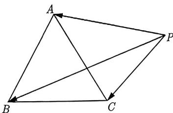

import Guide from '@/components/Guide.astro';
import Knowledge from '@/components/Knowledge.astro';
import Example from '@/components/Example.astro';
import Analysis from '@/components/Analysis.astro';
import Solution from '@/components/Solution.astro';
import Variant from '@/components/Variant.astro';
import Note from '@/components/Note.astro';
import Block from '@/components/Block.astro';

由于圆的标准方程是两个平方和的形式, 故如果题目中含有多个线段 (一个动点到多个定点组成的线段) 的平方和为定值的特征, 我们可以考虑转化为圆.

<Example title="例 4.27">
如图 4-6 所示, $\triangle ABC$ 是边长为 1 的正三角形, 点 P 在 $\triangle ABC$ 所在的平面内, 且 $|\overrightarrow{PA}|^{2} + |\overrightarrow{PB}|^{2} + |\overrightarrow{PC}|^{2} = a (a \text{ 为常数})$ . 下列结论中, 正确的是 ( ). A. 当 0 < a < 1 时, 满足条件的点 P 有且只有一个 B. 当 a = 1 时, 满足条件的点 P 有三个 C. 当 a > 1 时, 满足条件的点 P 有无数个 D. 当 a 为任意正实数时, 满足条件的点 P 是有限个

  
图4-6

<Solution>
以 BC 所在直线为 x 轴, BC 中点为原点, 建立直角坐标系, 则 $A\left(0, \frac{\sqrt{3}}{2}\right)$ , $B\left(-\frac{1}{2}, 0\right)$ , $C\left(\frac{1}{2}, 0\right)$ . 设 $P(x, y)$ , 可得 $|\overrightarrow{PA}|^{2} = x^{2} + \left(y - \frac{\sqrt{3}}{2}\right)^{2}$ , $|\overrightarrow{PB}|^{2} = \left(x + \frac{1}{2}\right)^{2} + y^{2}$ , $|\overrightarrow{PC}|^{2} = \left(x - \frac{1}{2}\right)^{2} + y^{2}$ .

因为 $|\overrightarrow{PA}|^2 + |\overrightarrow{PB}|^2 + |\overrightarrow{PC}|^2 = a,$ 所以 $x^2 + \left(y - \frac{\sqrt{3}}{2}\right)^2 + \left(x + \frac{1}{2}\right)^2 + y^2 + \left(x - \frac{1}{2}\right)^2 + y^2 = a,$ 化简得 $3x^2 + 3y^2 - \sqrt{3}y + \frac{5}{4} - a = 0,$ 即 $x^2 + y^2 - \frac{\sqrt{3}}{3}y + \frac{5}{12} - \frac{a}{3} = 0,$ 配方得

$$
x ^ {2} + \left(y - \frac {\sqrt {3}}{6}\right) ^ {2} = \frac {1}{3} (a - 1).\tag{4.2.1}
$$

当 a < 1 时, 方程 (4.2.1) 的右边小于 0, 故不能表示任何图形, 所以 A 错误;

当 $a = 1$ 时, 方程 (4.2.1) 的右边为 0 , 表示点 $\left(0, \frac{\sqrt{3}}{6}\right)$ 恰好是正三角形的重心, 故 B 错误;

当 $a > 1$ 时, 方程 (4.2.1) 的右边大于 0 , 表示以 $\left(0, \frac{\sqrt{3}}{6}\right)$ 为圆心, 半径为 $\sqrt{\frac{1}{3}(a - 1)}$ 的圆, 而圆上的点有无数个, 所以 C 正确, D 错误. 故选 C.
</Solution>
</Example>

<Variant title="变式 4.27.1">
正方形 ABCD 与点 P 在同一平面内，已知该正方形的边长为 1，且 $\left|PA\right|^{2} + \left|PB\right|^{2} - \left|PC\right|^{2} = 0$ ，求 P 的轨迹方程.
</Variant>
