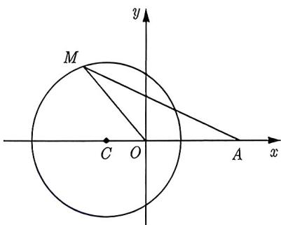
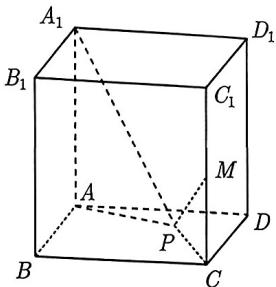
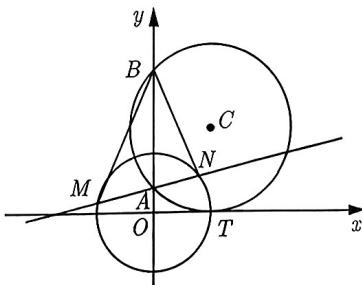

import Guide from '@/components/Guide.astro';
import Knowledge from '@/components/Knowledge.astro';
import Example from '@/components/Example.astro';
import Analysis from '@/components/Analysis.astro';
import Solution from '@/components/Solution.astro';
import Variant from '@/components/Variant.astro';
import Note from '@/components/Note.astro';
import Block from '@/components/Block.astro';

前面我们介绍了多种基于圆的轨迹的题型, 它们的重要性毋庸赘述, 下面我们继续介绍圆的轨迹方程, 先来看看教材中的一个习题.

<Example title="例 4.28">
已知动点 M 与两个定点 $O(0,0)$ , $A(3,0)$ 的距离的比为 $\frac{1}{2}$ ，求动点 M 的轨迹方程，并说明轨迹的形状.

<Solution title="解析">
如图4-7所示, 设点 $M$ 的坐标为 $(x, y)$ , 根据题设有 $\frac{|MO|}{|MA|} = \frac{1}{2}$ , 则

$$
\frac {\sqrt {x ^ {2} + y ^ {2}}}{\sqrt {(x - 3) ^ {2} + y ^ {2}}} = \frac {1}{2} \Rightarrow x ^ {2} + y ^ {2} + 2 x - 3 = 0 \Rightarrow (x + 1) ^ {2} + y ^ {2} = 4.
$$

所以点 $M$ 的轨迹是圆心为 $(-1,0)$ , 半径为 2 的圆.

  
图4-7
</Solution>
</Example>

由例 4.28 可知平面内到两个定点的距离之比为常数 (常数大于 0, 且不等于 1) 的点的轨迹都为圆, 且该类圆还有一个名字叫阿波罗尼斯圆 (简称阿氏圆).

<Knowledge title="知识点 4.12">
 在平面直角坐标系中, 到两个定点的距离之比为常数 $\lambda (\lambda > 0$ 且 $\lambda \neq 1)$ 的点的轨迹为圆, 以这种方式定义的圆叫作 “阿波罗尼斯圆” (简称阿氏圆).
</Knowledge>

<Solution title="解析">
设 $C$ 到两个定点 $A, B$ 的距离之比为 $\lambda (\lambda > 0$ 且 $\lambda \neq 1)$ , 以线段 $AB$ 所在直线为 $x$ 轴, 线段 $AB$ 的中垂线为 $y$ 轴, 建立平面直角坐标系. 设定点 $A(-m,0), B(m,0), C(x,y)$ , 由 $\frac{|CA|}{|CB|} = \lambda$ , 可得 $\frac{\sqrt{(x - m)^2 + y^2}}{\sqrt{(x + m)^2 + y^2}} = \lambda$ , 化简整理可得

$$
(1 - \lambda^ {2}) x ^ {2} + (1 - \lambda^ {2}) y ^ {2} + 2 m (\lambda^ {2} + 1) x + m ^ {2} (1 - \lambda^ {2}) = 0.
$$

因为 $\lambda > 0$ 且 $\lambda \neq 1$ , 配方得

$$
\left(x - \frac {\lambda^ {2} + 1}{\lambda^ {2} - 1} \cdot m\right) ^ {2} + y ^ {2} = \left(\frac {\lambda}{\lambda^ {2} - 1} \cdot 2 m\right) ^ {2}
$$

所以点 $C$ 的轨迹是以 $\left(\frac{\lambda^2 + 1}{\lambda^2 - 1} \cdot m, 0\right)$ 为圆心，半径为 $\left|\frac{\lambda}{\lambda^2 - 1} \cdot 2m\right|$ 的圆.
</Solution>

<Note>
 实际问题中所给两点未必关于坐标轴对称, 因此只需掌握最基本的推导计算, 不要去记忆这个圆的圆心与半径. 只要记住 “到两个定点的距离之比为常数的点的轨迹为圆” 就可以了.
</Note>

<Example title="例 4.29">
(2022 浙江统考) 正方体 $ABCD - A_{1}B_{1}C_{1}D_{1}$ 中, M 是棱 $CC_{1}$ 的中点, P 是底面 ABCD 内一动点, 且 $A_{1}P$ , MP 与底面 ABD 所成角相等, 则动点 P 的轨迹为 ( ).

A. 圆的一部分 B. 直线的一部分 C. 椭圆的一部分 D. 双曲线的一部分

<Solution title="解析">
正方体如图4-8所示, 连接 $PA, PC$ , 由 $A_{1}A \perp$ 底面 $ABCD, C_{1}C \perp$ 底面 $ABCD$ , 可得 $\angle A_{1}PA, \angle MPC$ 分别为直线 $A_{1}P, MP$ 与底面 $ABCD$ 所成的角, 因此 $\angle A_{1}PA = \angle MPC$ , 又因为 $\angle A_{1}AP = \angle MCP = 90^{\circ}$ , 所以 Rt△ $A_{1}AP \sim$ Rt△ $MCP$ , 可得 $\frac{PA}{PC} = \frac{A_{1}A}{MC} = 2$ , 所以 $PA = 2PC$ , 满足阿波罗尼斯圆的定义, 故选 A.

  
图4-8
</Solution>
</Example>

以上例题都是按照阿波罗尼斯圆的定义形式来命题的, 由 $|MA| = \lambda |MB| (\lambda > 0$ 且 $\lambda \neq 1)$ 就可以判断出点 $M$ 的轨迹为圆, 但我们必须提醒读者, 很多情况下命题者会反其道而行之, 就是逆用阿氏圆.

<Example title="例 4.30">
(2015 湖北理 17) 如图 4-9 所示, 圆 C 与 x 轴相切于点 $T(1,0)$ , 与 y 轴正半轴交于两点 A, B (点 B 在点 A 的上方), 且 $|AB| = 2$ .

(I) 圆 C 的标准方程为 \_\_\_\_；

(Ⅱ) 过点 $A$ 任作一条直线与圆 $O: x^2 + y^2 = 1$ 相交于 $M, N$ 两点, 下列三个结论:

图4-9

(1) $\frac{|NA|}{|NB|} = \frac{|MA|}{|MB|}$ ; (2) $\frac{|NB|}{|NA|} - \frac{|MA|}{|MB|} = 2$ ; (3) $\frac{|NB|}{|NA|} + \frac{|MA|}{|MB|} = 2\sqrt{2}$ .

其中正确结论的序号是\_\_\_\_。(写出所有正确结论的序号)

<Solution title="解析">
(I) 根据题意, 可设圆心为 $C(1, r)$ , 已知 $|AB| = 2$ , 可得 $r = \sqrt{2}$ , 则圆 $C$ 的方程为 $(x - 1)^2 + (y - \sqrt{2})^2 = 2$ .

(II) 由题意可知, 若能分别求出 $\frac{|NA|}{|NB|}$ 和 $\frac{|MA|}{|MB|}$ , 则可以顺利解答此题. 联想到阿波罗尼斯圆, 可以猜测它们应该是定值. 在圆 $C: (x - 1)^2 + (y - \sqrt{2})^2 = 2$ 中, 令 $x = 0$ , 解得 $A(0, \sqrt{2} - 1), B(0, \sqrt{2} + 1)$ , 设 $N(x, y)$ , 则

$$
\frac {| N A | ^ {2}}{| N B | ^ {2}} = \frac {x ^ {2} + [ y - (\sqrt {2} - 1) ] ^ {2}}{x ^ {2} + [ y - (\sqrt {2} + 1) ] ^ {2}} = \frac {x ^ {2} + y ^ {2} - 2 (\sqrt {2} - 1) y + (\sqrt {2} - 1) ^ {2}}{x ^ {2} + y ^ {2} - 2 (\sqrt {2} + 1) y + (\sqrt {2} + 1) ^ {2}}.
$$

利用 $x^{2} + y^{2} = 1$ ，并整理可得

$$
\frac {| N A | ^ {2}}{| N B | ^ {2}} = \frac {4 - 2 \sqrt {2} - 2 (\sqrt {2} - 1) y}{4 + 2 \sqrt {2} - 2 (\sqrt {2} + 1) y} = \frac {(\sqrt {2} - 1) (2 \sqrt {2} - 2 y)}{(\sqrt {2} + 1) (2 \sqrt {2} - 2 y)} = \frac {\sqrt {2} - 1}{\sqrt {2} + 1} = (\sqrt {2} - 1) ^ {2}.
$$

因此 $\frac{|NA|}{|NB|} = \sqrt{2} - 1$ , 由 $N$ 的任意性可得 $\frac{|MA|}{|MB|} = \sqrt{2} - 1$ . 从而可以轻松判断 (1) (2) (3) 都正确, 故填 (1)(2)(3).
</Solution>
</Example>

<Variant title="变式 4.30.1">
（2014 湖北文 17）已知圆 $O: x^{2} + y^{2} = 1$ 和点 $A(-2,0)$ ，若定点 $B(b,0)(b \neq -2)$ 和常数 $\lambda$ 满足：对圆 O 上任意一点 M，都有 $|MB| = \lambda |MA|$ ，则 b = \_\_\_\_， $\lambda =$ \_\_\_\_ .
</Variant>
