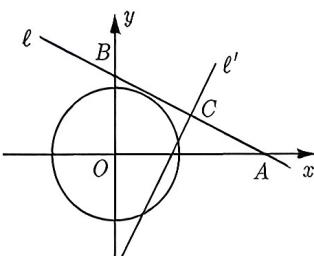
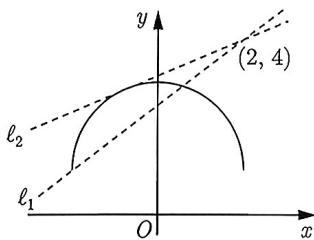

import Guide from '@/components/Guide.astro';
import Knowledge from '@/components/Knowledge.astro';
import Example from '@/components/Example.astro';
import Analysis from '@/components/Analysis.astro';
import Solution from '@/components/Solution.astro';
import Variant from '@/components/Variant.astro';
import Note from '@/components/Note.astro';
import Block from '@/components/Block.astro';

直线与圆的位置关系有三种: 相离、相切与相交. 判断方法主要为几何法和代数法:

<Knowledge title="知识点 4.18">
 (1) 几何法: 设圆 C 的半径为 r, 圆心到直线 $\ell$ 的距离为 d, 则:
① 当 d < r 时, $\ell$ 与 C 相交; ② 当 d = r 时, $\ell$ 与 C 相切; ③ 当 d > r 时, $\ell$ 与 C 相离.
(2) 代数法: 联立直线与圆的方程, 消元后得到一元二次方程, 求出判别式 $\Delta$ , 则:
① 当 $\Delta >0$ 时, $\ell$ 与 C 相交; ② 当 $\Delta = 0$ 时, $\ell$ 与 C 相切; ③ 当 $\Delta < 0$ 时, $\ell$ 与 C 相离.
</Knowledge>

虽然两种方法都能判断直线与圆的位置关系, 但一般来说, 几何法的计算量更小.

<Example title="例 4.36">
（2021 新高考Ⅱ 11-多选题）已知直线 $\ell: ax + by - r^{2} = 0$ ，圆 $C: x^{2} + y^{2} = r^{2}$ ，点 $A(a, b)$ ，下列命题中的真命题有（）.
A. 若 A 在 C 上, 则 $\ell$ 与 C 相切
B. 若 A 在 C 内, 则 $\ell$ 与 C 相离
C. 若 A 在 C 外, 则 $\ell$ 与 C 相离
D. 若 A 在 $\ell$ 上, 则 $\ell$ 与 C 相切

<Solution>
圆心 $C$ 到直线 $\ell$ 的距离 $d = \frac{|a\cdot 0 + b\cdot 0 - r^2|}{\sqrt{a^2 + b^2}} = \frac{r^2}{\sqrt{a^2 + b^2}}.$

选项 A, 若点 $A(a, b)$ 在圆 $C$ 上, 则 $a^2 + b^2 = r^2$ , 即 $d = r$ , 所以直线 $\ell$ 与圆 $C$ 相切, A 正确.  
选项 B, 若点 $A(a, b)$ 在圆 $C$ 内, 则 $a^2 + b^2 < r^2$ , 即 $d > r$ , 所以直线 $\ell$ 与圆 $C$ 相离, B 正确.  
选项 C, 若点 $A(a, b)$ 在圆外, 则 $a^2 + b^2 > r^2$ , 即 $d < r$ , 所以直线 $\ell$ 与圆 $C$ 相交, C 错误.  
选项 D, 因为点 $A$ 在 $\ell$ 上, 所以 $a^2 + b^2 = r^2$ , 即 $d = r$ , 所以直线 $\ell$ 与圆 $C$ 相切, D 正确.  
故选 ABD.
</Solution>
</Example>

反过来, 如果知道直线与圆的位置关系, 我们也可以通过几何法求参数的值或范围.

<Example title="例 4.37">
已知过点 $A(1,0)$ 的直线 $\ell$ 与圆 $C(x-2)^{2}+(y-3)^{2}=1$ 有一个交点，则直线 $\ell$ 的方程为 \_\_\_\_.

<Solution title="解析 1">
根据题意可设直线 $\ell$ 的方程为 y = kx - k，因为直线 $\ell$ 与圆只有一个交点，所以直线 $\ell$ 与圆 C 相切，则 $\frac{|k - 3|}{\sqrt{1 + k^{2}}} = 1$ ，解得 $k = \frac{4}{3}$ ，所以直线 $\ell$ 的方程为 $y = \frac{4}{3}x - \frac{4}{3}$ ，整理得 4x - 3y - 4 = 0，故填 4x - 3y - 4 = 0。
</Solution>

这个解法是错的, 什么地方出错了呢? 因为 $A(1,0)$ 在圆外, 而过圆外的点可以作圆的两条切线, 但是通过上面的解析 1 却只得到一条直线, 因此可知还有一条直线遗漏, 遗漏的是斜率不存在的情形. 正确解析如下:

<Solution title="解析 2">
(1) 当直线的斜率不存在时, 直线方程为 x = 1, 圆心到直线的距离恰好等于半径 1, 因此符合题意.

(2) 当直线的斜率存在时, 同解析 1.

综上可知, 直线 $\ell$ 的方程为 $4x - 3y - 4 = 0$ 或 $x = 1$ , 故填 $4x - 3y - 4 = 0$ 或 $x = 1$ .
</Solution>
</Example>

<Variant title="变式 4.37.1">
(2022 新高考 II15) 设点 $A(-2,3), B(0,a)$ , 直线 $AB$ 关于直线 $y = a$ 的对称直线为 $\ell$ , 已知 $\ell$ 与圆 $C: (x + 3)^2 + (y + 2)^2 = 1$ 有公共点, 则 $a$ 的取值范围为 \_\_\_\_.
</Variant>

有时候题目会把圆或直线隐藏起来, 需要我们通过题意将圆或直线找出来, 比如下面的例题:

<Example title="例 4.38">
(2022 唐山高三模拟) 已知圆 $O: x^{2} + y^{2} = r^{2} (r > 0)$ ，设直线 $\ell: x + 2y - 8 = 0$ 与两坐标轴的交点分别为 A, B，若圆 O 上存在点 P 满足 $|AP| = |BP|$ ，则 r 的最小值为（）.
A. $\frac{6\sqrt{5}}{5}$ B. $\frac{6}{5}$ C. $2\sqrt{5}$ D. 3

<Analysis>
因为 $|AP| = |BP|$ ，所以 $P$ 的轨迹为线段 $AB$ 的垂直平分线，故只需满足圆 $O$ 与线段 $AB$ 的垂直平分线相交或相切即可.
</Analysis>

<Solution>
如图4-10所示, 设直线 $\ell: x + 2y - 8 = 0$ 与 $x$ 轴、 $y$ 轴交于 $A, B$ , 则 $A(8,0), B(0,4)$ , 设 $AB$ 的中点为 $C$ , 故 $C$ 为 (4,2). 由 $|AP| = |BP|$ , 可知 $P$ 的轨迹为线段 $AB$ 的垂直平分线. 不妨设为 $\ell'$ , 因为 $AB$ 的斜率为 $-\frac{1}{2}$ , 故 $\ell'$ 的斜率为 2, 于是 $\ell'$ 的方程为 $y - 2 = 2(x - 4)$ , 即 $\ell': 2x - y - 6 = 0$ . 依题意可得, 圆 $O$ 与直线 $\ell'$ 相交或相切, 故圆心 $O$ 到直线 $\ell'$ 的距离 $d \leqslant r$ , 即 $\frac{|2 \times 0 - 0 - 6|}{\sqrt{2^2 + (-1)^2}} \leqslant r$ , 解得 $r \geqslant \frac{6\sqrt{5}}{5}$ , 故选 A.
</Solution>
</Example>

  
图4-10

<Variant title="变式 4.38.1">
已知点 A(2,3)，点 B(6,-3)，点 P 在直线 $3x - 4y + 3 = 0$ 上，若满足等式 $\overrightarrow{AP} \cdot \overrightarrow{BP} + 2\lambda = 0$ 的点 P 有两个，则实数 $\lambda$ 的取值范围是 \_\_\_\_.
</Variant>

同学们应该发现了, 前面几个例题都是用圆心到直线的距离来解题, 之所以可以这样解, 是由圆的几何性质所决定的, 但遇到的曲线不是完整的圆的时候, 直接用圆心到直线的距离解题会出现问题.

<Example title="例 4.39">
当曲线 $y=1+\sqrt{4-x^{2}}$ 与直线 $y=k(x-2)+4$ 有两个相异交点时, 实数 k 的取值范围是 ( ).

A. $\left(\frac{5}{12},+\infty\right)$ B. $\left(\frac{5}{12},\frac{3}{4}\right]$ C. $\left(0,\frac{5}{12}\right)$ D. $\left(\frac{1}{3},\frac{3}{4}\right]$

<Solution>
首先把曲线化简为 $x^{2} + (y - 1)^{2} = 4, y \in [1,3]$ , 画出曲线图像, 如图 4-11 所示. 直线 $y = k(x - 2) + 4$ 恒过定点 (2,4), 当直线与半圆相切时, 可得 $\frac{|2k - 3|}{\sqrt{1 + k^2}} = 2$ , 解得切线 $\ell_{2}$ 斜率 $k_{2} = \frac{5}{12}$ , 然后绕着 (2,4) 逆时针旋转, 旋转过程中会出现两个不同交点, 一直到直线经过点 (-2,1), 此时得到直线 $\ell_{1}$ 的斜率 $k_{1} = \frac{4 - 1}{2 - (-2)} = \frac{3}{4}$ , 因此 $k \in \left(\frac{5}{12}, \frac{3}{4}\right]$ , 故选 B.
</Solution>
</Example>

  
图4-11
