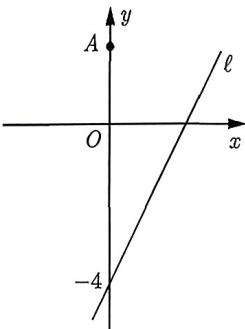
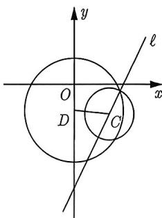

import Guide from '@/components/Guide.astro';
import Knowledge from '@/components/Knowledge.astro';
import Example from '@/components/Example.astro';
import Analysis from '@/components/Analysis.astro';
import Solution from '@/components/Solution.astro';
import Variant from '@/components/Variant.astro';
import Note from '@/components/Note.astro';
import Block from '@/components/Block.astro';

<Knowledge title="知识点 4.19">
设圆 $C_{1}$ 与圆 $C_{2}$ 的半径分别为 $r_{1}$ 和 $r_{2}$ ，圆心距为 d，则①两圆外离 $\Leftrightarrow d > r_{1} + r_{2}$ ; ②两圆外切 $\Leftrightarrow d = r_{1} + r_{2}$ ; ③两圆相交 $\Leftrightarrow |r_{1} - r_{2}| < d < r_{1} + r_{2}$ ; ④两圆内切 $\Leftrightarrow d = |r_{1} - r_{2}|$ ; ⑤两圆内含 $\Leftrightarrow d < |r_{1} - r_{2}|$ .
</Knowledge>

<Example title="例 4.40">
(2016 山东文 7) 已知圆 $M: x^{2} + y^{2} - 2ay = 0 (a > 0)$ 截直线 $x + y = 0$ 所得线段的长是 $2\sqrt{2}$ ，则圆 M 与圆 $N: (x - 1)^{2} + (y - 1)^{2} = 1$ 的位置关系是（）.
A. 内切    B. 相交    C. 外切    D. 相离

<Solution>
圆 $M$ 的标准方程为 $x^{2} + (y - a)^{2} = a^{2}(a > 0)$ , 则圆心为 $(0, a)$ , 半径 $r_{1} = a$ , 点 $M$ 到直线 $x + y = 0$ 的距离 $d = \frac{a}{\sqrt{2}}$ . 由题意得 $2\sqrt{a^2 - \frac{a^2}{2}} = 2\sqrt{2}$ , 解得 $a = 2$ , 即圆 $M$ 的圆心为 $M(0, 2)$ , 半径为 $r_{1} = 2$ , 圆 $N$ 的圆心为 $N(1, 1)$ , 半径为 $r_{2} = 1$ , 所以 $|MN| = \sqrt{2}$ . 因为 $1 = |r_{1} - r_{2}| < |MN| < r_{1} + r_{2} = 3$ , 所以两圆相交, 故选 B.
</Solution>
</Example>

直接考查圆与圆的位置关系很少, 很多时候都是通过其他方式给出圆与圆的位置关系, 比如两圆的公切线问题.

<Knowledge title="知识点 4.20">
两圆位置关系与公切线条数的关系:
(1) 两圆外离 $\Leftrightarrow$ 公切线有 4 条;
(2) 两圆外切 $\Leftrightarrow$ 公切线有 3 条;
(3) 两圆相交 $\Leftrightarrow$ 公切线有 2 条;
(4) 两圆内切 $\Leftrightarrow$ 公切线有 1 条;
(5) 两圆内含 $\Leftrightarrow$ 公切线有 0 条.
</Knowledge>

<Example title="例 4.41">
两圆 $x^{2} + y^{2} + 2ax + a^{2} - 4 = 0$ 和 $x^{2} + y^{2} - 4by - 1 + 4b^{2} = 0$ 恰有三条公切线, 若 $ab \neq 0$ , 则 $\frac{1}{a^{2}} + \frac{1}{b^{2}}$ 的最小值为 \_\_\_\_.

<Solution>
先把圆的方程写成标准形式, 即 $(x+a)^{2}+y^{2}=4$ 与 $x^{2}+(y-2b)^{2}=1$ . 由于两圆恰好有三条公切线, 由此可知两圆外切, 则两圆的圆心距离等于两圆的半径之和, 由此可得 $\sqrt{(0+a)^{2}+(2b-0)^{2}}=3$ , 整理得 $a^{2}+4b^{2}=9$ , 则

$$
\frac {1}{a ^ {2}} + \frac {1}{b ^ {2}} = \frac {1}{9} \left(\frac {1}{a ^ {2}} + \frac {1}{b ^ {2}}\right) (a ^ {2} + 4 b ^ {2}) = \frac {1}{9} \left(5 + \frac {a ^ {2}}{b ^ {2}} + \frac {4 b ^ {2}}{a ^ {2}}\right) \geqslant \frac {1}{9} \left(5 + 2 \sqrt {\frac {a ^ {2}}{b ^ {2}} \cdot \frac {4 b ^ {2}}{a ^ {2}}}\right) = 1,
$$

当且仅当 $\frac{a^2}{b^2} = \frac{4b^2}{a^2}$ 即 $a^2 = 3, b^2 = \frac{3}{2}$ 时取等号，故填1.
</Solution>
</Example>

<Variant title="变式 4.41.1">
（多选题）已知圆 $C_{1}: x^{2} + y^{2} = 4$ ，圆 $C_{2}: (x - 3)^{2} + (y + 4)^{2} = r^{2} (r > 0)$ ，则下列结论正确的是（）.

A. 若圆 $C_{1}$ 与圆 $C_{2}$ 有三条公切线，则 r = 3

B. 若圆 $C_{1}, C_{2}$ 相交，且原点到两圆公共弦所在直线的距离为 $\frac{2}{5}$ ，则 r = 5 或 $r = \sqrt{30}$ C. 若圆 $C_{1}, C_{2}$ 交于 A, B 两点，且过 A, B 两点的所有圆中周长最小的圆是 $C_{1}$ ，则 $r = \sqrt{29}$ D. 若圆 $C_{1}, C_{2}$ 交于 A, B 两点，且四边形 $AC_{1}BC_{2}$ 的面积为 $5\sqrt{3}$ ，则 $r = \sqrt{19}$ 或 $r = \sqrt{39}$
</Variant>

例 4.40 和例 4.41 都是在已知两个圆的前提下, 判断两个圆的位置关系或根据两个圆的位置关系求参数的范围, 而不少题为了增加难度, 会将圆隐藏起来, 比如下面的两道例题:

<Example title="例 4.42">
（2021 延边州一模）如果圆 $(x-a)^{2}+(y-a)^{2}=8$ 上总存在两个点到原点的距离为 $\sqrt{2}$ ，则实数 a 的取值范围是（）.
A. $(-3,3)$ B. $(-1,1)$ C. $(-3,1)$ D. $(-3,-1)\cup(1,3)$

<Solution>
设圆 $C_1:(x - a)^2 +(y - a)^2 = 8$ 上存在点 $P$ 到原点的距离为 $\sqrt{2}$ ，即 $|OP| = \sqrt{2}$ ，则 $P$ 也落在圆 $C_2:x^2 +y^2 = 2$ 上，从而 $\sqrt{8} -\sqrt{2} < |C_1C_2| <   \sqrt{8} +\sqrt{2}$ .又因为 $|C_1C_2| = \sqrt{(a - 0)^2 + (a - 0)^2} =$ $\sqrt{2} |a|$ ，所以 $2\sqrt{2} -\sqrt{2} <  \sqrt{2}|a| <   2\sqrt{2} +\sqrt{2},$ 解得 $1 <   |a| <   3,$ 即 $a\in (-3, - 1)\cup (1,3),$ 故选D.
</Solution>
</Example>

<Example title="例 4.43">
（2013 江苏 17(Ⅱ)）如图 4-12 所示，在平面直角坐标系 xOy 中，已知点 A(0,3)，直线 $\ell: y = 2x - 4$ 。设圆 C 的半径为 1，圆心在直线 $\ell$ 上。若圆 C 上存在点 M，使 $|MA| = 2|MO|$ ，求圆心 C 的横坐标 a 的取值范围。

<Solution>
由点 M 满足 $\left|MA\right|=2\left|MO\right|$ , $A(0,3)$ , $O(0,0)$ ，可知点 M 的轨迹为阿波罗尼斯圆，记为圆 D，如图 4-13 所示。设 $M(x,y)$ ，则 $\sqrt{x^{2}+(y-3)^{2}}=2\sqrt{x^{2}+y^{2}}$ ，整理得圆 D 的方程为 $x^{2}+(y+1)^{2}=4$ 。

  
图4-12

  
图4-13

由题意可知圆 $C$ 的圆心 $C$ 坐标为 $(a, 2a - 4)$ , 半径为 1, 因为点 $M$ 既在圆 $D$ 上, 也在圆 $C$ 上, 所以圆 $D$ 与圆 $C$ 相交或相切 (包括外切或内切), 则 $2 - 1 \leqslant DC \leqslant 2 + 1$ , 即 $1 \leqslant \sqrt{a^2 + (2a - 3)^2} \leqslant 3$ , 解得 $0 \leqslant a \leqslant \frac{12}{5}$ .
</Solution>
</Example>

<Variant title="变式 4.43.1">
（2023 大庆三模）已知直线 $\ell$ 是圆 $C:(x-2)^{2}+(y-1)^{2}=1$ 的切线，并且点 $B(3,4)$ 到直线 $\ell$ 的距离是 2，这样的直线 $\ell$ 有（）.
A. 1 条 B. 2 条 C. 3 条 D. 4 条
</Variant>

<Variant title="变式 4.43.2">
已知线段 AB 的长为 2, 动点 C 满足 $\overrightarrow{CA} \cdot \overrightarrow{CB} = \lambda (\lambda > -1)$ , 且点 C 总不在以点 B 为圆心, $\frac{1}{2}$ 为半径的圆内, 则 $\lambda$ 的最大值是 \_\_\_\_.
</Variant>

<Variant title="变式 4.43.3">
已知圆 $O: x^{2} + y^{2} = 1$ ，圆 $M: (x - a)^{2} + (y - a + 4)^{2} = 1$ 。若圆 M 上存在点 P，过点 P 作圆 O 的两条切线，切点为 A, B，使得 $\angle APB = 60^{\circ}$ ，则实数 a 的取值范围为 \_\_\_\_.
</Variant>
