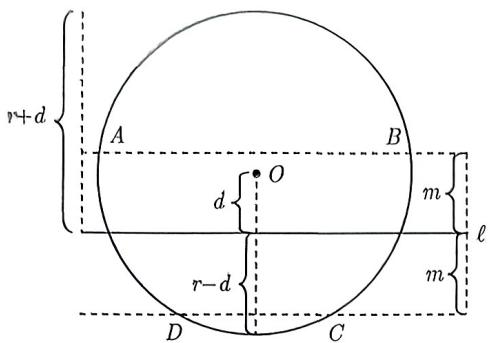
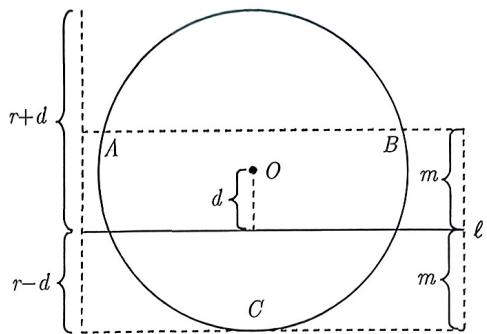
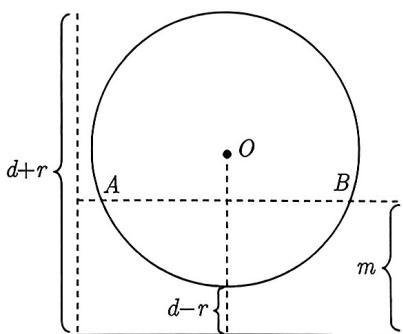
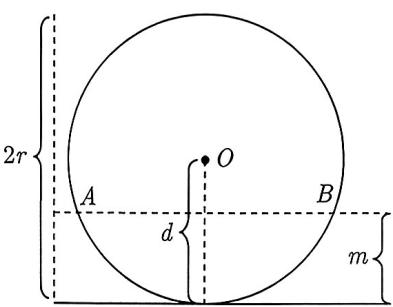
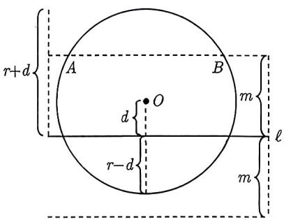

import Guide from '@/components/Guide.astro';
import Knowledge from '@/components/Knowledge.astro';
import Example from '@/components/Example.astro';
import Analysis from '@/components/Analysis.astro';
import Solution from '@/components/Solution.astro';
import Variant from '@/components/Variant.astro';
import Note from '@/components/Note.astro';
import Block from '@/components/Block.astro';
import Summary from '@/components/Summary.astro';

圆上点到直线 $\ell$ 距离为定值 $m$ 的个数问题是高考的热点和难点. 对于此类问题, 我们只需研究直线 $\ell$ 的两条等距线 (与 $\ell$ 的距离都为 $m$ ) 与圆的交点个数问题. 因为直线与圆的交点个数可能为 2, 1, 0, 所以圆上点到直线 $\ell$ 距离为定值 $m$ 的个数可能为 4, 3, 2, 1, 0.

下面我们依次来讨论每种情形的等价条件, 核心方法都一致. 首先, 我们找到与直线 $\ell$ 平行的两条切线以及它们与 $\ell$ 之间的距离. 然后, 根据点的个数来确定直线 $\ell$ 的两条等距线的位置.

(1) 若圆上有 4 个点到定直线的距离为定值 $m$ , 则 $\ell$ 与圆必相交且与它间距为 $m$ 的两条直线都与圆相交, 如图 4-30 所示, 这等价于 $\left\{ \begin{array}{l} m < r + d \\ m < r - d \end{array} \right.$ , 即等价于 $r > d + m$ .

(2) 若圆上恰有 3 个点到定直线的距离为定值 $m$ , 则 $\ell$ 与圆必相交且它的两条间距为 $m$ 的直线, 一条与圆相交, 另一条与圆相切, 如图 4-31 所示. 因此它等价于 $\left\{ \begin{array}{l} m = r - d \\ m < r + d \end{array} \right.$ , 即此时等价于 $r = d + m$ .

(3) 若圆上恰有 2 个点到定直线的距离为定值 $m$ , 这种情形比较复杂, 我们需要分类讨论.

① 若 $\ell$ 与圆相离, 则与 $\ell$ 间距为 $m$ 的两条直线中, 有一条与圆必相离. 又因为圆上恰有 2 个点到定直线的距离为 $m$ , 所以另外一条直线与圆相交, 如图 4-32 所示, 这等价于 $0 < d - r < m < d + r$ .

  
图4-30

  
图4-31

② 若 $\ell$ 与圆相切, 跟上面一模一样地讨论, 如图4-33所示, 故 $0 < m < 2r$ , 因为 $d = r$ , 故又可写成 $d - r < m < d + r$ .

③若 $\ell$ 与圆相交, 则与 $\ell$ 间距为 $m$ 的两条直线中, 一条与圆相交, 另一条与圆相离, 如图4-34所示, 故 $0 < r - d < m < r + d$ .

观察①②③, 发现它们可以统一成 $|r - d| < m < r + d$ , 等价于

$$
\left\{ \begin{array}{l l} - m <   r - d <   m \\ m <   r + d \end{array} \right. \Longrightarrow \left\{ \begin{array}{l l} d - m <   r <   m + d \\ r > m - d \end{array} \right. \Longrightarrow | d - m | <   r <   d + m.
$$

  
图4-32

  
图4-33

  
图4-34

(4) 若圆上恰有 1 个点到定直线的距离为定值 $m$ , 跟情形 (3) 类似地讨论可得 $m = d - r$ 或 $m = d + r$ , 即 $r = d - m$ 或 $r = m - d$ , 可以统一为 $r = |d - m|$ , 细节请同学们自己补充.

(5) 若圆上不存在点到定直线的距离为定值 $m$ , 跟情形 (3) 类似地讨论可得 $m < d - r$ 或 $m > d + r$ , 即 $r < d - m$ 或 $r < m - d$ , 可以统一为 $r < |d - m|$ , 细节也请同学们自己补充.

将上述的讨论总结如下:

设圆的半径为 r，圆心到直线的距离为 $d(d > 0)$ .

(1) 圆上有 4 个点到定直线的距离为定值 $m \Longleftrightarrow r > d + m$ .

(2) 圆上恰有 3 个点到定直线的距离为定值 $m \Longleftrightarrow r = d + m$ .

(3) 圆上恰有 2 个点到定直线的距离为定值 $m \Longleftrightarrow |d - m| < r < d + m$ .

(4) 圆上恰有 1 个点到定直线的距离为定值 $m \Longleftrightarrow r = |d - m|$ .

(5) 圆上不存在点到定直线的距离为定值 $m \Longleftrightarrow r < |d - m|$ .

