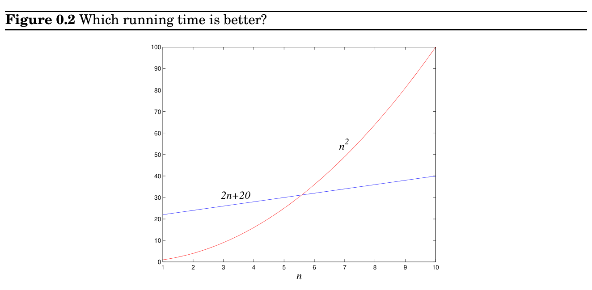

import Guide from '@/components/Guide.astro';
import Knowledge from '@/components/Knowledge.astro';
import Example from '@/components/Example.astro';
import Analysis from '@/components/Analysis.astro';
import Solution from '@/components/Solution.astro';
import Variant from '@/components/Variant.astro';
import Note from '@/components/Note.astro';
import Block from '@/components/Block.astro';
import Method from '@/components/Method.astro';
import Exercise from '@/components/Exercise.astro';

## 0.3 Big-O notation

for addition, which works on one digit at a time. Thus fib1, which performs about F_&#123;n&#125; additions, actually uses a number of basic steps roughly proportional to nF_&#123;n&#125;. Likewise, the number of steps taken by fib2 is proportional to n^&#123;2&#125;, still polynomial in n and therefore exponentially superior to fib1. This correction to the running time analysis does not diminish our breakthrough.

But can we do even better than fib2? Indeed we can: see Exercise 0.4.

We’ve just seen how sloppiness in the analysis of running times can lead to an unacceptable level of inaccuracy in the result. But the opposite danger is also present: it is possible to be too precise. An insightful analysis is based on the right simplifications.

Expressing running time in terms of basic computer steps is already a simplification. After all, the time taken by one such step depends crucially on the particular processor and even on details such as caching strategy (as a result of which the running time can differ subtly from one execution to the next). Accounting for these architecture-specific minutiae is a nightmarishly complex task and yields a result that does not generalize from one computer to the next. It therefore makes more sense to seek an uncluttered, machine-independent characterization of an algorithm’s efficiency. To this end, we will always express running time by counting the number of basic computer steps, as a function of the size of the input.

And this simplification leads to another. Instead of reporting that an algorithm takes, say, 5n^&#123;3&#125; + 4n + 3 steps on an input of size n, it is much simpler to leave out lower-order terms such as 4n and 3 (which become insignificant as n grows), and even the detail of the coefficient 5 in the leading term (computers will be five times faster in a few years anyway), and just say that the algorithm takes time O(n^&#123;3&#125;) (pronounced “big oh of n^&#123;3&#125;”).

It is time to define this notation precisely. In what follows, think of f(n) and g(n) as the running times of two algorithms on inputs of size n.

Let f(n) and g(n) be functions from positive integers to positive reals. We say f = O(g) (which means that “f grows no faster than g”) if there is a constant c > 0 such that f(n) ≤c · g(n).

Saying f = O(g) is a very loose analog of “f ≤g.” It differs from the usual notion of ≤ because of the constant c, so that for instance 10n = O(n). This constant also allows us to disregard what happens for small values of n. For example, suppose we are choosing between two algorithms for a particular computational task. One takes f_&#123;1&#125;(n) = n^&#123;2&#125; steps, while the other takes f_&#123;2&#125;(n) = 2n + 20 steps (Figure 0.2). Which is better? Well, this depends on the value of n. For n ≤5, f_&#123;1&#125; is smaller; thereafter, f_&#123;2&#125; is the clear winner. In this case, f_&#123;2&#125; scales much better as n grows, and therefore it is superior.

This superiority is captured by the big-O notation: f_&#123;2&#125; = O(f_&#123;1&#125;), because

f_&#123;2&#125;(n)

f_&#123;1&#125;(n) = 2n + 20

n^&#123;2&#125; ≤22

for all n; on the other hand, f_&#123;1&#125;̸ = O(f_&#123;2&#125;), since the ratio f_&#123;1&#125;(n)/f_&#123;2&#125;(n) = n^&#123;2&#125;/(2n + 20) can get arbitrarily large, and so no constant c will make the definition work.

Now another algorithm comes along, one that uses f_&#123;3&#125;(n) = n + 1 steps. Is this better than f_&#123;2&#125;? Certainly, but only by a constant factor. The discrepancy between f_&#123;2&#125; and f_&#123;3&#125; is tiny compared to the huge gap between f_&#123;1&#125; and f_&#123;2&#125;. In order to stay focused on the big picture, we treat functions as equivalent if they differ only by multiplicative constants.

Returning to the definition of big-O, we see that f_&#123;2&#125; = O(f_&#123;3&#125;):

f_&#123;2&#125;(n)

f_&#123;3&#125;(n) = 2n + 20

n + 1 ≤20,

and of course f_&#123;3&#125; = O(f_&#123;2&#125;), this time with c = 1.

Just as O(·) is an analog of ≤, we can also define analogs of ≥and = as follows:

f = Ω(g) means g = O(f)

f = Θ(g) means f = O(g) and f = Ω(g).

In the preceding example, f_&#123;2&#125; = Θ(f_&#123;3&#125;) and f_&#123;1&#125; = Ω(f_&#123;3&#125;).

Big-O notation lets us focus on the big picture. When faced with a complicated function like 3n^&#123;2&#125; + 4n + 5, we just replace it with O(f(n)), where f(n) is as simple as possible. In this particular example we’d use O(n^&#123;2&#125;), because the quadratic portion of the sum dominates the rest. Here are some commonsense rules that help simplify functions by omitting dominated terms:

1. Multiplicative constants can be omitted: 14n^&#123;2&#125; becomes n^&#123;2&#125;.

2. n^&#123;a&#125; dominates n^&#123;b&#125; if a > b: for instance, n^&#123;2&#125; dominates n.

3. Any exponential dominates any polynomial: 3^&#123;n&#125; dominates n^&#123;5&#125; (it even dominates 2^&#123;n&#125;).

4. Likewise, any polynomial dominates any logarithm: n dominates (log n)^&#123;3&#125;. This also means, for example, that n^&#123;2&#125; dominates n log n.

Don’t misunderstand this cavalier attitude toward constants. Programmers and algorithm developers are very interested in constants and would gladly stay up nights in order to make an algorithm run faster by a factor of 2. But understanding algorithms at the level of this book would be impossible without the simplicity afforded by big-O notation.
