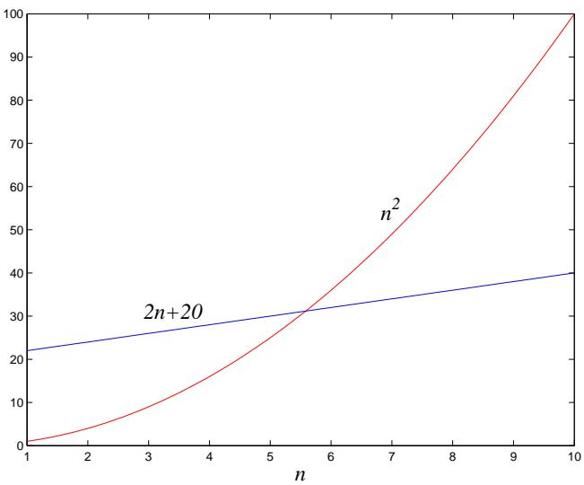

import Guide from '@/components/Guide.astro';
import Knowledge from '@/components/Knowledge.astro';
import Example from '@/components/Example.astro';
import Analysis from '@/components/Analysis.astro';
import Solution from '@/components/Solution.astro';
import Variant from '@/components/Variant.astro';
import Note from '@/components/Note.astro';
import Block from '@/components/Block.astro';
import Method from '@/components/Method.astro';
import Exercise from '@/components/Exercise.astro';

## 0.3 Big-O notation

We've just seen how sloppiness in the analysis of running times can lead to an unacceptable level of inaccuracy in the result. But the opposite danger is also present: it is possible to be too precise. An insightful analysis is based on the right simplifications.

Expressing running time in terms of basic computer steps is already a simplification. After all, the time taken by one such step depends crucially on the particular processor and even on details such as caching strategy (as a result of which the running time can differ subtly from one execution to the next). Accounting for these architecture-specific minutiae is a nightmarishly complex task and yields a result that does not generalize from one computer to the next. It therefore makes more sense to seek an uncluttered, machine-independent characterization of an algorithm's efficiency. To this end, we will always express running time by counting the number of basic computer steps, as a function of the size of the input.

And this simplification leads to another. Instead of reporting that an algorithm takes, say, $5 n ^ { 3 } + 4 n + 3$ steps on an input of size $n ,$ it is much simpler to leave out lower-order terms such as 4n and 3 (which become insignificant as $n$ grows), and even the detail of the coefficient 5 in the leading term (computers will be five times faster in a few years anyway), and just say that the algorithm takes time $O ( n ^ { 3 } )$ (pronounced $\mathrm { ^ { 6 6 } b i g }$ oh of $n ^ { 3 \mathfrak { s } } )$

It is time to define this notation precisely. In what follows, think of $f ( n )$ and $g ( n )$ as the running times of two algorithms on inputs of size $n .$ .

Let $f ( n )$ and $g ( n )$ be functions from positive integers to positive reals. We say $f = O ( g )$ (which means that $^ { 6 6 } f$ grows no faster than $\boldsymbol { g } ^ { \mathfrak { s } } )$ if there is a constant $c > 0$ such that $f ( n ) \leq c \cdot g ( n )$

Saying $f = O ( g )$ is a very loose analog of $^ { \ast } f \ \leq \ g . ^ { \ast }$ It differs from the usual notion $\mathbf { o f } \leq$ because of the constant $c ,$ so that for instance $1 0 n = O ( n )$ This constant also allows us to disregard what happens for small values of $n .$ . For example, suppose we are choosing between two algorithms for a particular computational task. One takes $f _ { 1 } ( n ) = n ^ { 2 }$ steps, while the other takes $f _ { 2 } ( n ) = 2 n + 2 0$ steps (Figure 0.2). Which is better? Well, this depends on the value of $n .$ . For $n \leq 5 , f _ { 1 }$ is smaller; thereafter, $f _ { 2 }$ is the clear winner. In this case, $f _ { 2 }$ scales much better as n grows, and therefore it is superior.

This superiority is captured by the big-O notation: $f _ { 2 } = O ( f _ { 1 } )$ , because

$$
\frac {f _ {2} (n)}{f _ {1} (n)} = \frac {2 n + 2 0}{n ^ {2}} \leq 2 2
$$

for all $n ;$ on the other hand, $f _ { 1 } \neq O ( f _ { 2 } )$ , since the ratio $f _ { 1 } ( n ) / f _ { 2 } ( n ) = n ^ { 2 } / ( 2 n + 2 0 )$ can get arbitrarily large, and so no constant c will make the definition work.

Figure 0.2 Which running time is better?

Now another algorithm comes along, one that uses $f _ { 3 } ( n ) = n + 1$ steps. Is this better than $f _ { 2 } { ? }$ Certainly, but only by a constant factor. The discrepancy between $f _ { 2 }$ and $f _ { 3 }$ is tiny compared to the huge gap between $f _ { 1 }$ and $f _ { 2 }$ . In order to stay focused on the big picture, we treat functions as equivalent if they differ only by multiplicative constants.

Returning to the definition of big-O, we see that $f _ { 2 } = O ( f _ { 3 } )$

$$
\frac {f _ {2} (n)}{f _ {3} (n)} = \frac {2 n + 2 0}{n + 1} \leq 2 0,
$$

and of course $f _ { 3 } = O ( f _ { 2 } )$ , this time with $c = 1$

Just as $O ( \cdot )$ is an analog $\mathbf { o f } \leq$ , we can also define analogs of $\geq$ and = as follows:

$$
\begin{array}{c} f = \Omega (g) \text { means } g = O (f) \\ f = \Theta (g) \text { means } f = O (g) \text { and } f = \Omega (g). \end{array}
$$

In the preceding example, $f _ { 2 } = \Theta ( f _ { 3 } )$ and $f _ { 1 } = \Omega ( f _ { 3 } )$

Big-O notation lets us focus on the big picture. When faced with a complicated function like $3 n ^ { 2 } + 4 n + 5$ , we just replace it with $O ( f ( n ) )$ , where $f ( n )$ is as simple as possible. In this particular example we'd use $O ( n ^ { 2 } )$ , because the quadratic portion of the sum dominates the rest. Here are some commonsense rules that help simplify functions by omitting dominated terms:

1. Multiplicative constants can be omitted: $1 4 n ^ { 2 }$ becomes $n ^ { 2 }$ .

2. $n ^ { a }$ dominates $n ^ { b } \operatorname { i f } a > b \colon$ for instance, $n ^ { 2 }$ dominates $n .$

3. Any exponential dominates any polynomial: $3 ^ { n }$ dominates $n ^ { 5 }$ (it even dominates $2 ^ { n } )$ .

4. Likewise, any polynomial dominates any logarithm: n dominates $( \log n ) ^ { 3 }$ . This also means, for example, that $n ^ { 2 }$ dominates n log n.

Don't misunderstand this cavalier attitude toward constants. Programmers and algorithm developers are very interested in constants and would gladly stay up nights in order to make an algorithm run faster by a factor of 2. But understanding algorithms at the level of this book would be impossible without the simplicity afforded by big-O notation.
