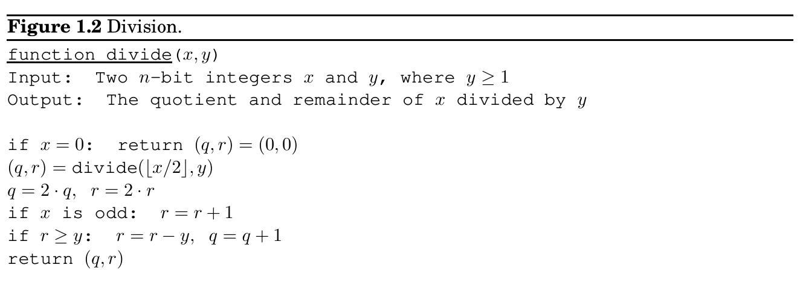
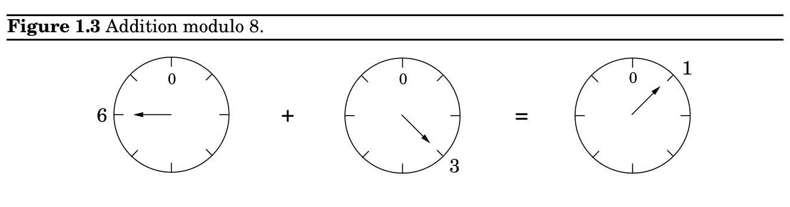
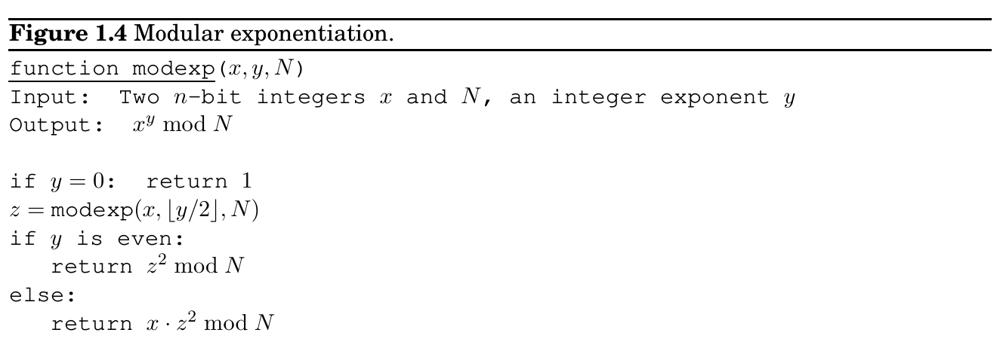
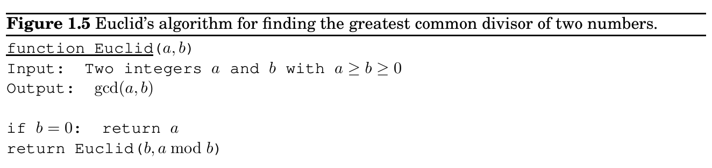
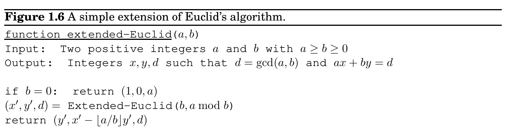

import Guide from '@/components/Guide.astro';
import Knowledge from '@/components/Knowledge.astro';
import Example from '@/components/Example.astro';
import Analysis from '@/components/Analysis.astro';
import Solution from '@/components/Solution.astro';
import Variant from '@/components/Variant.astro';
import Note from '@/components/Note.astro';
import Block from '@/components/Block.astro';
import Method from '@/components/Method.astro';
import Exercise from '@/components/Exercise.astro';

## 1.2 Modular arithmetic

Is this algorithm correct? The preceding recursive rule is transparently correct; so checking the correctness of the algorithm is merely a matter of verifying that it mimics the rule and that it handles the base case (y = 0) properly.

How long does the algorithm take? It must terminate after n recursive calls, because at each call y is halved—that is, its number of bits is decreased by one. And each recursive call requires these operations: a division by 2 (right shift); a test for odd/even (looking up the last bit); a multiplication by 2 (left shift); and possibly one addition, a total of O(n) bit operations. The total time taken is thus O(n^&#123;2&#125;), just as before.

Can we do better? Intuitively, it seems that multiplication requires adding about n multiples of one of the inputs, and we know that each addition is linear, so it would appear that n^&#123;2&#125;

bit operations are inevitable. Astonishingly, in Chapter 2 we’ll see that we can do significantly better!

Division is next. To divide an integer x by another integer y̸ = 0 means to find a quotient q and a remainder r, where x = yq + r and r &lt; y. We show the recursive version of division in Figure 1.2; like multiplication, it takes quadratic time. The analysis of this algorithm is the subject of Exercise 1.8.

With repeated addition or multiplication, numbers can get cumbersomely large. So it is fortunate that we reset the hour to zero whenever it reaches 24, and the month to January after every stretch of 12 months. Similarly, for the built-in arithmetic operations of computer processors, numbers are restricted to some size, 32 bits say, which is considered generous enough for most purposes.

For the applications we are working toward—primality testing and cryptography—it is necessary to deal with numbers that are significantly larger than 32 bits, but whose range is nonetheless limited.

Modular arithmetic is a system for dealing with restricted ranges of integers. We define x modulo N to be the remainder when x is divided by N; that is, if x = qN + r with 0 ≤r &lt; N,

then x modulo N is equal to r. This gives an enhanced notion of equivalence between numbers: x and y are congruent modulo N if they differ by a multiple of N, or in symbols,

x ≡y (mod N) ⇐⇒ N divides (x −y).

For instance, 253 ≡13 (mod 60) because 253 −13 is a multiple of 60; more familiarly, 253 minutes is 4 hours and 13 minutes. These numbers can also be negative, as in 59 ≡−1 (mod 60): when it is 59 minutes past the hour, it is also 1 minute short of the next hour.

One way to think of modular arithmetic is that it limits numbers to a predefined range &#123;0, 1, . . . , N −1&#125; and wraps around whenever you try to leave this range—like the hand of a clock (Figure 1.3).

Another interpretation is that modular arithmetic deals with all the integers, but divides them into N equivalence classes, each of the form &#123;i + kN : k ∈Z&#125; for some i between 0 and N −1. For example, there are three equivalence classes modulo 3:

· · · −9 −6 −3 0 3 6 9 · · · · · · −8 −5 −2 1 4 7 10 · · · · · · −7 −4 −1 2 5 8 11 · · ·

Any member of an equivalence class is substitutable for any other; when viewed modulo 3, the numbers 5 and 11 are no different. Under such substitutions, addition and multiplication remain well-defined:

Substitution rule If x ≡x^&#123;′&#125; (mod N) and y ≡y^&#123;′&#125; (mod N), then:

x + y ≡x^&#123;′&#125; + y^&#123;′&#125; (mod N) and xy ≡x^&#123;′&#125;y^&#123;′&#125; (mod N).

(See Exercise 1.9.) For instance, suppose you watch an entire season of your favorite television show in one sitting, starting at midnight. There are 25 episodes, each lasting 3 hours. At what time of day are you done? Answer: the hour of completion is (25 × 3) mod 24, which (since 25 ≡1 mod 24) is 1 × 3 = 3 mod 24, or three o’clock in the morning. It is not hard to check that in modular arithmetic, the usual associative, commutative, and distributive properties of addition and multiplication continue to apply, for instance:

x + (y + z) ≡(x + y) + z (mod N) Associativity

xy ≡yx (mod N) Commutativity

x(y + z) ≡xy + yz (mod N) Distributivity

Taken together with the substitution rule, this implies that while performing a sequence of arithmetic operations, it is legal to reduce intermediate results to their remainders modulo N at any stage. Such simplifications can be a dramatic help in big calculations. Witness, for instance:

2^&#123;345&#125; ≡(2^&#123;5&#125;)^&#123;69&#125; ≡32^&#123;69&#125; ≡1^&#123;69&#125; ≡1 (mod 31).

### Two’s complement

Modular arithmetic is nicely illustrated in two’s complement, the most common format for storing signed integers. It uses n bits to represent numbers in the range [−2^&#123;n&#125;−1, 2^&#123;n&#125;−1 −1] and is usually described as follows:

• Positive integers, in the range 0 to 2^&#123;n&#125;−1 −1, are stored in regular binary and have a leading bit of 0.

• Negative integers −x, with 1 ≤x ≤2^&#123;n&#125;−1, are stored by first constructing x in binary, then flipping all the bits, and finally adding 1. The leading bit in this case is 1.

(And the usual description of addition and multiplication in this format is even more arcane!)

Here’s a much simpler way to think about it: any number in the range −2^&#123;n&#125;−1 to 2^&#123;n&#125;−1 −1 is stored modulo 2^&#123;n&#125;. Negative numbers −x therefore end up as 2^&#123;n&#125; −x. Arithmetic operations like addition and subtraction can be performed directly in this format, ignoring any overflow bits that arise.

### 1.2.1 Modular addition and multiplication

To add two numbers x and y modulo N, we start with regular addition. Since x and y are each in the range 0 to N −1, their sum is between 0 and 2(N −1). If the sum exceeds N −1, we merely need to subtract off N to bring it back into the required range. The overall computation therefore consists of an addition, and possibly a subtraction, of numbers that never exceed 2N. Its running time is linear in the sizes of these numbers, in other words O(n), where n = ⌈log N⌉is the size of N; as a reminder, our convention is to use the letter n to denote input size.

To multiply two mod-N numbers x and y, we again just start with regular multiplication and then reduce the answer modulo N. The product can be as large as (N −1)^&#123;2&#125;, but this is still at most 2n bits long since log(N −1)^&#123;2&#125; = 2 log(N −1) ≤2n. To reduce the answer modulo N, we compute the remainder upon dividing it by N, using our quadratic-time division algorithm. Multiplication thus remains a quadratic operation.

Division is not quite so easy. In ordinary arithmetic there is just one tricky case—division by zero. It turns out that in modular arithmetic there are potentially other such cases as well, which we will characterize toward the end of this section. Whenever division is legal, however, it can be managed in cubic time, O(n^&#123;3&#125;).

To complete the suite of modular arithmetic primitives we need for cryptography, we next turn to modular exponentiation, and then to the greatest common divisor, which is the key to

division. For both tasks, the most obvious procedures take exponentially long, but with some ingenuity polynomial-time solutions can be found. A careful choice of algorithm makes all the difference.

### 1.2.2 Modular exponentiation

In the cryptosystem we are working toward, it is necessary to compute x^&#123;y&#125; mod N for values of x, y, and N that are several hundred bits long. Can this be done quickly?

The result is some number modulo N and is therefore itself a few hundred bits long. However, the raw value of x^&#123;y&#125; could be much, much longer than this. Even when x and y are just 20-bit numbers, x^&#123;y&#125; is at least (2^&#123;19&#125;)^&#123;(2&#125;^&#123;19&#125;) = 2^&#123;(19)(524288)&#125;, about 10 million bits long! Imagine what happens if y is a 500-bit number!

To make sure the numbers we are dealing with never grow too large, we need to perform all intermediate computations modulo N. So here’s an idea: calculate x^&#123;y&#125; mod N by repeatedly multiplying by x modulo N. The resulting sequence of intermediate products,

x mod N →x^&#123;2&#125; mod N →x^&#123;3&#125; mod N →· · · →x^&#123;y&#125; mod N,

consists of numbers that are smaller than N, and so the individual multiplications do not take too long. But there’s a problem: if y is 500 bits long, we need to perform y −1 ≈2^&#123;500&#125;

multiplications! This algorithm is clearly exponential in the size of y.

Luckily, we can do better: starting with x and squaring repeatedly modulo N, we get

x mod N →x^&#123;2&#125; mod N →x^&#123;4&#125; mod N →x^&#123;8&#125; mod N →· · · →x^&#123;2&#125;^&#123;⌊&#125;log y⌋mod N.

Each takes just O(log^&#123;2&#125; N) time to compute, and in this case there are only log y multiplications. To determine x^&#123;y&#125; mod N, we simply multiply together an appropriate subset of these powers, those corresponding to 1’s in the binary representation of y. For instance,

x^&#123;25&#125; = x^&#123;11001&#125;_&#123;2&#125; = x^&#123;10000&#125;_&#123;2&#125; · x^&#123;1000&#125;_&#123;2&#125; · x^&#123;1&#125;_&#123;2&#125; = x^&#123;16&#125; · x^&#123;8&#125; · x^&#123;1&#125;.

A polynomial-time algorithm is finally within reach!

We can package this idea in a particularly simple form: the recursive algorithm of Figure 1.4, which works by executing, modulo N, the self-evident rule

x^&#123;y&#125; =

 (x^&#123;⌊&#125;y/2⌋)^&#123;2&#125; if y is even x · (x^&#123;⌊&#125;y/2⌋)^&#123;2&#125; if y is odd.

In doing so, it closely parallels our recursive multiplication algorithm (Figure 1.1). For instance, that algorithm would compute the product x · 25 by an analogous decomposition to the one we just saw: x · 25 = x · 16 + x · 8 + x · 1. And whereas for multiplication the terms x · 2^&#123;i&#125;

come from repeated doubling, for exponentiation the corresponding terms x^&#123;2&#125;^&#123;i&#125; are generated by repeated squaring.

Let n be the size in bits of x, y, and N (whichever is largest of the three). As with multiplication, the algorithm will halt after at most n recursive calls, and during each call it multiplies n-bit numbers (doing computation modulo N saves us here), for a total running time of O(n^&#123;3&#125;).

### 1.2.3 Euclid’s algorithm for greatest common divisor

Our next algorithm was discovered well over 2000 years ago by the mathematician Euclid, in ancient Greece. Given two integers a and b, it finds the largest integer that divides both of them, known as their greatest common divisor (gcd).

The most obvious approach is to first factor a and b, and then multiply together their common factors. For instance, 1035 = 3^&#123;2&#125; · 5 · 23 and 759 = 3 · 11 · 23, so their gcd is 3 · 23 = 69. However, we have no efficient algorithm for factoring. Is there some other way to compute greatest common divisors?

Euclid’s algorithm uses the following simple formula.

Euclid’s rule If x and y are positive integers with x ≥y, then gcd(x, y) = gcd(x mod y, y).

Proof. It is enough to show the slightly simpler rule gcd(x, y) = gcd(x −y, y) from which the one stated can be derived by repeatedly subtracting y from x.

Here it goes. Any integer that divides both x and y must also divide x −y, so gcd(x, y) ≤ gcd(x −y, y). Likewise, any integer that divides both x −y and y must also divide both x and y, so gcd(x, y) ≥gcd(x −y, y).

Euclid’s rule allows us to write down an elegant recursive algorithm (Figure 1.5), and its correctness follows immediately from the rule. In order to figure out its running time, we need to understand how quickly the arguments (a, b) decrease with each successive recursive call. In a single round, arguments (a, b) become (b, a mod b): their order is swapped, and the larger of them, a, gets reduced to a mod b. This is a substantial reduction.

Lemma If a ≥b, then a mod b &lt; a/2.

Proof. Witness that either b ≤a/2 or b > a/2. These two cases are shown in the following figure. If b ≤a/2, then we have a mod b &lt; b ≤a/2; and if b > a/2, then a mod b = a −b &lt; a/2.

a a/2 b a

a mod b

b

a mod b

a/2

This means that after any two consecutive rounds, both arguments, a and b, are at the very least halved in value—the length of each decreases by at least one bit. If they are initially n-bit integers, then the base case will be reached within 2n recursive calls. And since each call involves a quadratic-time division, the total time is O(n^&#123;3&#125;).

### 1.2.4 An extension of Euclid’s algorithm

A small extension to Euclid’s algorithm is the key to dividing in the modular world.

To motivate it, suppose someone claims that d is the greatest common divisor of a and b: how can we check this? It is not enough to verify that d divides both a and b, because this only shows d to be a common factor, not necessarily the largest one. Here’s a test that can be used if d is of a particular form.

Lemma If d divides both a and b, and d = ax + by for some integers x and y, then necessarily d = gcd(a, b).

Proof. By the first two conditions, d is a common divisor of a and b and so it cannot exceed the greatest common divisor; that is, d ≤gcd(a, b). On the other hand, since gcd(a, b) is a common divisor of a and b, it must also divide ax + by = d, which implies gcd(a, b) ≤d. Putting these together, d = gcd(a, b).

So, if we can supply two numbers x and y such that d = ax + by, then we can be sure d = gcd(a, b). For instance, we know gcd(13, 4) = 1 because 13 · 1 + 4 · (−3) = 1. But when can we find these numbers: under what circumstances can gcd(a, b) be expressed in this checkable form? It turns out that it always can. What is even better, the coefficients x and y can be found by a small extension to Euclid’s algorithm; see Figure 1.6.

Lemma For any positive integers a and b, the extended Euclid algorithm returns integers x, y, and d such that gcd(a, b) = d = ax + by.

Proof. The first thing to confirm is that if you ignore the x’s and y’s, the extended algorithm is exactly the same as the original. So, at least we compute d = gcd(a, b).

For the rest, the recursive nature of the algorithm suggests a proof by induction. The recursion ends when b = 0, so it is convenient to do induction on the value of b.

The base case b = 0 is easy enough to check directly. Now pick any larger value of b. The algorithm finds gcd(a, b) by calling gcd(b, a mod b). Since a mod b &lt; b, we can apply the inductive hypothesis to this recursive call and conclude that the x^&#123;′&#125; and y^&#123;′&#125; it returns are correct:

gcd(b, a mod b) = bx^&#123;′&#125; + (a mod b)y^&#123;′&#125;.

Writing (a mod b) as (a −⌊a/b⌋b), we find

d = gcd(a, b) = gcd(b, a mod b) = bx^&#123;′&#125;+(a mod b)y^&#123;′&#125; = bx^&#123;′&#125;+(a−⌊a/b⌋b)y^&#123;′&#125; = ay^&#123;′&#125;+b(x^&#123;′&#125;−⌊a/b⌋y^&#123;′&#125;).

Therefore d = ax+by with x = y^&#123;′&#125; and y = x^&#123;′&#125;−⌊a/b⌋y^&#123;′&#125;, thus validating the algorithm’s behavior on input (a, b).

Example. To compute gcd(25, 11), Euclid’s algorithm would proceed as follows:

25

= 2 · 11

+ 3

11

= 3 · 3

+ 2

3

= 1 · 2

+ 1

2

= 2 · 1

+ 0

(at each stage, the gcd computation has been reduced to the underlined numbers). Thus gcd(25, 11) = gcd(11, 3) = gcd(3, 2) = gcd(2, 1) = gcd(1, 0) = 1.

To find x and y such that 25x + 11y = 1, we start by expressing 1 in terms of the last pair (1, 0). Then we work backwards and express it in terms of (2, 1), (3, 2), (11, 3), and finally (25, 11). The first step is:

1 = 1

−0

.

To rewrite this in terms of (2, 1), we use the substitution 0 = 2 −2 · 1 from the last line of the gcd calculation to get:

1 = 1

−(2

−2 · 1

) = −1 · 2

+ 3 · 1

.

The second-last line of the gcd calculation tells us that 1 = 3 −1 · 2. Substituting:

1 = −1 · 2

+ 3(3

−1 · 2

) = 3 · 3

−4 · 2

.

Continuing in this same way with substitutions 2 = 11 −3 · 3 and 3 = 25 −2 · 11 gives:

1 = 3 · 3

−4(11

−3 · 3

) = −4 · 11

+ 15 · 3

= −4 · 11

+ 15(25

−2 · 11

) = 15 · 25

−34 · 11

.

We’re done: 15 · 25 −34 · 11 = 1, so x = 15 and y = −34.

### 1.2.5 Modular division

In real arithmetic, every number a̸ = 0 has an inverse, 1/a, and dividing by a is the same as multiplying by this inverse. In modular arithmetic, we can make a similar definition.

We say x is the multiplicative inverse of a modulo N if ax ≡1 (mod N).

There can be at most one such x modulo N (Exercise 1.23), and we shall denote it by a^&#123;−&#125;1. However, this inverse does not always exist! For instance, 2 is not invertible modulo 6: that is, 2x̸ ≡1 mod 6 for every possible choice of x. In this case, a and N are both even and thus then a mod N is always even, since a mod N = a −kN for some k. More generally, we can be certain that gcd(a, N) divides ax mod N, because this latter quantity can be written in the form ax + kN. So if gcd(a, N) > 1, then ax̸ ≡1 mod N, no matter what x might be, and therefore a cannot have a multiplicative inverse modulo N.

In fact, this is the only circumstance in which a is not invertible. When gcd(a, N) = 1 (we say a and N are relatively prime), the extended Euclid algorithm gives us integers x and y such that ax + Ny = 1, which means that ax ≡1 (mod N). Thus x is a’s sought inverse.

Example. Continuing with our previous example, suppose we wish to compute 11^&#123;−&#125;1 mod 25. Using the extended Euclid algorithm, we find that 15 · 25 −34 · 11 = 1. Reducing both sides modulo 25, we have −34 · 11 ≡1 mod 25. So −34 ≡16 mod 25 is the inverse of 11 mod 25.

Modular division theorem For any a mod N, a has a multiplicative inverse modulo N if and only if it is relatively prime to N. When this inverse exists, it can be found in time O(n^&#123;3&#125;) (where as usual n denotes the number of bits of N) by running the extended Euclid algorithm.

This resolves the issue of modular division: when working modulo N, we can divide by numbers relatively prime to N—and only by these. And to actually carry out the division, we multiply by the inverse.

### Is your social security number a prime?

The numbers 7, 17, 19, 71, and 79 are primes, but how about 717-19-7179? Telling whether a reasonably large number is a prime seems tedious because there are far too many candidate factors to try. However, there are some clever tricks to speed up the process. For instance, you can omit even-valued candidates after you have eliminated the number 2. You can actually omit all candidates except those that are themselves primes.

In fact, a little further thought will convince you that you can proclaim N a prime as soon as you have rejected all candidates up to

√

N, for if N can indeed be factored as N = K · L, then it is impossible for both factors to exceed

√

N. We seem to be making progress! Perhaps by omitting more and more candidate factors, a truly efficient primality test can be discovered.

Unfortunately, there is no fast primality test down this road. The reason is that we have been trying to tell if a number is a prime by factoring it. And factoring is a hard problem!

Modern cryptography, as well as the balance of this chapter, is about the following important idea: factoring is hard and primality is easy. We cannot factor large numbers, but we can easily test huge numbers for primality! (Presumably, if a number is composite, such a test will detect this without finding a factor.)
