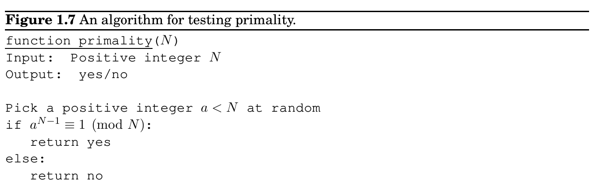
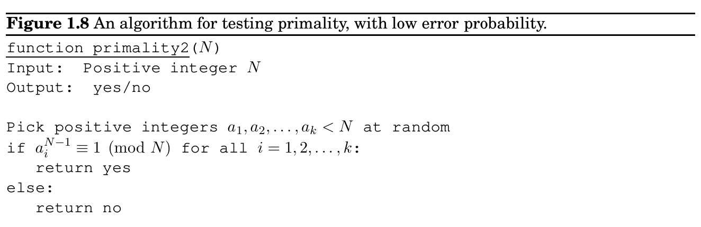

import Guide from '@/components/Guide.astro';
import Knowledge from '@/components/Knowledge.astro';
import Example from '@/components/Example.astro';
import Analysis from '@/components/Analysis.astro';
import Solution from '@/components/Solution.astro';
import Variant from '@/components/Variant.astro';
import Note from '@/components/Note.astro';
import Block from '@/components/Block.astro';
import Method from '@/components/Method.astro';
import Exercise from '@/components/Exercise.astro';

## 1.3 Primality testing

Is there some litmus test that will tell us whether a number is prime without actually trying to factor the number? We place our hopes in a theorem from the year 1640.

Fermat’s little theorem If p is prime, then for every 1 ≤a &lt; p,

a^&#123;p&#125;−1 ≡1 (mod p).

Proof. Let S be the nonzero integers modulo p; that is, S = &#123;1, 2, . . . , p −1&#125;. Here’s the crucial observation: the effect of multiplying these numbers by a (modulo p) is simply to permute them. For instance, here’s a picture of the case a = 3, p = 7:

6

5

4

3

2

1 1

2

3

4

5

6

Let’s carry this example a bit further. From the picture, we can conclude

&#123;1, 2, . . . , 6&#125; = &#123;3 · 1 mod 7, 3 · 2 mod 7, . . . , 3 · 6 mod 7&#125;.

Multiplying all the numbers in each representation then gives 6! ≡3^&#123;6&#125;·6! (mod 7), and dividing by 6! we get 3^&#123;6&#125; ≡1 (mod 7), exactly the result we wanted in the case a = 3, p = 7.

Now let’s generalize this argument to other values of a and p, with S = &#123;1, 2, . . . , p −1&#125;. We’ll prove that when the elements of S are multiplied by a modulo p, the resulting numbers are all distinct and nonzero. And since they lie in the range [1, p −1], they must simply be a permutation of S.

The numbers a · i mod p are distinct because if a · i ≡a · j (mod p), then dividing both sides by a gives i ≡j (mod p). They are nonzero because a · i ≡0 similarly implies i ≡0. (And we can divide by a, because by assumption it is nonzero and therefore relatively prime to p.)

We now have two ways to write set S:

S = &#123;1, 2, . . . , p −1&#125; = &#123;a · 1 mod p, a · 2 mod p, . . . , a · (p −1) mod p&#125;.

We can multiply together its elements in each of these representations to get

(p −1)! ≡a^&#123;p&#125;−1 · (p −1)! (mod p).

Dividing by (p −1)! (which we can do because it is relatively prime to p, since p is assumed prime) then gives the theorem.

This theorem suggests a “factorless” test for determining whether a number N is prime:

Is a^&#123;N&#125;−1 ≡1 mod N? Pick some a

“prime”

“composite”

Fermat’s test

Pass

Fail

The problem is that Fermat’s theorem is not an if-and-only-if condition; it doesn’t say what happens when N is not prime, so in these cases the preceding diagram is questionable. In fact, it is possible for a composite number N to pass Fermat’s test (that is, a^&#123;N&#125;−1 ≡1 mod N) for certain choices of a. For instance, 341 = 11 · 31 is not prime, and yet 2^&#123;340&#125; ≡1 mod 341. Nonetheless, we might hope that for composite N, most values of a will fail the test. This is indeed true, in a sense we will shortly make precise, and motivates the algorithm of Figure 1.7: rather than fixing an arbitrary value of a in advance, we should choose it randomly from &#123;1, . . . , N −1&#125;.

In analyzing the behavior of this algorithm, we first need to get a minor bad case out of the way. It turns out that certain extremely rare composite numbers N, called Carmichael numbers, pass Fermat’s test for all a relatively prime to N. On such numbers our algorithm will fail; but they are pathologically rare, and we will later see how to deal with them (page 36), so let’s ignore these numbers for the time being.

In a Carmichael-free universe, our algorithm works well. Any prime number N will of course pass Fermat’s test and produce the right answer. On the other hand, any nonCarmichael composite number N must fail Fermat’s test for some value of a; and as we will now show, this implies immediately that N fails Fermat’s test for at least half the possible values of a!

Lemma If a^&#123;N&#125;−1̸ ≡1 mod N for some a relatively prime to N, then it must hold for at least half the choices of a &lt; N.

Proof. Fix some value of a for which a^&#123;N&#125;−1̸ ≡1 mod N. The key is to notice that every element b &lt; N that passes Fermat’s test with respect to N (that is, b^&#123;N&#125;−1 ≡1 mod N) has a twin, a · b, that fails the test:

(a · b)^&#123;N&#125;−1 ≡a^&#123;N&#125;−1 · b^&#123;N&#125;−1 ≡a^&#123;N&#125;−1̸ ≡1 mod N.

Moreover, all these elements a · b, for fixed a but different choices of b, are distinct, for the same reason a · i̸ ≡a · j in the proof of Fermat’s test: just divide by a.

Fail Pass

The set &#123;1, 2, . . . , N −1&#125;

b a · b

The one-to-one function b 7→a · b shows that at least as many elements fail the test as pass it.

### Hey, that was group theory!

For any integer N, the set of all numbers mod N that are relatively prime to N constitute what mathematicians call a group:

• There is a multiplication operation defined on this set.

• The set contains a neutral element (namely 1: any number multiplied by this remains unchanged).

• All elements have a well-defined inverse.

This particular group is called the multiplicative group of N, usually denoted Z^&#123;∗&#125;

N. Group theory is a very well developed branch of mathematics. One of its key concepts is that a group can contain a subgroup—a subset that is a group in and of itself. And an important fact about a subgroup is that its size must divide the size of the whole group.

Consider now the set B = &#123;b : b^&#123;N&#125;−1 ≡1 mod N&#125;. It is not hard to see that it is a subgroup of Z^&#123;∗&#125;

N (just check that B is closed under multiplication and inverses). Thus the size of B must divide that of Z^&#123;∗&#125;

N. Which means that if B doesn’t contain all of Z^&#123;∗&#125;

N, the next largest size it can have is |Z^&#123;∗&#125;

N|/2.

We are ignoring Carmichael numbers, so we can now assert

If N is prime, then a^&#123;N&#125;−1 ≡1 mod N for all a &lt; N. If N is not prime, then a^&#123;N&#125;−1 ≡1 mod N for at most half the values of a &lt; N.

The algorithm of Figure 1.7 therefore has the following probabilistic behavior.

Pr(Algorithm 1.7 returns yes when N is prime) = 1

Pr(Algorithm 1.7 returns yes when N is not prime) ≤ 1

2

We can reduce this one-sided error by repeating the procedure many times, by randomly picking several values of a and testing them all (Figure 1.8).

Pr(Algorithm 1.8 returns yes when N is not prime) ≤ 1

2^&#123;k&#125;

This probability of error drops exponentially fast, and can be driven arbitrarily low by choosing k large enough. Testing k = 100 values of a makes the probability of failure at most 2^&#123;−&#125;100, which is miniscule: far less, for instance, than the probability that a random cosmic ray will sabotage the computer during the computation!

### Carmichael numbers

The smallest Carmichael number is 561. It is not a prime: 561 = 3 · 11 · 17; yet it fools the Fermat test, because a^&#123;560&#125; ≡1 (mod 561) for all values of a relatively prime to 561. For a long time it was thought that there might be only finitely many numbers of this type; now we know they are infinite, but exceedingly rare.

There is a way around Carmichael numbers, using a slightly more refined primality test due to Rabin and Miller. Write N −1 in the form 2^&#123;t&#125;u. As before we’ll choose a random base a and check the value of a^&#123;N&#125;−1 mod N. Perform this computation by first determining a^&#123;u&#125; mod N and then repeatedly squaring, to get the sequence:

a^&#123;u&#125; mod N, a^&#123;2&#125;u mod N, . . . , a^&#123;2&#125;^&#123;t&#125;u = a^&#123;N&#125;−1 mod N.

If a^&#123;N&#125;−1̸ ≡1 mod N, then N is composite by Fermat’s little theorem, and we’re done. But if a^&#123;N&#125;−1 ≡1 mod N, we conduct a little follow-up test: somewhere in the preceding sequence, we ran into a 1 for the first time. If this happened after the first position (that is, if a^&#123;u&#125; mod N̸ = 1), and if the preceding value in the list is not −1 mod N, then we declare N composite. In the latter case, we have found a nontrivial square root of 1 modulo N: a number that is not ±1 mod N but that when squared is equal to 1 mod N. Such a number can only exist if N is composite (Exercise 1.40). It turns out that if we combine this square-root check with our earlier Fermat test, then at least three-fourths of the possible values of a between 1 and N −1 will reveal a composite N, even if it is a Carmichael number.

### 1.3.1 Generating random primes

We are now close to having all the tools we need for cryptographic applications. The final piece of the puzzle is a fast algorithm for choosing random primes that are a few hundred bits

long. What makes this task quite easy is that primes are abundant—a random n-bit number has roughly a one-in-n chance of being prime (actually about 1/(ln 2^&#123;n&#125;) ≈1.44/n). For instance, about 1 in 20 social security numbers is prime!

Lagrange’s prime number theorem Let π(x) be the number of primes ≤x. Then π(x) ≈ x/(ln x), or more precisely,

lim x→∞

π(x)

(x/ ln x) = 1.

Such abundance makes it simple to generate a random n-bit prime:

• Pick a random n-bit number N.

• Run a primality test on N.

• If it passes the test, output N; else repeat the process.

How fast is this algorithm? If the randomly chosen N is truly prime, which happens with probability at least 1/n, then it will certainly pass the test. So on each iteration, this procedure has at least a 1/n chance of halting. Therefore on average it will halt within O(n) rounds (Exercise 1.34).

Next, exactly which primality test should be used? In this application, since the numbers we are testing for primality are chosen at random rather than by an adversary, it is sufficient to perform the Fermat test with base a = 2 (or to be really safe, a = 2, 3, 5), because for random numbers the Fermat test has a much smaller failure probability than the worst-case 1/2 bound that we proved earlier. Numbers that pass this test have been jokingly referred to as “industrial grade primes.” The resulting algorithm is quite fast, generating primes that are hundreds of bits long in a fraction of a second on a PC.

The important question that remains is: what is the probability that the output of the algorithm is really prime? To answer this we must first understand how discerning the Fermat test is. As a concrete example, suppose we perform the test with base a = 2 for all numbers N ≤25×10^&#123;9&#125;. In this range, there are about 10^&#123;9&#125; primes, and about 20,000 composites that pass the test (see the following figure). Thus the chance of erroneously outputting a composite is approximately 20,000/10^&#123;9&#125; = 2 × 10^&#123;−&#125;5. This chance of error decreases rapidly as the length of the numbers involved is increased (to the few hundred digits we expect in our applications).











Fermat test (base a = 2) Composites

Pass

Fail

≈10^&#123;9&#125; primes

≈20,000 composites

Before primality test: all numbers ≤25 × 10^&#123;9&#125; After primality test

Primes
