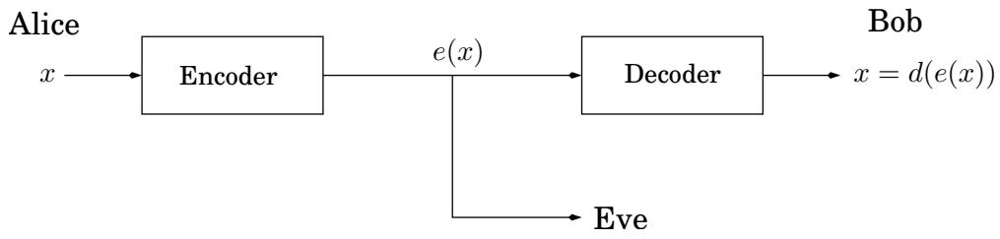
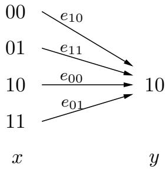

import Guide from '@/components/Guide.astro';
import Knowledge from '@/components/Knowledge.astro';
import Example from '@/components/Example.astro';
import Analysis from '@/components/Analysis.astro';
import Solution from '@/components/Solution.astro';
import Variant from '@/components/Variant.astro';
import Note from '@/components/Note.astro';
import Block from '@/components/Block.astro';
import Method from '@/components/Method.astro';
import Exercise from '@/components/Exercise.astro';

## 1.4 Cryptography

Our next topic, the Rivest-Shamir-Adelman (RSA) cryptosystem, uses all the ideas we have introduced in this chapter! It derives very strong guarantees of security by ingeniously exploiting the wide gulf between the polynomial-time computability of certain number-theoretic tasks (modular exponentiation, greatest common divisor, primality testing) and the intractabil ity of others (factoring).

The typical setting for cryptography can be described via a cast of three characters: Alice and Bob, who wish to communicate in private, and Eve, an eavesdropper who will go to great lengths to find out what they are saying. For concreteness, let's say Alice wants to send a specific message x, written in binary (why not), to her friend Bob. She encodes it as e(x), sends it over, and then Bob applies his decryption function d( ) to decode it: $d ( e ( x ) ) = x$ . Here e( ) and d( ) are appropriate transformations of the messages.



Alice and Bob are worried that the eavesdropper, Eve, will intercept e(x): for instance, she might be a sniffer on the network. But ideally the encryption function e( ) is so chosen that without knowing d( ), Eve cannot do anything with the information she has picked up. In other words, knowing e(x) tells her little or nothing about what x might be.

For centuries, cryptography was based on what we now call private-key protocols. In such a scheme, Alice and Bob meet beforehand and together choose a secret codebook, with which they encrypt all future correspondence between them. Eve's only hope, then, is to collect some encoded messages and use them to at least partially figure out the codebook.

Public-key schemes such as RSA are significantly more subtle and tricky: they allow Alice to send Bob a message without ever having met him before. This almost sounds impossible, because in this scenario there is a symmetry between Bob and Eve: why should Bob have any advantage over Eve in terms of being able to understand Alice's message? The central idea behind the RSA cryptosystem is that using the dramatic contrast between factoring and primality, Bob is able to implement a digital lock, to which only he has the key. Now by making this digital lock public, he gives Alice a way to send him a secure message, which only he can open. Moreover, this is exactly the scenario that comes up in Internet commerce, for example, when you wish to send your credit card number to some company over the Internet.

In the RSA protocol, Bob need only perform the simplest of calculations, such as multiplication, to implement his digital lock. Similarly Alice and Bob need only perform simple calculations to lock and unlock the message respectively—operations that any pocket computing device could handle. By contrast, to unlock the message without the key, Eve must perform operations like factoring large numbers, which requires more computational power than would be afforded by the world's most powerful computers combined. This compelling guarantee of security explains why the RSA cryptosystem is such a revolutionary development in cryptography.

## An application of number theory?

The renowned mathematician G. H. Hardy once declared of his work: “I have never done anything useful.” Hardy was an expert in the theory of numbers, which has long been regarded as one of the purest areas of mathematics, untarnished by material motivation and consequence. Yet the work of thousands of number theorists over the centuries, Hardy's included, is now crucial to the operation of Web browsers and cell phones and to the security of financial transactions worldwide.

## 1.4.1 Private-key schemes: one-time pad and AES

If Alice wants to transmit an important private message to Bob, it would be wise of her to scramble it with an encryption function,

$$
e: \langle \text { messages } \rangle \to \langle \text { encoded   messages } \rangle .
$$

Of course, this function must be invertible—for decoding to be possible—and is therefore a bijection. Its inverse is the decryption function d( ).

In the one-time pad, Alice and Bob meet beforehand and secretly choose a binary string r of the same length—say, n bits—as the important message x that Alice will later send.

Alice's encryption function is then a bitwise exclusive-or, $e _ { r } ( x ) = x \oplus r \colon$ each position in the encoded message is the exclusive-or of the corresponding positions in x and r. For instance, if $r = 0 1 1 1 0 0 1 0$ , then the message 11110000 is scrambled thus:

$$
e _ {r} (1 1 1 1 0 0 0 0) = 1 1 1 1 0 0 0 0 \oplus 0 1 1 1 0 0 1 0 = 1 0 0 0 0 0 1 0.
$$

This function $e _ { r }$ is a bijection from n-bit strings to n-bit strings, as evidenced by the fact that it is its own inverse!

$$
e _ {r} (e _ {r} (x)) = (x \oplus r) \oplus r = x \oplus (r \oplus r) = x \oplus \overline {{0}} = x,
$$

where $\overline { { 0 } }$ is the string of all zeros. Thus Bob can decode Alice's transmission by applying the same encryption function a second time: $d _ { r } ( y ) = y \oplus r$

How should Alice and Bob choose r for this scheme to be secure? Simple: they should pick r at random, flipping a coin for each bit, so that the resulting string is equally likely to be any element of $\{ 0 , 1 \} ^ { n }$ . This will ensure that if Eve intercepts the encoded message $\boldsymbol { y } = \boldsymbol { e } _ { r } ( \boldsymbol { x } )$ , she gets no information about $x .$ Suppose, for example, that Eve finds out $y = 1 0 ;$ what can she deduce? She doesn't know $^ { r , }$ and the possible values it can take all correspond to different original messages x:



So given what Eve knows, all possibilities for x are equally likely!

The downside of the one-time pad is that it has to be discarded after use, hence the name. A second message encoded with the same pad would not be secure, because if Eve knew x  r and $z \oplus r$ for two messages x and $z ,$ then she could take the exclusive-or to get $x \oplus z ,$ which might be important information—for example, (1) it reveals whether the two messages begin or end the same, and (2) if one message contains a long sequence of zeros (as could easily be the case if the message is an image), then the corresponding part of the other message will be exposed. Therefore the random string that Alice and Bob share has to be the combined length of all the messages they will need to exchange.

The one-time pad is a toy cryptographic scheme whose behavior and theoretical properties are completely clear. At the other end of the spectrum lies the advanced encryption standard (AES), a very widely used cryptographic protocol that was approved by the U.S. National Institute of Standards and Technologies in 2001. AES is once again private-key: Alice and Bob have to agree on a shared random string r. But this time the string is of a small fixed size, 128 to be precise (variants with 192 or 256 bits also exist), and specifies a bijection $e _ { r }$ from 128-bit strings to 128-bit strings. The crucial difference is that this function can be used repeatedly, so for instance a long message can be encoded by splitting it into segments of 128 bits and applying $e _ { r }$ to each segment.

The security of AES has not been rigorously established, but certainly at present the general public does not know how to break the code—to recover x from $e _ { r } ( x )$ —except using techniques that are not very much better than the brute-force approach of trying all possibilities for the shared string r.

## 1.4.2 RSA

Unlike the previous two protocols, the RSA scheme is an example of public-key cryptography: anybody can send a message to anybody else using publicly available information, rather like addresses or phone numbers. Each person has a public key known to the whole world and a secret key known only to him- or herself. When Alice wants to send message x to Bob, she encodes it using his public key. He decrypts it using his secret key, to retrieve x. Eve is welcome to see as many encrypted messages for Bob as she likes, but she will not be able to decode them, under certain simple assumptions.

The RSA scheme is based heavily upon number theory. Think of messages from Alice to Bob as numbers modulo $N ;$ messages larger than N can be broken into smaller pieces. The encryption function will then be a bijection on $\{ 0 , 1 , \ldots , N - 1 \}$ , and the decryption function will be its inverse. What values of $N$ are appropriate, and what bijection should be used?

<Knowledge title="Property">

Pick any two primes $p$ and $q$ and let $N = p q$ . For any e relatively prime to $( p -$ $1 ) ( q - 1 )$

</Knowledge>

1. The mapping $x \mapsto x ^ { e }$ mod N is a bijection on $\{ 0 , 1 , \ldots , N - 1 \}$

2. Moreover the inverse mapping is easily realized: let d be the inverse ofe modulo $( p$ $1 ) ( q - 1 )$ ). Then for all $x \in \{ 0 , \ldots , N - 1 \}$ ,

$$
(x ^ {e}) ^ {d} \equiv x \bmod N.
$$

The first property tells us that the mapping $x \mapsto x ^ { e }$ mod N is a reasonable way to encode messages $x ;$ no information is lost. So, if Bob publishes $( N , e )$ as his public key, everyone else can use it to send him encrypted messages. The second property then tells us how decryption can be achieved. Bob should retain the value d as his secret key, with which he can decode all messages that come to him by simply raising them to the dth power modulo N.

Example. Let $N = 5 5 = 5 \cdot 1 1$ . Choose encryption exponent $e = 3$ , which satisfies the condition gcd $\lfloor ( e , ( p - 1 ) ( q - 1 ) ) = \operatorname* { g c d } ( 3 , 4 0 ) = 1$ . The decryption exponent is then $d = 3 ^ { - 1 }$ mod $4 0 = 2 7$ Now for any message x mod 55, the encryption of x is $y = x ^ { 3 }$ mod 55, and the decryption of $y$ is $x = y ^ { 2 7 }$ mod 55. So, for example, $\mathrm { i f } x = 1 3$ , then $y = 1 3 ^ { 3 } = 5 2$ mod 55. and $1 3 = 5 2 ^ { 2 7 }$ mod 55.

Let's prove the assertion above and then examine the security of the scheme.

<Solution title="Proof">

If the mapping $x \mapsto x ^ { e }$ mod N is invertible, it must be a bijection; hence statement 2 implies statement 1. To prove statement 2, we start by observing that e is invertible modulo $( p - 1 ) ( q - 1 )$ because it is relatively prime to this number. To see that $( x ^ { e } ) ^ { d } \equiv x$ mod N, we examine the exponent: since $e d \equiv 1$ mod $( p - 1 ) ( q - 1 )$ , we can write ed in the form $1 + k ( p -$ $1 ) ( q - 1 )$ for some k. Now we need to show that the difference

</Solution>

$$
x ^ {e d} - x = x ^ {1 + k (p - 1) (q - 1)} - x
$$

```txt
Figure 1.9 RSA.

Bob chooses his public and secret keys.
```

He starts by picking two large (n-bit) random primes $p$ and $q .$

His public key is $( N , e )$ where $N \ : = \ : p q$ and $e$ is a 2n-bit number relatively prime to $( p - 1 ) ( q - 1 )$ . A common choice is $e = 3$ because it permits fast encoding.

His secret key is $d ,$ the inverse of e modulo $( p - 1 ) ( q - 1 )$ , computed using the extended Euclid algorithm.

```txt
Alice wishes to send message x to Bob.
```

She looks up his public key $( N , e )$ and sends him $y = \left( x ^ { e } \mathrm { m o d } \ N \right)$ , computed using an efficient modular exponentiation algorithm.

He decodes the message by computing $y ^ { d }$ mod $N .$ .

is always 0 modulo $N .$ . The second form of the expression is convenient because it can be simplified using Fermat's little theorem. It is divisible by $p$ (since $x ^ { p - 1 } \equiv 1$ mod $p )$ and likewise by q. Since p and q are primes, this expression must also be divisible by their product N. Hence $x ^ { e d } - x = x ^ { 1 + k ( p - 1 ) ( q - 1 ) } - x \equiv 0$ (mod N), exactly as we need.

The RSA protocol is summarized in Figure 1.9. It is certainly convenient: the computations it requires of Alice and Bob are elementary. But how secure is it against Eve?

The security of RSA hinges upon a simple assumption:

Given $N , e ,$ and $y = x ^ { e }$ mod $N _ { ; }$ , it is computationally intractable to determine x.

This assumption is quite plausible. How might Eve try to guess x? She could experiment with all possible values of $x ,$ , each time checking whether $x ^ { e } \equiv y$ mod N, but this would take exponential time. Or she could try to factor $N$ to retrieve $p$ and $q ,$ and then figure out d by inverting e modulo $( p - 1 ) ( q - 1 )$ , but we believe factoring to be hard. Intractability is normally a source of dismay; the insight of RSA lies in using it to advantage.
