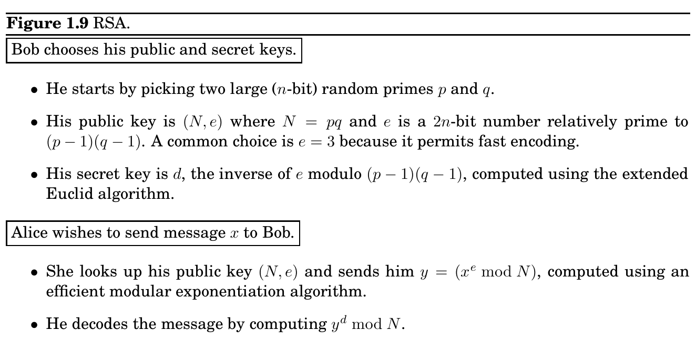

import Guide from '@/components/Guide.astro';
import Knowledge from '@/components/Knowledge.astro';
import Example from '@/components/Example.astro';
import Analysis from '@/components/Analysis.astro';
import Solution from '@/components/Solution.astro';
import Variant from '@/components/Variant.astro';
import Note from '@/components/Note.astro';
import Block from '@/components/Block.astro';
import Method from '@/components/Method.astro';
import Exercise from '@/components/Exercise.astro';

## 1.5 Universal hashing

is always 0 modulo N. The second form of the expression is convenient because it can be simplified using Fermat’s little theorem. It is divisible by p (since x^&#123;p&#125;−1 ≡1 mod p) and likewise by q. Since p and q are primes, this expression must also be divisible by their product N. Hence x^&#123;ed&#125; −x = x^&#123;1+&#125;k(p−1)(q−1) −x ≡0 (mod N), exactly as we need.

The RSA protocol is summarized in Figure 1.9. It is certainly convenient: the computations it requires of Alice and Bob are elementary. But how secure is it against Eve?

The security of RSA hinges upon a simple assumption:

Given N, e, and y = x^&#123;e&#125; mod N, it is computationally intractable to determine x.

This assumption is quite plausible. How might Eve try to guess x? She could experiment with all possible values of x, each time checking whether x^&#123;e&#125; ≡y mod N, but this would take exponential time. Or she could try to factor N to retrieve p and q, and then figure out d by inverting e modulo (p−1)(q−1), but we believe factoring to be hard. Intractability is normally a source of dismay; the insight of RSA lies in using it to advantage.

We end this chapter with an application of number theory to the design of hash functions. Hashing is a very useful method of storing data items in a table so as to support insertions, deletions, and lookups.

Suppose, for instance, that we need to maintain an ever-changing list of about 250 IP (Internet protocol) addresses, perhaps the addresses of the currently active customers of a Web service. (Recall that an IP address consists of 32 bits encoding the location of a computer on the Internet, usually shown broken down into four 8-bit fields, for example, 128.32.168.80.) We could obtain fast lookup times if we maintained the records in an array indexed by IP address. But this would be very wasteful of memory: the array would have 2^&#123;32&#125; ≈4 × 10^&#123;9&#125;

entries, the vast majority of them blank. Or alternatively, we could use a linked list of just the 250 records. But then accessing records would be very slow, taking time proportional to 250, the total number of customers. Is there a way to get the best of both worlds, to use an amount of memory that is proportional to the number of customers and yet also achieve fast lookup times? This is exactly where hashing comes in.

### 1.5.1 Hash tables

Here’s a high-level view of hashing. We will give a short “nickname” to each of the 2^&#123;32&#125; possible IP addresses. You can think of this short name as just a number between 1 and 250 (we will later adjust this range very slightly). Thus many IP addresses will inevitably have the same nickname; however, we hope that most of the 250 IP addresses of our particular customers are assigned distinct names, and we will store their records in an array of size 250 indexed by these names. What if there is more than one record associated with the same name? Easy: each entry of the array points to a linked list containing all records with that name. So the total amount of storage is proportional to 250, the number of customers, and is independent of the total number of possible IP addresses. Moreover, if not too many customer IP addresses are assigned the same name, lookup is fast, because the average size of the linked list we have to scan through is small.

But how do we assign a short name to each IP address? This is the role of a hash function: in our example, a function h that maps IP addresses to positions in a table of length about 250 (the expected number of data items). The name assigned to an IP address x is thus h(x), and the record for x is stored in position h(x) of the table. As described before, each position of the table is in fact a bucket, a linked list that contains all current IP addresses that map to it. Hopefully, there will be very few buckets that contain more than a handful of IP addresses.

x

y

z

x y

z

Space of all 2^&#123;32&#125; IP addresses

250 IPs

Hash table

h

of size ≈250

### 1.5.2 Families of hash functions

Designing hash functions is tricky. A hash function must in some sense be “random” (so that it scatters data items around), but it should also be a function and therefore “consistent” (so that we get the same result every time we apply it). And the statistics of the data items may work against us. In our example, one possible hash function would map an IP address to the 8-bit number that is its last segment: h(128.32.168.80) = 80. A table of n = 256 buckets would then be required. But is this a good hash function? Not if, for example, the last segment of an IP address tends to be a small (single- or double-digit) number; then low-numbered buckets would be crowded. Taking the first segment of the IP address also invites disaster— for example, if most of our customers come from Asia.

There is nothing inherently wrong with these two functions. If our 250 IP addresses were uniformly drawn from among all N = 2^&#123;32&#125; possibilities, then these functions would behave well. The problem is we have no guarantee that the distribution of IP addresses is uniform.

Conversely, there is no single hash function, no matter how sophisticated, that behaves well on all sets of data. Since a hash function maps 2^&#123;32&#125; IP addresses to just 250 names, there must be a collection of at least 2^&#123;32&#125;/250 ≈2^&#123;24&#125; ≈16,000,000 IP addresses that are assigned the same name (or, in hashing terminology, “collide”). If many of these show up in our customer set, we’re in trouble.

Obviously, we need some kind of randomization. Here’s an idea: let us pick a hash function at random from some class of functions. We will then show that, no matter what set of 250 IP addresses we actually care about, most choices of the hash function will give very few collisions among these addresses.

To this end, we need to define a class of hash functions from which we can pick at random; and this is where we turn to number theory. Let us take the number of buckets to be not 250 but n = 257—a prime number! And we consider every IP address x as a quadruple x = (x_&#123;1&#125;, . . . , x_&#123;4&#125;) of integers modulo n—recall that it is in fact a quadruple of integers between 0 and 255, so there is no harm in this. We can define a function h from IP addresses to a number mod n as follows: fix any four numbers mod n = 257, say 87, 23, 125, and 4. Now map the IP address (x_&#123;1&#125;, ..., x_&#123;4&#125;) to h(x_&#123;1&#125;, ..., x_&#123;4&#125;) = (87x_&#123;1&#125; + 23x_&#123;2&#125; + 125x_&#123;3&#125; + 4x_&#123;4&#125;) mod 257. Indeed, any four numbers mod n define a hash function.

For any four coefficients a_&#123;1&#125;, . . . , a_&#123;4&#125; ∈&#123;0, 1, . . . , n −1&#125;, write a = (a_&#123;1&#125;, a_&#123;2&#125;, a_&#123;3&#125;, a_&#123;4&#125;) and define h_&#123;a&#125; to be the following hash function:

h_&#123;a&#125;(x_&#123;1&#125;, . . . , x_&#123;4&#125;) =

4 X

i=1

a_&#123;i&#125; · x_&#123;i&#125; mod n.

We will show that if we pick these coefficients a at random, then h_&#123;a&#125; is very likely to be good in the following sense.

Property Consider any pair of distinct IP addresses x = (x_&#123;1&#125;, . . . , x_&#123;4&#125;) and y = (y_&#123;1&#125;, . . . , y_&#123;4&#125;). If the coefficients a = (a_&#123;1&#125;, a_&#123;2&#125;, a_&#123;3&#125;, a_&#123;4&#125;) are chosen uniformly at random from &#123;0, 1, . . . , n −1&#125;, then

Pr &#123;h_&#123;a&#125;(x_&#123;1&#125;, . . . , x_&#123;4&#125;) = h_&#123;a&#125;(y_&#123;1&#125;, . . . , y_&#123;4&#125;)&#125; = 1

n.

In other words, the chance that x and y collide under h_&#123;a&#125; is the same as it would be if each were assigned nicknames randomly and independently. This condition guarantees that the expected lookup time for any item is small. Here’s why. If we wish to look up x in our hash table, the time required is dominated by the size of its bucket, that is, the number of items that are assigned the same name as x. But there are only 250 items in the hash table, and the probability that any one item gets the same name as x is 1/n = 1/257. Therefore the expected number of items that are assigned the same name as x by a randomly chosen hash function h_&#123;a&#125; is 250/257 ≈1, which means the expected size of x’s bucket is less than 2.^&#123;1&#125;

1When a hash function h_&#123;a&#125; is chosen at random, let the random variable Y_&#123;i&#125; (for i = 1, . . . , 250) be 1 if item i gets the same name as x and 0 otherwise. So the expected value of Y_&#123;i&#125; is 1/n. Now, Y = Y_&#123;1&#125; + Y_&#123;2&#125; + · · · + Y_&#123;250&#125; is the number of items which get the same name as x, and by linearity of expectation, the expected value of Y is simply the sum of the expected values of Y_&#123;1&#125; through Y_&#123;250&#125;. It is thus 250/n = 250/257.

Let us now prove the preceding property. Proof. Since x = (x_&#123;1&#125;, . . . , x_&#123;4&#125;) and y = (y_&#123;1&#125;, . . . , y_&#123;4&#125;) are distinct, these quadruples must differ in some component; without loss of generality let us assume that x_&#123;4&#125;̸ = y_&#123;4&#125;. We wish to compute the probability Pr[h_&#123;a&#125;(x_&#123;1&#125;, . . . , x_&#123;4&#125;) = h_&#123;a&#125;(y_&#123;1&#125;, . . . , y_&#123;4&#125;)], that is, the probability that P4

i=1 a_&#123;i&#125; · x_&#123;i&#125; ≡ P4

i=1 a_&#123;i&#125; · y_&#123;i&#125; mod n. This last equation can be rewritten as

3 X

i=1

a_&#123;i&#125; · (x_&#123;i&#125; −y_&#123;i&#125;) ≡a_&#123;4&#125; · (y_&#123;4&#125; −x_&#123;4&#125;) mod n (1)

Suppose that we draw a random hash function h_&#123;a&#125; by picking a = (a_&#123;1&#125;, a_&#123;2&#125;, a_&#123;3&#125;, a_&#123;4&#125;) at random. We start by drawing a_&#123;1&#125;, a_&#123;2&#125;, and a_&#123;3&#125;, and then we pause and think: What is the probability that the last drawn number a_&#123;4&#125; is such that equation (1) holds? So far the left-hand side of equation (1) evaluates to some number, call it c. And since n is prime and x_&#123;4&#125;̸ = y_&#123;4&#125;, (y_&#123;4&#125; −x_&#123;4&#125;) has a unique inverse modulo n. Thus for equation (1) to hold, the last number a_&#123;4&#125; must be precisely c · (y_&#123;4&#125; −x_&#123;4&#125;)^&#123;−&#125;1 mod n, out of its n possible values. The probability of this happening is 1/n, and the proof is complete.

Let us step back and see what we just achieved. Since we have no control over the set of data items, we decided instead to select a hash function h uniformly at random from among a family H of hash functions. In our example,

H = &#123;h_&#123;a&#125; : a ∈&#123;0, . . . , n −1&#125;^&#123;4&#125;&#125;.

To draw a hash function uniformly at random from this family, we just draw four numbers a_&#123;1&#125;, . . . , a_&#123;4&#125; modulo n. (Incidentally, notice that the two simple hash functions we considered earlier, namely, taking the last or the first 8-bit segment, belong to this class. They are h_&#123;(0&#125;,0,0,1) and h_&#123;(1&#125;,0,0,0), respectively.) And we insisted that the family have the following property:

For any two distinct data items x and y, exactly |H|/n of all the hash functions in H map x and y to the same bucket, where n is the number of buckets.

A family of hash functions with this property is called universal. In other words, for any two data items, the probability these items collide is 1/n if the hash function is randomly drawn from a universal family. This is also the collision probability if we map x and y to buckets uniformly at random—in some sense the gold standard of hashing. We then showed that this property implies that hash table operations have good performance in expectation.

This idea, motivated as it was by the hypothetical IP address application, can of course be applied more generally. Start by choosing the table size n to be some prime number that is a little larger than the number of items expected in the table (there is usually a prime number close to any number we start with; actually, to ensure that hash table operations have good performance, it is better to have the size of the hash table be about twice as large as the number of items). Next assume that the size of the domain of all data items is N = n^&#123;k&#125;, a power of n (if we need to overestimate the true number of data items, so be it). Then each data item can be considered as a k-tuple of integers modulo n, and H = &#123;h_&#123;a&#125; : a ∈&#123;0, . . . , n −1&#125;^&#123;k&#125;&#125; is a universal family of hash functions.
