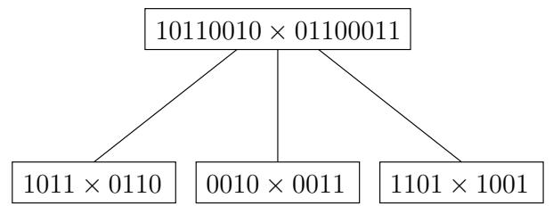
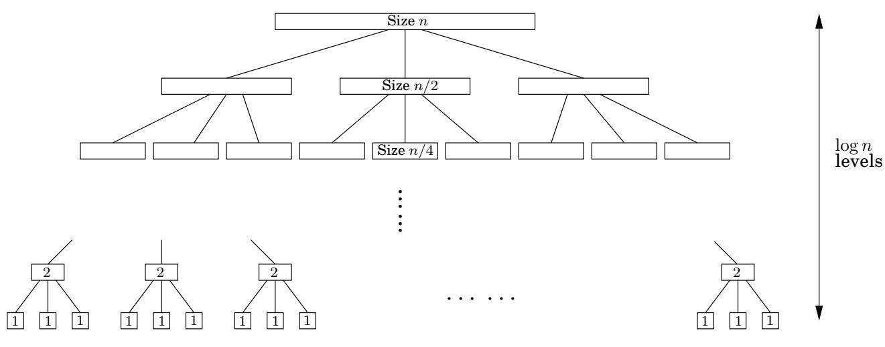
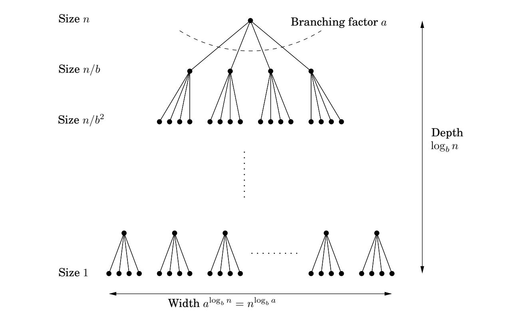

import Guide from '@/components/Guide.astro';
import Knowledge from '@/components/Knowledge.astro';
import Example from '@/components/Example.astro';
import Analysis from '@/components/Analysis.astro';
import Solution from '@/components/Solution.astro';
import Variant from '@/components/Variant.astro';
import Note from '@/components/Note.astro';
import Block from '@/components/Block.astro';
import Method from '@/components/Method.astro';
import Exercise from '@/components/Exercise.astro';

## 2.2 Recurrence relations

Divide-and-conquer algorithms often follow a generic pattern: they tackle a problem of size n by recursively solving, say, a subproblems of size $n / b$ and then combining these answers in $O ( n ^ { d } )$ time, for some $a , b , d > 0$ (in the multiplication algorithm, $a = 3 , b = 2 ,$ , and $d = 1 )$ . Their running time can therefore be captured by the equation $T ( n ) = a T ( \lceil n / b \rceil ) + O ( n ^ { d } )$ . We next derive a closed-form solution to this general recurrence so that we no longer have to solve it explicitly in each new instance.

Figure 2.2 Divide-and-conquer integer multiplication. (a) Each problem is divided into three subproblems. (b) The levels of recursion.

(a)

(b)

Master theorem2 $I f T ( n ) = a T ( \lceil n / b \rceil ) + O ( n ^ { d } )$ for some constants $a > 0 , b > 1$ and $d \geq 0 .$ then

$$
T (n) = \left\{ \begin{array}{l l} O (n ^ {d}) & \text {if} d > \log_ {b} a \\ O (n ^ {d} \log n) & \text {if} d = \log_ {b} a \\ O (n ^ {\log_ {b} a}) & \text {if} d <   \log_ {b} a. \end{array} \right.
$$

This single theorem tells us the running times of most of the divide-and-conquer procedures we are likely to use.

<Solution title="Proof">

To prove the claim, let's start by assuming for the sake of convenience that n is a power of $b .$ This will not influence the final bound in any important way—after all, n is at most a multiplicative factor of b away from some power of b (Exercise 2.2)—and it will allow us to ignore the rounding effect in $\lceil n / b \rceil$

</Solution>

Next, notice that the size of the subproblems decreases by a factor of b with each level of recursion, and therefore reaches the base case after $\log _ { b } n$ levels. This is the height of the recursion tree. Its branching factor is $^ { a , }$ so the kth level of the tree is made up of $a ^ { k }$ subproblems, each of size $n / b ^ { k }$ (Figure 2.3). The total work done at this level is

Figure 2.3 Each problem of size n is divided into a subproblems of size $n / b .$

$$
a ^ {k} \times O \left(\frac {n}{b ^ {k}}\right) ^ {d} = O (n ^ {d}) \times \left(\frac {a}{b ^ {d}}\right) ^ {k}.
$$

As k goes from 0 (the root) to $\log _ { b } n$ (the leaves), these numbers form a geometric series with ratio $a / b ^ { d }$ . Finding the sum of such a series in big-O notation is easy (Exercise 0.2), and comes down to three cases.

## 1. The ratio is less than 1.

Then the series is decreasing, and its sum is just given by its first term, $O ( n ^ { d } )$

2. The ratio is greater than 1.

The series is increasing and its sum is given by its last term, $O ( n ^ { \log _ { b } a } )$

$$
n ^ {d} \left(\frac {a}{b ^ {d}}\right) ^ {\log_ {b} n} = n ^ {d} \left(\frac {a ^ {\log_ {b} n}}{(b ^ {\log_ {b} n}) ^ {d}}\right) = a ^ {\log_ {b} n} = a ^ {(\log_ {a} n) (\log_ {b} a)} = n ^ {\log_ {b} a}.
$$

3. The ratio is exactly 1.

In this case all $O ( \log n )$ terms of the series are equal to $O ( n ^ { d } )$

These cases translate directly into the three contingencies in the theorem statement.

<Knowledge title="Box: Binary search">

The ultimate divide-and-conquer algorithm is, of course, binary search: to find a key k in a large file containing keys $z [ 0 , 1 , \ldots , n - 1 ]$ in sorted order, we first compare k with $z [ n / 2 ]$ , and depending on the result we recurse either on the first half of the file, $z [ 0 , \ldots , n / 2 - 1 ]$ , or on the second half, $z [ n / 2 , \ldots , n - 1 ]$ . The recurrence now is $T ( n ) = T ( \lceil n / 2 \rceil ) + O ( 1 )$ , which is the case $a = 1 , b = 2 , d = 0 .$ Plugging into our master theorem we get the familiar solution: a running time of just O(log n).

</Knowledge>
