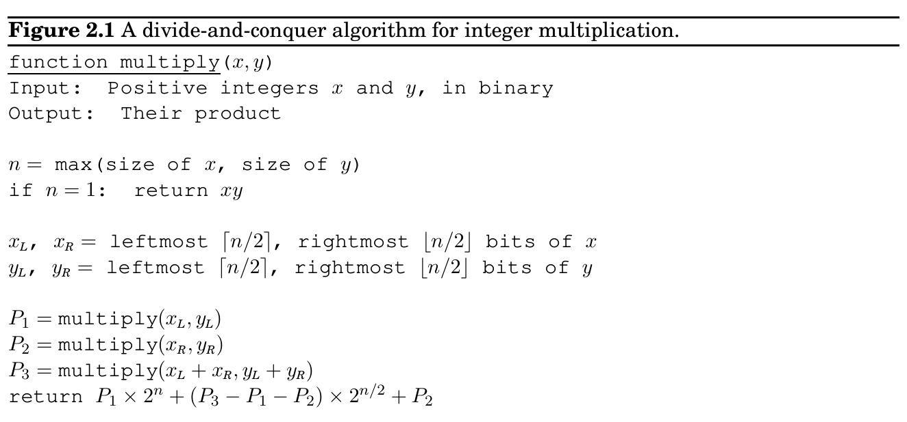
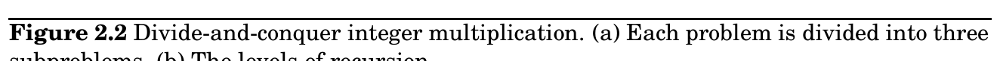
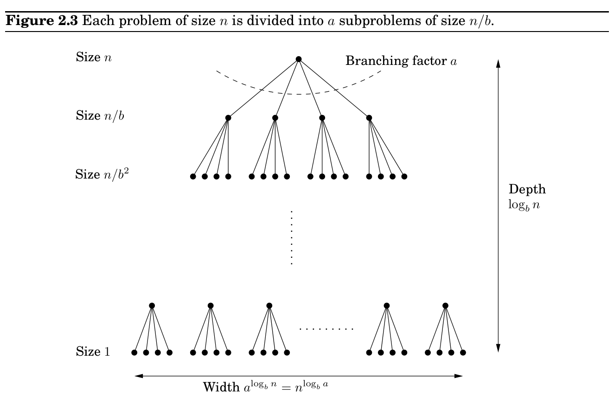

import Guide from '@/components/Guide.astro';
import Knowledge from '@/components/Knowledge.astro';
import Example from '@/components/Example.astro';
import Analysis from '@/components/Analysis.astro';
import Solution from '@/components/Solution.astro';
import Variant from '@/components/Variant.astro';
import Note from '@/components/Note.astro';
import Block from '@/components/Block.astro';
import Method from '@/components/Method.astro';
import Exercise from '@/components/Exercise.astro';

## 2.2 Recurrence relations

At the very top level, when k = 0, this works out to O(n). At the bottom, when k = log_&#123;2&#125; n, it is O(3^&#123;log&#125;_&#123;2&#125; n), which can be rewritten as O(n^&#123;log&#125;_&#123;2&#125; 3) (do you see why?). Between these two endpoints, the work done increases geometrically from O(n) to O(n^&#123;log&#125;_&#123;2&#125; 3), by a factor of 3/2 per level. The sum of any increasing geometric series is, within a constant factor, simply the last term of the series: such is the rapidity of the increase (Exercise 0.2). Therefore the overall running time is O(n^&#123;log&#125;_&#123;2&#125; 3), which is about O(n^&#123;1&#125;.59).

In the absence of Gauss’s trick, the recursion tree would have the same height, but the branching factor would be 4. There would be 4^&#123;log&#125;_&#123;2&#125; n = n^&#123;2&#125; leaves, and therefore the running time would be at least this much. In divide-and-conquer algorithms, the number of subproblems translates into the branching factor of the recursion tree; small changes in this coefficient can have a big impact on running time.

A practical note: it generally does not make sense to recurse all the way down to 1 bit. For most processors, 16- or 32-bit multiplication is a single operation, so by the time the numbers get into this range they should be handed over to the built-in procedure.

Finally, the eternal question: Can we do better? It turns out that even faster algorithms for multiplying numbers exist, based on another important divide-and-conquer algorithm: the fast Fourier transform, to be explained in Section 2.6.

Divide-and-conquer algorithms often follow a generic pattern: they tackle a problem of size n by recursively solving, say, a subproblems of size n/b and then combining these answers in O(n^&#123;d&#125;) time, for some a, b, d > 0 (in the multiplication algorithm, a = 3, b = 2, and d = 1). Their running time can therefore be captured by the equation T(n) = aT(⌈n/b⌉) + O(n^&#123;d&#125;). We next derive a closed-form solution to this general recurrence so that we no longer have to solve it explicitly in each new instance.

(a)

10110010 × 01100011

1011 × 0110 0010 × 0011 1101 × 1001

(b)

2

1 1 1

2

1 1 1

2

1 1 1

2

1 1 1

Size n

Size n/2

· · · · · ·

......

log n levels Size n/4

Master theorem^&#123;2&#125; If T(n) = aT(⌈n/b⌉) + O(n^&#123;d&#125;) for some constants a > 0, b > 1, and d ≥0, then

T(n) =

 



O(n^&#123;d&#125;) if d > log_&#123;b&#125; a O(n^&#123;d&#125; log n) if d = log_&#123;b&#125; a O(n^&#123;log&#125;_&#123;b&#125; a) if d &lt; log_&#123;b&#125; a .

This single theorem tells us the running times of most of the divide-and-conquer procedures we are likely to use. Proof. To prove the claim, let’s start by assuming for the sake of convenience that n is a power of b. This will not influence the final bound in any important way—after all, n is at most a multiplicative factor of b away from some power of b (Exercise 2.2)—and it will allow us to ignore the rounding effect in ⌈n/b⌉.

Next, notice that the size of the subproblems decreases by a factor of b with each level of recursion, and therefore reaches the base case after log_&#123;b&#125; n levels. This is the height of the recursion tree. Its branching factor is a, so the kth level of the tree is made up of a^&#123;k&#125;

2There are even more general results of this type, but we will not be needing them.

subproblems, each of size n/b^&#123;k&#125; (Figure 2.3). The total work done at this level is

a^&#123;k&#125; × O

 n

b^&#123;k&#125;

d

= O(n^&#123;d&#125;) ×

 a

b^&#123;d&#125;

k

.

As k goes from 0 (the root) to log_&#123;b&#125; n (the leaves), these numbers form a geometric series with ratio a/b^&#123;d&#125;. Finding the sum of such a series in big-O notation is easy (Exercise 0.2), and comes down to three cases.

1. The ratio is less than 1.

Then the series is decreasing, and its sum is just given by its first term, O(n^&#123;d&#125;).

2. The ratio is greater than 1.

The series is increasing and its sum is given by its last term, O(n^&#123;log&#125;_&#123;b&#125; a):

n^&#123;d&#125;  a

b^&#123;d&#125;

log_&#123;b&#125; n

= n^&#123;d&#125;

 a^&#123;log&#125;_&#123;b&#125; n

(b^&#123;log&#125;_&#123;b&#125; n)^&#123;d&#125;



= a^&#123;log&#125;_&#123;b&#125; n = a^&#123;(log&#125;_&#123;a&#125; n)(log_&#123;b&#125; a) = n^&#123;log&#125;_&#123;b&#125; a.

3. The ratio is exactly 1.

In this case all O(log n) terms of the series are equal to O(n^&#123;d&#125;).

These cases translate directly into the three contingencies in the theorem statement.
