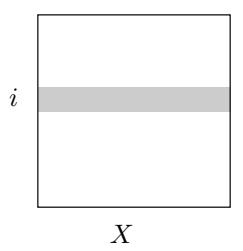
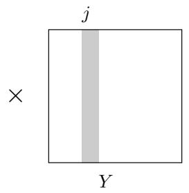
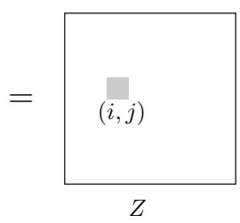

import Guide from '@/components/Guide.astro';
import Knowledge from '@/components/Knowledge.astro';
import Example from '@/components/Example.astro';
import Analysis from '@/components/Analysis.astro';
import Solution from '@/components/Solution.astro';
import Variant from '@/components/Variant.astro';
import Note from '@/components/Note.astro';
import Block from '@/components/Block.astro';
import Method from '@/components/Method.astro';
import Exercise from '@/components/Exercise.astro';

## 2.5 Matrix multiplication

The product of two $n \times n$ matrices X and Y is a third $n \times n$ matrix $Z = X Y$ , with $( i , j )$ th entry

$$
Z _ {i j} = \sum_ {k = 1} ^ {n} X _ {i k} Y _ {k j}.
$$

To make it more visual, $Z _ { i j }$ is the dot product of the ith row of X with the jth column of Y :

In general, XY is not the same as $Y X ;$ ; matrix multiplication is not commutative.

The preceding formula implies an $O ( n ^ { 3 } )$ algorithm for matrix multiplication: there are $n ^ { 2 }$ entries to be computed, and each takes $O ( n )$ time. For quite a while, this was widely believed to be the best running time possible, and it was even proved that in certain models of computation no algorithm could do better. It was therefore a source of great excitement when in 1969, the German mathematician Volker Strassen announced a significantly more efficient algorithm, based upon divide-and-conquer.

Matrix multiplication is particularly easy to break into subproblems, because it can be performed blockwise. To see what this means, carve X into four $n / 2 \times n / 2$ blocks, and also $Y { : }$

$$
X = \left[ \begin{array}{c c} A & B \\ C & D \end{array} \right], Y = \left[ \begin{array}{c c} E & F \\ G & H \end{array} \right].
$$

Then their product can be expressed in terms of these blocks and is exactly as if the blocks were single elements (Exercise 2.11).

$$
X Y = \left[ \begin{array}{c c} A & B \\ C & D \end{array} \right] \left[ \begin{array}{c c} E & F \\ G & H \end{array} \right] = \left[ \begin{array}{c c} A E + B G & A F + B H \\ C E + D G & C F + D H \end{array} \right]
$$

We now have a divide-and-conquer strategy: to compute the size-n product $X Y$ , recursively compute eight si $\scriptstyle \mathtt { z e - n / 2 }$ products AE, BG, AF, BH, CE, DG, CF, DH, and then do a few $O ( n ^ { 2 } )$ time additions. The total running time is described by the recurrence relation

$$
T (n) = 8 T (n / 2) + O (n ^ {2}).
$$

This comes out to an unimpressive $O ( n ^ { 3 } )$ , the same as for the default algorithm. But the efficiency can be further improved, and as with integer multiplication, the key is some clever algebra. It turns out XY can be computed from just seven $n / 2 \times n / 2$ subproblems, via a decomposition so tricky and intricate that one wonders how Strassen was ever able to discover it!

$$
\begin{array}{r l r} {X Y} & = & {\left[ \begin{array}{c c} P _ {5} + P _ {4} - P _ {2} + P _ {6} & P _ {1} + P _ {2} \\ P _ {3} + P _ {4} & P _ {1} + P _ {5} - P _ {3} - P _ {7} \end{array} \right]} \end{array}
$$

where

$$
\begin{array}{r c l} P _ {1} & = & A (F - H) \\ P _ {2} & = & (A + B) H \\ P _ {3} & = & (C + D) E \\ P _ {4} & = & D (G - E) \end{array} \qquad \qquad \begin{array}{r c l} P _ {5} & = & (A + D) (E + H) \\ P _ {6} & = & (B - D) (G + H) \\ P _ {7} & = & (A - C) (E + F) \end{array}
$$

The new running time is

$$
T (n) = 7 T (n / 2) + O (n ^ {2}),
$$

which by the master theorem works out to $O ( n ^ { \log _ { 2 } 7 } ) \approx O ( n ^ { 2 . 8 1 } )$
