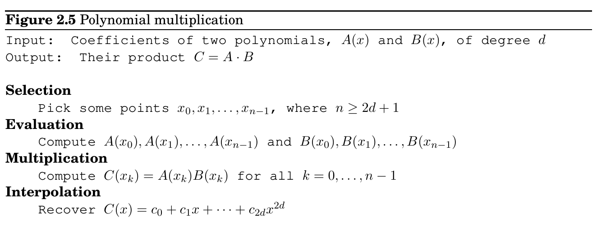
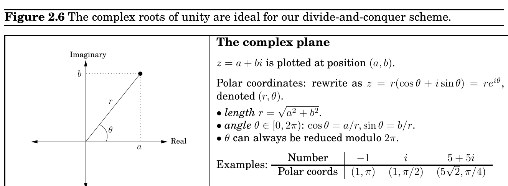
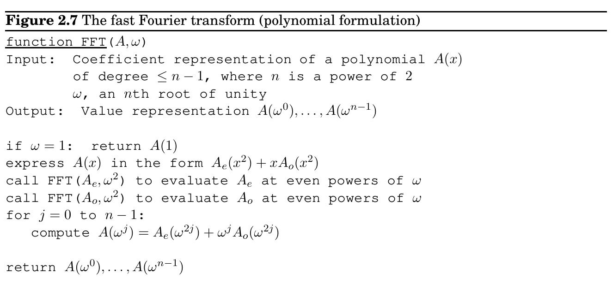
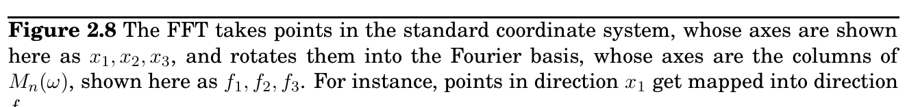
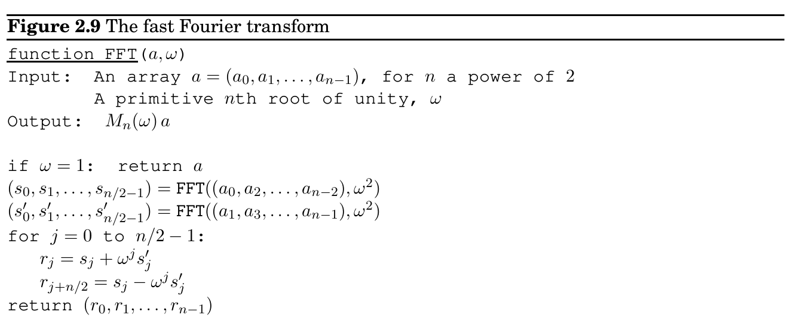
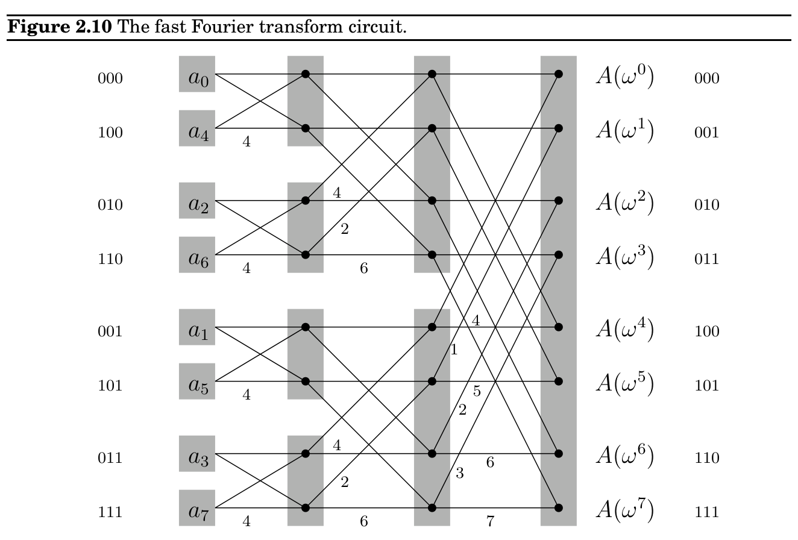

import Guide from '@/components/Guide.astro';
import Knowledge from '@/components/Knowledge.astro';
import Example from '@/components/Example.astro';
import Analysis from '@/components/Analysis.astro';
import Solution from '@/components/Solution.astro';
import Variant from '@/components/Variant.astro';
import Note from '@/components/Note.astro';
import Block from '@/components/Block.astro';
import Method from '@/components/Method.astro';
import Exercise from '@/components/Exercise.astro';

## 2.6 The fast Fourier transform

We have so far seen how divide-and-conquer gives fast algorithms for multiplying integers and matrices; our next target is polynomials. The product of two degree-d polynomials is a polynomial of degree 2d, for example:

(1 + 2x + 3x^&#123;2&#125;) · (2 + x + 4x^&#123;2&#125;) = 2 + 5x + 12x^&#123;2&#125; + 11x^&#123;3&#125; + 12x^&#123;4&#125;.

More generally, if A(x) = a_&#123;0&#125; + a_&#123;1&#125;x + · · · + a_&#123;d&#125;x^&#123;d&#125; and B(x) = b_&#123;0&#125; + b_&#123;1&#125;x + · · · + b_&#123;d&#125;x^&#123;d&#125;, their product C(x) = A(x) · B(x) = c_&#123;0&#125; + c_&#123;1&#125;x + · · · + c_&#123;2&#125;dx^&#123;2&#125;d has coefficients

c_&#123;k&#125; = a_&#123;0&#125;b_&#123;k&#125; + a_&#123;1&#125;b_&#123;k&#125;−1 + · · · + a_&#123;k&#125;b_&#123;0&#125; =

k X

i=0

a_&#123;i&#125;b_&#123;k&#125;−i

(for i > d, take a_&#123;i&#125; and b_&#123;i&#125; to be zero). Computing c_&#123;k&#125; from this formula takes O(k) steps, and finding all 2d + 1 coefficients would therefore seem to require Θ(d^&#123;2&#125;) time. Can we possibly multiply polynomials faster than this?

The solution we will develop, the fast Fourier transform, has revolutionized—indeed, defined—the field of signal processing (see the following box). Because of its huge importance, and its wealth of insights from different fields of study, we will approach it a little more leisurely than usual. The reader who wants just the core algorithm can skip directly to Section 2.6.4.

### Why multiply polynomials?

For one thing, it turns out that the fastest algorithms we have for multiplying integers rely heavily on polynomial multiplication; after all, polynomials and binary integers are quite similar—just replace the variable x by the base 2, and watch out for carries. But perhaps more importantly, multiplying polynomials is crucial for signal processing.

A signal is any quantity that is a function of time (as in Figure (a)) or of position. It might, for instance, capture a human voice by measuring fluctuations in air pressure close to the speaker’s mouth, or alternatively, the pattern of stars in the night sky, by measuring brightness as a function of angle.

a(t)

t

a(t)

t

t

δ(t)

(a) (b) (c)

In order to extract information from a signal, we need to first digitize it by sampling (Figure (b))—and, then, to put it through a system that will transform it in some way. The output is called the response of the system:

signal −→

SYSTEM

−→ response

An important class of systems are those that are linear—the response to the sum of two signals is just the sum of their individual responses—and time invariant—shifting the input signal by time t produces the same output, also shifted by t. Any system with these properties is completely characterized by its response to the simplest possible input signal: the unit impulse δ(t), consisting solely of a “jerk” at t = 0 (Figure (c)). To see this, first consider the close relative δ(t −i), a shifted impulse in which the jerk occurs at time i. Any signal a(t) can be expressed as a linear combination of these, letting δ(t −i) pick out its behavior at time i,

a(t) =

T −1 X

i=0

a(i)δ(t −i)

(if the signal consists of T samples). By linearity, the system response to input a(t) is determined by the responses to the various δ(t−i). And by time invariance, these are in turn just shifted copies of the impulse response b(t), the response to δ(t).

In other words, the output of the system at time k is

c(k) =

k X

i=0

a(i)b(k −i),

exactly the formula for polynomial multiplication!

### 2.6.1 An alternative representation of polynomials

To arrive at a fast algorithm for polynomial multiplication we take inspiration from an important property of polynomials.

Fact A degree-d polynomial is uniquely characterized by its values at any d + 1 distinct points.

A familiar instance of this is that “any two points determine a line.” We will later see why the more general statement is true (page 72), but for the time being it gives us an alternative representation of polynomials. Fix any distinct points x_&#123;0&#125;, . . . , x_&#123;d&#125;. We can specify a degree-d polynomial A(x) = a_&#123;0&#125; + a_&#123;1&#125;x + · · · + a_&#123;d&#125;x^&#123;d&#125; by either one of the following:

1. Its coefficients a_&#123;0&#125;, a_&#123;1&#125;, . . . , a_&#123;d&#125;

2. The values A(x_&#123;0&#125;), A(x_&#123;1&#125;), . . . , A(x_&#123;d&#125;)

Of these two representations, the second is the more attractive for polynomial multiplication. Since the product C(x) has degree 2d, it is completely determined by its value at any 2d + 1 points. And its value at any given point z is easy enough to figure out, just A(z) times B(z). Thus polynomial multiplication takes linear time in the value representation.

The problem is that we expect the input polynomials, and also their product, to be specified by coefficients. So we need to first translate from coefficients to values—which is just a matter of evaluating the polynomial at the chosen points—then multiply in the value representation, and finally translate back to coefficients, a process called interpolation.

Interpolation

Coefficient representation

a_&#123;0&#125;, a_&#123;1&#125;, . . . , a_&#123;d&#125;

Value representation A(x_&#123;0&#125;), A(x_&#123;1&#125;), . . . , A(x_&#123;d&#125;)

Evaluation

Figure 2.5 presents the resulting algorithm.

The equivalence of the two polynomial representations makes it clear that this high-level approach is correct, but how efficient is it? Certainly the selection step and the n multiplications are no trouble at all, just linear time.^&#123;3&#125; But (leaving aside interpolation, about which we know even less) how about evaluation? Evaluating a polynomial of degree d ≤n at a single point takes O(n) steps (Exercise 2.29), and so the baseline for n points is Θ(n^&#123;2&#125;). We’ll now see that the fast Fourier transform (FFT) does it in just O(n log n) time, for a particularly clever choice of x_&#123;0&#125;, . . . , x_&#123;n&#125;−1 in which the computations required by the individual points overlap with one another and can be shared.

### 2.6.2 Evaluation by divide-and-conquer

Here’s an idea for how to pick the n points at which to evaluate a polynomial A(x) of degree ≤n −1. If we choose them to be positive-negative pairs, that is,

±x_&#123;0&#125;, ±x_&#123;1&#125;, . . . , ±x_&#123;n/&#125;2−1,

then the computations required for each A(x_&#123;i&#125;) and A(−x_&#123;i&#125;) overlap a lot, because the even powers of x_&#123;i&#125; coincide with those of −x_&#123;i&#125;.

To investigate this, we need to split A(x) into its odd and even powers, for instance

3 + 4x + 6x^&#123;2&#125; + 2x^&#123;3&#125; + x^&#123;4&#125; + 10x^&#123;5&#125; = (3 + 6x^&#123;2&#125; + x^&#123;4&#125;) + x(4 + 2x^&#123;2&#125; + 10x^&#123;4&#125;).

Notice that the terms in parentheses are polynomials in x^&#123;2&#125;. More generally,

A(x) = A_&#123;e&#125;(x^&#123;2&#125;) + xA_&#123;o&#125;(x^&#123;2&#125;),

where A_&#123;e&#125;(·), with the even-numbered coefficients, and A_&#123;o&#125;(·), with the odd-numbered coefficients, are polynomials of degree ≤n/2 −1 (assume for convenience that n is even). Given paired points ±x_&#123;i&#125;, the calculations needed for A(x_&#123;i&#125;) can be recycled toward computing A(−x_&#123;i&#125;):

A(x_&#123;i&#125;) = A_&#123;e&#125;(x^&#123;2&#125;

i ) + x_&#123;i&#125;A_&#123;o&#125;(x^&#123;2&#125;

i )

A(−x_&#123;i&#125;) = A_&#123;e&#125;(x^&#123;2&#125;

i ) −x_&#123;i&#125;A_&#123;o&#125;(x^&#123;2&#125;

i ).

In other words, evaluating A(x) at n paired points ±x_&#123;0&#125;, . . . , ±x_&#123;n/&#125;2−1 reduces to evaluating A_&#123;e&#125;(x) and A_&#123;o&#125;(x) (which each have half the degree of A(x)) at just n/2 points, x^&#123;2&#125;

0, . . . , x^&#123;2&#125; n/2−1.

Evaluate: A(x) degree ≤n −1

A_&#123;e&#125;(x) and A_&#123;o&#125;(x) degree ≤n/2 −1 at:

at: −x_&#123;0&#125; +x_&#123;1&#125; −x_&#123;1&#125; · · ·

· · · x^&#123;2&#125;

0

−x_&#123;n/&#125;2−1 +x_&#123;n/&#125;2−1

x^&#123;2&#125;

1 x^&#123;2&#125;

n/2−1

+x_&#123;0&#125;

Equivalently, evaluate:

3In a typical setting for polynomial multiplication, the coefficients of the polynomials are real numbers and, moreover, are small enough that basic arithmetic operations (adding and multiplying) take unit time. We will assume this to be the case without any great loss of generality; in particular, the time bounds we obtain are easily adjustable to situations with larger numbers.

The original problem of size n is in this way recast as two subproblems of size n/2, followed by some linear-time arithmetic. If we could recurse, we would get a divide-and-conquer procedure with running time

T(n) = 2T(n/2) + O(n),

which is O(n log n), exactly what we want.

But we have a problem: The plus-minus trick only works at the top level of the recursion. To recurse at the next level, we need the n/2 evaluation points x^&#123;2&#125;

0, x^&#123;2&#125; 1, . . . , x^&#123;2&#125; n/2−1 to be themselves plus-minus pairs. But how can a square be negative? The task seems impossible! Unless, of course, we use complex numbers.

Fine, but which complex numbers? To figure this out, let us “reverse engineer” the process. At the very bottom of the recursion, we have a single point. This point might as well be 1, in which case the level above it must consist of its square roots, ±

√

1 = ±1.

−1 −i

−1

+1

+1

+i +1

...

The next level up then has ±√

+1 = ±1 as well as the complex numbers ±√

−1 = ±i, where i is the imaginary unit. By continuing in this manner, we eventually reach the initial set of n points. Perhaps you have already guessed what they are: the complex nth roots of unity, that is, the n complex solutions to the equation z^&#123;n&#125; = 1.

Figure 2.6 is a pictorial review of some basic facts about complex numbers. The third panel of this figure introduces the nth roots of unity: the complex numbers 1, ω, ω^&#123;2&#125;, . . . , ω^&#123;n&#125;−1, where ω = e^&#123;2&#125;πi/n. If n is even,

1. The nth roots are plus-minus paired, ω^&#123;n/&#125;2+j = −ω^&#123;j&#125;.

2. Squaring them produces the (n/2)nd roots of unity.

Therefore, if we start with these numbers for some n that is a power of 2, then at successive levels of recursion we will have the (n/2^&#123;k&#125;)th roots of unity, for k = 0, 1, 2, 3, . . .. All these sets of numbers are plus-minus paired, and so our divide-and-conquer, as shown in the last panel, works perfectly. The resulting algorithm is the fast Fourier transform (Figure 2.7).

(r_&#123;1&#125;r_&#123;2&#125;, θ_&#123;1&#125; + θ_&#123;2&#125;)

(r_&#123;1&#125;, θ_&#123;1&#125;)

(r_&#123;2&#125;, θ_&#123;2&#125;)

Multiplying is easy in polar coordinates

Multiply the lengths and add the angles:

(r_&#123;1&#125;, θ_&#123;1&#125;) × (r_&#123;2&#125;, θ_&#123;2&#125;) = (r_&#123;1&#125;r_&#123;2&#125;, θ_&#123;1&#125; + θ_&#123;2&#125;).

For any z = (r, θ),

• −z = (r, θ + π) since −1 = (1, π). • If z is on the unit circle (i.e., r = 1), then z^&#123;n&#125; = (1, nθ).

Angle_&#123; &#125;2π

n

4π

n

2π

n + π

The nth complex roots of unity

Solutions to the equation z^&#123;n&#125; = 1.

By the multiplication rule: solutions are z = (1, θ), for θ a multiple of 2π/n (shown here for n = 16).

For even n:

• These numbers are plus-minus paired: −(1, θ) = (1, θ+π). • Their squares are the (n/2)nd roots of unity, shown here with boxes around them.

Divide-and-conquer step

Evaluate A_&#123;e&#125;(x), A_&#123;o&#125;(x) at (n/2)nd roots

Still paired

Divide and conquer

Paired

Evaluate A(x) at nth roots of unity

(n is a power of 2)

### 2.6.3 Interpolation

Let’s take stock of where we are. We first developed a high-level scheme for multiplying polynomials (Figure 2.5), based on the observation that polynomials can be represented in two ways, in terms of their coefficients or in terms of their values at a selected set of points.

Interpolation

Coefficient representation

a_&#123;0&#125;, a_&#123;1&#125;, . . . , a_&#123;n&#125;−1

Value representation A(x_&#123;0&#125;), A(x_&#123;1&#125;), . . . , A(x_&#123;n&#125;−1)

Evaluation

The value representation makes it trivial to multiply polynomials, but we cannot ignore the coefficient representation since it is the form in which the input and output of our overall algorithm are specified.

So we designed the FFT, a way to move from coefficients to values in time just O(n log n), when the points &#123;x_&#123;i&#125;&#125; are complex nth roots of unity (1, ω, ω^&#123;2&#125;, . . . , ω^&#123;n&#125;−1).

⟨values⟩= FFT(⟨coefficients⟩, ω).

The last remaining piece of the puzzle is the inverse operation, interpolation. It will turn out, amazingly, that

⟨coefficients⟩= 1

n FFT(⟨values⟩, ω^&#123;−&#125;1).

Interpolation is thus solved in the most simple and elegant way we could possibly have hoped for—using the same FFT algorithm, but called with ω^&#123;−&#125;1 in place of ω! This might seem like a miraculous coincidence, but it will make a lot more sense when we recast our polynomial operations in the language of linear algebra. Meanwhile, our O(n log n) polynomial multiplication algorithm (Figure 2.5) is now fully specified.

A matrix reformulation

To get a clearer view of interpolation, let’s explicitly set down the relationship between our two representations for a polynomial A(x) of degree ≤n −1. They are both vectors of n numbers, and one is a linear transformation of the other:





A(x_&#123;0&#125;) A(x_&#123;1&#125;)

... A(x_&#123;n&#125;−1)



 =





1 x_&#123;0&#125; x^&#123;2&#125;

0 · · · x^&#123;n&#125;−1

0 1 x_&#123;1&#125; x^&#123;2&#125;

1 · · · x^&#123;n&#125;−1

1 ... 1 x_&#123;n&#125;−1 x^&#123;2&#125;

n−1 · · · x^&#123;n&#125;−1

n−1









a_&#123;0&#125; a_&#123;1&#125;

... a_&#123;n&#125;−1



.

Call the matrix in the middle M. Its specialized format—a Vandermonde matrix—gives it many remarkable properties, of which the following is particularly relevant to us.

If x_&#123;0&#125;, . . . , x_&#123;n&#125;−1 are distinct numbers, then M is invertible.

The existence of M^&#123; &#125;−1 allows us to invert the preceding matrix equation so as to express coefficients in terms of values. In brief,

Evaluation is multiplication by M, while interpolation is multiplication by M^&#123; &#125;−1.

This reformulation of our polynomial operations reveals their essential nature more clearly. Among other things, it finally justifies an assumption we have been making throughout, that A(x) is uniquely characterized by its values at any n points—in fact, we now have an explicit formula that will give us the coefficients of A(x) in this situation. Vandermonde matrices also have the distinction of being quicker to invert than more general matrices, in O(n^&#123;2&#125;) time instead of O(n^&#123;3&#125;). However, using this for interpolation would still not be fast enough for us, so once again we turn to our special choice of points—the complex roots of unity.

Interpolation resolved

In linear algebra terms, the FFT multiplies an arbitrary n-dimensional vector—which we have been calling the coefficient representation—by the n × n matrix

M_&#123;n&#125;(ω) =





1 1 1 · · · 1 1 ω ω^&#123;2&#125; · · · ω^&#123;n&#125;−1

1 ω^&#123;2&#125; ω^&#123;4&#125; · · · ω^&#123;2(&#125;n−1) ... 1 ω^&#123;j&#125; ω^&#123;2&#125;j · · · ω^&#123;(&#125;n−1)j ... 1 ω^&#123;(&#125;n−1) ω^&#123;2(&#125;n−1) · · · ω^&#123;(&#125;n−1)(n−1)





←− row for ω^&#123;0&#125; = 1 ←− ω ←− ω^&#123;2&#125;

... ←− ω^&#123;j&#125;

... ←− ω^&#123;n&#125;−1

where ω is a complex nth root of unity, and n is a power of 2. Notice how simple this matrix is to describe: its (j, k)th entry (starting row- and column-count at zero) is ω^&#123;jk&#125;.

Multiplication by M = M_&#123;n&#125;(ω) maps the kth coordinate axis (the vector with all zeros except for a 1 at position k) onto the kth column of M. Now here’s the crucial observation, which we’ll prove shortly: the columns of M are orthogonal (at right angles) to each other. Therefore they can be thought of as the axes of an alternative coordinate system, which is often called

FFT

x_&#123;1&#125;

x_&#123;3&#125; x_&#123;2&#125;

f_&#123;3&#125;

f_&#123;1&#125;

f_&#123;2&#125;

the Fourier basis. The effect of multiplying a vector by M is to rotate it from the standard basis, with the usual set of axes, into the Fourier basis, which is defined by the columns of M (Figure 2.8). The FFT is thus a change of basis, a rigid rotation. The inverse of M is the opposite rotation, from the Fourier basis back into the standard basis. When we write out the orthogonality condition precisely, we will be able to read off this inverse transformation with ease:

Inversion formula M_&#123;n&#125;(ω)^&#123;−&#125;1 = 1

nM_&#123;n&#125;(ω^&#123;−&#125;1).

But ω^&#123;−&#125;1 is also an nth root of unity, and so interpolation—or equivalently, multiplication by M_&#123;n&#125;(ω)^&#123;−&#125;1—is itself just an FFT operation, but with ω replaced by ω^&#123;−&#125;1.

Now let’s get into the details. Take ω to be e^&#123;2&#125;πi/n for convenience, and think of the columns of M as vectors in C^&#123;n&#125;. Recall that the angle between two vectors u = (u_&#123;0&#125;, . . . , u_&#123;n&#125;−1) and v = (v_&#123;0&#125;, . . . , v_&#123;n&#125;−1) in C^&#123;n&#125; is just a scaling factor times their inner product

u · v^&#123;∗&#125;= u_&#123;0&#125;v^&#123;∗&#125;

0 + u_&#123;1&#125;v^&#123;∗&#125; 1 + · · · + u_&#123;n&#125;−1v^&#123;∗&#125; n−1,

where z^&#123;∗&#125;denotes the complex conjugate^&#123;4&#125; of z. This quantity is maximized when the vectors lie in the same direction and is zero when the vectors are orthogonal to each other.

The fundamental observation we need is the following.

Lemma The columns of matrix M are orthogonal to each other.

Proof. Take the inner product of any columns j and k of matrix M,

1 + ω^&#123;j&#125;−k + ω^&#123;2(&#125;j−k) + · · · + ω^&#123;(&#125;n−1)(j−k).

This is a geometric series with first term 1, last term ω^&#123;(&#125;n−1)(j−k), and ratio ω^&#123;(&#125;j−k). Therefore it evaluates to (1 −ω^&#123;n&#125;(j−k))/(1 −ω^&#123;(&#125;j−k)), which is 0—except when j = k, in which case all terms are 1 and the sum is n.

4The complex conjugate of a complex number z = re^&#123;iθ&#125; is z^&#123;∗&#125;= re^&#123;−&#125;iθ. The complex conjugate of a vector (or matrix) is obtained by taking the complex conjugates of all its entries.

The orthogonality property can be summarized in the single equation

MM^&#123; &#125;∗= nI,

since (MM^&#123; &#125;∗)_&#123;ij&#125; is the inner product of the ith and jth columns of M (do you see why?). This immediately implies M^&#123; &#125;−1 = (1/n)M^&#123; &#125;∗: we have an inversion formula! But is it the same formula we earlier claimed? Let’s see—the (j, k)th entry of M^&#123; &#125;∗is the complex conjugate of the corresponding entry of M, in other words ω^&#123;−&#125;jk. Whereupon M^&#123; &#125;∗= M_&#123;n&#125;(ω^&#123;−&#125;1), and we’re done.

And now we can finally step back and view the whole affair geometrically. The task we need to perform, polynomial multiplication, is a lot easier in the Fourier basis than in the standard basis. Therefore, we first rotate vectors into the Fourier basis (evaluation), then perform the task (multiplication), and finally rotate back (interpolation). The initial vectors are coefficient representations, while their rotated counterparts are value representations. To efficiently switch between these, back and forth, is the province of the FFT.

### 2.6.4 A closer look at the fast Fourier transform

Now that our efficient scheme for polynomial multiplication is fully realized, let’s hone in more closely on the core subroutine that makes it all possible, the fast Fourier transform.

The definitive FFT algorithm

The FFT takes as input a vector a = (a_&#123;0&#125;, . . . , a_&#123;n&#125;−1) and a complex number ω whose powers 1, ω, ω^&#123;2&#125;, . . . , ω^&#123;n&#125;−1 are the complex nth roots of unity. It multiplies vector a by the n × n matrix M_&#123;n&#125;(ω), which has (j, k)th entry (starting row- and column-count at zero) ω^&#123;jk&#125;. The potential for using divide-and-conquer in this matrix-vector multiplication becomes apparent when M’s columns are segregated into evens and odds:

=

a M_&#123;n&#125;(ω)

a_&#123;n&#125;−1

a_&#123;0&#125; a_&#123;1&#125; a_&#123;2&#125; a_&#123;3&#125; a_&#123;4&#125;

...

ω^&#123;jk&#125;

k

j =

a_&#123;2&#125;

a_&#123;1&#125; a_&#123;3&#125;

a_&#123;n&#125;−1

...

a_&#123;0&#125;

... a_&#123;n&#125;−2

2k + 1 Column

2k

Even

ω^&#123;2&#125;jk ω^&#123;j&#125; · ω^&#123;2&#125;jk

columns

Odd columns

j

Row j

a_&#123;2&#125;

a_&#123;1&#125; a_&#123;3&#125;

a_&#123;n&#125;−1

...

a_&#123;0&#125;

... a_&#123;n&#125;−2

ω^&#123;2&#125;jk

ω^&#123;2&#125;jk

ω^&#123;j&#125; · ω^&#123;2&#125;jk

2k + 1 Column

j + n/2

2k

−ω^&#123;j&#125; · ω^&#123;2&#125;jk

In the second step, we have simplified entries in the bottom half of the matrix using ω^&#123;n/&#125;2 = −1 and ω^&#123;n&#125; = 1. Notice that the top left n/2 × n/2 submatrix is M_&#123;n/&#125;2(ω^&#123;2&#125;), as is the one on the bottom left. And the top and bottom right submatrices are almost the same as M_&#123;n/&#125;2(ω^&#123;2&#125;), but with their jth rows multiplied through by ω^&#123;j&#125; and −ω^&#123;j&#125;, respectively. Therefore the final product is the vector

a_&#123;0&#125; a_&#123;2&#125; ... a_&#123;n&#125;−2

a_&#123;0&#125; a_&#123;2&#125; ... a_&#123;n&#125;−2

M_&#123;n/&#125;2

M_&#123;n/&#125;2

a_&#123;1&#125; a_&#123;3&#125; ... a_&#123;n&#125;−1

a_&#123;1&#125; a_&#123;3&#125; ... a_&#123;n&#125;−1

M_&#123;n/&#125;2

M_&#123;n/&#125;2

+ ω^&#123;j&#125;

−ω^&#123;j&#125; j + n/2

Row j

In short, the product of M_&#123;n&#125;(ω) with vector (a_&#123;0&#125;, . . . , a_&#123;n&#125;−1), a size-n problem, can be expressed in terms of two size-n/2 problems: the product of M_&#123;n/&#125;2(ω^&#123;2&#125;) with (a_&#123;0&#125;, a_&#123;2&#125;, . . . , a_&#123;n&#125;−2) and with (a_&#123;1&#125;, a_&#123;3&#125;, . . . , a_&#123;n&#125;−1). This divide-and-conquer strategy leads to the definitive FFT algorithm of Figure 2.9, whose running time is T(n) = 2T(n/2) + O(n) = O(n log n).

The fast Fourier transform unraveled

Throughout all our discussions so far, the fast Fourier transform has remained tightly cocooned within a divide-and-conquer formalism. To fully expose its structure, we now unravel the recursion.

The divide-and-conquer step of the FFT can be drawn as a very simple circuit. Here is how a problem of size n is reduced to two subproblems of size n/2 (for clarity, one pair of outputs (j, j + n/2) is singled out):

a_&#123;0&#125; a_&#123;2&#125;

a_&#123;3&#125;

j + n/2

j a_&#123;1&#125;

a_&#123;n&#125;−1

r_&#123;j&#125;+n/2 FFT_&#123;n/&#125;2

FFT_&#123;n/&#125;2 ...

...

a_&#123;n&#125;−2

r_&#123;j&#125;

FFT_&#123;n&#125; (input: a_&#123;0&#125;, . . . , a_&#123;n&#125;−1, output: r_&#123;0&#125;, . . . , r_&#123;n&#125;−1)

We’re using a particular shorthand: the edges are wires carrying complex numbers from left to right. A weight of j means “multiply the number on this wire by ω^&#123;j&#125;.” And when two wires come into a junction from the left, the numbers they are carrying get added up. So the two outputs depicted are executing the commands

r_&#123;j&#125; = s_&#123;j&#125; + ω^&#123;j&#125;s^&#123;′&#125;

j r_&#123;j&#125;+n/2 = s_&#123;j&#125; −ω^&#123;j&#125;s^&#123;′&#125;

j

from the FFT algorithm (Figure 2.9), via a pattern of wires known as a butterfly: . Unraveling the FFT circuit completely for n = 8 elements, we get Figure 10.4. Notice the following.

1. For n inputs there are log_&#123;2&#125; n levels, each with n nodes, for a total of n log n operations.

2. The inputs are arranged in a peculiar order: 0, 4, 2, 6, 1, 5, 3, 7.

Why? Recall that at the top level of recursion, we first bring up the even coefficients of the input and then move on to the odd ones. Then at the next level, the even coefficients of this first group (which therefore are multiples of 4, or equivalently, have zero as their two least significant bits) are brought up, and so on. To put it otherwise, the inputs are arranged by increasing last bit of the binary representation of their index, resolving ties by looking at the next more significant bit(s). The resulting order in binary, 000, 100, 010, 110, 001, 101, 011, 111, is the same as the natural one, 000, 001, 010, 011, 100, 101, 110, 111 except the bits are mirrored!

3. There is a unique path between each input a_&#123;j&#125; and each output A(ω^&#123;k&#125;).

This path is most easily described using the binary representations of j and k (shown in Figure 10.4 for convenience). There are two edges out of each node, one going up (the 0-edge) and one going down (the 1-edge). To get to A(ω^&#123;k&#125;) from any input node, simply follow the edges specified in the bit representation of k, starting from the rightmost bit. (Can you similarly specify the path in the reverse direction?)

4. On the path between a_&#123;j&#125; and A(ω^&#123;k&#125;), the labels add up to jk mod 8.

Since ω^&#123;8&#125; = 1, this means that the contribution of input a_&#123;j&#125; to output A(ω^&#123;k&#125;) is a_&#123;j&#125;ω^&#123;jk&#125;, and therefore the circuit computes correctly the values of polynomial A(x).

5. And finally, notice that the FFT circuit is a natural for parallel computation and direct implementation in hardware.

### The slow spread of a fast algorithm

In 1963, during a meeting of President Kennedy’s scientific advisors, John Tukey, a mathematician from Princeton, explained to IBM’s Dick Garwin a fast method for computing Fourier transforms. Garwin listened carefully, because he was at the time working on ways to detect nuclear explosions from seismographic data, and Fourier transforms were the bottleneck of his method. When he went back to IBM, he asked John Cooley to implement Tukey’s algorithm; they decided that a paper should be published so that the idea could not be patented.

Tukey was not very keen to write a paper on the subject, so Cooley took the initiative. And this is how one of the most famous and most cited scientific papers was published in 1965, co-authored by Cooley and Tukey. The reason Tukey was reluctant to publish the FFT was not secretiveness or pursuit of profit via patents. He just felt that this was a simple observation that was probably already known. This was typical of the period: back then (and for some time later) algorithms were considered second-class mathematical objects, devoid of depth and elegance, and unworthy of serious attention.

But Tukey was right about one thing: it was later discovered that British engineers had used the FFT for hand calculations during the late 1930s. And—to end this chapter with the same great mathematician who started it—a paper by Gauss in the early 1800s on (what else?) interpolation contained essentially the same idea in it! Gauss’s paper had remained a secret for so long because it was protected by an old-fashioned cryptographic technique: like most scientific papers of its era, it was written in Latin.
