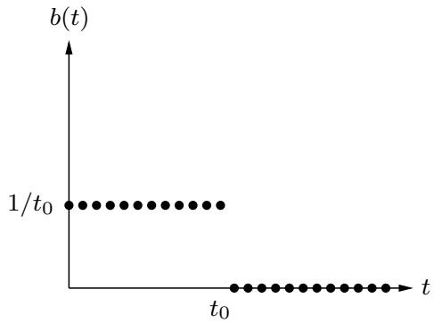

import Guide from '@/components/Guide.astro';
import Knowledge from '@/components/Knowledge.astro';
import Example from '@/components/Example.astro';
import Analysis from '@/components/Analysis.astro';
import Solution from '@/components/Solution.astro';
import Variant from '@/components/Variant.astro';
import Note from '@/components/Note.astro';
import Block from '@/components/Block.astro';
import Method from '@/components/Method.astro';
import Exercise from '@/components/Exercise.astro';

## Chapter 2 Exercises

<Exercise title="Exercise 2.1">

Use the divide-and-conquer integer multiplication algorithm to multiply the two binary integers 10011011 and 10111010.

</Exercise>

<Exercise title="Exercise 2.2">

Show that for any positive integers n and any base $b ,$ there must some power of b lying in the range [n, bn].

</Exercise>

<Exercise title="Exercise 2.3">

Section 2.2 describes a method for solving recurrence relations which is based on analyzing the recursion tree and deriving a formula for the work done at each level. Another (closely related) method is to expand out the recurrence a few times, until a pattern emerges. For instance, let's start with the familiar $T ( n ) = 2 T ( n / 2 ) + O ( n )$ . Think of $O ( n )$ as being $\leq c n$ for some constant $c ,$ so: $T ( n ) \leq 2 T ( n / 2 )$ + cn. By repeatedly applying this rule, we can bound $T ( n )$ in terms of $T ( n / 2 )$ then $T ( n / 4 )$ , then $T ( n / 8 )$ , and so on, at each step getting closer to the value of $T ( \cdot )$ we do know, namely $T ( 1 ) = O ( 1 )$

$$
\begin{array}{r c l} T (n) & \leq & 2 T (n / 2) + c n \\ & \leq & 2 [ 2 T (n / 4) + c n / 2 ] + c n = 4 T (n / 4) + 2 c n \\ & \leq & 4 [ 2 T (n / 8) + c n / 4 ] + 2 c n = 8 T (n / 8) + 3 c n \\ & \leq & 8 [ 2 T (n / 1 6) + c n / 8 ] + 3 c n = 1 6 T (n / 1 6) + 4 c n \\ & \vdots \end{array}
$$

A pattern is emerging... the general term is

$$
T (n) \leq 2 ^ {k} T (n / 2 ^ {k}) + k c n.
$$

Plugging in $k = \log _ { 2 } n ,$ , we get $T ( n ) \leq n T ( 1 ) + c n \log _ { 2 } n = O ( n \log n ) .$

(a) Do the same thing for the recurrence $T ( n ) = 3 T ( n / 2 ) + O ( n )$ . What is the general kth term in this case? And what value of k should be plugged in to get the answer?

(b) Now try the recurrence $T ( n ) = T ( n - 1 ) + O ( 1 )$ , a case which is not covered by the master theorem. Can you solve this too?

</Exercise>

<Exercise title="Exercise 2.4">

Suppose you are choosing between the following three algorithms:

Algorithm A solves problems by dividing them into five subproblems of half the size, recursively solving each subproblem, and then combining the solutions in linear time.

Algorithm B solves problems of size n by recursively solving two subproblems of size $n - 1$ and then combining the solutions in constant time.

Algorithm C solves problems of size n by dividing them into nine subproblems of size $n / 3$ recursively solving each subproblem, and then combining the solutions in $O ( n ^ { 2 } )$ time.

What are the running times of each of these algorithms (in big-O notation), and which would you choose?

</Exercise>

<Exercise title="Exercise 2.5">

Solve the following recurrence relations and give a Θ bound for each of them.

$$
(a) T (n) = 2 T (n / 3) + 1
$$

$$
\text { (b) } T (n) = 5 T (n / 4) + n
$$

$$
(\mathbf {c}) T (n) = 7 T (n / 7) + n
$$

$$
(\mathbf {d}) T (n) = 9 T (n / 3) + n ^ {2}
$$

(e) $T ( n ) = 8 T ( n / 2 ) + n ^ { 3 }$ (f) $T ( n ) = 4 9 T ( n / 2 5 ) + n ^ { 3 / 2 } \log n$ (g) $T ( n ) = T ( n - 1 ) + 2$ (h) $T ( n ) = T ( n - 1 ) + n ^ { c } ;$ , where $c \geq 1$ is a constant (i) $T ( n ) = T ( n - 1 ) + c ^ { n }$ , where $c > 1$ is some constant (j) $T ( n ) = 2 T ( n - 1 ) + 1$ (k) $T ( n ) = T ( { \sqrt { n } } ) + 1$

</Exercise>

<Exercise title="Exercise 2.6">

A linear, time-invariant system has the following impulse response:



(a) Describe in words the effect of this system.

(b) What is the corresponding polynomial?

</Exercise>

<Exercise title="Exercise 2.7">

What is the sum of the nth roots of unity? What is their product if n is odd? If n is even?

</Exercise>

<Exercise title="Exercise 2.8">

Practice with the fast Fourier transform.

(a) What is the FFT of $( 1 , 0 , 0 , 0 ) ?$ What is the appropriate value of ω in this case? And of which sequence is $( 1 , 0 , 0 , 0 )$ the FFT?

(b) Repeat for $( 1 , 0 , 1 , - 1 )$

</Exercise>

<Exercise title="Exercise 2.9">

Practice with polynomial multiplication by FFT.

(a) Suppose that you want to multiply the two polynomials $x + 1$ and $x ^ { 2 } + 1$ using the FFT. Choose an appropriate power of two, find the FFT of the two sequences, multiply the results componentwise, and compute the inverse FFT to get the final result.

(b) Repeat for the pair of polynomials $1 + x + 2 x ^ { 2 }$ and $2 + 3 x$

</Exercise>

<Exercise title="Exercise 2.10">

Find the unique polynomial of degree 4 that takes on values $p ( 1 ) = 2 , p ( 2 ) = 1 , p ( 3 ) = 0 , p ( 4 ) = 4 _ { ! }$ and $p ( 5 ) = 0$ . Write your answer in the coefficient representation.

</Exercise>

<Exercise title="Exercise 2.11">

In justifying our matrix multiplication algorithm (Section 2.5), we claimed the following blockwise property: if X and Y are $n \times n$ matrices, and

$$
X = \left[ \begin{array}{c c} A & B \\ C & D \end{array} \right], Y = \left[ \begin{array}{c c} E & F \\ G & H \end{array} \right].
$$

where $A , \ B , \ C , \ D , \ E , \ F , \ G ,$ , and H are $n / 2 \times n / 2$ submatrices, then the product $X Y$ can be expressed in terms of these blocks:

$$
X Y = \left[ \begin{array}{c c} A & B \\ C & D \end{array} \right] \left[ \begin{array}{c c} E & F \\ G & H \end{array} \right] = \left[ \begin{array}{c c} A E + B G & A F + B H \\ C E + D G & C F + D H \end{array} \right]
$$

Prove this property.

</Exercise>

<Exercise title="Exercise 2.12">

How many lines, as a function of n (in Θ( ) form), does the following program print? Write a recurrence and solve it. You may assume n is a power of 2.

```python
function f(n)
    if n > 1:
    print_line('still going')
    f(n/2)
    f(n/2)
```

</Exercise>

<Exercise title="Exercise 2.13">

A binary tree is full if all of its vertices have either zero or two children. Let $B _ { n }$ denote the number of full binary trees with n vertices.

(a) By drawing out all full binary trees with 3, 5, or 7 vertices, determine the exact values of $B _ { 3 } , B _ { 5 }$ , and $B _ { 7 }$ . Why have we left out even numbers of vertices, like $B _ { 4 } ?$

(b) For general $n ,$ derive a recurrence relation for $B _ { n }$ .

(c) Show by induction that $B _ { n }$ is $\Omega ( 2 ^ { n } )$

</Exercise>

<Exercise title="Exercise 2.14">

You are given an array of n elements, and you notice that some of the elements are duplicates; that is, they appear more than once in the array. Show how to remove all duplicates from the array in time $O ( n \log n )$

</Exercise>

<Exercise title="Exercise 2.15">

In our median-finding algorithm (Section 2.4), a basic primitive is the split operation, which takes as input an array S and a value v and then divides S into three sets: the elements less than v, the elements equal to $v ,$ and the elements greater than v. Show how to implement this split operation in place, that is, without allocating new memory.

</Exercise>

<Exercise title="Exercise 2.16">

You are given an infinite array $A [ \cdot ]$ in which the first n cells contain integers in sorted order and the rest of the cells are filled with . You are not given the value of n. Describe an algorithm that takes an integer x as input and finds a position in the array containing $x ,$ if such a position exists, in $O ( \log n )$ time. (If you are disturbed by the fact that the array A has infinite length, assume instead that it is of length $n ,$ but that you don't know this length, and that the implementation of the array data type in your programming language returns the error message whenever elements $A [ i ]$ with $i > n$ are accessed.)

</Exercise>

<Exercise title="Exercise 2.17">

Given a sorted array of distinct integers $A [ 1 , \ldots , n ]$ , you want to find out whether there is an index i for which $A [ i ] = i .$ Give a divide-and-conquer algorithm that runs in time $O ( \log n )$

</Exercise>

<Exercise title="Exercise 2.18">

Consider the task of searching a sorted array $A [ 1 \ldots n ]$ for a given element x: a task we usually perform by binary search in time $O ( \log n )$ . Show that any algorithm that accesses the array only via comparisons (that is, by asking questions of the form “is $A [ i ] \leq z ? ^ { \mathfrak { n } } )$ , must take $\Omega ( \log n )$ steps.

</Exercise>

<Exercise title="Exercise 2.19">

A k-way merge operation. Suppose you have k sorted arrays, each with n elements, and you want to combine them into a single sorted array of kn elements.

(a) Here's one strategy: Using the merge procedure from Section 2.3, merge the first two arrays, then merge in the third, then merge in the fourth, and so on. What is the time complexity of this algorithm, in terms of k and $n ?$

(b) Give a more efficient solution to this problem, using divide-and-conquer.

</Exercise>

<Exercise title="Exercise 2.20">

Show that any array of integers $x [ 1 \ldots n ]$ can be sorted in $O ( n + M )$ time, where

$$
M = \max _ {i} x _ {i} - \min _ {i} x _ {i}.
$$

For small M, this is linear time: why doesn't the Ω(n log n) lower bound apply in this case?

</Exercise>

<Exercise title="Exercise 2.21">

Mean and median. One of the most basic tasks in statistics is to summarize a set of observations $\{ x _ { 1 } , x _ { 2 } , \ldots , x _ { n } \} \subseteq \mathbb { R }$ by a single number. Two popular choices for this summary statistic are:

The median, which we'll call $\mu _ { 1 }$

The mean, which we'll call $\mu _ { 2 }$

(a) Show that the median is the value of $\mu$ that minimizes the function

$$
\sum_ {i} | x _ {i} - \mu |.
$$

You can assume for simplicity that n is odd. (Hint: Show that for any $\mu \neq \mu _ { 1 }$ , the function decreases if you move $\mu$ either slightly to the left or slightly to the right.)

(b) Show that the mean is the value of ${ \bf \dot { \mu } } _ { \mu }$ that minimizes the function

$$
\sum_ {i} (x _ {i} - \mu) ^ {2}.
$$

One way to do this is by calculus. Another method is to prove that for any $\mu \in \mathbb { R }$

$$
\sum_ {i} (x _ {i} - \mu) ^ {2} = \sum_ {i} (x _ {i} - \mu_ {2}) ^ {2} + n (\mu - \mu_ {2}) ^ {2}.
$$

Notice how the function for $\mu _ { 2 }$ penalizes points that are far from $\mu$ much more heavily than the function for $\mu _ { 1 }$ . Thus $\mu _ { 2 }$ tries much harder to be close to all the observations. This might sound like a good thing at some level, but it is statistically undesirable because just a few outliers can severely throw off the estimate of $\mu _ { 2 }$ . It is therefore sometimes said that $\mu _ { 1 }$ is a more robust estimator than $\mu _ { 2 }$ . Worse than either of them, however, is $\mu _ { \infty }$ , the value of $\mu$ that minimizes the function

$$
\max _ {i} | x _ {i} - \mu |.
$$

(c) Show that $\mu _ { \infty }$ can be computed in $O ( n )$ time (assuming the numbers $x _ { i }$ are small enough that basic arithmetic operations on them take unit time).

</Exercise>

<Exercise title="Exercise 2.22">

You are given two sorted lists of size m and n. Give an $O ( \log m + \log n )$ time algorithm for computing the kth smallest element in the union of the two lists.

</Exercise>

<Exercise title="Exercise 2.23">

An array $A [ 1 \ldots n ]$ is said to have a majority element if more than half of its entries are the same. Given an array, the task is to design an efficient algorithm to tell whether the array has a majority element, and, if so, to find that element. The elements of the array are not necessarily from some ordered domain like the integers, and so there can be no comparisons of the form “is $A [ i ] > A [ j ] ? ^ { \prime \prime }$ . (Think of the array elements as GIF files, say.) However you can answer questions of the form: “is $A [ i ] = A [ j ] ? ^ { \mathfrak { n } }$ in constant time.

(a) Show how to solve this problem in O(n log n) time. (Hint: Split the array A into two arrays $A _ { 1 }$ and $A _ { 2 }$ of half the size. Does knowing the majority elements of $A _ { 1 }$ and $A _ { 2 }$ help you figure out the majority element of A? If so, you can use a divide-and-conquer approach.)

(b) Can you give a linear-time algorithm? (Hint: Here's another divide-and-conquer approach:

Pair up the elements of A arbitrarily, to get $n / 2$ pairs

Look at each pair: if the two elements are different, discard both of them; if they are the same, keep just one of them

Show that after this procedure there are at most $n / 2$ elements left, and that they have a majority element if and only if A does.)

</Exercise>

<Exercise title="Exercise 2.24">

On page 62 there is a high-level description of the quicksort algorithm.

(a) Write down the pseudocode for quicksort.

(b) Show that its worst-case running time on an array of size n is $\Theta ( n ^ { 2 } )$

(c) Show that its expected running time satisfies the recurrence relation

$$
T (n) \leq O (n) + \frac {1}{n} \sum_ {i = 1} ^ {n - 1} (T (i) + T (n - i)).
$$

Then, show that the solution to this recurrence is O(n log n).

</Exercise>

<Exercise title="Exercise 2.25">

In Section 2.1 we described an algorithm that multiplies two n-bit binary integers x and y in time na, where a = log 3. Call this procedure fastmultiply(x, y).

(a) We want to convert the decimal integer 10n (a 1 followed by n zeros) into binary. Here is the algorithm (assume n is a power of 2):

<div class="mineru-algorithm">
function pwr2bin(n)
    if n=1: return  $1010_{2}$ 
    else:
    z=??? 
    return fastmultiply(z,z)
</div>

Fill in the missing details. Then give a recurrence relation for the running time of the algorithm, and solve the recurrence.

(b) Next, we want to convert any decimal integer x with n digits (where n is a power of 2) into binary. The algorithm is the following:

<div class="mineru-algorithm">
function dec2bin(x)
    if n=1: return binary[x]
    else:
    split x into two decimal numbers  $x_{L}$ ,  $x_{R}$  with n/2 digits each
    return ???
</div>

Here binary[ ] is a vector that contains the binary representation of all one-digit integers. That is, binary[0] = 0<sub>2</sub>, binary[1] = 1<sub>2</sub>, up to binary[9] = 1001<sub>2</sub>. Assume that a lookup in binary takes O(1) time.

Fill in the missing details. Once again, give a recurrence for the running time of the algorithm, and solve it.

</Exercise>

<Exercise title="Exercise 2.26">

Professor F. Lake tells his class that it is asymptotically faster to square an n-bit integer than to multiply two n-bit integers. Should they believe him?

</Exercise>

<Exercise title="Exercise 2.27">

The square of a matrix A is its product with itself, AA.

(a) Show that five multiplications are sufficient to compute the square of a $2 \times 2$ matrix.

(b) What is wrong with the following algorithm for computing the square of an n n matrix?

“Use a divide-and-conquer approach as in Strassen's algorithm, except that instead of getting 7 subproblems of size $n / 2 ,$ , we now get 5 subproblems of size $n / 2$ thanks to part (a). Using the same analysis as in Strassen's algorithm, we can conclude that the algorithm runs in time ${ \dot { O } } ( n ^ { \log _ { 2 } 5 } )$ .”

(c) In fact, squaring matrices is no easier than matrix multiplication. In this part, you will show that if $n \times n$ matrices can be squared in time $S ( n ) ~ = ~ { \cal O } ( n ^ { c } )$ , then any two $n \times n$ matrices can be multiplied in time $O ( n ^ { c } )$

i. Given two $n \times n$ matrices A and B, show that the matrix $A B + B A$ can be computed in time $3 S ( n ) + O ( n ^ { 2 } )$

ii. Given two $n \times n$ matrices X and Y, define the $2 n \times 2 n$ matrices A and B as follows:

$$
A = \left[ \begin{array}{c c} X & 0 \\ 0 & 0 \end{array} \right] \text {and} B = \left[ \begin{array}{c c} 0 & Y \\ 0 & 0 \end{array} \right].
$$

What is $A B + B A ,$ in terms of X and $Y ?$

iii. Using (i) and (ii), argue that the product $X Y$ can be computed in time $3 S ( 2 n ) + O ( n ^ { 2 } )$ Conclude that matrix multiplication takes time $O ( n ^ { c } )$

</Exercise>

<Exercise title="Exercise 2.28">

The Hadamard matrices $H _ { 0 } , H _ { 1 } , H _ { 2 } , . . .$ . are defined as follows:

$H _ { 0 }$ is the $1 \times 1$ matrix 1

• For $k > 0 , H _ { k }$ is the $2 ^ { k } \times 2 ^ { k }$ matrix

$$
H _ {k} = \left[ \begin{array}{c c} H _ {k - 1} & H _ {k - 1} \\ \hline H _ {k - 1} & - H _ {k - 1} \end{array} \right]
$$

Show that if v is a column vector of length $n = 2 ^ { k }$ , then the matrix-vector product $H _ { k } v$ can be calculated using $O ( n \log n )$ operations. Assume that all the numbers involved are small enough that basic arithmetic operations like addition and multiplication take unit time.

</Exercise>

<Exercise title="Exercise 2.29">

Suppose we want to evaluate the polynomial $p ( x ) = a _ { 0 } + a _ { 1 } x + a _ { 2 } x ^ { 2 } + \cdot \cdot \cdot + a _ { n } x ^ { n }$ at point x.

(a) Show that the following simple routine, known as Horner's rule, does the job and leaves the answer in z.

$$
\begin{array}{c} z = a _ {n} \\ \text { for } i = n - 1 \text { downto } 0: \\ z = z x + a _ {i} \end{array}
$$

(b) How many additions and multiplications does this routine use, as a function of $n ?$ Can you find a polynomial for which an alternative method is substantially better?

</Exercise>

<Exercise title="Exercise 2.30">

This problem illustrates how to do the Fourier Transform (FT) in modular arithmetic, for example, modulo 7.

(a) There is a number $\omega$ such that all the powers $\omega , \omega ^ { 2 } , \ldots , \omega ^ { 6 }$ are distinct (modulo 7). Find this ω, and show that $\omega + \omega ^ { 2 } + \cdot \cdot \cdot + \omega ^ { 6 } = 0$ . (Interestingly, for any prime modulus there is such a number.)

(b) Using the matrix form of the FT, produce the transform of the sequence $( 0 , 1 , 1 , 1 , 5 , 2 )$ modulo 7; that is, multiply this vector by the matrix $M _ { 6 } ( \omega )$ , for the value of ω you found earlier. In the matrix multiplication, all calculations should be performed modulo 7.

(c) Write down the matrix necessary to perform the inverse FT. Show that multiplying by this matrix returns the original sequence. (Again all arithmetic should be performed modulo 7.)

(d) Now show how to multiply the polynomials $x ^ { 2 } + x + 1$ and $x ^ { 3 } + 2 x - 1$ using the FT modulo 7.

</Exercise>

<Exercise title="Exercise 2.31">

In Section 1.2.3, we studied Euclid's algorithm for computing the greatest common divisor (gcd) of two positive integers: the largest integer which divides them both. Here we will look at an alternative algorithm based on divide-and-conquer.

(a) Show that the following rule is true.

$$
\operatorname * {g c d} (a, b) = \left\{ \begin{array}{l l} 2 \operatorname * {g c d} (a / 2, b / 2) & \text { if   } a, b \text {   are   even } \\ \operatorname * {g c d} (a, b / 2) & \text { if   } a \text {   is   odd }, b \text {   is   even } \\ \operatorname * {g c d} ((a - b) / 2, b) & \text { if   } a, b \text {   are   odd } \end{array} \right.
$$

(b) Give an efficient divide-and-conquer algorithm for greatest common divisor.

(c) How does the efficiency of your algorithm compare to Euclid's algorithm if a and b are n-bit integers? (In particular, since n might be large you cannot assume that basic arithmetic operations like addition take constant time.)

</Exercise>

<Exercise title="Exercise 2.32">

In this problem we will develop a divide-and-conquer algorithm for the following geometric task.

CLOSEST PAIR

Input: A set of points in the plane, $\{ p _ { 1 } = ( x _ { 1 } , y _ { 1 } ) , p _ { 2 } = ( x _ { 2 } , y _ { 2 } ) , \ldots , p _ { n } = ( x _ { n } , y _ { n } ) \}$

Output: The closest pair of points: that is, the pair $p _ { i } \neq p _ { j }$ for which the distance between $p _ { i }$ and $p _ { j }$ , that is,

$$
\sqrt {(x _ {i} - x _ {j}) ^ {2} + (y _ {i} - y _ {j}) ^ {2}},
$$

is minimized.

For simplicity, assume that n is a power of two, and that all the x-coordinates $x _ { i }$ are distinct, as are the y-coordinates.

Here's a high-level overview of the algorithm:

Find a value x for which exactly half the points have $x _ { i } < x _ { \ast }$ , and half have $x _ { i } > x .$ . On this basis, split the points into two groups, L and R.

Recursively find the closest pair in L and in R. Say these pairs are $p _ { L } , q _ { L } \in L$ and $p _ { R } , q _ { R } \in R _ { ☉ }$ with distances $d _ { L }$ and $d _ { R }$ respectively. Let d be the smaller of these two distances.

It remains to be seen whether there is a point in L and a point in R that are less than distance d apart from each other. To this end, discard all points with $x _ { i } < x - d \mathbf { o r } x _ { i } > x + d $ and sort the remaining points by y-coordinate.

Now, go through this sorted list, and for each point, compute its distance to the seven subsequent points in the list. Let $p _ { M } , q _ { M }$ be the closest pair found in this way.

The answer is one of the three pairs $\{ p _ { L } , q _ { L } \} , \{ p _ { R } , q _ { R } \} , \{ p _ { M } , q _ { M } \}$ , whichever is closest.

(a) In order to prove the correctness of this algorithm, start by showing the following property: any square of size d $\times d$ in the plane contains at most four points of L.

(b) Now show that the algorithm is correct. The only case which needs careful consideration is when the closest pair is split between L and R.

(c) Write down the pseudocode for the algorithm, and show that its running time is given by the recurrence:

$$
T (n) = 2 T (n / 2) + O (n \log n).
$$

Show that the solution to this recurrence is $O ( n \log ^ { 2 } n )$

(d) Can you bring the running time down to $O ( n \log n ) ?$

</Exercise>

