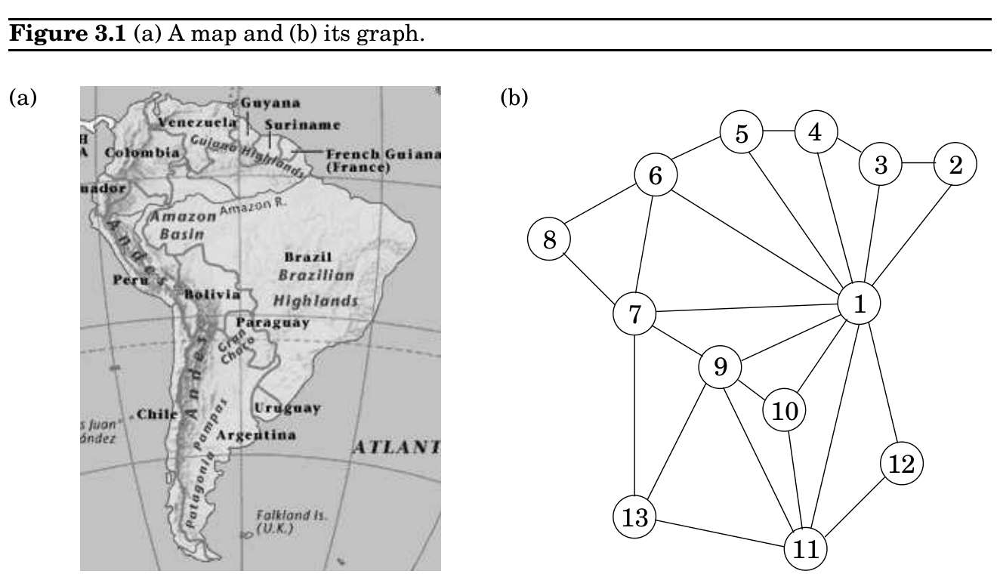

import Guide from '@/components/Guide.astro';
import Knowledge from '@/components/Knowledge.astro';
import Example from '@/components/Example.astro';
import Analysis from '@/components/Analysis.astro';
import Solution from '@/components/Solution.astro';
import Variant from '@/components/Variant.astro';
import Note from '@/components/Note.astro';
import Block from '@/components/Block.astro';
import Method from '@/components/Method.astro';
import Exercise from '@/components/Exercise.astro';

## 3.1 Why graphs?

### Decompositions of graphs

A wide range of problems can be expressed with clarity and precision in the concise pictorial language of graphs. For instance, consider the task of coloring a political map. What is the minimum number of colors needed, with the obvious restriction that neighboring countries should have different colors? One of the difficulties in attacking this problem is that the map itself, even a stripped-down version like Figure 3.1(a), is usually cluttered with irrelevant information: intricate boundaries, border posts where three or more countries meet, open seas, and meandering rivers. Such distractions are absent from the mathematical object of Figure 3.1(b), a graph with one vertex for each country (1 is Brazil, 11 is Argentina) and edges between neighbors. It contains exactly the information needed for coloring, and nothing more. The precise goal is now to assign a color to each vertex so that no edge has endpoints of the same color.

Graph coloring is not the exclusive domain of map designers. Suppose a university needs to schedule examinations for all its classes and wants to use the fewest time slots possible. The only constraint is that two exams cannot be scheduled concurrently if some student will be taking both of them. To express this problem as a graph, use one vertex for each exam and put an edge between two vertices if there is a conflict, that is, if there is somebody taking both endpoint exams. Think of each time slot as having its own color. Then, assigning time slots is exactly the same as coloring this graph!

Some basic operations on graphs arise with such frequency, and in such a diversity of contexts, that a lot of effort has gone into finding efficient procedures for them. This chapter is devoted to some of the most fundamental of these algorithms—those that uncover the basic connectivity structure of a graph.

Formally, a graph is specified by a set of vertices (also called nodes) V and by edges E between select pairs of vertices. In the map example, V = &#123;1, 2, 3, . . . , 13&#125; and E includes, among many other edges, &#123;1, 2&#125;, &#123;9, 11&#125;, and &#123;7, 13&#125;. Here an edge between x and y specifically means “x shares a border with y.” This is a symmetric relation—it implies also that y shares a border with x—and we denote it using set notation, e = &#123;x, y&#125;. Such edges are undirected and are part of an undirected graph.

Sometimes graphs depict relations that do not have this reciprocity, in which case it is

necessary to use edges with directions on them. There can be directed edges e from x to y (written e = (x, y)), or from y to x (written (y, x)), or both. A particularly enormous example of a directed graph is the graph of all links in the World Wide Web. It has a vertex for each site on the Internet, and a directed edge (u, v) whenever site u has a link to site v: in total, billions of nodes and edges! Understanding even the most basic connectivity properties of the Web is of great economic and social interest. Although the size of this problem is daunting, we will soon see that a lot of valuable information about the structure of a graph can, happily, be determined in just linear time.

### 3.1.1 How is a graph represented?

We can represent a graph by an adjacency matrix; if there are n = |V | vertices v_&#123;1&#125;, . . . , v_&#123;n&#125;, this is an n × n array whose (i, j)th entry is

a_&#123;ij&#125; =

 1 if there is an edge from v_&#123;i&#125; to v_&#123;j&#125; 0 otherwise.

For undirected graphs, the matrix is symmetric since an edge &#123;u, v&#125; can be taken in either direction.

The biggest convenience of this format is that the presence of a particular edge can be checked in constant time, with just one memory access. On the other hand the matrix takes up O(n^&#123;2&#125;) space, which is wasteful if the graph does not have very many edges.

An alternative representation, with size proportional to the number of edges, is the adjacency list. It consists of |V | linked lists, one per vertex. The linked list for vertex u holds the names of vertices to which u has an outgoing edge—that is, vertices v for which (u, v) ∈E.
