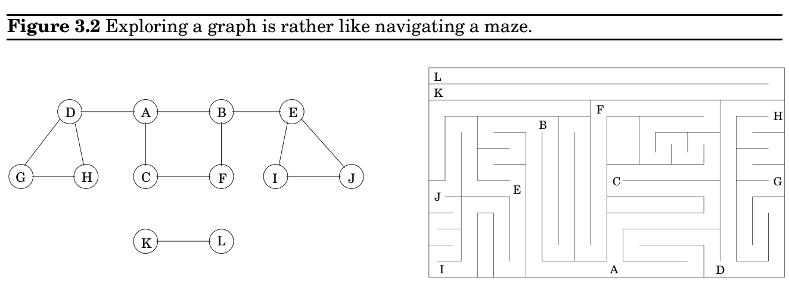
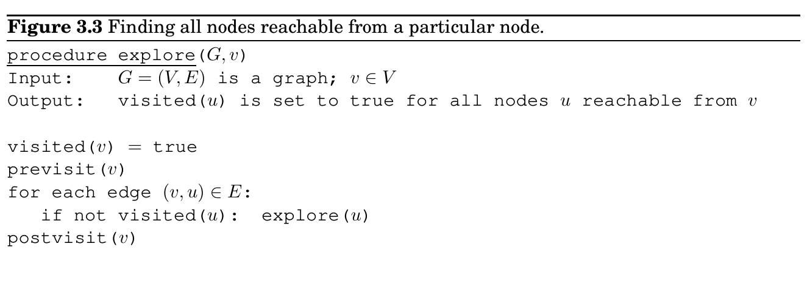
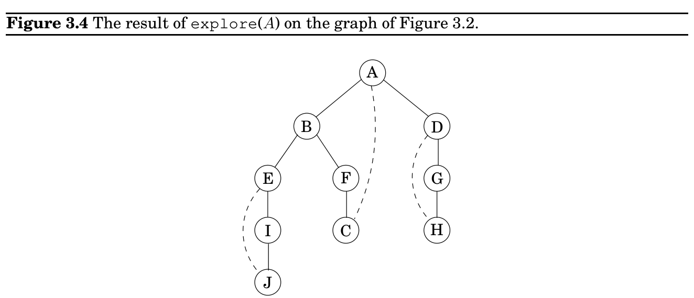
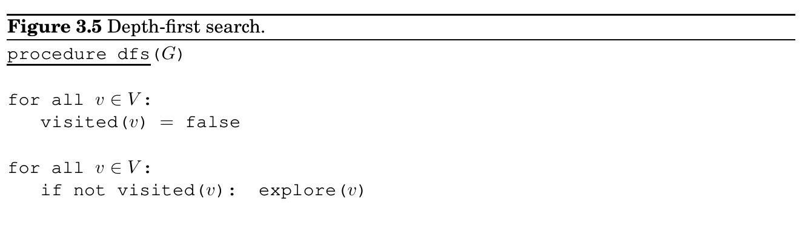
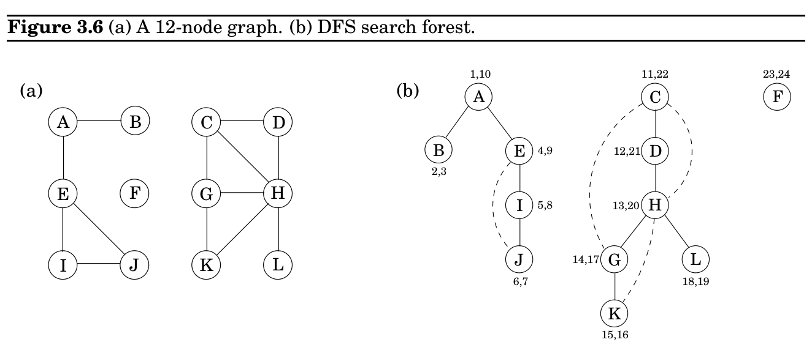

import Guide from '@/components/Guide.astro';
import Knowledge from '@/components/Knowledge.astro';
import Example from '@/components/Example.astro';
import Analysis from '@/components/Analysis.astro';
import Solution from '@/components/Solution.astro';
import Variant from '@/components/Variant.astro';
import Note from '@/components/Note.astro';
import Block from '@/components/Block.astro';
import Method from '@/components/Method.astro';
import Exercise from '@/components/Exercise.astro';

## 3.2 Depth-first search in undirected graphs

Therefore, each edge appears in exactly one of the linked lists if the graph is directed or two of the lists if the graph is undirected. Either way, the total size of the data structure is O(|E|). Checking for a particular edge (u, v) is no longer constant time, because it requires sifting through u’s adjacency list. But it is easy to iterate through all neighbors of a vertex (by running down the corresponding linked list), and, as we shall soon see, this turns out to be a very useful operation in graph algorithms. Again, for undirected graphs, this representation has a symmetry of sorts: v is in u’s adjacency list if and only if u is in v’s adjacency list.

### How big is your graph?

Which of the two representations, adjacency matrix or adjacency list, is better? Well, it depends on the relationship between |V |, the number of nodes in the graph, and |E|, the number of edges. |E| can be as small as |V | (if it gets much smaller, then the graph degenerates— for example, has isolated vertices), or as large as |V |^&#123;2&#125; (when all possible edges are present). When |E| is close to the upper limit of this range, we call the graph dense. At the other extreme, if |E| is close to |V |, the graph is sparse. As we shall see in this chapter and the next two chapters, exactly where |E| lies in this range is usually a crucial factor in selecting the right graph algorithm.

Or, for that matter, in selecting the graph representation. If it is the World Wide Web graph that we wish to store in computer memory, we should think twice before using an adjacency matrix: at the time of writing, search engines know of about eight billion vertices of this graph, and hence the adjacency matrix would take up dozens of millions of terabits. Again at the time we write these lines, it is not clear that there is enough computer memory in the whole world to achieve this. (And waiting a few years until there is enough memory is unwise: the Web will grow too and will probably grow faster.)

With adjacency lists, representing the World Wide Web becomes feasible: there are only a few dozen billion hyperlinks in the Web, and each will occupy a few bytes in the adjacency list. You can carry a device that stores the result, a terabyte or two, in your pocket (it may soon fit in your earring, but by that time the Web will have grown too).

The reason why adjacency lists are so much more effective in the case of the World Wide Web is that the Web is very sparse: the average Web page has hyperlinks to only about half a dozen other pages, out of the billions of possibilities.

### 3.2.1 Exploring mazes

Depth-first search is a surprisingly versatile linear-time procedure that reveals a wealth of information about a graph. The most basic question it addresses is,

What parts of the graph are reachable from a given vertex?

To understand this task, try putting yourself in the position of a computer that has just been given a new graph, say in the form of an adjacency list. This representation offers just one basic operation: finding the neighbors of a vertex. With only this primitive, the reachability problem is rather like exploring a labyrinth (Figure 3.2). You start walking from a fixed place

and whenever you arrive at any junction (vertex) there are a variety of passages (edges) you can follow. A careless choice of passages might lead you around in circles or might cause you to overlook some accessible part of the maze. Clearly, you need to record some intermediate information during exploration.

This classic challenge has amused people for centuries. Everybody knows that all you need to explore a labyrinth is a ball of string and a piece of chalk. The chalk prevents looping, by marking the junctions you have already visited. The string always takes you back to the starting place, enabling you to return to passages that you previously saw but did not yet investigate.

How can we simulate these two primitives, chalk and string, on a computer? The chalk marks are easy: for each vertex, maintain a Boolean variable indicating whether it has been visited already. As for the ball of string, the correct cyberanalog is a stack. After all, the exact role of the string is to offer two primitive operations—unwind to get to a new junction (the stack equivalent is to push the new vertex) and rewind to return to the previous junction (pop the stack).

Instead of explicitly maintaining a stack, we will do so implicitly via recursion (which is implemented using a stack of activation records). The resulting algorithm is shown in

Figure 3.3.^&#123;1&#125; The previsit and postvisit procedures are optional, meant for performing operations on a vertex when it is first discovered and also when it is being left for the last time. We will soon see some creative uses for them.

More immediately, we need to confirm that explore always works correctly. It certainly does not venture too far, because it only moves from nodes to their neighbors and can therefore never jump to a region that is not reachable from v. But does it find all vertices reachable from v? Well, if there is some u that it misses, choose any path from v to u, and look at the last vertex on that path that the procedure actually visited. Call this node z, and let w be the node immediately after it on the same path.

z w v u

So z was visited but w was not. This is a contradiction: while the explore procedure was at node z, it would have noticed w and moved on to it.

Incidentally, this pattern of reasoning arises often in the study of graphs and is in essence a streamlined induction. A more formal inductive proof would start by framing a hypothesis, such as “for any k ≥0, all nodes within k hops from v get visited.” The base case is as usual trivial, since v is certainly visited. And the general case—showing that if all nodes k hops away are visited, then so are all nodes k + 1 hops away—is precisely the same point we just argued.

Figure 3.4 shows the result of running explore on our earlier example graph, starting at node A, and breaking ties in alphabetical order whenever there is a choice of nodes to visit. The solid edges are those that were actually traversed, each of which was elicited by a call to explore and led to the discovery of a new vertex. For instance, while B was being visited, the edge B −E was noticed and, since E was as yet unknown, was traversed via a call to explore(E). These solid edges form a tree (a connected graph with no cycles) and are therefore called tree edges. The dotted edges were ignored because they led back to familiar terrain, to vertices previously visited. They are called back edges.

### 3.2.2 Depth-first search

The explore procedure visits only the portion of the graph reachable from its starting point. To examine the rest of the graph, we need to restart the procedure elsewhere, at some vertex that has not yet been visited. The algorithm of Figure 3.5, called depth-first search (DFS), does this repeatedly until the entire graph has been traversed.

The first step in analyzing the running time of DFS is to observe that each vertex is explore’d just once, thanks to the visited array (the chalk marks). During the exploration of a vertex, there are the following steps:

1. Some fixed amount of work—marking the spot as visited, and the pre/postvisit.

2. A loop in which adjacent edges are scanned, to see if they lead somewhere new.

1As with many of our graph algorithms, this one applies to both undirected and directed graphs. In such cases, we adopt the directed notation for edges, (x, y). If the graph is undirected, then each of its edges should be thought of as existing in both directions: (x, y) and (y, x).

This loop takes a different amount of time for each vertex, so let’s consider all vertices together. The total work done in step 1 is then O(|V |). In step 2, over the course of the entire DFS, each edge &#123;x, y&#125; ∈E is examined exactly twice, once during explore(x) and once during explore(y). The overall time for step 2 is therefore O(|E|) and so the depth-first search has a running time of O(|V | + |E|), linear in the size of its input. This is as efficient as we could possibly hope for, since it takes this long even just to read the adjacency list.

Figure 3.6 shows the outcome of depth-first search on a 12-node graph, once again breaking ties alphabetically (ignore the pairs of numbers for the time being). The outer loop of DFS calls explore three times, on A, C, and finally F. As a result, there are three trees, each rooted at one of these starting points. Together they constitute a forest.

### 3.2.3 Connectivity in undirected graphs

An undirected graph is connected if there is a path between any pair of vertices. The graph of Figure 3.6 is not connected because, for instance, there is no path from A to K. However, it does have three disjoint connected regions, corresponding to the following sets of vertices:

&#123;A, B, E, I, J&#125; &#123;C, D, G, H, K, L&#125; &#123;F&#125;

These regions are called connected components: each of them is a subgraph that is internally connected but has no edges to the remaining vertices. When explore is started at a particular vertex, it identifies precisely the connected component containing that vertex. And each time the DFS outer loop calls explore, a new connected component is picked out.

Thus depth-first search is trivially adapted to check if a graph is connected and, more generally, to assign each node v an integer ccnum[v] identifying the connected component to which it belongs. All it takes is

procedure previsit

(v) ccnum[v] = cc

where cc needs to be initialized to zero and to be incremented each time the DFS procedure calls explore.

### 3.2.4 Previsit and postvisit orderings

We have seen how depth-first search—a few unassuming lines of code—is able to uncover the connectivity structure of an undirected graph in just linear time. But it is far more versatile than this. In order to stretch it further, we will collect a little more information during the exploration process: for each node, we will note down the times of two important events, the moment of first discovery (corresponding to previsit) and that of final departure (postvisit). Figure 3.6 shows these numbers for our earlier example, in which there are 24 events. The fifth event is the discovery of I. The 21st event consists of leaving D behind for good.

One way to generate arrays pre and post with these numbers is to define a simple counter clock, initially set to 1, which gets updated as follows.

procedure previsit

(v) pre[v] = clock clock = clock + 1
