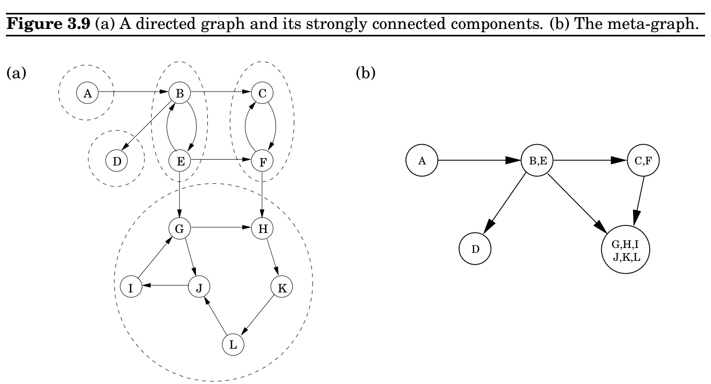
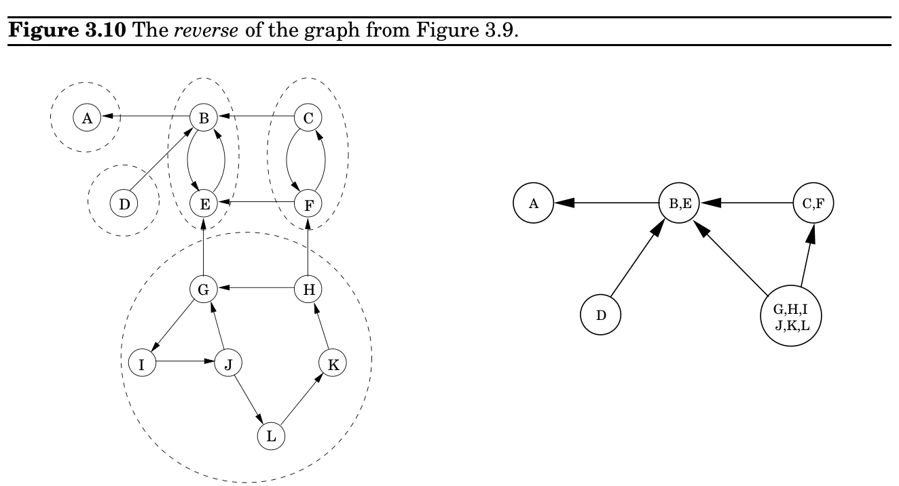

import Guide from '@/components/Guide.astro';
import Knowledge from '@/components/Knowledge.astro';
import Example from '@/components/Example.astro';
import Analysis from '@/components/Analysis.astro';
import Solution from '@/components/Solution.astro';
import Variant from '@/components/Variant.astro';
import Note from '@/components/Note.astro';
import Block from '@/components/Block.astro';
import Method from '@/components/Method.astro';
import Exercise from '@/components/Exercise.astro';

## 3.4 Strongly connected components

the same thing.

Since a dag is linearized by decreasing post numbers, the vertex with the smallest post number comes last in this linearization, and it must be a sink—no outgoing edges. Symmetrically, the one with the highest post is a source, a node with no incoming edges.

Property Every dag has at least one source and at least one sink.

The guaranteed existence of a source suggests an alternative approach to linearization:

Find a source, output it, and delete it from the graph.

Repeat until the graph is empty.

Can you see why this generates a valid linearization for any dag? What happens if the graph has cycles? And, how can this algorithm be implemented in linear time? (Exercise 3.14.)

### 3.4.1 Defining connectivity for directed graphs

Connectivity in undirected graphs is pretty straightforward: a graph that is not connected can be decomposed in a natural and obvious manner into several connected components (Figure 3.6 is a case in point). As we saw in Section 3.2.3, depth-first search does this handily, with each restart marking a new connected component.

In directed graphs, connectivity is more subtle. In some primitive sense, the directed graph of Figure 3.9(a) is “connected”—it can’t be “pulled apart,” so to speak, without breaking edges. But this notion is hardly interesting or informative. The graph cannot be considered connected, because for instance there is no path from G to B or from F to A. The right way to define connectivity for directed graphs is this:

Two nodes u and v of a directed graph are connected if there is a path from u to v and a path from v to u.

This relation partitions V into disjoint sets (Exercise 3.30) that we call strongly connected components. The graph of Figure 3.9(a) has five of them.

Now shrink each strongly connected component down to a single meta-node, and draw an edge from one meta-node to another if there is an edge (in the same direction) between their respective components (Figure 3.9(b)). The resulting meta-graph must be a dag. The reason is simple: a cycle containing several strongly connected components would merge them all into a single, strongly connected component. Restated,

Property Every directed graph is a dag of its strongly connected components.

This tells us something important: The connectivity structure of a directed graph is twotiered. At the top level we have a dag, which is a rather simple structure—for instance, it can be linearized. If we want finer detail, we can look inside one of the nodes of this dag and examine the full-fledged strongly connected component within.

### 3.4.2 An efficient algorithm

The decomposition of a directed graph into its strongly connected components is very informative and useful. It turns out, fortunately, that it can be found in linear time by making further use of depth-first search. The algorithm is based on some properties we have already seen but which we will now pinpoint more closely.

Property 1 If the explore subroutine is started at node u, then it will terminate precisely when all nodes reachable from u have been visited.

Therefore, if we call explore on a node that lies somewhere in a sink strongly connected component (a strongly connected component that is a sink in the meta-graph), then we will retrieve exactly that component. Figure 3.9 has two sink strongly connected components. Starting explore at node K, for instance, will completely traverse the larger of them and then stop.

This suggests a way of finding one strongly connected component, but still leaves open two major problems: (A) how do we find a node that we know for sure lies in a sink strongly connected component and (B) how do we continue once this first component has been discovered?

Let’s start with problem (A). There is not an easy, direct way to pick out a node that is guaranteed to lie in a sink strongly connected component. But there is a way to get a node in a source strongly connected component.

Property 2 The node that receives the highest post number in a depth-first search must lie in a source strongly connected component.

This follows from the following more general property.

Property 3 If C and C^&#123;′&#125; are strongly connected components, and there is an edge from a node

in C to a node in C^&#123;′&#125;, then the highest post number in C is bigger than the highest post number in C^&#123;′&#125;.

Proof. In proving Property 3, there are two cases to consider. If the depth-first search visits component C before component C^&#123;′&#125;, then clearly all of C and C^&#123;′&#125; will be traversed before the procedure gets stuck (see Property 1). Therefore the first node visited in C will have a higher post number than any node of C^&#123;′&#125;. On the other hand, if C^&#123;′&#125; gets visited first, then the depthfirst search will get stuck after seeing all of C^&#123; &#125;′ but before seeing any of C, in which case the property follows immediately.

Property 3 can be restated as saying that the strongly connected components can be linearized by arranging them in decreasing order of their highest post numbers. This is a generalization of our earlier algorithm for linearizing dags; in a dag, each node is a singleton strongly connected component.

Property 2 helps us find a node in the source strongly connected component of G. However, what we need is a node in the sink component. Our means seem to be the opposite of our needs! But consider the reverse graph G^&#123;R&#125;, the same as G but with all edges reversed (Figure 3.10). G^&#123;R&#125; has exactly the same strongly connected components as G (why?). So, if we do a depth-first search of G^&#123;R&#125;, the node with the highest post number will come from a source strongly connected component in G^&#123;R&#125;, which is to say a sink strongly connected component in G. We have solved problem (A)!

Onward to problem (B). How do we continue after the first sink component is identified? The solution is also provided by Property 3. Once we have found the first strongly connected component and deleted it from the graph, the node with the highest post number among those remaining will belong to a sink strongly connected component of whatever remains of G. Therefore we can keep using the post numbering from our initial depth-first search on G^&#123;R&#125;

to successively output the second strongly connected component, the third strongly connected component, and so on. The resulting algorithm is this.

1. Run depth-first search on G^&#123;R&#125;.

2. Run the undirected connected components algorithm (from Section 3.2.3) on G, and during the depth-first search, process the vertices in decreasing order of their post numbers from step 1.

This algorithm is linear-time, only the constant in the linear term is about twice that of straight depth-first search. (Question: How does one construct an adjacency list representation of G^&#123;R&#125; in linear time? And how, in linear time, does one order the vertices of G by decreasing post values?)

Let’s run this algorithm on the graph of Figure 3.9. If step 1 considers vertices in lexicographic order, then the ordering it sets up for the second step (namely, decreasing post numbers in the depth-first search of G^&#123;R&#125;) is: G, I, J, L, K, H, D, C, F, B, E, A. Then step 2 peels off components in the following sequence: &#123;G, H, I, J, K, L&#125;, &#123;D&#125;, &#123;C, F &#125;, &#123;B, E&#125;, &#123;A&#125;.

### Crawling fast

All this assumes that the graph is neatly given to us, with vertices numbered 1 to n and edges tucked in adjacency lists. The realities of the World Wide Web are very different. The nodes of the Web graph are not known in advance, and they have to be discovered one by one during the process of search. And, of course, recursion is out of the question.

Still, crawling the Web is done by algorithms very similar to depth-first search. An explicit stack is maintained, containing all nodes that have been discovered (as endpoints of hyperlinks) but not yet explored. In fact, this “stack” is not exactly a last-in, first-out list. It gives highest priority not to the nodes that were inserted most recently (nor the ones that were inserted earliest, that would be a breadth-first search, see Chapter 4), but to the ones that look most “interesting”—a heuristic criterion whose purpose is to keep the stack from overflowing and, in the worst case, to leave unexplored only nodes that are very unlikely to lead to vast new expanses.

In fact, crawling is typically done by many computers running explore simultaneously: each one takes the next node to be explored from the top of the stack, downloads the http file (the kind of Web files that point to each other), and scans it for hyperlinks. But when a new http document is found at the end of a hyperlink, no recursive calls are made: instead, the new vertex is inserted in the central stack.

But one question remains: When we see a “new” document, how do we know that it is indeed new, that we have not seen it before in our crawl? And how do we give it a name, so it can be inserted in the stack and recorded as “already seen”? The answer is by hashing.

Incidentally, researchers have run the strongly connected components algorithm on the Web and have discovered some very interesting structure.
