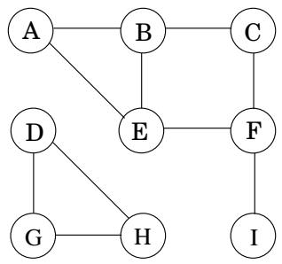
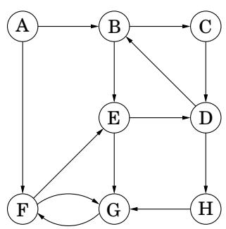
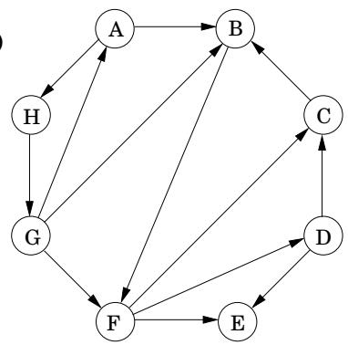
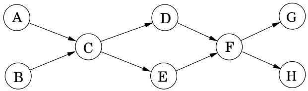
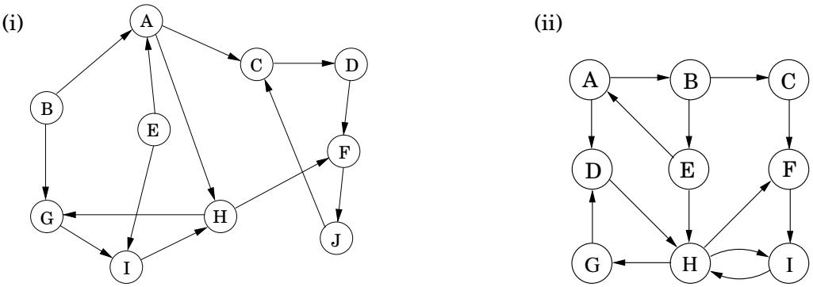
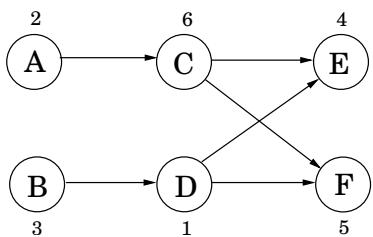
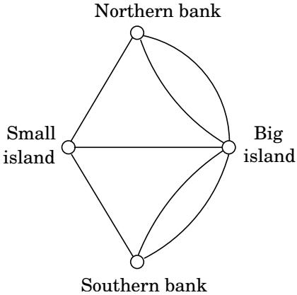
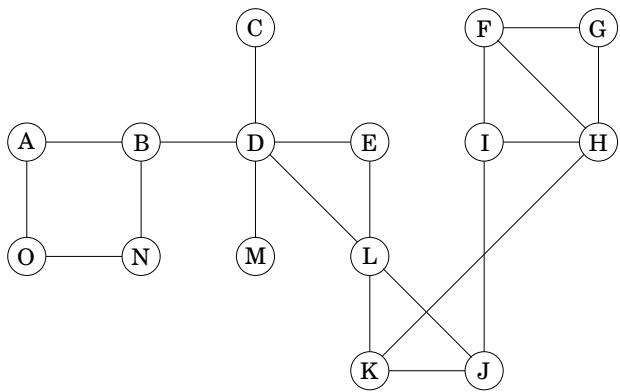

import Guide from '@/components/Guide.astro';
import Knowledge from '@/components/Knowledge.astro';
import Example from '@/components/Example.astro';
import Analysis from '@/components/Analysis.astro';
import Solution from '@/components/Solution.astro';
import Variant from '@/components/Variant.astro';
import Note from '@/components/Note.astro';
import Block from '@/components/Block.astro';
import Method from '@/components/Method.astro';
import Exercise from '@/components/Exercise.astro';

## Chapter 3 Exercises

<Exercise title="Exercise 3.1">

Perform a depth-first search on the following graph; whenever there's a choice of vertices, pick the one that is alphabetically first. Classify each edge as a tree edge or back edge, and give the pre and post number of each vertex.

</Exercise>

<Exercise title="Exercise 3.2">

Perform depth-first search on each of the following graphs; whenever there's a choice of vertices, pick the one that is alphabetically first. Classify each edge as a tree edge, forward edge, back edge, or cross edge, and give the pre and post number of each vertex.

(a)

(b)

</Exercise>

<Exercise title="Exercise 3.3">

Run the DFS-based topological ordering algorithm on the following graph. Whenever you have a choice of vertices to explore, always pick the one that is alphabetically first.

(a) Indicate the pre and post numbers of the nodes.

(b) What are the sources and sinks of the graph?

(c) What topological ordering is found by the algorithm?

(d) How many topological orderings does this graph have?

</Exercise>

<Exercise title="Exercise 3.4">

Run the strongly connected components algorithm on the following directed graphs G. When doing DFS on $\mathbf { \bar { \mathit { G } } } ^ { R } \mathbf { : }$ : whenever there is a choice of vertices to explore, always pick the one that is alphabetically first.

(i)

In each case answer the following questions.

(a) In what order are the strongly connected components (SCCs) found?

(b) Which are source SCCs and which are sink SCCs?

(c) Draw the “metagraph” (each meta-node is an SCC of G).

(d) What is the minimum number of edges you must add to this graph to make it strongly connected?

</Exercise>

<Exercise title="Exercise 3.5">

The reverse of a directed graph $G = ( V , E )$ is another directed graph $G ^ { R } = ( V , E ^ { R } )$ on the same vertex set, but with all edges reversed; that is, $E ^ { R } = \{ ( v , u ) : ( u , v ) \in E \}$ Give a linear-time algorithm for computing the reverse of a graph in adjacency list format.

</Exercise>

<Exercise title="Exercise 3.6">

In an undirected graph, the degree d(u) of a vertex u is the number of neighbors u has, or equivalently, the number of edges incident upon it. In a directed graph, we distinguish between the indegree $d _ { i n } ( u )$ , which is the number of edges into u, and the outdegree $d _ { o u t } ( \boldsymbol { u } )$ , the number of edges leaving u.

(a) Show that in an undirected graph, $\textstyle \sum _ { u \in V } d ( u ) = 2 | E |$

(b) Use part (a) to show that in an undirected graph, there must be an even number of vertices whose degree is odd.

(c) Does a similar statement hold for the number of vertices with odd indegree in a directed graph?

</Exercise>

<Exercise title="Exercise 3.7">

A bipartite graph is a graph $G = ( V , E )$ whose vertices can be partitioned into two sets $( V = V _ { 1 } \cup V _ { 2 }$ and $V _ { 1 } \cap V _ { 2 } = \emptyset )$ such that there are no edges between vertices in the same set (for instance, if $u , v \in V _ { 1 }$ , then there is no edge between u and v).

(a) Give a linear-time algorithm to determine whether an undirected graph is bipartite.

(b) There are many other ways to formulate this property. For instance, an undirected graph is bipartite if and only if it can be colored with just two colors.

Prove the following formulation: an undirected graph is bipartite if and only if it contains no cycles of odd length.

(c) At most how many colors are needed to color in an undirected graph with exactly one oddlength cycle?

</Exercise>

<Exercise title="Exercise 3.8">

Pouring water. We have three containers whose sizes are 10 pints, 7 pints, and 4 pints, respectively. The 7-pint and 4-pint containers start out full of water, but the 10-pint container is initially empty. We are allowed one type of operation: pouring the contents of one container into another, stopping only when the source container is empty or the destination container is full. We want to know if there is a sequence of pourings that leaves exactly 2 pints in the 7- or 4-pint container.

(a) Model this as a graph problem: give a precise definition of the graph involved and state the specific question about this graph that needs to be answered.

(b) What algorithm should be applied to solve the problem?

(c) Find the answer by applying the algorithm.

</Exercise>

<Exercise title="Exercise 3.9">

For each node u in an undirected graph, let twodegree[u] be the sum of the degrees of u's neighbors. Show how to compute the entire array of twodegree[ ] values in linear time, given a graph in adjacency list format.

</Exercise>

<Exercise title="Exercise 3.10">

Rewrite the explore procedure (Figure 3.3) so that it is non-recursive (that is, explicitly use a stack). The calls to previsit and postvisit should be positioned so that they have the same effect as in the recursive procedure.

</Exercise>

<Exercise title="Exercise 3.11">

Design a linear-time algorithm which, given an undirected graph G and a particular edge e in it, determines whether G has a cycle containing e.

</Exercise>

<Exercise title="Exercise 3.12">

Either prove or give a counterexample: if $\{ u , v \}$ is an edge in an undirected graph, and during depth-first search post(u) &lt;post(v), then v is an ancestor of u in the DFS tree.

</Exercise>

<Exercise title="Exercise 3.13">

Undirected vs. directed connectivity.

(a) Prove that in any connected undirected graph $G = ( V , E )$ there is a vertex $v \in V$ whose removal leaves G connected. (Hint: Consider the DFS search tree for G.)

(b) Give an example of a strongly connected directed graph $G = ( V , E )$ such that, for every $v \in V _ { i }$ , removing v from G leaves a directed graph that is not strongly connected.

(c) In an undirected graph with 2 connected components it is always possible to make the graph connected by adding only one edge. Give an example of a directed graph with two strongly connected components such that no addition of one edge can make the graph strongly connected.

</Exercise>

<Exercise title="Exercise 3.14">

The chapter suggests an alternative algorithm for linearization (topological sorting), which repeatedly removes source nodes from the graph (page 97). Show that this algorithm can be implemented in linear time.

</Exercise>

<Exercise title="Exercise 3.15">

The police department in the city of Computopia has made all streets one-way. The mayor contends that there is still a way to drive legally from any intersection in the city to any other intersection, but the opposition is not convinced. A computer program is needed to determine whether the mayor is right. However, the city elections are coming up soon, and there is just enough time to run a linear-time algorithm.

(a) Formulate this problem graph-theoretically, and explain why it can indeed be solved in linear time.

(b) Suppose it now turns out that the mayor's original claim is false. She next claims something weaker: if you start driving from town hall, navigating one-way streets, then no matter where you reach, there is always a way to drive legally back to the town hall. Formulate this weaker property as a graph-theoretic problem, and carefully show how it too can be checked in linear time.

</Exercise>

<Exercise title="Exercise 3.16">

Suppose a CS curriculum consists of n courses, all of them mandatory. The prerequisite graph G has a node for each course, and an edge from course v to course w if and only if v is a prerequisite for w. Find an algorithm that works directly with this graph representation, and computes the minimum number of semesters necessary to complete the curriculum (assume that a student can take any number of courses in one semester). The running time of your algorithm should be linear.

</Exercise>

<Exercise title="Exercise 3.17">

Infinite paths. Let $G = ( V , E )$ be a directed graph with a designated “start vertex” $s \in V$ , a set $V _ { G } \subseteq V \ \mathrm { o f } ^ { \infty } \mathrm { g o o d } ^ { \gg }$ vertices, and a set $V _ { B } \subseteq V$ of “bad” vertices. An infinite trace $p$ of G is an infinite sequence $v _ { 0 } v _ { 1 } v _ { 2 } \cdots$ of vertices $v _ { i } \in V$ such that (1) $v _ { 0 } = s ,$ and (2) for all $i \geq 0 , ( v _ { i } , v _ { i + 1 } ) \in E$ . That $\mathbf { i s } , p$ is an infinite path in G starting at vertex $s .$ Since the set V of vertices is finite, every infinite trace of G must visit some vertices infinitely often.

(a) If $p$ is an infinite trace, let $I n f ( p ) \subseteq V$ be the set of vertices that occur infinitely often in $p .$ Show that $I n f ( p )$ is a subset of a strongly connected component of $G _ { \ast }$

(b) Describe an algorithm that determines if G has an infinite trace.

(c) Describe an algorithm that determines ifG has an infinite trace that visits some good vertex in $V _ { G }$ infinitely often.

(d) Describe an algorithm that determines ifG has an infinite trace that visits some good vertex in $V _ { G }$ infinitely often, but visits no bad vertex in $V _ { B }$ infinitely often.

</Exercise>

<Exercise title="Exercise 3.18">

You are given a binary tree $T = ( V , E )$ (in adjacency list format), along with a designated root node $r \in V$ . Recall that u is said to be an ancestor of v in the rooted tree, if the path from $r$ to v in $T$ passes through u.

You wish to preprocess the tree so that queries of the form “is u an ancestor of $v ? ^ { \mathfrak { n } }$ can be answered in constant time. The preprocessing itself should take linear time. How can this be done?

</Exercise>

<Exercise title="Exercise 3.19">

As in the previous problem, you are given a binary tree $T = ( V , E )$ with designated root node. In addition, there is an array $x [ \cdot ]$ with a value for each node in $V$ . Define a new array $z [ \cdot ]$ as follows: for each $u \in V$

z[u] = the maximum of the x-values associated with u's descendants.

Give a linear-time algorithm which calculates the entire z-array.

</Exercise>

<Exercise title="Exercise 3.20">

You are given a tree $T = ( V , E )$ along with a designated root node $r \in V$ . The parent of any node v $\neq r ,$ denoted $p ( v )$ , is defined to be the node adjacent to v in the path from r to v. By convention, $p ( r ) = r$ . For $k > 1$ , define $p ^ { k } ( v ) = p ^ { k - 1 } ( p ( v ) )$ ) and $p ^ { 1 } ( v ) = p ( v )$ (so $p ^ { k } ( v )$ is the kth ancestor of $v )$ . Each vertex v of the tree has an associated non-negative integer label $l ( v )$ . Give a linear-time algorithm to update the labels of all the vertices in $T$ according to the following rule: $l _ { n e w } ( v ) =$ $l ( \bar { p ^ { l ( v ) } } ( v ) )$

</Exercise>

<Exercise title="Exercise 3.21">

Give a linear-time algorithm to find an odd-length cycle in a directed graph. (Hint: First solve this problem under the assumption that the graph is strongly connected.)

</Exercise>

<Exercise title="Exercise 3.22">

Give an efficient algorithm which takes as input a directed graph $G = ( V , E )$ , and determines whether or not there is a vertex $s \in V$ from which all other vertices are reachable.

</Exercise>

<Exercise title="Exercise 3.23">

Give an efficient algorithm that takes as input a directed acyclic graph $G = ( V , E )$ , and two vertices $s , t \in V$ , and outputs the number of different directed paths from s to t in G.

</Exercise>

<Exercise title="Exercise 3.24">

Give a linear-time algorithm for the following task.

Input: A directed acyclic graph G

Question: Does G contain a directed path that touches every vertex exactly once?

</Exercise>

<Exercise title="Exercise 3.25">

You are given a directed graph in which each node $u \in V$ has an associated price $p _ { u }$ which is a positive integer. Define the array cost as follows: for each $u \in V$

cost[u] = price of the cheapest node reachable from u (including u itself).

For instance, in the graph below (with prices shown for each vertex), the cost values of the nodes A, B, C, D, E, F are 2, 1, 4, 1, 4, 5, respectively.

Your goal is to design an algorithm that fills in the entire cost array (i.e., for all vertices).

(a) Give a linear-time algorithm that works for directed acyclic graphs. (Hint: Handle the vertices in a particular order.)

(b) Extend this to a linear-time algorithm that works for all directed graphs. (Hint: Recall the “two-tiered” structure of directed graphs.)

</Exercise>

<Exercise title="Exercise 3.26">

An Eulerian tour in an undirected graph is a cycle that is allowed to pass through each vertex multiple times, but must use each edge exactly once.

This simple concept was used by Euler in 1736 to solve the famous Konigsberg bridge problem, which launched the field of graph theory. The city of Konigsberg (now called Kaliningrad, in western Russia) is the meeting point of two rivers with a small island in the middle. There are seven bridges across the rivers, and a popular recreational question of the time was to determine whether it is possible to perform a tour in which each bridge is crossed exactly once.

Euler formulated the relevant information as a graph with four nodes (denoting land masses) and seven edges (denoting bridges), as shown here.

Notice an unusual feature of this problem: multiple edges between certain pairs of nodes.

(a) Show that an undirected graph has an Eulerian tour if and only if all its vertices have even degree. Conclude that there is no Eulerian tour of the Konigsberg bridges.

(b) An Eulerian path is a path which uses each edge exactly once. Can you give a similar if-and-only-if characterization of which undirected graphs have Eulerian paths?

(c) Can you give an analog of part (a) for directed graphs?

</Exercise>

<Exercise title="Exercise 3.27">

Two paths in a graph are called edge-disjoint if they have no edges in common. Show that in any undirected graph, it is possible to pair up the vertices of odd degree and find paths between each such pair so that all these paths are edge-disjoint.

</Exercise>

<Exercise title="Exercise 3.28">

In the 2SAT problem, you are given a set of clauses, where each clause is the disjunction (OR) of two literals (a literal is a Boolean variable or the negation of a Boolean variable). You are looking for a way to assign a value true or false to each of the variables so that all clauses are satisfied – that is, there is at least one true literal in each clause. For example, here's an instance of 2SAT:

$$
(x _ {1} \vee \overline {{x}} _ {2}) \wedge (\overline {{x}} _ {1} \vee \overline {{x}} _ {3}) \wedge (x _ {1} \vee x _ {2}) \wedge (\overline {{x}} _ {3} \vee x _ {4}) \wedge (\overline {{x}} _ {1} \vee x _ {4}).
$$

This instance has a satisfying assignment: set $x _ { 1 } , x _ { 2 } , x _ { 3 }$ , and $x _ { 4 }$ to true, false, false, and true, respectively.

(a) Are there other satisfying truth assignments of this 2SAT formula? If so, find them all.

(b) Give an instance of 2SAT with four variables, and with no satisfying assignment.

The purpose of this problem is to lead you to a way of solving 2SAT efficiently by reducing it to the problem of finding the strongly connected components of a directed graph. Given an instance I of 2SAT with n variables and m clauses, construct a directed graph $G _ { I } = ( V , E )$ as follows.

$G _ { I }$ has 2n nodes, one for each variable and its negation.

$G _ { I }$ has 2m edges: for each clause $( \alpha \lor \beta )$ of I (where $\alpha , \beta$ are literals), $G _ { I }$ has an edge from from the negation of α to $\beta ,$ , and one from the negation of $\beta$ to α.

Note that the clause $( \alpha \lor \beta )$ is equivalent to either of the implications $\overline { { \alpha } } \Rightarrow \beta \ \mathbf { o r } \ \overline { { \beta } } \Rightarrow \alpha$ . In this sense, $G _ { I }$ records all implications in I.

(c) Carry out this construction for the instance of 2SAT given above, and for the instance you constructed in (b).

(d) Show that if $G _ { I }$ has a strongly connected component containing both x and $\textstyle { \overline { { x } } }$ for some variable x, then I has no satisfying assignment.

(e) Now show the converse of (d): namely, that if none of $G _ { I } { \bf \ ' _ { S } }$ strongly connected components contain both a literal and its negation, then the instance I must be satisfiable. (Hint: Assign values to the variables as follows: repeatedly pick a sink strongly connected component of $G _ { I }$ . Assign value true to all literals in the sink, assign false to their negations, and delete all of these. Show that this ends up discovering a satisfying assignment.)

(f) Conclude that there is a linear-time algorithm for solving 2SAT.

</Exercise>

<Exercise title="Exercise 3.29">

Let S be a finite set. A binary relation on S is simply a collection R of ordered pairs $( x , y ) \in S \times S$ For instance, S might be a set of people, and each such pair $( x , y ) \in R$ might mean “x knows y.” An equivalence relation is a binary relation which satisfies three properties:

Reflexivity: $( x , x ) \in R$ for all $x \in S$

Symmetry: if $( x , y ) \in R$ then $( y , x ) \in R$

• Transitivity: $\mathbf { i f } \left( x , y \right) \in R$ and $( y , z ) \in R$ then $( x , z ) \in R$

For instance, the binary relation “has the same birthday $\mathbf { a s } ^ { \mathfrak { n } }$ is an equivalence relation, whereas “is the father $\mathbf { o f } ^ { \mathfrak { n } }$ is not, since it violates all three properties.

Show that an equivalence relation partitions set S into disjoint groups $S _ { 1 } , S _ { 2 } , \ldots , S _ { k }$ (in other words, $S = S _ { 1 } \cup S _ { 2 } \cup \cdot \cdot \cdot \cup S _ { k }$ and $S _ { i } \cap S _ { j } = \emptyset$ for all $i \neq j )$ such that:

Any two members of a group are related, that is, $( x , y ) \in R$ for any $x , y \in S _ { i }$ , for any i.

Members of different groups are not related, that is, for all $i \neq j ,$ , for all $x \in S _ { i }$ and $y \in S _ { j }$ we have $( x , y ) \notin R$

(Hint: Represent an equivalence relation by an undirected graph.)

</Exercise>

<Exercise title="Exercise 3.30">

On page 97, we defined the binary relation “connected” on the set of vertices of a directed graph. Show that this is an equivalence relation (see Exercise 3.29), and conclude that it partitions the vertices into disjoint strongly connected components.

</Exercise>

<Exercise title="Exercise 3.31">

Biconnected components Let $G = ( V , E )$ be an undirected graph. For any two edges $\boldsymbol { e } , \boldsymbol { e } ^ { \prime } \in E$ , we'll say $e \sim e ^ { \prime }$ if either $e = e ^ { \prime }$ or there is a (simple) cycle containing both e and $e ^ { \prime } .$

(a) Show that is an equivalence relation (recall Exercise 3.29) on the edges.

The equivalence classes into which this relation partitions the edges are called the biconnected components of G. A bridge is an edge which is in a biconnected component all by itself.

A separating vertex is a vertex whose removal disconnects the graph.

(b) Partition the edges of the graph below into biconnected components, and identify the bridges and separating vertices.

Not only do biconnected components partition the edges of the graph, they also almost partition the vertices in the following sense.

(c) Associate with each biconnected component all the vertices that are endpoints of its edges. Show that the vertices corresponding to two different biconnected components are either disjoint or intersect in a single separating vertex.

(d) Collapse each biconnected component into a single meta-node, and retain individual nodes for each separating vertex. (So there are edges between each component-node and its separating vertices.) Show that the resulting graph is a tree.

DFS can be used to identify the biconnected components, bridges, and separating vertices of a graph in linear time.

(e) Show that the root of the DFS tree is a separating vertex if and only if it has more than one child in the tree.

(f) Show that a non-root vertex v of the DFS tree is a separating vertex if and only if it has a child $v ^ { \prime }$ none of whose descendants (including itself) has a backedge to a proper ancestor of $v .$

(g) For each vertex u define:

pre(u) low(u) = min pre(w) where (v, w) is a backedge for some descendant v of u

Show that the entire array of low values can be computed in linear time.

(h) Show how to compute all separating vertices, bridges, and biconnected components of a graph in linear time. (Hint: Use low to identify separating vertices, and run another DFS with an extra stack of edges to remove biconnected components one at a time.)

</Exercise>
