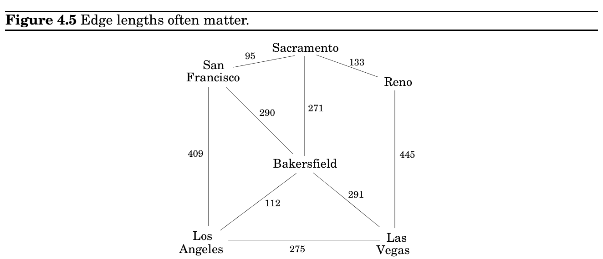

import Guide from '@/components/Guide.astro';
import Knowledge from '@/components/Knowledge.astro';
import Example from '@/components/Example.astro';
import Analysis from '@/components/Analysis.astro';
import Solution from '@/components/Solution.astro';
import Variant from '@/components/Variant.astro';
import Note from '@/components/Note.astro';
import Block from '@/components/Block.astro';
import Method from '@/components/Method.astro';
import Exercise from '@/components/Exercise.astro';

## 4.3 Lengths on edges

Also notice one stylistic difference from DFS: since we are only interested in distances from s, we do not restart the search in other connected components. Nodes not reachable from s are simply ignored.

Breadth-first search treats all edges as having the same length. This is rarely true in applications where shortest paths are to be found. For instance, suppose you are driving from San Francisco to Las Vegas, and want to find the quickest route. Figure 4.5 shows the major highways you might conceivably use. Picking the right combination of them is a shortest-path problem in which the length of each edge (each stretch of highway) is important. For the remainder of this chapter, we will deal with this more general scenario, annotating every edge e ∈E with a length l_&#123;e&#125;. If e = (u, v), we will sometimes also write l(u, v) or l_&#123;uv&#125;.

These l_&#123;e&#125;’s do not have to correspond to physical lengths. They could denote time (driving time between cities) or money (cost of taking a bus), or any other quantity that we would like to conserve. In fact, there are cases in which we need to use negative lengths, but we will briefly overlook this particular complication.

### 4.4 Dijkstra’s algorithm

### 4.4.1 An adaptation of breadth-first search

Breadth-first search finds shortest paths in any graph whose edges have unit length. Can we adapt it to a more general graph G = (V, E) whose edge lengths l_&#123;e&#125; are positive integers?

A more convenient graph

Here is a simple trick for converting G into something BFS can handle: break G’s long edges into unit-length pieces, by introducing “dummy” nodes. Figure 4.6 shows an example of this
