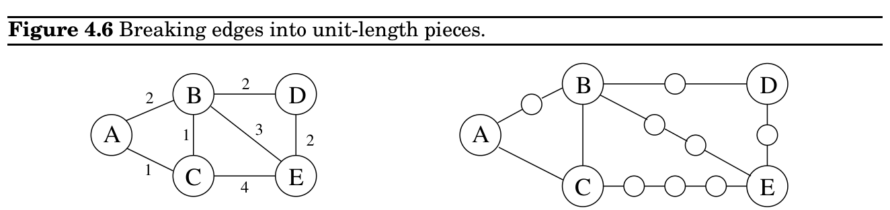
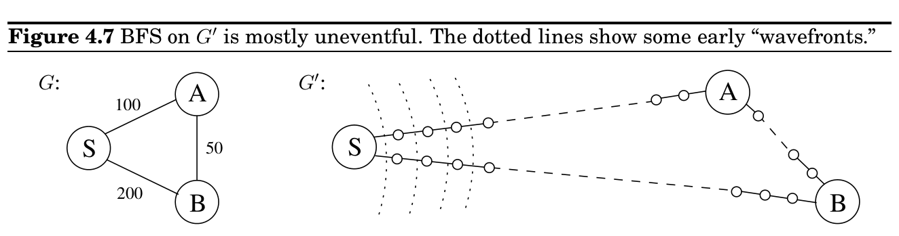
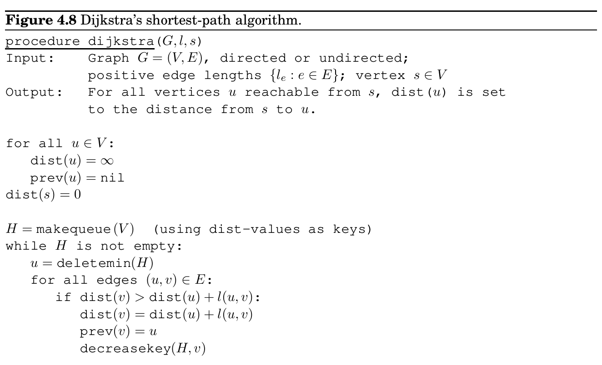
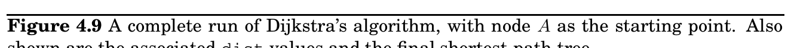
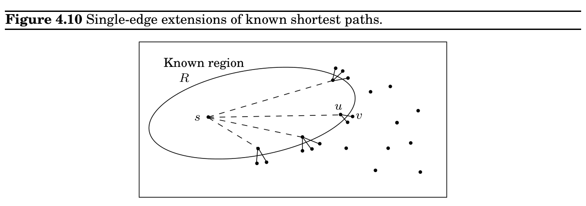

import Guide from '@/components/Guide.astro';
import Knowledge from '@/components/Knowledge.astro';
import Example from '@/components/Example.astro';
import Analysis from '@/components/Analysis.astro';
import Solution from '@/components/Solution.astro';
import Variant from '@/components/Variant.astro';
import Note from '@/components/Note.astro';
import Block from '@/components/Block.astro';
import Method from '@/components/Method.astro';
import Exercise from '@/components/Exercise.astro';

## 4.4 Dijkstra’s algorithm

Also notice one stylistic difference from DFS: since we are only interested in distances from s, we do not restart the search in other connected components. Nodes not reachable from s are simply ignored.

### 4.3 Lengths on edges

Breadth-first search treats all edges as having the same length. This is rarely true in applications where shortest paths are to be found. For instance, suppose you are driving from San Francisco to Las Vegas, and want to find the quickest route. Figure 4.5 shows the major highways you might conceivably use. Picking the right combination of them is a shortest-path problem in which the length of each edge (each stretch of highway) is important. For the remainder of this chapter, we will deal with this more general scenario, annotating every edge e ∈E with a length l_&#123;e&#125;. If e = (u, v), we will sometimes also write l(u, v) or l_&#123;uv&#125;.

These l_&#123;e&#125;’s do not have to correspond to physical lengths. They could denote time (driving time between cities) or money (cost of taking a bus), or any other quantity that we would like to conserve. In fact, there are cases in which we need to use negative lengths, but we will briefly overlook this particular complication.

### 4.4.1 An adaptation of breadth-first search

Breadth-first search finds shortest paths in any graph whose edges have unit length. Can we adapt it to a more general graph G = (V, E) whose edge lengths l_&#123;e&#125; are positive integers?

A more convenient graph

Here is a simple trick for converting G into something BFS can handle: break G’s long edges into unit-length pieces, by introducing “dummy” nodes. Figure 4.6 shows an example of this

transformation. To construct the new graph G^&#123;′&#125;,

For any edge e = (u, v) of E, replace it by l_&#123;e&#125; edges of length 1, by adding l_&#123;e&#125; −1 dummy nodes between u and v.

Graph G^&#123;′&#125; contains all the vertices V that interest us, and the distances between them are exactly the same as in G. Most importantly, the edges of G^&#123;′&#125; all have unit length. Therefore, we can compute distances in G by running BFS on G^&#123;′&#125;.

Alarm clocks

If efficiency were not an issue, we could stop here. But when G has very long edges, the G^&#123;′&#125;

it engenders is thickly populated with dummy nodes, and the BFS spends most of its time diligently computing distances to these nodes that we don’t care about at all.

To see this more concretely, consider the graphs G and G^&#123;′&#125; of Figure 4.7, and imagine that the BFS, started at node s of G^&#123;′&#125;, advances by one unit of distance per minute. For the first 99 minutes it tediously progresses along S −A and S −B, an endless desert of dummy nodes. Is there some way we can snooze through these boring phases and have an alarm wake us up whenever something interesting is happening—specifically, whenever one of the real nodes (from the original graph G) is reached?

We do this by setting two alarms at the outset, one for node A, set to go off at time T = 100, and one for B, at time T = 200. These are estimated times of arrival, based upon the edges currently being traversed. We doze off and awake at T = 100 to find A has been discovered. At this point, the estimated time of arrival for B is adjusted to T = 150 and we change its alarm accordingly.

More generally, at any given moment the breadth-first search is advancing along certain edges of G, and there is an alarm for every endpoint node toward which it is moving, set to go off at the estimated time of arrival at that node. Some of these might be overestimates because BFS may later find shortcuts, as a result of future arrivals elsewhere. In the preceding example, a quicker route to B was revealed upon arrival at A. However, nothing interesting can possibly happen before an alarm goes off. The sounding of the next alarm must therefore signal the arrival of the wavefront to a real node u ∈V by BFS. At that point, BFS might also start advancing along some new edges out of u, and alarms need to be set for their endpoints.

The following “alarm clock algorithm” faithfully simulates the execution of BFS on G^&#123;′&#125;.

• Set an alarm clock for node s at time 0.

• Repeat until there are no more alarms:

Say the next alarm goes off at time T, for node u. Then:

– The distance from s to u is T.

– For each neighbor v of u in G:

∗If there is no alarm yet for v, set one for time T + l(u, v). ∗If v’s alarm is set for later than T + l(u, v), then reset it to this earlier time.

Dijkstra’s algorithm. The alarm clock algorithm computes distances in any graph with positive integral edge lengths. It is almost ready for use, except that we need to somehow implement the system of alarms. The right data structure for this job is a priority queue (usually implemented via a heap), which maintains a set of elements (nodes) with associated numeric key values (alarm times) and supports the following operations:

Insert. Add a new element to the set.

Decrease-key. Accommodate the decrease in key value of a particular element.^&#123;1&#125;

Delete-min. Return the element with the smallest key, and remove it from the set.

Make-queue. Build a priority queue out of the given elements, with the given key values. (In many implementations, this is significantly faster than inserting the elements one by one.)

The first two let us set alarms, and the third tells us which alarm is next to go off. Putting this all together, we get Dijkstra’s algorithm (Figure 4.8).

In the code, dist(u) refers to the current alarm clock setting for node u. A value of ∞ means the alarm hasn’t so far been set. There is also a special array, prev, that holds one crucial piece of information for each node u: the identity of the node immediately before it on the shortest path from s to u. By following these back-pointers, we can easily reconstruct shortest paths, and so this array is a compact summary of all the paths found. A full example of the algorithm’s operation, along with the final shortest-path tree, is shown in Figure 4.9.

In summary, we can think of Dijkstra’s algorithm as just BFS, except it uses a priority queue instead of a regular queue, so as to prioritize nodes in a way that takes edge lengths

1The name decrease-key is standard but is a little misleading: the priority queue typically does not itself change key values. What this procedure really does is to notify the queue that a certain key value has been decreased.

into account. This viewpoint gives a concrete appreciation of how and why the algorithm works, but there is a more direct, more abstract derivation that doesn’t depend upon BFS at all. We now start from scratch with this complementary interpretation.

B

C

D

E

A

4

1 3

2

4

1

3

5

2

A: 0

D: ∞

B: 4

E: ∞

C: 2

B

C

D

E

A

4

2

4

1

3

5

2

1 3

A: 0

D: 6

B: 3

E: 7

C: 2

B

C

D

E

A

4

1 3

2

4

1

3

5

2

A: 0

D: 5

B: 3

E: 6

C: 2

B

C

D

E

A

4

1 3

2

1

5

2

3

4

A: 0

D: 5

B: 3

E: 6

C: 2

B

C

D

E

A

2

1 3

2

### 4.4.2 An alternative derivation

Here’s a plan for computing shortest paths: expand outward from the starting point s, steadily growing the region of the graph to which distances and shortest paths are known. This growth should be orderly, first incorporating the closest nodes and then moving on to those further away. More precisely, when the “known region” is some subset of vertices R that includes s, the next addition to it should be the node outside R that is closest to s. Let us call this node v; the question is: how do we identify it?

To answer, consider u, the node just before v in the shortest path from s to v:

67 v u s

Since we are assuming that all edge lengths are positive, u must be closer to s than v is. This means that u is in R—otherwise it would contradict v’s status as the closest node to s outside R. So, the shortest path from s to v is simply a known shortest path extended by a single edge.

But there will typically be many single-edge extensions of the currently known shortest paths (Figure 4.10); which of these identifies v? The answer is, the shortest of these extended paths. Because, if an even shorter single-edge-extended path existed, this would once more contradict v’s status as the node outside R closest to s. So, it’s easy to find v: it is the node outside R for which the smallest value of distance(s, u) + l(u, v) is attained, as u ranges over R. In other words, try all single-edge extensions of the currently known shortest paths, find the shortest such extended path, and proclaim its endpoint to be the next node of R.

We now have an algorithm for growing R by looking at extensions of the current set of shortest paths. Some extra efficiency comes from noticing that on any given iteration, the only new extensions are those involving the node most recently added to region R. All other extensions will have been assessed previously and do not need to be recomputed. In the following pseudocode, dist(v) is the length of the currently shortest single-edge-extended path leading to v; it is ∞for nodes not adjacent to R.

Initialize dist(s) to 0, other dist(·) values to ∞ R = &#123; &#125; (the ‘‘known region’’) while R̸ = V :

Pick the node v̸ ∈R with smallest dist(·) Add v to R for all edges (v, z) ∈E:

if dist(z) > dist(v) + l(v, z):

dist(z) = dist(v) + l(v, z)

Incorporating priority queue operations gives us back Dijkstra’s algorithm (Figure 4.8).

To justify this algorithm formally, we would use a proof by induction, as with breadth-first search. Here’s an appropriate inductive hypothesis.

At the end of each iteration of the while loop, the following conditions hold: (1) there is a value d such that all nodes in R are at distance ≤d from s and all nodes outside R are at distance ≥d from s, and (2) for every node u, the value dist(u) is the length of the shortest path from s to u whose intermediate nodes are constrained to be in R (if no such path exists, the value is ∞).

The base case is straightforward (with d = 0), and the details of the inductive step can be filled in from the preceding discussion.

### 4.4.3 Running time

At the level of abstraction of Figure 4.8, Dijkstra’s algorithm is structurally identical to breadth-first search. However, it is slower because the priority queue primitives are computationally more demanding than the constant-time eject’s and inject’s of BFS. Since makequeue takes at most as long as |V | insert operations, we get a total of |V | deletemin and |V | + |E| insert/decreasekey operations. The time needed for these varies by implementation; for instance, a binary heap gives an overall running time of O((|V | + |E|) log |V |).

### Which heap is best?

The running time of Dijkstra’s algorithm depends heavily on the priority queue implementation used. Here are the typical choices.

Implementation

deletemin

insert/ decreasekey

|V | × deletemin + (|V | + |E|) × insert

Array

O(|V |)

O(1)

O(|V |^&#123;2&#125;)

Binary heap

O(log |V |)

O(log |V |)

O((|V | + |E|) log |V |)

d-ary heap

O(^&#123; &#125;d log |V |

log d )

O(^&#123; &#125;log |V |

log d )

O((|V | · d + |E|)^&#123; &#125;log |V |

log d )

Fibonacci heap

O(log |V |)

O(1) (amortized)

O(|V | log |V | + |E|)

So for instance, even a naive array implementation gives a respectable time complexity of O(|V |^&#123;2&#125;), whereas with a binary heap we get O((|V | + |E|) log |V |). Which is preferable?

This depends on whether the graph is sparse (has few edges) or dense (has lots of them). For all graphs, |E| is less than |V |^&#123;2&#125;. If it is Ω(|V |^&#123;2&#125;), then clearly the array implementation is the faster. On the other hand, the binary heap becomes preferable as soon as |E| dips below |V |^&#123;2&#125;/ log |V |.

The d-ary heap is a generalization of the binary heap (which corresponds to d = 2) and leads to a running time that is a function of d. The optimal choice is d ≈|E|/|V |; in other words, to optimize we must set the degree of the heap to be equal to the average degree of the graph. This works well for both sparse and dense graphs. For very sparse graphs, in which |E| = O(|V |), the running time is O(|V | log |V |), as good as with a binary heap. For dense graphs, |E| = Ω(|V |^&#123;2&#125;) and the running time is O(|V |^&#123;2&#125;), as good as with a linked list. Finally, for graphs with intermediate density |E| = |V |^&#123;1+&#125;δ, the running time is O(|E|), linear!

The last line in the table gives running times using a sophisticated data structure called a Fibonacci heap. Although its efficiency is impressive, this data structure requires considerably more work to implement than the others, and this tends to dampen its appeal in practice. We will say little about it except to mention a curious feature of its time bounds. Its insert operations take varying amounts of time but are guaranteed to average O(1) over the course of the algorithm. In such situations (one of which we shall encounter in Chapter 5) we say that the amortized cost of heap insert’s is O(1).
