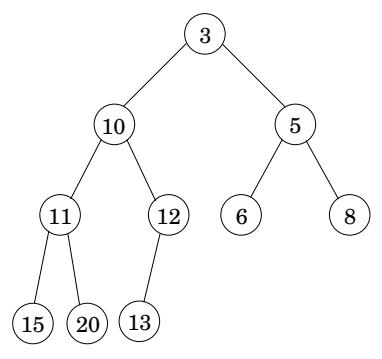
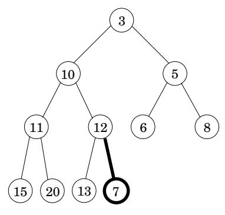
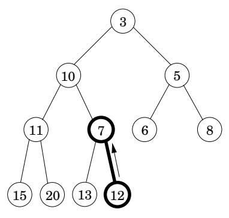
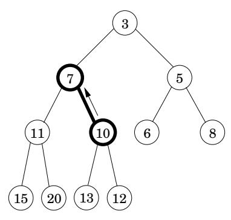
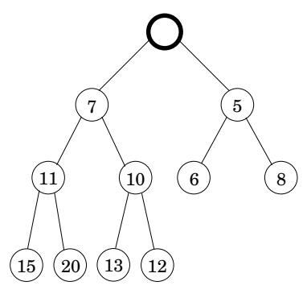
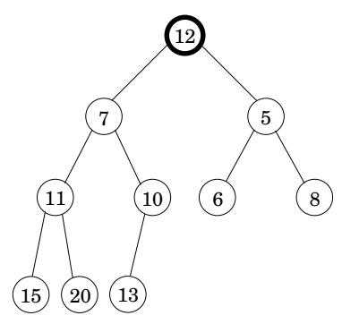
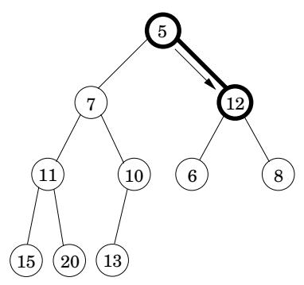
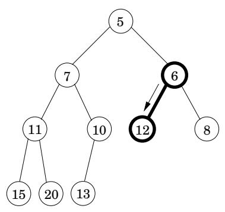
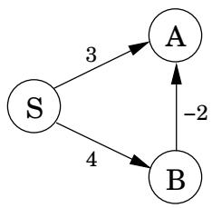

import Guide from '@/components/Guide.astro';
import Knowledge from '@/components/Knowledge.astro';
import Example from '@/components/Example.astro';
import Analysis from '@/components/Analysis.astro';
import Solution from '@/components/Solution.astro';
import Variant from '@/components/Variant.astro';
import Note from '@/components/Note.astro';
import Block from '@/components/Block.astro';
import Method from '@/components/Method.astro';
import Exercise from '@/components/Exercise.astro';

## 4.5 Priority queue implementations

## 4.5.1 Array

The simplest implementation of a priority queue is as an unordered array of key values for all potential elements (the vertices of the graph, in the case of Dijkstra's algorithm). Initially, these values are set to .

An insert or decreasekey is fast, because it just involves adjusting a key value, an O(1) operation. To deletemin, on the other hand, requires a linear-time scan of the list.

## 4.5.2 Binary heap

Here elements are stored in a complete binary tree, namely, a binary tree in which each level is filled in from left to right, and must be full before the next level is started. In addition, a special ordering constraint is enforced: the key value of any node of the tree is less than or equal to that of its children. In particular, therefore, the root always contains the smallest element. See Figure 4.11(a) for an example.

To insert, place the new element at the bottom of the tree (in the first available position), and let it “bubble $\mathrm { { u p . } } ^ { \mathfrak { p } }$ That is, if it is smaller than its parent, swap the two and repeat (Figure 4.11(b)–(d)). The number of swaps is at most the height of the tree, which is $\lfloor \log _ { 2 } n \rfloor$ when there are n elements. A decreasekey is similar, except that the element is already in the tree, so we let it bubble up from its current position.

To deletemin, return the root value. To then remove this element from the heap, take the last node in the tree (in the rightmost position in the bottom row) and place it at the root. Let it “sift down”: if it is bigger than either child, swap it with the smaller child and repeat (Figure 4.11(e)–(g)). Again this takes $O ( \log n )$ time.

The regularity of a complete binary tree makes it easy to represent using an array. The tree nodes have a natural ordering: row by row, starting at the root and moving left to right within each row. If there are n nodes, this ordering specifies their positions 1, $, 2 , \ldots , n$ within the array. Moving up and down the tree is easily simulated on the array, using the fact that node number j has parent $\lfloor j / 2 \rfloor$ and children 2j and $2 j + 1$ (Exercise 4.16).

## 4.5.3 d-ary heap

A d-ary heap is identical to a binary heap, except that nodes have d children instead of just two. This reduces the height of a tree with n elements to $\Theta ( \log _ { d } n ) = \Theta ( ( \log n ) / ( \log d ) )$ . Inserts are therefore speeded up by a factor of $\Theta ( \log d )$ . Deletemin operations, however, take a little longer, namely $O ( d \log _ { d } n )$ (do you see why?).

The array representation of a binary heap is easily extended to the d-ary case. This time, node number j has parent $\lceil ( j - 1 ) / d \rceil$ and children $\{ ( j - 1 ) d + 2 , \ldots , \operatorname* { m i n } \{ n , ( j - 1 ) d + d + 1 \} \}$ (Exercise 4.16).

Figure 4.11 (a) A binary heap with 10 elements. Only the key values are shown. (b)–(d) The intermediate “bubble-up” steps in inserting an element with key 7. (e)–(g) The “sift-down” steps in a delete-min operation.

(a)

(b)

(c)

(d)

(e)

(f)

(g)

(h)

$$
\begin{array}{l} \underline {{\text { procedure\_update}}} ((u, v) \in E) \\ \underline {{\text { dist } (v) = \min \{\text { dist } (v) , \text { dist } (u) + l (u , v) \}}} \end{array}
$$

Figure 4.12 Dijkstra's algorithm will not work if there are negative edges.

