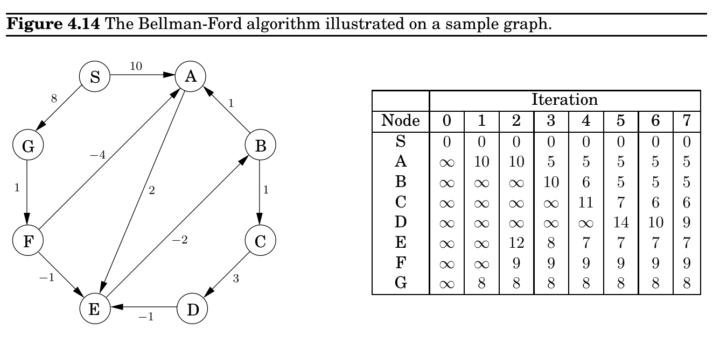
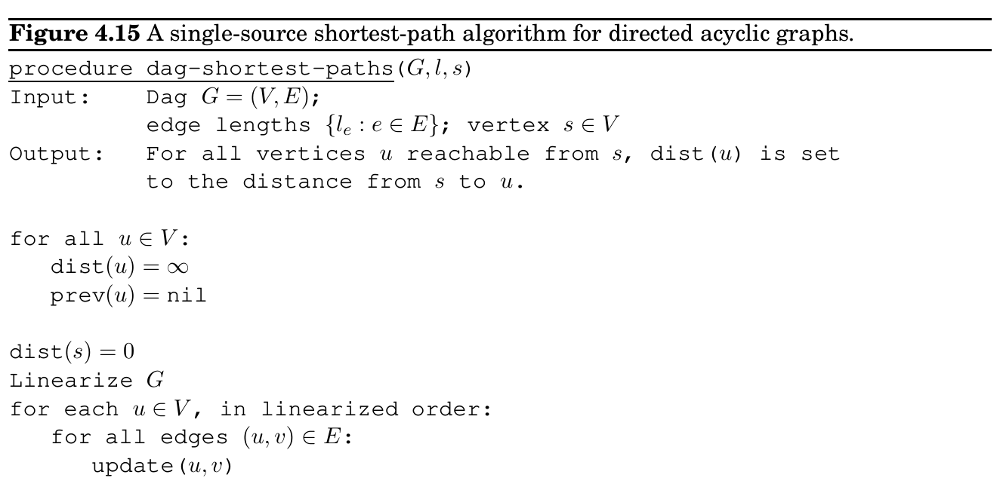

import Guide from '@/components/Guide.astro';
import Knowledge from '@/components/Knowledge.astro';
import Example from '@/components/Example.astro';
import Analysis from '@/components/Analysis.astro';
import Solution from '@/components/Solution.astro';
import Variant from '@/components/Variant.astro';
import Note from '@/components/Note.astro';
import Block from '@/components/Block.astro';
import Method from '@/components/Method.astro';
import Exercise from '@/components/Exercise.astro';

## 4.7 Shortest paths in dags

There are two subclasses of graphs that automatically exclude the possibility of negative cycles: graphs without negative edges, and graphs without cycles. We already know how to efficiently handle the former. We will now see how the single-source shortest-path problem can be solved in just linear time on directed acyclic graphs.

As before, we need to perform a sequence of updates that includes every shortest path as a subsequence. The key source of efficiency is that

In any path of a dag, the vertices appear in increasing linearized order.

Therefore, it is enough to linearize (that is, topologically sort) the dag by depth-first search, and then visit the vertices in sorted order, updating the edges out of each. The algorithm is given in Figure 4.15.

Notice that our scheme doesn’t require edges to be positive. In particular, we can find longest paths in a dag by the same algorithm: just negate all edge lengths.

