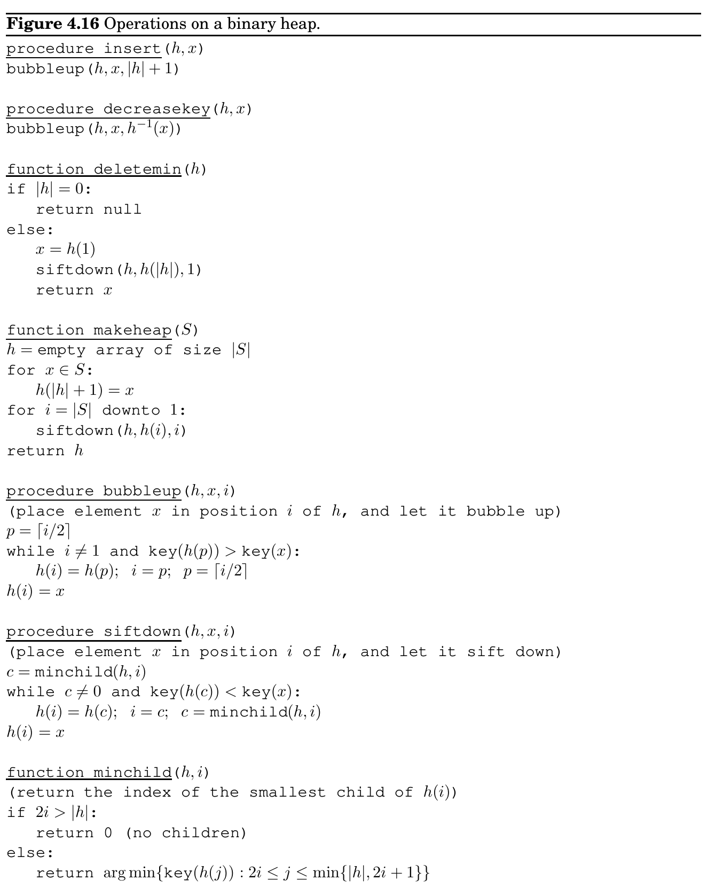

import Guide from '@/components/Guide.astro';
import Knowledge from '@/components/Knowledge.astro';
import Example from '@/components/Example.astro';
import Analysis from '@/components/Analysis.astro';
import Solution from '@/components/Solution.astro';
import Variant from '@/components/Variant.astro';
import Note from '@/components/Note.astro';
import Block from '@/components/Block.astro';
import Method from '@/components/Method.astro';
import Exercise from '@/components/Exercise.astro';

## Chapter 4 Exercises

<Exercise title="Exercise 4.1">

Suppose Dijkstra’s algorithm is run on the following graph, starting at node A.

</Exercise>

A B C D

E F G H

1 2

4 1 2 6 8

5

6 4

1 1

1

(a) Draw a table showing the intermediate distance values of all the nodes at each iteration of

the algorithm.

(b) Show the final shortest-path tree.

<Exercise title="Exercise 4.2">

Just like the previous problem, but this time with the Bellman-Ford algorithm.

</Exercise>

B

G H

I

C D

F

E

S

A

7

1

−4

6

5

3

−2

3

2

−2

6

4

−2

1

−1 1

<Exercise title="Exercise 4.3">

Squares. Design and analyze an algorithm that takes as input an undirected graph G = (V, E) and determines whether G contains a simple cycle (that is, a cycle which doesn’t intersect itself) of length four. Its running time should be at most O(|V |^&#123;3&#125;).

</Exercise>

You may assume that the input graph is represented either as an adjacency matrix or with adjacency lists, whichever makes your algorithm simpler.

<Exercise title="Exercise 4.4">

Here’s a proposal for how to find the length of the shortest cycle in an undirected graph with unit edge lengths.

</Exercise>

When a back edge, say (v, w), is encountered during a depth-first search, it forms a cycle with the tree edges from w to v. The length of the cycle is level[v] −level[w] + 1, where the level of a vertex is its distance in the DFS tree from the root vertex. This suggests the following algorithm:

• Do a depth-first search, keeping track of the level of each vertex. • Each time a back edge is encountered, compute the cycle length and save it if it is smaller than the shortest one previously seen.

Show that this strategy does not always work by providing a counterexample as well as a brief (one or two sentence) explanation.

<Exercise title="Exercise 4.5">

Often there are multiple shortest paths between two nodes of a graph. Give a linear-time algorithm for the following task.

</Exercise>

Input: Undirected graph G = (V, E) with unit edge lengths; nodes u, v ∈V . Output: The number of distinct shortest paths from u to v.

<Exercise title="Exercise 4.6">

Prove that for the array prev computed by Dijkstra’s algorithm, the edges &#123;u, prev[u]&#125; (for all u ∈V ) form a tree.

</Exercise>

<Exercise title="Exercise 4.7">

You are given a directed graph G = (V, E) with (possibly negative) weighted edges, along with a specific node s ∈V and a tree T = (V, E^&#123;′&#125;), E^&#123;′&#125; ⊆E. Give an algorithm that checks whether T is a shortest-path tree for G with starting point s. Your algorithm should run in linear time.

</Exercise>

<Exercise title="Exercise 4.8">

Professor F. Lake suggests the following algorithm for finding the shortest path from node s to node t in a directed graph with some negative edges: add a large constant to each edge weight so that all the weights become positive, then run Dijkstra’s algorithm starting at node s, and return the shortest path found to node t.

</Exercise>

Is this a valid method? Either prove that it works correctly, or give a counterexample.

<Exercise title="Exercise 4.9">

Consider a directed graph in which the only negative edges are those that leave s; all other edges are positive. Can Dijkstra’s algorithm, started at s, fail on such a graph? Prove your answer.

</Exercise>

<Exercise title="Exercise 4.10">

You are given a directed graph with (possibly negative) weighted edges, in which the shortest path between any two vertices is guaranteed to have at most k edges. Give an algorithm that finds the shortest path between two vertices u and v in O(k|E|) time.

</Exercise>

<Exercise title="Exercise 4.11">

Give an algorithm that takes as input a directed graph with positive edge lengths, and returns the length of the shortest cycle in the graph (if the graph is acyclic, it should say so). Your algorithm should take time at most O(|V |^&#123;3&#125;).

</Exercise>

<Exercise title="Exercise 4.12">

Give an O(|V |^&#123;2&#125;) algorithm for the following task.

</Exercise>

Input: An undirected graph G = (V, E); edge lengths l_&#123;e&#125; > 0; an edge e ∈E. Output: The length of the shortest cycle containing edge e.

<Exercise title="Exercise 4.13">

You are given a set of cities, along with the pattern of highways between them, in the form of an undirected graph G = (V, E). Each stretch of highway e ∈E connects two of the cities, and you know its length in miles, l_&#123;e&#125;. You want to get from city s to city t. There’s one problem: your car can only hold enough gas to cover L miles. There are gas stations in each city, but not between cities. Therefore, you can only take a route if every one of its edges has length l_&#123;e&#125; ≤L.

</Exercise>

(a) Given the limitation on your car’s fuel tank capacity, show how to determine in linear time

whether there is a feasible route from s to t.

(b) You are now planning to buy a new car, and you want to know the minimum fuel tank

capacity that is needed to travel from s to t. Give an O((|V | + |E|) log |V |) algorithm to determine this.

<Exercise title="Exercise 4.14">

You are given a strongly connected directed graph G = (V, E) with positive edge weights along with a particular node v_&#123;0&#125; ∈V . Give an efficient algorithm for finding shortest paths between all pairs of nodes, with the one restriction that these paths must all pass through v_&#123;0&#125;.

</Exercise>

<Exercise title="Exercise 4.15">

Shortest paths are not always unique: sometimes there are two or more different paths with the minimum possible length. Show how to solve the following problem in O((|V | + |E|) log |V |) time.

</Exercise>

Input: An undirected graph G = (V, E); edge lengths l_&#123;e&#125; > 0; starting vertex s ∈V . Output: A Boolean array usp[·]: for each node u, the entry usp[u] should be true if and only if there is a unique shortest path from s to u. (Note: usp[s] = true.)

<Exercise title="Exercise 4.16">

Section 4.5.2 describes a way of storing a complete binary tree of n nodes in an array indexed by 1, 2, . . . , n.

</Exercise>

(a) Consider the node at position j of the array. Show that its parent is at position ⌊j/2⌋and

its children are at 2j and 2j + 1 (if these numbers are ≤n).

(b) What the corresponding indices when a complete d-ary tree is stored in an array?

Figure 4.16 shows pseudocode for a binary heap, modeled on an exposition by R.E. Tarjan.^&#123;2&#125; The heap is stored as an array h, which is assumed to support two constant-time operations:

• |h|, which returns the number of elements currently in the array;

• h^&#123;−&#125;1, which returns the position of an element within the array.

The latter can always be achieved by maintaining the values of h^&#123;−&#125;1 as an auxiliary array.

(c) Show that the makeheap procedure takes O(n) time when called on a set of n elements.

What is the worst-case input? (Hint: Start by showing that the running time is at most Pn

i=1 log(n/i).)

(a) What needs to be changed to adapt this pseudocode to d-ary heaps?

<Exercise title="Exercise 4.17">

Suppose we want to run Dijkstra’s algorithm on a graph whose edge weights are integers in the range 0, 1, . . . , W, where W is a relatively small number.

</Exercise>

(a) Show how Dijkstra’s algorithm can be made to run in time O(W|V | + |E|).

(b) Show an alternative implementation that takes time just O((|V | + |E|) log W).

<Exercise title="Exercise 4.18">

In cases where there are several different shortest paths between two nodes (and edges have varying lengths), the most convenient of these paths is often the one with fewest edges. For instance, if nodes represent cities and edge lengths represent costs of flying between cities, there might be many ways to get from city s to city t which all have the same cost. The most convenient of these alternatives is the one which involves the fewest stopovers. Accordingly, for a specific starting node s, define

</Exercise>

best[u] = minimum number of edges in a shortest path from s to u.

In the example below, the best values for nodes S, A, B, C, D, E, F are 0, 1, 1, 1, 2, 2, 3, respectively.

S

A

B

C

D

E

F

2

2

4 3

2

2 1

1

1

1

Give an efficient algorithm for the following problem.

Input: Graph G = (V, E); positive edge lengths l_&#123;e&#125;; starting node s ∈V . Output: The values of best[u] should be set for all nodes u ∈V .

2See: R. E. Tarjan, Data Structures and Network Algorithms, Society for Industrial and Applied Mathematics, 1983.

<Exercise title="Exercise 4.19">

Generalized shortest-paths problem. In Internet routing, there are delays on lines but also, more significantly, delays at routers. This motivates a generalized shortest-paths problem. Suppose that in addition to having edge lengths &#123;l_&#123;e&#125; : e ∈E&#125;, a graph also has vertex costs &#123;c_&#123;v&#125; : v ∈V &#125;. Now define the cost of a path to be the sum of its edge lengths, plus the costs of all vertices on the path (including the endpoints). Give an efficient algorithm for the following problem.

</Exercise>

Input: A directed graph G = (V, E); positive edge lengths l_&#123;e&#125; and positive vertex costs c_&#123;v&#125;; a starting vertex s ∈V . Output: An array cost[·] such that for every vertex u, cost[u] is the least cost of any path from s to u (i.e., the cost of the cheapest path), under the definition above.

Notice that cost[s] = c_&#123;s&#125;.

<Exercise title="Exercise 4.20">

There is a network of roads G = (V, E) connecting a set of cities V . Each road in E has an associated length l_&#123;e&#125;. There is a proposal to add one new road to this network, and there is a list E^&#123;′&#125; of pairs of cities between which the new road can be built. Each such potential road e^&#123;′&#125; ∈E^&#123;′&#125; has an associated length. As a designer for the public works department you are asked to determine the road e^&#123;′&#125; ∈E^&#123;′&#125; whose addition to the existing network G would result in the maximum decrease in the driving distance between two fixed cities s and t in the network. Give an efficient algorithm for solving this problem.

</Exercise>

<Exercise title="Exercise 4.21">

Shortest path algorithms can be applied in currency trading. Let c_&#123;1&#125;, c_&#123;2&#125;, . . . , c_&#123;n&#125; be various currencies; for instance, c_&#123;1&#125; might be dollars, c_&#123;2&#125; pounds, and c_&#123;3&#125; lire. For any two currencies c_&#123;i&#125; and c_&#123;j&#125;, there is an exchange rate r_&#123;i,j&#125;; this means that you can purchase r_&#123;i,j&#125; units of currency c_&#123;j&#125; in exchange for one unit of c_&#123;i&#125;. These exchange rates satisfy the condition that r_&#123;i,j&#125; ·r_&#123;j,i&#125; &lt; 1, so that if you start with a unit of currency c_&#123;i&#125;, change it into currency c_&#123;j&#125; and then convert back to currency c_&#123;i&#125;, you end up with less than one unit of currency c_&#123;i&#125; (the difference is the cost of the transaction).

</Exercise>

(a) Give an efficient algorithm for the following problem: Given a set of exchange rates r_&#123;i,j&#125;,

and two currencies s and t, find the most advantageous sequence of currency exchanges for converting currency s into currency t. Toward this goal, you should represent the currencies and rates by a graph whose edge lengths are real numbers.

The exchange rates are updated frequently, reflecting the demand and supply of the various currencies. Occasionally the exchange rates satisfy the following property: there is a sequence of currencies c_&#123;i&#125;^&#123;1&#125;, c_&#123;i&#125;^&#123;2&#125;, . . . , c_&#123;i&#125;_&#123;k&#125; such that r_&#123;i&#125;^&#123;1&#125;,i^&#123;2&#125; · r_&#123;i&#125;^&#123;2&#125;,i^&#123;3&#125; · · · r_&#123;i&#125;_&#123;k&#125;−1,i_&#123;k&#125; · r_&#123;i&#125;_&#123;k&#125;,i^&#123;1&#125; > 1. This means that by starting with a unit of currency c_&#123;i&#125;^&#123;1&#125; and then successively converting it to currencies c_&#123;i&#125;^&#123;2&#125;, c_&#123;i&#125;^&#123;3&#125;, . . . , c_&#123;i&#125;_&#123;k&#125;, and finally back to c_&#123;i&#125;^&#123;1&#125;, you would end up with more than one unit of currency c_&#123;i&#125;^&#123;1&#125;. Such anomalies last only a fraction of a minute on the currency exchange, but they provide an opportunity for risk-free profits.

(b) Give an efficient algorithm for detecting the presence of such an anomaly. Use the graph

representation you found above.

<Exercise title="Exercise 4.22">

The tramp steamer problem. You are the owner of a steamship that can ply between a group of port cities V . You make money at each port: a visit to city i earns you a profit of p_&#123;i&#125; dollars. Meanwhile, the transportation cost from port i to port j is c_&#123;ij&#125; > 0. You want to find a cyclic route in which the ratio of profit to cost is maximized. To this end, consider a directed graph G = (V, E) whose nodes are ports, and which has edges between each pair of ports. For any cycle C in this graph, the profit-to-cost ratio is

</Exercise>

r(C) =

P

(i,j)∈C p_&#123;j&#125;

P

(i,j)∈C c_&#123;ij&#125;

.

Let r^&#123;∗&#125;be the maximum ratio achievable by a simple cycle. One way to determine r^&#123;∗&#125;is by binary search: by first guessing some ratio r, and then testing whether it is too large or too small. Consider any positive r > 0. Give each edge (i, j) a weight of w_&#123;ij&#125; = rc_&#123;ij&#125; −p_&#123;j&#125;.

(a) Show that if there is a cycle of negative weight, then r &lt; r^&#123;∗&#125;.

(b) Show that if all cycles in the graph have strictly positive weight, then r > r^&#123;∗&#125;.

(c) Give an efficient algorithm that takes as input a desired accuracy ϵ > 0 and returns a simple

cycle C for which r(C) ≥r^&#123;∗&#125;−ϵ. Justify the correctness of your algorithm and analyze its running time in terms of |V |, ϵ, and R = max_&#123;(&#125;i,j)∈E(p_&#123;j&#125;/c_&#123;ij&#125;).
