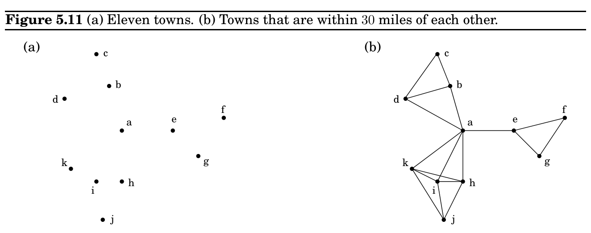

import Guide from '@/components/Guide.astro';
import Knowledge from '@/components/Knowledge.astro';
import Example from '@/components/Example.astro';
import Analysis from '@/components/Analysis.astro';
import Solution from '@/components/Solution.astro';
import Variant from '@/components/Variant.astro';
import Note from '@/components/Note.astro';
import Block from '@/components/Block.astro';
import Method from '@/components/Method.astro';
import Exercise from '@/components/Exercise.astro';

## 5.4 Set cover

while there is an implication that is not satisfied:

set the right-hand variable of the implication to true

if all pure negative clauses are satisfied: return the assignment else: return ‘‘formula is not satisfiable’’

For instance, suppose the formula is

(w ∧y ∧z) ⇒x, (x ∧z) ⇒w, x ⇒y, ⇒x, (x ∧y) ⇒w, (

w ∨

x ∨

y), (

z).

We start with everything false and then notice that x must be true on account of the singleton implication ⇒x. Then we see that y must also be true, because of x ⇒y. And so on.

To see why the algorithm is correct, notice that if it returns an assignment, this assignment satisfies both the implications and the negative clauses, and so it is indeed a satisfying truth assignment of the input Horn formula. So we only have to convince ourselves that if the algorithm finds no satisfying assignment, then there really is none. This is so because our “stingy” rule maintains the following invariant:

If a certain set of variables is set to true, then they must be true in any satisfying assignment.

Hence, if the truth assignment found after the while loop does not satisfy the negative clauses, there can be no satisfying truth assignment.

Horn formulas lie at the heart of Prolog (“programming by logic”), a language in which you program by specifying desired properties of the output, using simple logical expressions. The workhorse of Prolog interpreters is our greedy satisfiability algorithm. Conveniently, it can be implemented in time linear in the length of the formula; do you see how (Exercise 5.32)?

The dots in Figure 5.11 represent a collection of towns. This county is in its early stages of planning and is deciding where to put schools. There are only two constraints: each school should be in a town, and no one should have to travel more than 30 miles to reach one of them. What is the minimum number of schools needed?

This is a typical set cover problem. For each town x, let S_&#123;x&#125; be the set of towns within 30 miles of it. A school at x will essentially “cover” these other towns. The question is then, how many sets S_&#123;x&#125; must be picked in order to cover all the towns in the county?

S_&#123;ET&#125; COVER

Input: A set of elements B; sets S_&#123;1&#125;, . . . , S_&#123;m&#125; ⊆B

Output: A selection of the S_&#123;i&#125; whose union is B.

Cost: Number of sets picked.

(In our example, the elements of B are the towns.) This problem lends itself immediately to a greedy solution:

Repeat until all elements of B are covered:

Pick the set S_&#123;i&#125; with the largest number of uncovered elements.

This is extremely natural and intuitive. Let’s see what it would do on our earlier example: It would first place a school at town a, since this covers the largest number of other towns. Thereafter, it would choose three more schools—c, j, and either f or g—for a total of four. However, there exists a solution with just three schools, at b, e, and i. The greedy scheme is not optimal!

But luckily, it isn’t too far from optimal.

Claim Suppose B contains n elements and that the optimal cover consists of k sets. Then the greedy algorithm will use at most k ln n sets.^&#123;2&#125;

Let n_&#123;t&#125; be the number of elements still not covered after t iterations of the greedy algorithm (so n_&#123;0&#125; = n). Since these remaining elements are covered by the optimal k sets, there must be some set with at least n_&#123;t&#125;/k of them. Therefore, the greedy strategy will ensure that

n_&#123;t&#125;+1 ≤ n_&#123;t&#125; −n_&#123;t&#125;

k = n_&#123;t&#125;



1 −1

k



,

which by repeated application implies n_&#123;t&#125; ≤n_&#123;0&#125;(1 −1/k)^&#123;t&#125;. A more convenient bound can be obtained from the useful inequality

1 −x ≤e^&#123;−&#125;x for all x, with equality if and only if x = 0,

which is most easily proved by a picture:

2ln means “natural logarithm,” that is, to the base e.

x 0

1 1 −x

e^&#123;−&#125;x

Thus

n_&#123;t&#125; ≤ n_&#123;0&#125;



1 −1

k

t

&lt; n_&#123;0&#125;(e^&#123;−&#125;1/k)^&#123;t&#125; = ne^&#123;−&#125;t/k.

At t = k ln n, therefore, n_&#123;t&#125; is strictly less than ne^&#123;−&#125;ln n = 1, which means no elements remain to be covered.

The ratio between the greedy algorithm’s solution and the optimal solution varies from input to input but is always less than ln n. And there are certain inputs for which the ratio is very close to ln n (Exercise 5.33). We call this maximum ratio the approximation factor of the greedy algorithm. There seems to be a lot of room for improvement, but in fact such hopes are unjustified: it turns out that under certain widely-held complexity assumptions (which will be clearer when we reach Chapter 8), there is provably no polynomial-time algorithm with a smaller approximation factor.
