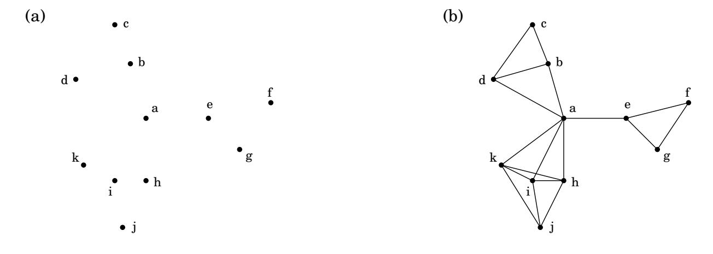
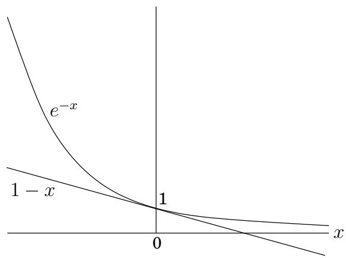

import Guide from '@/components/Guide.astro';
import Knowledge from '@/components/Knowledge.astro';
import Example from '@/components/Example.astro';
import Analysis from '@/components/Analysis.astro';
import Solution from '@/components/Solution.astro';
import Variant from '@/components/Variant.astro';
import Note from '@/components/Note.astro';
import Block from '@/components/Block.astro';
import Method from '@/components/Method.astro';
import Exercise from '@/components/Exercise.astro';

## 5.4 Set cover

The dots in Figure 5.11 represent a collection of towns. This county is in its early stages of planning and is deciding where to put schools. There are only two constraints: each school should be in a town, and no one should have to travel more than 30 miles to reach one of them. What is the minimum number of schools needed?

This is a typical set cover problem. For each town x, let $S _ { x }$ be the set of towns within 30 miles of it. A school at x will essentially “cover” these other towns. The question is then, how many sets $S _ { x }$ must be picked in order to cover all the towns in the county?

SET COVER

Input: A set of elements $B ;$ sets $S _ { 1 } , \dots , S _ { m } \subseteq B$

Output: A selection of the $S _ { i }$ whose union is $B .$ .

Cost: Number of sets picked.

(In our example, the elements of B are the towns.) This problem lends itself immediately to a greedy solution:

Figure 5.11 (a) Eleven towns. (b) Towns that are within 30 miles of each other.

Repeat until all elements of B are covered:

Pick the set $S _ { i }$ with the largest number of uncovered elements.

This is extremely natural and intuitive. Let's see what it would do on our earlier example: It would first place a school at town $^ { a , }$ since this covers the largest number of other towns. Thereafter, it would choose three more schools—c, j, and either $f$ or $g { \mathrm { - } } \mathbf { f o r }$ a total of four. However, there exists a solution with just three schools, at $b , e ,$ and i. The greedy scheme is not optimal!

But luckily, it isn't too far from optimal.

Claim Suppose B contains n elements and that the optimal cover consists ofk sets. Then the k ln n 2

Let $n _ { t }$ be the number of elements still not covered after t iterations of the greedy algorithm (so $n _ { 0 } = n )$ . Since these remaining elements are covered by the optimal k sets, there must be some set with at least $n _ { t } / k$ of them. Therefore, the greedy strategy will ensure that

$$
n _ {t + 1} \leq n _ {t} - \frac {n _ {t}}{k} = n _ {t} \left(1 - \frac {1}{k}\right),
$$

which by repeated application implies $n _ { t } \le n _ { 0 } ( 1 - 1 / k ) ^ { t }$ . A more convenient bound can be obtained from the useful inequality

$1 - x \leq e ^ { - x }$ for all x, with equality if and only if $x = 0 _ { i }$

which is most easily proved by a picture:

Thus

$$
n _ {t} \leq n _ {0} \left(1 - \frac {1}{k}\right) ^ {t} <   n _ {0} (e ^ {- 1 / k}) ^ {t} = n e ^ {- t / k}.
$$

At $t = k$ ln n, therefore, $n _ { t }$ is strictly less than $n e ^ { - \ln n } = 1$ , which means no elements remain to be covered.

The ratio between the greedy algorithm's solution and the optimal solution varies from input to input but is always less than ln $n .$ . And there are certain inputs for which the ratio is very close to ln n (Exercise 5.33). We call this maximum ratio the approximation factor of the greedy algorithm. There seems to be a lot of room for improvement, but in fact such hopes are unjustified: it turns out that under certain widely-held complexity assumptions (which will be clearer when we reach Chapter 8), there is provably no polynomial-time algorithm with a smaller approximation factor.
