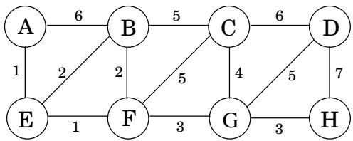
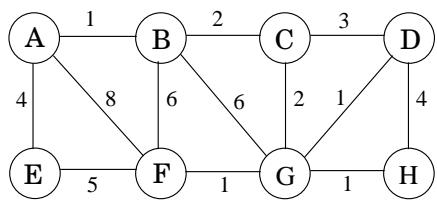

import Guide from '@/components/Guide.astro';
import Knowledge from '@/components/Knowledge.astro';
import Example from '@/components/Example.astro';
import Analysis from '@/components/Analysis.astro';
import Solution from '@/components/Solution.astro';
import Variant from '@/components/Variant.astro';
import Note from '@/components/Note.astro';
import Block from '@/components/Block.astro';
import Method from '@/components/Method.astro';
import Exercise from '@/components/Exercise.astro';
import Algorithm from '@/components/Algorithm.astro';

## Chapter 5 Exercises

<Exercise title="Exercise 5.1">

Consider the following graph.

(a) What is the cost of its minimum spanning tree?

(b) How many minimum spanning trees does it have?

(c) Suppose Kruskal's algorithm is run on this graph. In what order are the edges added to the MST? For each edge in this sequence, give a cut that justifies its addition.

</Exercise>

<Exercise title="Exercise 5.2">

Suppose we want to find the minimum spanning tree of the following graph.

(a) Run Prim's algorithm; whenever there is a choice of nodes, always use alphabetic ordering (e.g., start from node A). Draw a table showing the intermediate values of the cost array.

(b) Run Kruskal's algorithm on the same graph. Show how the disjoint-sets data structure looks at every intermediate stage (including the structure of the directed trees), assuming path compression is used.

</Exercise>

<Exercise title="Exercise 5.3">

Design a linear-time algorithm for the following task.

Input: A connected, undirected graph G.

Question: Is there an edge you can remove from G while still leaving G connected?

Can you reduce the running time of your algorithm to $O ( | V | ) ?$

</Exercise>

<Exercise title="Exercise 5.4">

Show that if an undirected graph with n vertices has k connected components, then it has at least $n - k$ edges.

</Exercise>

<Exercise title="Exercise 5.5">

Consider an undirected graph $G = ( V , E )$ with nonnegative edge weights $w _ { e } \geq 0$ . Suppose that you have computed a minimum spanning tree of $G ,$ and that you have also computed shortest paths to all nodes from a particular node $s \in V$

Now suppose each edge weight is increased by 1: the new weights are $w _ { e } ^ { \prime } = w _ { e } + 1$

(a) Does the minimum spanning tree change? Give an example where it changes or prove it cannot change.

(b) Do the shortest paths change? Give an example where they change or prove they cannot change.

</Exercise>

<Exercise title="Exercise 5.6">

Let $G = ( V , E )$ be an undirected graph. Prove that if all its edge weights are distinct, then it has a unique minimum spanning tree.

</Exercise>

<Exercise title="Exercise 5.7">

Show how to find the maximum spanning tree of a graph, that is, the spanning tree of largest total weight.

</Exercise>

<Exercise title="Exercise 5.8">

Suppose you are given a weighted graph $G = ( V , E )$ with a distinguished vertex s and where all edge weights are positive and distinct. Is it possible for a tree of shortest paths from s and a minimum spanning tree in G to not share any edges? If so, give an example. If not, give a reason.

</Exercise>

<Exercise title="Exercise 5.9">

The following statements may or may not be correct. In each case, either prove it (if it is correct) or give a counterexample (if it isn't correct). Always assume that the graph $G = ( V , E )$ is undirected. Do not assume that edge weights are distinct unless this is specifically stated.

(a) If graph G has more than V 1 edges, and there is a unique heaviest edge, then this edge cannot be part of a minimum spanning tree.

(b) If G has a cycle with a unique heaviest edge e, then e cannot be part of any MST.

(c) Let e be any edge of minimum weight in G. Then e must be part of some MST.

(d) If the lightest edge in a graph is unique, then it must be part of every MST.

(e) If e is part of some MST of G, then it must be a lightest edge across some cut of G.

(f) If G has a cycle with a unique lightest edge e, then e must be part of every MST.

(g) The shortest-path tree computed by Dijkstra's algorithm is necessarily an MST.

(h) The shortest path between two nodes is necessarily part of some MST.

(i) Prim's algorithm works correctly when there are negative edges.

(j) (For any $r > 0 ,$ define an r-path to be a path whose edges all have weight $< r . )$ If G contains an r-path from node s to t, then every MST of G must also contain an r-path from node s to node t.

</Exercise>

<Exercise title="Exercise 5.10">

Let T be an MST of graph G. Given a connected subgraph H of G, show that $T \cap H$ is contained in some MST of H.

</Exercise>

<Exercise title="Exercise 5.11">

Give the state of the disjoint-sets data structure after the following sequence of operations, starting from singleton sets $\{ 1 \} , \ldots , \{ 8 \}$ . Use path compression. In case ofties, always make the lower numbered root point to the higher numbered one.

union(1, 2), union(3, 4), union(5, 6), union(7, 8), union(1, 4), union(6, 7), union(4, 5), find(1)

</Exercise>

<Exercise title="Exercise 5.12">

Suppose you implement the disjoint-sets data structure using union-by-rank but not path compression. Give a sequence of m union and find operations on n elements that take Ω(m log n) time.

</Exercise>

<Exercise title="Exercise 5.13">

A long string consists of the four characters $A , C , G , T ;$ they appear with frequency 31%, 20%, 9%, and 40%, respectively. What is the Huffman encoding of these four characters?

</Exercise>

<Exercise title="Exercise 5.14">

Suppose the symbols $a , b , c , d ,$ e occur with frequencies $1 / 2 , 1 / 4 , 1 / 8 , 1 / 1 6 , 1 / 1 6 ,$ , respectively.

(a) What is the Huffman encoding of the alphabet?

(b) If this encoding is applied to a file consisting of 1,000,000 characters with the given frequencies, what is the length of the encoded file in bits?

</Exercise>

<Exercise title="Exercise 5.15">

We use Huffman's algorithm to obtain an encoding of alphabet $\{ a , b , c \}$ with frequencies $f _ { a } , f _ { b } , f _ { c } .$ In each of the following cases, either give an example of frequencies $( f _ { a } , f _ { b } , f _ { c } )$ that would yield the specified code, or explain why the code cannot possibly be obtained (no matter what the frequencies are).

(a) Code: 0, 10, 11

(b) Code: 0, 1, 00

(c) Code: &#123;10, 01, 00&#125;

</Exercise>

<Exercise title="Exercise 5.16">

Prove the following two properties of the Huffman encoding scheme.

(a) If some character occurs with frequency more than $2 / 5 ,$ , then there is guaranteed to be a codeword of length 1.

(b) If all characters occur with frequency less than $1 / 3 ,$ then there is guaranteed to be no codeword of length 1.

</Exercise>

<Exercise title="Exercise 5.17">

Under a Huffman encoding of n symbols with frequencies $f _ { 1 } , f _ { 2 } , \ldots , f _ { n }$ , what is the longest a codeword could possibly be? Give an example set of frequencies that would produce this case.

</Exercise>

<Exercise title="Exercise 5.18">

The following table gives the frequencies of the letters of the English language (including the blank for separating words) in a particular corpus.

$$
\begin{array}{c c c c c c} \text {blank} & 1 8.3\% & \text {r} & 4.8\% & \text {y} & 1.6\% \\ \text {e} & 10.2\% & \text {d} & 3.5\% & \text {p} & 1.6\% \\ \text {t} & 7.7\% & \text {l} & 3.4\% & \text {b} & 1.3\% \\ \text {a} & 6.8\% & \text {c} & 2.6\% & \text {v} & 0.9\% \\ \text {o} & 5.9\% & \text {u} & 2.4\% & \text {k} & 0.6\% \\ \text {i} & 5.8\% & \text {m} & 2.1\% & \text {j} & 0.2\% \\ \text {n} & 5.5\% & \text {w} & 1.9\% & \text {x} & 0.2\% \\ \text {s} & 5.1\% & \text {f} & 1.8\% & \text {q} & 0.1\% \\ \text {h} & 4.9\% & \text {g} & 1.7\% & \text {z} & 0.1\% \end{array}
$$

(a) What is the optimum Huffman encoding of this alphabet?

(b) What is the expected number of bits per letter?

(c) Suppose now that we calculate the entropy of these frequencies

$$
H = \sum_ {i = 0} ^ {2 6} p _ {i} \log {\frac {1}{p _ {i}}}
$$

(see the box in page 150). Would you expect it to be larger or smaller than your answer above? Explain.

(d) Do you think that this is the limit of how much English text can be compressed? What features of the English language, besides letters and their frequencies, should a better compression scheme take into account?

</Exercise>

<Exercise title="Exercise 5.19">

Entropy. Consider a distribution over n possible outcomes, with probabilities $p _ { 1 } , p _ { 2 } , \ldots , p _ { n } .$

(a) Just for this part of the problem, assume that each $p _ { i }$ is a power of 2 (that is, of the form $1 / 2 ^ { k } )$ . Suppose a long sequence of m samples is drawn from the distribution and that for all $1 \leq i \leq n ,$ the $i ^ { \mathrm { t h } }$ outcome occurs exactly $m p _ { i }$ times in the sequence. Show that if Huffman encoding is applied to this sequence, the resulting encoding will have length

$$
\sum_ {i = 1} ^ {n} m p _ {i} \log {\frac {1}{p _ {i}}}.
$$

(b) Now consider arbitrary distributions—that is, the probabilities $p _ { i }$ are not restricted to powers of 2. The most commonly used measure of the amount of randomness in the distribution is the entropy

$$
\sum_ {i = 1} ^ {n} p _ {i} \log {\frac {1}{p _ {i}}}.
$$

For what distribution (over n outcomes) is the entropy the largest possible? The smallest possible?

</Exercise>

<Exercise title="Exercise 5.20">

Give a linear-time algorithm that takes as input a tree and determines whether it has a perfect matching: a set of edges that touches each node exactly once.

A feedback edge set of an undirected graph $G = ( V , E )$ is a subset of edges $E ^ { \prime } \subseteq E$ that intersects every cycle of the graph. Thus, removing the edges $E ^ { \prime }$ will render the graph acyclic.

Give an efficient algorithm for the following problem:

Input: Undirected graph $G = ( V , E )$ with positive edge weights $w _ { e }$

Output: A feedback edge set $E ^ { \prime } \subseteq E$ of minimum total weight $\textstyle \sum _ { e \in E ^ { \prime } } w _ { e }$

</Exercise>

<Exercise title="Exercise 5.21">

In this problem, we will develop a new algorithm for finding minimum spanning trees. It is based upon the following property:

Pick any cycle in the graph, and let e be the heaviest edge in that cycle. Then there is a minimum spanning tree that does not contain e.

(a) Prove this property carefully.

(b) Here is the new MST algorithm. The input is some undirected graph $G = ( V , E )$ (in adjacency list format) with edge weights $\{ w _ { e } \}$

<Algorithm>
sort the edges according to their weights
for each edge $e \in E$, in decreasing order of $w_e$:
    if e is part of a cycle of G:
        G = G - e (that is, remove e from G)
return G
</Algorithm>

Prove that this algorithm is correct.

(c) On each iteration, the algorithm must check whether there is a cycle containing a specific edge e. Give a linear-time algorithm for this task, and justify its correctness.

(d) What is the overall time taken by this algorithm, in terms of E ? Explain your answer.

</Exercise>

<Exercise title="Exercise 5.22">

You are given a graph $G = ( V , E )$ with positive edge weights, and a minimum spanning tree $T = \left( V , E ^ { \prime } \right)$ with respect to these weights; you may assume G and T are given as adjacency lists. Now suppose the weight of a particular edge $e \in E$ is modified from $w ( e )$ to a new value $\hat { w } ( e )$ . You wish to quickly update the minimum spanning tree T to reflect this change, without recomputing the entire tree from scratch. There are four cases. In each case give a linear-time algorithm for updating the tree.

(a) $e \notin E ^ { \prime }$ and ${ \hat { w } } ( e ) > w ( e )$

(b) $e \notin E ^ { \prime }$ and $\hat { w } ( e ) < w ( e )$

(c) $e \in E ^ { \prime }$ and $\hat { w } ( e ) < w ( e )$

(d) $e \in E ^ { \prime }$ and ${ \hat { w } } ( e ) > w ( e )$

</Exercise>

<Exercise title="Exercise 5.23">

Sometimes we want light spanning trees with certain special properties. Here's an example.

Input: Undirected graph $G = ( V , E )$ ; edge weights $w _ { e } ;$ subset of vertices $U \subset V$

Output: The lightest spanning tree in which the nodes of U are leaves (there might be other leaves in this tree as well).

(The answer isn't necessarily a minimum spanning tree.)

Give an algorithm for this problem which runs in $O ( | E | \log | V | )$ time. (Hint: When you remove nodes U from the optimal solution, what is left?)

</Exercise>

<Exercise title="Exercise 5.24">

A binary counter of unspecified length supports two operations: increment (which increases its value by one) and reset (which sets its value back to zero). Show that, starting from an initially zero counter, any sequence of n increment and reset operations takes time $O ( n ) ;$ that is, the amortized time per operation is $O ( 1 )$

</Exercise>

<Exercise title="Exercise 5.25">

Here's a problem that occurs in automatic program analysis. For a set of variables $x _ { 1 } , \ldots , x _ { n } ,$ you are given some equality constraints, of the form $^ { \ast } x _ { i } = { x _ { j } } ^ { \ast }$ and some disequality constraints, of the form $^ { \ast } x _ { i } \neq x _ { j } . ^ { \ast }$ Is it possible to satisfy all of them?

For instance, the constraints

$$
x _ {1} = x _ {2}, x _ {2} = x _ {3}, x _ {3} = x _ {4}, x _ {1} \neq x _ {4}
$$

cannot be satisfied. Give an efficient algorithm that takes as input m constraints over n variables and decides whether the constraints can be satisfied.

</Exercise>

<Exercise title="Exercise 5.26">

Graphs with prescribed degree sequences. Given a list of n positive integers $d _ { 1 } , d _ { 2 } , \ldots , d _ { n } .$ , we want to efficiently determine whether there exists an undirected graph $G = ( V , E )$ whose nodes have degrees precisely $d _ { 1 } , d _ { 2 } , \ldots , d _ { n }$ . That is, if $V = \{ v _ { 1 } , \ldots , v _ { n } \}$ , then the degree of $v _ { i }$ should be exactly $d _ { i } .$ . We call $( d _ { 1 } , \ldots , d _ { n } )$ the degree sequence $o f G$ . This graph G should not contain self-loops (edges with both endpoints equal to the same node) or multiple edges between the same pair of nodes.

(a) Give an example of $d _ { 1 } , d _ { 2 } , d _ { 3 } , d _ { 4 }$ where all the $d _ { i } \leq 3$ and $d _ { 1 } + d _ { 2 } + d _ { 3 } + d _ { 4 }$ is even, but for which no graph with degree sequence $( d _ { 1 } , d _ { 2 } , d _ { 3 } , d _ { 4 } )$ exists.

(b) Suppose that $d _ { 1 } \geq d _ { 2 } \geq \cdot \cdot \cdot \geq d _ { n }$ and that there exists a graph $G = ( V , E )$ with degree sequence $( d _ { 1 } , \ldots , d _ { n } )$ . We want to show that there must exist a graph that has this degree sequence and where in addition the neighbors of $v _ { 1 }$ are $v _ { 2 } , v _ { 3 } , \ldots , v _ { d _ { 1 } + 1 }$ The idea is to gradually transform G into a graph with the desired additional property.

i. Suppose the neighbors of $v _ { 1 }$ in $G$ are not $v _ { 2 } , v _ { 3 } , \ldots , v _ { d _ { 1 } + 1 }$ . Show that there exists $i <$ $j \leq n$ and $u \in V$ such that $\{ v _ { 1 } , v _ { i } \} , \{ u , v _ { j } \} \notin E$ and $\{ v _ { 1 } , v _ { j } \} , \{ u , v _ { i } \} \in E$

ii. Specify the changes you would make to G to obtain a new graph $G ^ { \prime } = ( V , E ^ { \prime } )$ with the same degree sequence as $G$ and where $( v _ { 1 } , v _ { i } ) \in E ^ { \prime }$

iii. Now show that there must be a graph with the given degree sequence but in which $v _ { 1 }$ has neighbors v2, $v _ { 3 } , \ldots , v _ { d _ { 1 } + 1 }$

(c) Using the result from part (b), describe an algorithm that on input $d _ { 1 } , \ldots , d _ { n }$ (not necessarily sorted) decides whether there exists a graph with this degree sequence. Your algorithm should run in time polynomial in n and in $\textstyle m = \sum _ { i = 1 } ^ { n } d _ { i }$

</Exercise>

<Exercise title="Exercise 5.27">

Alice wants to throw a party and is deciding whom to call. She has n people to choose from, and she has made up a list of which pairs of these people know each other. She wants to pick as many people as possible, subject to two constraints: at the party, each person should have at least five other people whom they know and five other people whom they don't know.

Give an efficient algorithm that takes as input the list of n people and the list of pairs who know each other and outputs the best choice of party invitees. Give the running time in terms of n.

</Exercise>

<Exercise title="Exercise 5.28">

A prefix-free encoding of a finite alphabet Γ assigns each symbol in Γ a binary codeword, such that no codeword is a prefix of another codeword.

Show that such an encoding can be represented by a full binary tree in which each leaf corresponds to a unique element of Γ, whose codeword is generated by the path from the root to that leaf (interpreting a left branch as 0 and a right branch as 1).

</Exercise>

<Exercise title="Exercise 5.29">

Ternary Huffman. Trimedia Disks Inc. has developed “ternary” hard disks. Each cell on a disk can now store values 0, 1, or 2 (instead ofjust 0 or 1). To take advantage of this new technology, provide a modified Huffman algorithm for compressing sequences of characters from an alphabet of size $n ,$ where the characters occur with known frequencies $f _ { 1 } , f _ { 2 } , \ldots , f _ { n } .$ . Your algorithm should encode each character with a variable-length codeword over the values 0, 1, 2 such that no codeword is a prefix of another codeword and so as to obtain the maximum possible compression. Prove that your algorithm is correct.

</Exercise>

<Exercise title="Exercise 5.30">

The basic intuition behind Huffman's algorithm, that frequent blocks should have short encodings and infrequent blocks should have long encodings, is also at work in English, where typical words like I, you, is, and, to, from, and so on are short, and rarely used words like velociraptor are longer.

However, words like fire!, help!, and run! are short not because they are frequent, but perhaps because time is precious in situations where they are used.

To make things theoretical, suppose we have a file composed of m different words, with frequencies $f _ { 1 } , \ldots , f _ { m }$ . Suppose also that for the ith word, the cost per bit of encoding is $c _ { i } .$ . Thus, if we find a prefix-free code where the ith word has a codeword of length $l _ { i } ,$ , then the total cost of the encoding will be $\textstyle \sum _ { i } f _ { i } \cdot c _ { i } \cdot l _ { i }$

Show how to modify Huffman's algorithm to find the prefix-free encoding of minimum total cost.

</Exercise>

<Exercise title="Exercise 5.31">

A server has n customers waiting to be served. The service time required by each customer is known in advance: it is $t _ { i }$ minutes for customer i. So if, for example, the customers are served in order of increasing $i ,$ then the ith customer has to wait $\textstyle \sum _ { j = 1 } ^ { i } t _ { j }$ minutes.

We wish to minimize the total waiting time

$$
T = \sum_ {i = 1} ^ {n} (\text { time   spent   waiting   by   customer } i).
$$

Give an efficient algorithm for computing the optimal order in which to process the customers.

</Exercise>

<Exercise title="Exercise 5.32">

Show how to implement the stingy algorithm for Horn formula satisfiability (Section 5.3) in time that is linear in the length of the formula (the number of occurrences of literals in it). (Hint: Use a directed graph, with one node per variable, to represent the implications.)

</Exercise>

<Exercise title="Exercise 5.33">

Show that for any integer n that is a power of 2, there is an instance of the set cover problem (Section 5.4) with the following properties:

i. There are n elements in the base set.

ii. The optimal cover uses just two sets.

iii. The greedy algorithm picks at least log n sets.

Thus the approximation ratio we derived in the chapter is tight.

</Exercise>

