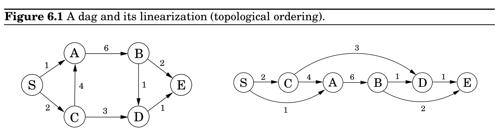

import Guide from '@/components/Guide.astro';
import Knowledge from '@/components/Knowledge.astro';
import Example from '@/components/Example.astro';
import Analysis from '@/components/Analysis.astro';
import Solution from '@/components/Solution.astro';
import Variant from '@/components/Variant.astro';
import Note from '@/components/Note.astro';
import Block from '@/components/Block.astro';
import Method from '@/components/Method.astro';
import Exercise from '@/components/Exercise.astro';

## 6.1 Shortest paths in dags, revisited

### Dynamic programming

In the preceding chapters we have seen some elegant design principles—such as divide-andconquer, graph exploration, and greedy choice—that yield definitive algorithms for a variety of important computational tasks. The drawback of these tools is that they can only be used on very specific types of problems. We now turn to the two sledgehammers of the algorithms craft, dynamic programming and linear programming, techniques of very broad applicability that can be invoked when more specialized methods fail. Predictably, this generality often comes with a cost in efficiency.

At the conclusion of our study of shortest paths (Chapter 4), we observed that the problem is especially easy in directed acyclic graphs (dags). Let’s recapitulate this case, because it lies at the heart of dynamic programming.

The special distinguishing feature of a dag is that its nodes can be linearized; that is, they can be arranged on a line so that all edges go from left to right (Figure 6.1). To see why this helps with shortest paths, suppose we want to figure out distances from node S to the other nodes. For concreteness, let’s focus on node D. The only way to get to it is through its predecessors, B or C; so to find the shortest path to D, we need only compare these two routes:

dist(D) = min&#123;dist(B) + 1, dist(C) + 3&#125;.

A similar relation can be written for every node. If we compute these dist values in the
