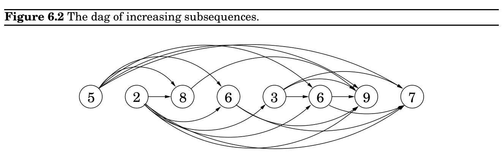

import Guide from '@/components/Guide.astro';
import Knowledge from '@/components/Knowledge.astro';
import Example from '@/components/Example.astro';
import Analysis from '@/components/Analysis.astro';
import Solution from '@/components/Solution.astro';
import Variant from '@/components/Variant.astro';
import Note from '@/components/Note.astro';
import Block from '@/components/Block.astro';
import Method from '@/components/Method.astro';
import Exercise from '@/components/Exercise.astro';

## 6.2 Longest increasing subsequences

left-to-right order of Figure 6.1, we can always be sure that by the time we get to a node v, we already have all the information we need to compute dist(v). We are therefore able to compute all distances in a single pass:

initialize all dist(·) values to ∞ dist(s) = 0 for each v ∈V \&#123;s&#125;, in linearized order:

dist(v) = min_&#123;(&#125;u,v)∈E&#123;dist(u) + l(u, v)&#125;

Notice that this algorithm is solving a collection of subproblems, &#123;dist(u) : u ∈V &#125;. We start with the smallest of them, dist(s), since we immediately know its answer to be 0. We then proceed with progressively “larger” subproblems—distances to vertices that are further and further along in the linearization—where we are thinking of a subproblem as large if we need to have solved a lot of other subproblems before we can get to it.

This is a very general technique. At each node, we compute some function of the values of the node’s predecessors. It so happens that our particular function is a minimum of sums, but we could just as well make it a maximum, in which case we would get longest paths in the dag. Or we could use a product instead of a sum inside the brackets, in which case we would end up computing the path with the smallest product of edge lengths.

Dynamic programming is a very powerful algorithmic paradigm in which a problem is solved by identifying a collection of subproblems and tackling them one by one, smallest first, using the answers to small problems to help figure out larger ones, until the whole lot of them is solved. In dynamic programming we are not given a dag; the dag is implicit. Its nodes are the subproblems we define, and its edges are the dependencies between the subproblems: if to solve subproblem B we need the answer to subproblem A, then there is a (conceptual) edge from A to B. In this case, A is thought of as a smaller subproblem than B—and it will always be smaller, in an obvious sense.

But it’s time we saw an example.

In the longest increasing subsequence problem, the input is a sequence of numbers a_&#123;1&#125;, . . . , a_&#123;n&#125;. A subsequence is any subset of these numbers taken in order, of the form a_&#123;i&#125;_&#123;1&#125;, a_&#123;i&#125;_&#123;2&#125;, . . . , a_&#123;i&#125;_&#123;k&#125; where 1 ≤i_&#123;1&#125; &lt; i_&#123;2&#125; &lt; · · · &lt; i_&#123;k&#125; ≤n, and an increasing subsequence is one in which the numbers are getting strictly larger. The task is to find the increasing subsequence of greatest length. For instance, the longest increasing subsequence of 5, 2, 8, 6, 3, 6, 9, 7 is 2, 3, 6, 9:

5 2 8 6 3 6 9 7

In this example, the arrows denote transitions between consecutive elements of the optimal solution. More generally, to better understand the solution space, let’s create a graph of all permissible transitions: establish a node i for each element a_&#123;i&#125;, and add directed edges (i, j) whenever it is possible for a_&#123;i&#125; and a_&#123;j&#125; to be consecutive elements in an increasing subsequence, that is, whenever i &lt; j and a_&#123;i&#125; &lt; a_&#123;j&#125; (Figure 6.2).

Notice that (1) this graph G = (V, E) is a dag, since all edges (i, j) have i &lt; j, and (2) there is a one-to-one correspondence between increasing subsequences and paths in this dag. Therefore, our goal is simply to find the longest path in the dag!

Here is the algorithm:

for j = 1, 2, . . . , n:

L(j) = 1 + max&#123;L(i) : (i, j) ∈E&#125; return max_&#123;j&#125; L(j)

L(j) is the length of the longest path—the longest increasing subsequence—ending at j (plus 1, since strictly speaking we need to count nodes on the path, not edges). By reasoning in the same way as we did for shortest paths, we see that any path to node j must pass through one of its predecessors, and therefore L(j) is 1 plus the maximum L(·) value of these predecessors. If there are no edges into j, we take the maximum over the empty set, zero. And the final answer is the largest L(j), since any ending position is allowed.

This is dynamic programming. In order to solve our original problem, we have defined a collection of subproblems &#123;L(j) : 1 ≤j ≤n&#125; with the following key property that allows them to be solved in a single pass:

(*) There is an ordering on the subproblems, and a relation that shows how to solve a subproblem given the answers to “smaller” subproblems, that is, subproblems that appear earlier in the ordering.

In our case, each subproblem is solved using the relation

L(j) = 1 + max&#123;L(i) : (i, j) ∈E&#125;,

an expression which involves only smaller subproblems. How long does this step take? It requires the predecessors of j to be known; for this the adjacency list of the reverse graph G^&#123;R&#125;, constructible in linear time (recall Exercise 3.5), is handy. The computation of L(j) then takes time proportional to the indegree of j, giving an overall running time linear in |E|. This is at most O(n^&#123;2&#125;), the maximum being when the input array is sorted in increasing order. Thus the dynamic programming solution is both simple and efficient.

There is one last issue to be cleared up: the L-values only tell us the length of the optimal subsequence, so how do we recover the subsequence itself? This is easily managed with the

same bookkeeping device we used for shortest paths in Chapter 4. While computing L(j), we should also note down prev(j), the next-to-last node on the longest path to j. The optimal subsequence can then be reconstructed by following these backpointers.

Recursion? No, thanks.

Returning to our discussion of longest increasing subsequences: the formula for L(j) also suggests an alternative, recursive algorithm. Wouldn’t that be even simpler?

Actually, recursion is a very bad idea: the resulting procedure would require exponential time! To see why, suppose that the dag contains edges (i, j) for all i &lt; j—that is, the given sequence of numbers a_&#123;1&#125;, a_&#123;2&#125;, . . . , a_&#123;n&#125; is sorted. In that case, the formula for subproblem L(j) becomes

L(j) = 1 + max&#123;L(1), L(2), . . . , L(j −1)&#125;.

The following figure unravels the recursion for L(5). Notice that the same subproblems get solved over and over again!

L(2)

L(1) L(1) L(2) L(1) L(2)

L(1) L(1) L(1) L(2)

L(1)

L(3)

L(1) L(3) L(4)

L(5)

For L(n) this tree has exponentially many nodes (can you bound it?), and so a recursive solution is disastrous.

Then why did recursion work so well with divide-and-conquer? The key point is that in divide-and-conquer, a problem is expressed in terms of subproblems that are substantially smaller, say half the size. For instance, mergesort sorts an array of size n by recursively sorting two subarrays of size n/2. Because of this sharp drop in problem size, the full recursion tree has only logarithmic depth and a polynomial number of nodes.

In contrast, in a typical dynamic programming formulation, a problem is reduced to subproblems that are only slightly smaller—for instance, L(j) relies on L(j −1). Thus the full recursion tree generally has polynomial depth and an exponential number of nodes. However, it turns out that most of these nodes are repeats, that there are not too many distinct subproblems among them. Efficiency is therefore obtained by explicitly enumerating the distinct subproblems and solving them in the right order.
