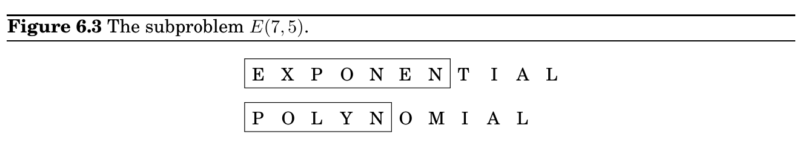
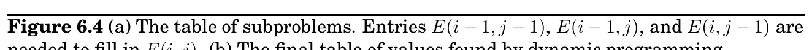
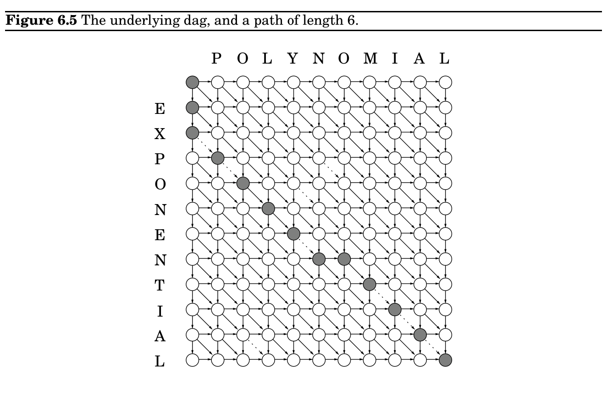

import Guide from '@/components/Guide.astro';
import Knowledge from '@/components/Knowledge.astro';
import Example from '@/components/Example.astro';
import Analysis from '@/components/Analysis.astro';
import Solution from '@/components/Solution.astro';
import Variant from '@/components/Variant.astro';
import Note from '@/components/Note.astro';
import Block from '@/components/Block.astro';
import Method from '@/components/Method.astro';
import Exercise from '@/components/Exercise.astro';

## 6.3 Edit distance

### Programming?

The origin of the term dynamic programming has very little to do with writing code. It was first coined by Richard Bellman in the 1950s, a time when computer programming was an esoteric activity practiced by so few people as to not even merit a name. Back then programming meant “planning,” and “dynamic programming” was conceived to optimally plan multistage processes. The dag of Figure 6.2 can be thought of as describing the possible ways in which such a process can evolve: each node denotes a state, the leftmost node is the starting point, and the edges leaving a state represent possible actions, leading to different states in the next unit of time.

The etymology of linear programming, the subject of Chapter 7, is similar.

When a spell checker encounters a possible misspelling, it looks in its dictionary for other words that are close by. What is the appropriate notion of closeness in this case?

A natural measure of the distance between two strings is the extent to which they can be aligned, or matched up. Technically, an alignment is simply a way of writing the strings one above the other. For instance, here are two possible alignments of SNOWY and SUNNY:

S − N O W Y S U N N − Y Cost: 3

− S N O W − Y S U N − − N Y Cost: 5

The “−” indicates a “gap”; any number of these can be placed in either string. The cost of an alignment is the number of columns in which the letters differ. And the edit distance between two strings is the cost of their best possible alignment. Do you see that there is no better alignment of SNOWY and SUNNY than the one shown here with a cost of 3?

Edit distance is so named because it can also be thought of as the minimum number of edits—insertions, deletions, and substitutions of characters—needed to transform the first string into the second. For instance, the alignment shown on the left corresponds to three edits: insert U, substitute O →N, and delete W.

In general, there are so many possible alignments between two strings that it would be terribly inefficient to search through all of them for the best one. Instead we turn to dynamic programming.

A dynamic programming solution

When solving a problem by dynamic programming, the most crucial question is, What are the subproblems? As long as they are chosen so as to have the property (*) from page 163. it is an easy matter to write down the algorithm: iteratively solve one subproblem after the other, in order of increasing size.

Our goal is to find the edit distance between two strings x[1 · · · m] and y[1 · · · n]. What is a good subproblem? Well, it should go part of the way toward solving the whole problem; so how about looking at the edit distance between some prefix of the first string, x[1 · · · i], and some prefix of the second, y[1 · · · j]? Call this subproblem E(i, j) (see Figure 6.3). Our final objective, then, is to compute E(m, n).

For this to work, we need to somehow express E(i, j) in terms of smaller subproblems. Let’s see—what do we know about the best alignment between x[1 · · · i] and y[1 · · · j]? Well, its rightmost column can only be one of three things:

x[i]

− or − y[j] or x[i] y[j]

The first case incurs a cost of 1 for this particular column, and it remains to align x[1 · · · i −1] with y[1 · · · j]. But this is exactly the subproblem E(i−1, j)! We seem to be getting somewhere. In the second case, also with cost 1, we still need to align x[1 · · · i] with y[1 · · · j −1]. This is again another subproblem, E(i, j −1). And in the final case, which either costs 1 (if x[i]̸ = y[j]) or 0 (if x[i] = y[j]), what’s left is the subproblem E(i −1, j −1). In short, we have expressed E(i, j) in terms of three smaller subproblems E(i −1, j), E(i, j −1), E(i −1, j −1). We have no idea which of them is the right one, so we need to try them all and pick the best:

E(i, j) = min&#123;1 + E(i −1, j), 1 + E(i, j −1), diff(i, j) + E(i −1, j −1)&#125;

where for convenience diff(i, j) is defined to be 0 if x[i] = y[j] and 1 otherwise.

For instance, in computing the edit distance between EXPONENTIAL and POLYNOMIAL, subproblem E(4, 3) corresponds to the prefixes EXPO and POL. The rightmost column of their best alignment must be one of the following:

O − or −

L or O L

Thus, E(4, 3) = min&#123;1 + E(3, 3), 1 + E(4, 2), 1 + E(3, 2)&#125;.

The answers to all the subproblems E(i, j) form a two-dimensional table, as in Figure 6.4. In what order should these subproblems be solved? Any order is fine, as long as E(i −1, j), E(i, j −1), and E(i −1, j −1) are handled before E(i, j). For instance, we could fill in the table one row at a time, from top row to bottom row, and moving left to right across each row. Or alternatively, we could fill it in column by column. Both methods would ensure that by the time we get around to computing a particular table entry, all the other entries we need are already filled in.

With both the subproblems and the ordering specified, we are almost done. There just remain the “base cases” of the dynamic programming, the very smallest subproblems. In the present situation, these are E(0, ·) and E(·, 0), both of which are easily solved. E(0, j) is the edit distance between the 0-length prefix of x, namely the empty string, and the first j letters of y: clearly, j. And similarly, E(i, 0) = i.

At this point, the algorithm for edit distance basically writes itself.

(a)

i

j −1 j

i −1

m GOAL

n

(b)

P O L Y N O M I A L

0 1 2 3 4 5 6 7 8 9 10

E

1 1 2 3 4 5 6 7 8 9 10

X

2 2 2 3 4 5 6 7 8 9 10

P

3 2 3 3 4 5 6 7 8 9 10

O

4 3 2 3 4 5 5 6 7 8 9

N

5 4 3 3 4 4 5 6 7 8 9

E

6 5 4 4 4 5 5 6 7 8 9

N

7 6 5 5 5 4 5 6 7 8 9

T

8 7 6 6 6 5 5 6 7 8 9

I

9 8 7 7 7 6 6 6 6 7 8

A

10 9 8 8 8 7 7 7 7 6 7

L

11 10 9 8 9 8 8 8 8 7 6

for i = 0, 1, 2, . . . , m:

E(i, 0) = i for j = 1, 2, . . . , n:

E(0, j) = j for i = 1, 2, . . . , m:

for j = 1, 2, . . . , n:

E(i, j) = min&#123;E(i −1, j) + 1, E(i, j −1) + 1, E(i −1, j −1) + diff(i, j)&#125; return E(m, n)

This procedure fills in the table row by row, and left to right within each row. Each entry takes constant time to fill in, so the overall running time is just the size of the table, O(mn).

And in our example, the edit distance turns out to be 6:

E X P O N E N − T I A L − − P O L Y N O M I A L

The underlying dag

Every dynamic program has an underlying dag structure: think of each node as representing a subproblem, and each edge as a precedence constraint on the order in which the subproblems can be tackled. Having nodes u_&#123;1&#125;, . . . , u_&#123;k&#125; point to v means “subproblem v can only be solved once the answers to u_&#123;1&#125;, . . . , u_&#123;k&#125; are known.”

In our present edit distance application, the nodes of the underlying dag correspond to subproblems, or equivalently, to positions (i, j) in the table. Its edges are the precedence constraints, of the form (i−1, j) →(i, j), (i, j −1) →(i, j), and (i−1, j −1) →(i, j) (Figure 6.5). In fact, we can take things a little further and put weights on the edges so that the edit

distances are given by shortest paths in the dag! To see this, set all edge lengths to 1, except for &#123;(i −1, j −1) →(i, j) : x[i] = y[j]&#125; (shown dotted in the figure), whose length is 0. The final answer is then simply the distance between nodes s = (0, 0) and t = (m, n). One possible shortest path is shown, the one that yields the alignment we found earlier. On this path, each move down is a deletion, each move right is an insertion, and each diagonal move is either a match or a substitution.

By altering the weights on this dag, we can allow generalized forms of edit distance, in which insertions, deletions, and substitutions have different associated costs.

### Common subproblems

Finding the right subproblem takes creativity and experimentation. But there are a few standard choices that seem to arise repeatedly in dynamic programming.

i. The input is x_&#123;1&#125;, x_&#123;2&#125;, . . . , x_&#123;n&#125; and a subproblem is x_&#123;1&#125;, x_&#123;2&#125;, . . . , x_&#123;i&#125;.

x_&#123;1&#125; x_&#123;2&#125; x_&#123;3&#125; x_&#123;4&#125; x_&#123;5&#125; x_&#123;6&#125; x_&#123;7&#125; x_&#123;8&#125; x_&#123;9&#125; x_&#123;10&#125;

The number of subproblems is therefore linear.

ii. The input is x_&#123;1&#125;, . . . , x_&#123;n&#125;, and y_&#123;1&#125;, . . . , y_&#123;m&#125;. A subproblem is x_&#123;1&#125;, . . . , x_&#123;i&#125; and y_&#123;1&#125;, . . . , y_&#123;j&#125;.

x_&#123;1&#125; x_&#123;2&#125; x_&#123;3&#125; x_&#123;4&#125; x_&#123;5&#125; x_&#123;6&#125; x_&#123;7&#125; x_&#123;8&#125; x_&#123;9&#125; x_&#123;10&#125;

y_&#123;1&#125; y_&#123;2&#125; y_&#123;3&#125; y_&#123;4&#125; y_&#123;5&#125; y_&#123;6&#125; y_&#123;7&#125; y_&#123;8&#125;

The number of subproblems is O(mn).

iii. The input is x_&#123;1&#125;, . . . , x_&#123;n&#125; and a subproblem is x_&#123;i&#125;, x_&#123;i&#125;+1, . . . , x_&#123;j&#125;.

x_&#123;1&#125; x_&#123;2&#125; x_&#123;3&#125; x_&#123;4&#125; x_&#123;5&#125; x_&#123;6&#125; x_&#123;7&#125; x_&#123;8&#125; x_&#123;9&#125; x_&#123;10&#125;

The number of subproblems is O(n^&#123;2&#125;).

iv. The input is a rooted tree. A subproblem is a rooted subtree.

If the tree has n nodes, how many subproblems are there?

We’ve already encountered the first two cases, and the others are coming up shortly.

### Of mice and men

Our bodies are extraordinary machines: flexible in function, adaptive to new environments, and able to interact and reproduce. All these capabilities are specified by a program unique to each of us, a string that is 3 billion characters long over the alphabet &#123;A, C, G, T&#125;—our DNA.

The DNA sequences of any two people differ by only about 0.1%. However, this still leaves 3 million positions on which they vary, more than enough to explain the vast range of human diversity. These differences are of great scientific and medical interest—for instance, they might help predict which people are prone to certain diseases.

DNA is a vast and seemingly inscrutable program, but it can be broken down into smaller units that are more specific in their role, rather like subroutines. These are called genes. Computers have become a crucial tool in understanding the genes of humans and other organisms, to the extent that computational genomics is now a field in its own right. Here are examples of typical questions that arise.

1. When a new gene is discovered, one way to gain insight into its function is to find known genes that match it closely. This is particularly helpful in transferring knowledge from well-studied species, such as mice, to human beings.

A basic primitive in this search problem is to define an efficiently computable notion of when two strings approximately match. The biology suggests a generalization of edit distance, and dynamic programming can be used to compute it.

Then there’s the problem of searching through the vast thicket of known genes: the database GenBank already has a total length of over 10^&#123;10&#125;, and this number is growing rapidly. The current method of choice is BLAST, a clever combination of algorithmic tricks and biological intuitions that has made it the most widely used software in computational biology.

2. Methods for sequencing DNA (that is, determining the string of characters that constitute it) typically only find fragments of 500–700 characters. Billions of these randomly scattered fragments can be generated, but how can they be assembled into a coherent DNA sequence? For one thing, the position of any one fragment in the final sequence is unknown and must be inferred by piecing together overlapping fragments.

A showpiece of these efforts is the draft of human DNA completed in 2001 by two groups simultaneously: the publicly funded Human Genome Consortium and the private Celera Genomics.

3. When a particular gene has been sequenced in each of several species, can this information be used to reconstruct the evolutionary history of these species?

We will explore these problems in the exercises at the end of this chapter. Dynamic programming has turned out to be an invaluable tool for some of them and for computational biology in general.
