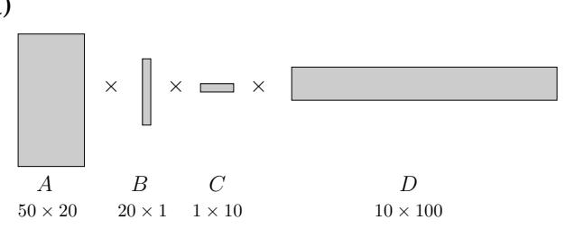
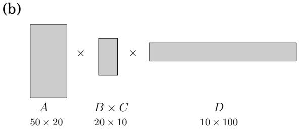
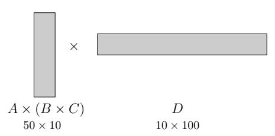
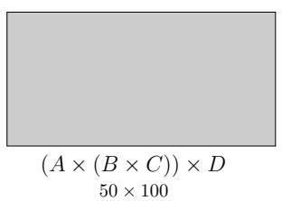

import Guide from '@/components/Guide.astro';
import Knowledge from '@/components/Knowledge.astro';
import Example from '@/components/Example.astro';
import Analysis from '@/components/Analysis.astro';
import Solution from '@/components/Solution.astro';
import Variant from '@/components/Variant.astro';
import Note from '@/components/Note.astro';
import Block from '@/components/Block.astro';
import Method from '@/components/Method.astro';
import Exercise from '@/components/Exercise.astro';

## 6.4 Knapsack

During a robbery, a burglar finds much more loot than he had expected and has to decide what to take. His bag (or “knapsack”) will hold a total weight of at most W pounds. There are n items to pick from, of weight $w _ { 1 } , \ldots , w _ { n }$ and dollar value $v _ { 1 } , \ldots , v _ { n }$ . What's the most valuable combination of items he can fit into his bag?1

For instance, take W = 10 and

<table><tr><td>Item</td><td>Weight</td><td>Value</td></tr><tr><td>1</td><td>6</td><td>$30</td></tr><tr><td>2</td><td>3</td><td>$14</td></tr><tr><td>3</td><td>4</td><td>$16</td></tr><tr><td>4</td><td>2</td><td>$9</td></tr></table>

There are two versions of this problem. If there are unlimited quantities of each item available, the optimal choice is to pick item 1 and two of item 4 (total: \$48). On the other hand, if there is one of each item (the burglar has broken into an art gallery, say), then the optimal knapsack contains items 1 and 3 (total: \$46).

As we shall see in Chapter 8, neither version of this problem is likely to have a polynomialtime algorithm. However, using dynamic programming they can both be solved in $O ( n W )$ time, which is reasonable when W is small, but is not polynomial since the input size is proportional to log W rather than W.

## Knapsack with repetition

Let's start with the version that allows repetition. As always, the main question in dynamic programming is, what are the subproblems? In this case we can shrink the original problem in two ways: we can either look at smaller knapsack capacities $w \leq W$ , or we can look at fewer items (for instance, items $1 , 2 , \dotsc , j , \operatorname { f o r } j \leq n )$ . It usually takes a little experimentation to figure out exactly what works.

The first restriction calls for smaller capacities. Accordingly, define

K(w) = maximum value achievable with a knapsack of capacity w.

Can we express this in terms of smaller subproblems? Well, if the optimal solution to $K ( w )$ includes item i, then removing this item from the knapsack leaves an optimal solution to $K ( w - w _ { i } )$ . In other words, $K ( w )$ is simply $K ( w - w _ { i } ) + v _ { i }$ , for some i. We don't know which $i ,$ so we need to try all possibilities.

$$
K (w) = \max _ {i: w _ {i} \leq w} \{K (w - w _ {i}) + v _ {i} \},
$$

where as usual our convention is that the maximum over an empty set is 0. We're done! The algorithm now writes itself, and it is characteristically simple and elegant.

$K(0) = 0$   
for $w = 1$ to $W$:  
$K(w) = \max \{K(w - w_i) + v_i:w_i\leq w\}$  
return $K(W)$

This algorithm fills in a one-dimensional table of length $W + 1$ , in left-to-right order. Each entry can take up to $O ( n )$ time to compute, so the overall running time is $O ( n W )$

As always, there is an underlying dag. Try constructing it, and you will be rewarded with a startling insight: this particular variant of knapsack boils down to finding the longest path in a dag!

## Knapsack without repetition

On to the second variant: what if repetitions are not allowed? Our earlier subproblems now become completely useless. For instance, knowing that the value $K ( w - w _ { n } )$ is very high doesn't help us, because we don't know whether or not item n already got used up in this partial solution. We must therefore refine our concept of a subproblem to carry additional information about the items being used. We add a second parameter, $0 \leq j \leq n \colon$

K(w, j) = maximum value achievable using a knapsack of capacity w and items $1 , \ldots , j$

The answer we seek is $K ( W , n )$

How can we express a subproblem $K ( w , j )$ in terms of smaller subproblems? Quite simple: either item $j$ is needed to achieve the optimal value, or it isn't needed:

$$
K (w, j) = \max \{K (w - w _ {j}, j - 1) + v _ {j}, K (w, j - 1) \}.
$$

(The first case is invoked only if $w _ { j } \leq w . )$ In other words, we can express $K ( w , j )$ in terms of subproblems $K ( \cdot , j - 1 )$

The algorithm then consists of filling out a two-dimensional table, with $W + 1$ rows and $n + 1$ columns. Each table entry takes just constant time, so even though the table is much larger than in the previous case, the running time remains the same, $O ( n W )$ . Here's the code.

Initialize all  $K(0,j)=0$  and all  $K(w,0)=0$ 
for j=1 to n:
    for w=1 to W:
    if  $w_{j}>w:$ $K(w,j)=K(w,j-1)$ 
    else:  $K(w,j)=\max\{K(w,j-1),K(w-w_{j},j-1)+v_{j}\}$ 
return  $K(W,n)$

<Knowledge title="Box: Memoization">

In dynamic programming, we write out a recursive formula that expresses large problems in terms of smaller ones and then use it to fill out a table of solution values in a bottom-up manner, from smallest subproblem to largest.

The formula also suggests a recursive algorithm, but we saw earlier that naive recursion can be terribly inefficient, because it solves the same subproblems over and over again. What about a more intelligent recursive implementation, one that remembers its previous invocations and thereby avoids repeating them?

On the knapsack problem (with repetitions), such an algorithm would use a hash table (recall Section 1.5) to store the values of K( ) that had already been computed. At each recursive call requesting some K(w), the algorithm would first check if the answer was already in the table and then would proceed to its calculation only if it wasn't. This trick is called memoization:

A hash table, initially empty, holds values of K(w) indexed by w

function knapsack(w)
if w is in hash table: return K(w)
 $K(w) = \max\{\text{knapsack}(w - w_i) + v_i : w_i \leq w\}$ 
insert  $K(w)$  into hash table, with key w
return  $K(w)$

Since this algorithm never repeats a subproblem, its running time is O(nW), just like the dynamic program. However, the constant factor in this big-O notation is substantially larger because of the overhead of recursion.

In some cases, though, memoization pays off. Here's why: dynamic programming automatically solves every subproblem that could conceivably be needed, while memoization only ends up solving the ones that are actually used. For instance, suppose that W and all the weights wi are multiples of 100. Then a subproblem K(w) is useless if 100 does not divide w. The memoized recursive algorithm will never look at these extraneous table entries.

(a)  

(b)  

(c)  
  
(d)

</Knowledge>
